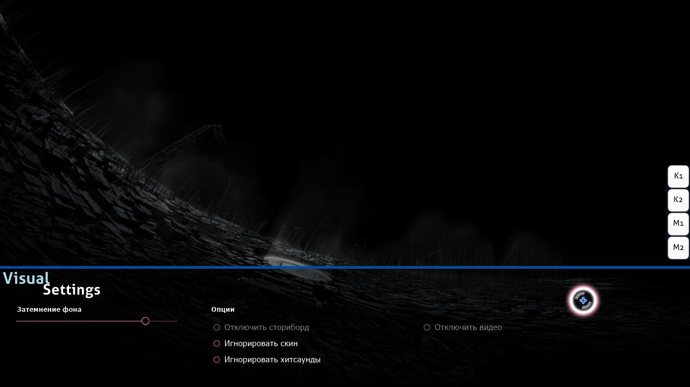

# Визуальные настройки

**Визуальные настройки** — панель, скрытая в нижней части игрового поля. Её можно развернуть во время загрузки карты, либо поставив игру на паузу. Если развернуть панель до начала игры, то карта не запустится, пока курсор не будет убран с панели.

*Примечание: выбранные настройки сохраняются отдельно для каждой карты, но частично сбрасываются после выхода из osu!. Чтобы выставить их раз и навсегда (и для всех карт сразу), воспользуйтесь [настройками клиента](/wiki/Client/Options).*

Хотя визуальные настройки можно открыть, приостановив игру, этот метод не сработает во время [мультиплеера](/wiki/Client/Interface/Multiplayer), так как игра воспримет ваши попытки включить паузу как желание покинуть комнату.

## Настройки

| Название | Эффект | Примечание |
| :-- | :-- | :-- |
| `Затемнение фона` | Затемняет игровое поле (в том числе сториборд и/или фоновое видео). | Во время перерывов затемнение уменьшается на 30% (максимум — до 0%) (это можно отключить в настройках). *Примечание: уровень затемнения сохраняется отдельно для каждой карты, но будет сброшен после выхода из osu!.* |
| `Отключить сториборд` | Полностью скрывает сториборд. Никак не влияет на [киаи](/wiki/Gameplay/Kiai_time) и фоновое видео. | Рекомендуется для игроков, страдающих от эпилепсии, когда у карты есть соответствующее предупреждение перед началом игры. Если в карте нет сториборда, эта настройка неактивна. |
| `Игнорировать скин карты` | Вместо скина, имеющегося в карте, будет использоваться текущий скин игрока. | После включения нужно перезапустить карту. |
| `Игнорировать хитсаунды карты` | Вместо хитсаундов, имеющихся в карте, будут использоваться хитсаунды из текущего скина игрока. | После включения нужно перезапустить карту. |
| `Отключить видео` | Отключает фоновое видео. Не скрывает сториборд. | После включения нужно перезапустить карту, если вы уже начали играть. Если в карте нет видео, эта настройка неактивна. |
