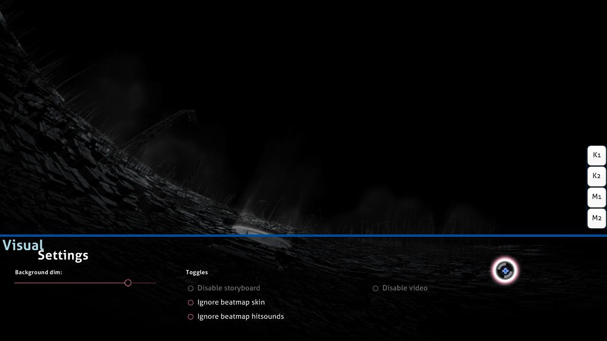

# การตั้งค่าภาพ (Visual settings)

**การตั้งค่าภาพ (Visual settings)** คือแผงปรับแต่งที่ซ่อนอยู่บริเวณด้านล่างของหน้าจอสนามเล่น (Playfield) คุณสามารถเข้าถึงได้ในขณะที่ [Beatmap](/wiki/Beatmap) กำลังโหลดเข้าสู่การเล่น หรือเมื่อกดหยุดพัก (Pause) ในระหว่างการเล่น เมื่อเปิดแผงนี้ขึ้นมา ตัวเกมจะหน่วงเวลาเริ่มแมพออกไปจนกว่าเคอร์เซอร์ของคุณจะเลื่อนออกจากแผงควบคุมนี้

*ประกาศ: การเปลี่ยนแปลงในแผงการตั้งค่าภาพนี้จะถูกบันทึกแยกตามราย Beatmap แต่การตั้งค่าบางอย่างจะหายไปหลังจากปิดโปรแกรม osu! หากคุณต้องการตั้งค่าแบบถาวรให้ใช้เมนู [ตัวเลือกและการตั้งค่า (Options)](/wiki/Client/Options)*

นอกจากนี้ คุณยังสามารถเข้าถึงแผงการตั้งค่าภาพได้จากการกดหยุดพักเกม (Pause) อย่างไรก็ตาม วิธีนี้จะไม่สามารถใช้ได้ในโหมด [มัลติเพลเยอร์ (Multiplayer)](/wiki/Client/Interface/Multiplayer) เนื่องจากการกดปุ่มหยุดจะถือเป็นการออกจากห้องแข่งขันแทน

## รายละเอียดการตั้งค่า

| ชื่อตัวเลือก | ผลลัพธ์ | หมายเหตุ |
| :-- | :-- | :-- |
| `Background dim` | ปรับความมืดของสนามเล่น (รวมถึง Storyboard และวิดีโอพื้นหลัง) | ในช่วงเวลาพัก (Breaks) ความมืดจะลดลง 30% (สว่างขึ้น) โดยอัตโนมัติ (สามารถปิดพฤติกรรมนี้ได้ในเมนู Options) *หมายเหตุ: ค่าความมืดที่ตั้งที่นี่จะถูกบันทึกแยกตามแมพ แต่จะรีเซ็ตเมื่อปิดเกม* |
| `Disable storyboard` | ปิดการแสดงผล Storyboard ทั้งหมด โดยไม่มีผลกับ [Kiai Time](/wiki/Gameplay/Kiai_time) และวิดีโอพื้นหลัง | แนะนำสำหรับผู้เล่นที่มีปัญหาโรคลมชักหากแมพมีการแจ้งเตือนแสงกระพริบ ตัวเลือกนี้จะใช้งานไม่ได้หากแมพไม่มี Storyboard |
| `Ignore beatmap skin` | ใช้ Skin ที่ผู้เล่นเลือกไว้แทนที่ Skin ที่ติดมากับแมพ | ต้องเริ่มเล่นใหม่ (Retry) เพื่อให้การตั้งค่ามีผล |
| `Ignore beatmap hitsounds` | ใช้เสียง Hitsound จาก Skin ของผู้เล่นแทนที่เสียง Hitsound เฉพาะของแมพนั้นๆ | ต้องเริ่มเล่นใหม่ (Retry) เพื่อให้การตั้งค่ามีผล |
| `Disable video` | ปิดการเล่นวิดีโอพื้นหลัง โดยไม่มีผลกับ Storyboard | ต้องเริ่มเล่นใหม่หากปรับในระหว่างเล่น ตัวเลือกนี้จะใช้งานไม่ได้หากแมพไม่มีวิดีโอ |
