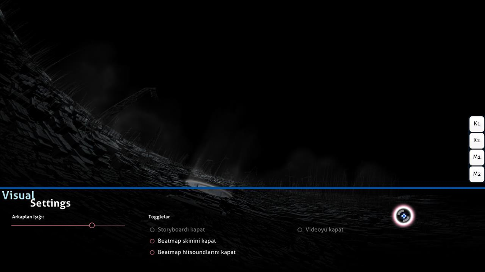

# Görsel ayarlar

**Görsel Ayarlar** oyun alanının altında bulunan gizli bir kişiselleştirme panelidir. Beatmap yüklemedeyken veya oyun duraklatıldığında bu panele erişilebilir. Görsel ayarlar paneli ekranda gözüktüğünde, imleç görsel ayarlar panelinden dışarı çıkana kadar beatmapin akışı duraklatılır.

*Bildirim: Görsel ayarlar değişiklikleri her bir beatmap için kaydedilir fakat bazıları osu! kapatıldığında sıfırlanır. Bunları evrensel (ve ebedi) olarak ayarlamak için [seçenekler](/wiki/Client/Options) menüsünü kullanın.*

Alternatif olarak, oyunu duraklatarak görsel ayarlar paneline erişmek mümkündür. Ancak, bu yöntem [Çok oyunculu](/wiki/Client/Interface/Multiplayer) maçlarda maçtan çıkma ve odayı terk etme olarak algılanacağı için çalışmaz.

## Ayarlar

| İsim | Efekt | Notlar |
| :-- | :-- | :-- |
| `Arkaplan ışığı` | Oyun alanını karart (storyboardlar ve/veya arkaplan videoları dahil). | Mola kısımlarında, karartma %30 oranında azaltılır (azami %0) (bu durum seçeneklerden devre dışı bırakılabilir). *Not: Arkaplan ışığı değişiklikleri her beatmap için kaydedilir fakat osu!'nun kapatılmasının ardından sıfırlanır.* |
| `Storyboardı kapat` | Tüm storyboard elementlerini kaldır. Bu, eğer varsa, [Kiai Zamanını](/wiki/Gameplay/Kiai_time) ve arkaplan videosunu etkilemez. | Bu, beatmap epilepsi uyarısı gösterdiği zamanlarda epilepsi sorunları yaşayan oyuncular için tavsiye edilir. Eğer oynatılacak herhangi bir storyboard bulunmuyorsa bu seçenek devre dışı bırakılır. |
| `Beatmap skinini kapat` | Beatmapin kendi teması yerine oyuncunun seçtiği temayı kullan. | Etkinleşmesi için beatmapi yeniden başlatmak gerekir. |
| `Beatmap hitsoundlarını kapat` | Eğer varsa, beatmapin kendi vuruş sesleri yerine kullanıcının seçtiği temanın vuruş seslerini kullan. | Etkinleşmesi için beatmapi yeniden başlatmak gerekir. |
| `Videoyu kapat` | Arkaplan videousunu oynatma. Bu, storyboardı kaldırmaz. | Oyun başlatıldıktan sonra etkinleştirildiğinde beatmapi yeniden başlatmak gerekir. Eğer oynatılacak herhangi bir arkaplan videosu bulunmuyorsa bu seçenek devre dışı bırakılır. |
