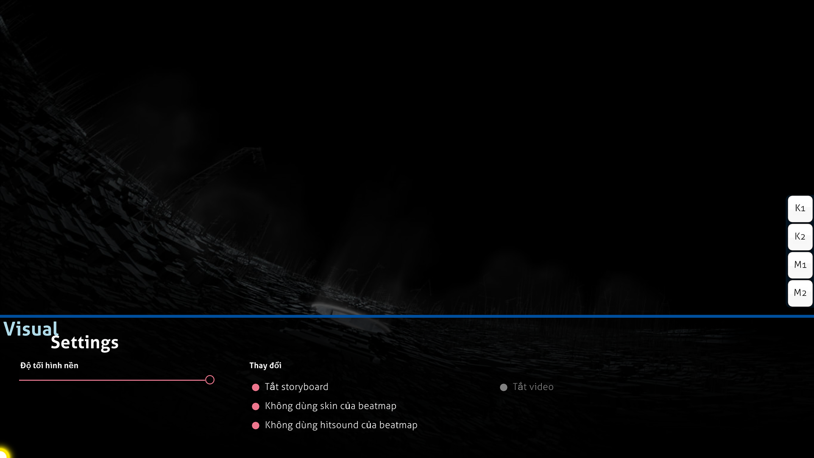

# Cài đặt trực quan

**Cài đặt trực quan** là một menu ẩn nằm ở dưới cùng của màn chơi. Nó có thể được truy cập khi beatmap đang tải hoặc khi trò chơi đang tạm dừng. Khi menu cài đặt trực quan được hiển thị, beatmap sẽ bị trì hoãn cho đến khi con trỏ rời khỏi menu này.

*Lưu ý: Các thay đổi cài đặt trực quan được lưu theo từng beatmap nhưng một số thay đổi sẽ bị mất sau khi đóng osu!. Để thiết lập các tùy chọn này trên toàn bộ trò chơi (và vĩnh viễn), hãy sử dụng thanh bên [Menu tuỳ chọn](/wiki/Client/Options).*

Ngoài ra, có thể truy cập menu cài đặt trực quan bằng cách tạm dừng trò chơi. Tuy nhiên, phương pháp này không hoạt động trong các trận [Multi](/wiki/Client/Interface/Multiplayer) vì sẽ bị coi là cố gắng thoát khỏi trận đấu và rời khỏi phòng.

## Cài đặt

| Tên | Hiệu ứng | Ghi chú |
| :-- | :-- | :-- |
| `Độ tối hình nền` | Làm tối màn chơi (bao gồm cả storyboards và/hoặc video nền). | Trong các khoảng nghỉ, độ mờ sẽ giảm 30% (tối đa 0%) (điều này có thể được tắt trong phần tùy chọn). *Lưu ý: Các thay đổi về độ mờ nền được lưu theo từng beatmap nhưng sẽ bị mất sau khi đóng osu!.* |
| `Tắt storyboard` | Loại bỏ tất cả các yếu tố storyboard. Điều này không ảnh hưởng đến [Kiai Time](/wiki/Gameplay/Kiai_time) và video nền, nếu có. | Điều này được khuyến nghị sử dụng cho người chơi có vấn đề về động kinh khi beatmap hiển thị cảnh báo động kinh. Tùy chọn này bị tắt nếu không có storyboard để phát. |
| `Không dùng skin của beatmap` | Sử dụng skin đã chọn của người chơi thay vì skin đi kèm beatmap. | Tùy chọn này yêu cầu chơi lại để có hiệu lực. |
| `Không dùng hitsound của beatmap` | Sử dụng hitsound của skin người chơi thay vì hitsound tùy chỉnh của beatmap, nếu có. | Tùy chọn này yêu cầu chơi lại để có hiệu lực. |
| `Tắt video` | Không phát video nền. Tuỳ chọn này không loại bỏ storyboard. | Tùy chọn này yêu cầu chơi lại nếu được kích hoạt sau khi trò chơi bắt đầu. Tùy chọn này bị tắt nếu không có video nền để phát. |
