# Interfaz

Este artículo explica todo lo que necesitas saber sobre cómo usar el cliente del juego de osu!. Aquí encontrarás información sobre la pantalla del selector de canciones, la visualización de clasificaciones y la pantalla de resultados. Al iniciar el cliente del juego, puedes ver la siguiente pantalla:

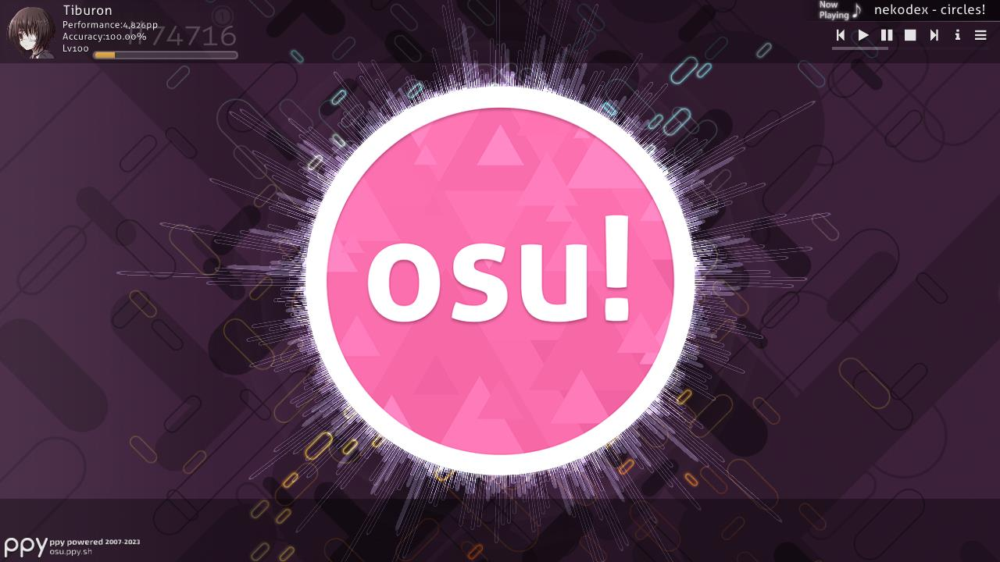

## Menú principal

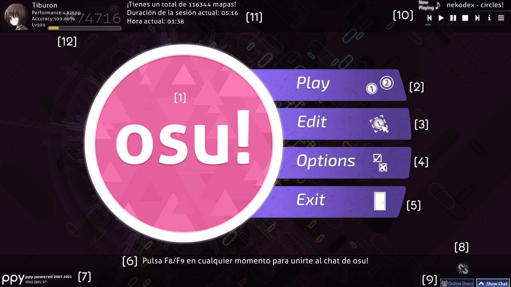

- \[1\] La [osu! cookie](/wiki/Client/Interface/Cookie). Al hacer clic en ella, se abre el menú principal. Pulsa según el [BPM](/wiki/Music_theory/Tempo) de la música y las barras se extienden a su alrededor visualizando el espectro de audio. Si no se está reproduciendo ninguna canción, pulsa a una velocidad lenta de 60 BPM.
- \[2\] Haz clic en `Play` (o presiona `P`) para jugar osu! ya sea para uno mismo o con los demás.
- \[3\] Haz clic en `Edit` (o presiona `E`) para editar un [beatmap](/wiki/Beatmap).
- \[4\] Haz clic en `Options` (o presiona `O`) para abrir la [barra lateral de opciones](/wiki/Client/Options).
- \[5\] Haz clic en `Exit` (o presiona `Esc`) para salir del juego.
- \[6\] Un [consejo](/wiki/Client/Menu_tips) útil al azar.
- \[7\] El logo [ppy](https://ppy.sh/) junto con la información de derechos de autor. Al hacer clic en él, se accede al [sitio web de osu!](https://osu.ppy.sh/home).
- \[8\] Cuando surgen problemas de conexión con el [servidor de Bancho](/wiki/Bancho_(server)), aquí se muestra un eslabón de cadena roto.
- \[9\] El [chat](/wiki/Client/Interface/Chat_console) y, a su izquierda, un botón para la ventana de chat extendida, que enumera los usuarios actualmente en línea. También se pueden alternar con `F8` y `F9` respectivamente.
- \[10\] La rocola. En el menú principal, reproduce canciones en orden aleatorio. Ve a continuación para obtener más información sobre los botones de este menú.
- \[11\] El número de las [dificultades de los beatmaps](/wiki/Beatmap/Difficulty) disponibles (a pesar de lo que dice), cuánto tiempo ha estado jugando y el reloj de su sistema.
- \[12\] Tu perfil. Al hacer clic en él, se muestran las [opciones de usuario](#opciones-de-usuario).

---

La rocola tiene los siguientes botones:

| Botón | Descripción |
| :-: | :-- |
|  | Pista anterior |
|  | Reproducir |
|  | Pausar |
|  | Detiene y restablece la canción actual a su comienzo |
|  | Pista siguiente |
|  | Alterna entre mostrar permanentemente la información de la canción actual o que desaparezca después de un rato. |
|  | Saltar a una canción específica. Puedes buscar canciones o filtrar por colección. |

La rocola también se puede controlar mediante [atajos de teclado](/wiki/Client/Keyboard_shortcuts#gramola).

## Opciones de usuario

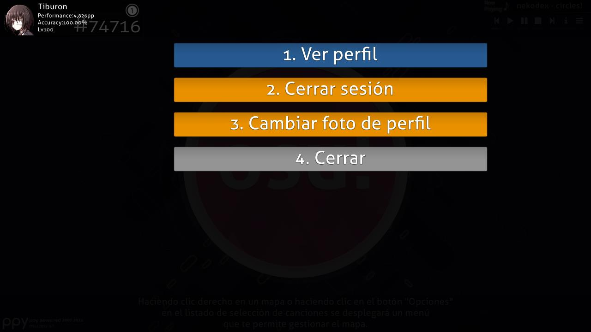

Accede a esta pantalla haciendo clic en tu perfil en la parte superior izquierda del menú principal. Puedes seleccionar cualquier elemento pulsando su número correspondiente:

- `1. Ver perfil`: Ver tu página de perfil en el sitio web.
- `2. Cerrar sesión`: Cierra sesión en tu cuenta. Después de cerrar sesión, el juego te pedirá que vuelvas a iniciar sesión.
- `3. Cambiar foto de perfil`: Abre la [página de edición de avatar](https://osu.ppy.sh/home/account/edit#avatar) en el sitio web.
- `4. Cerrar`: Cierra este cuadro de diálogo.

## Menú de juego

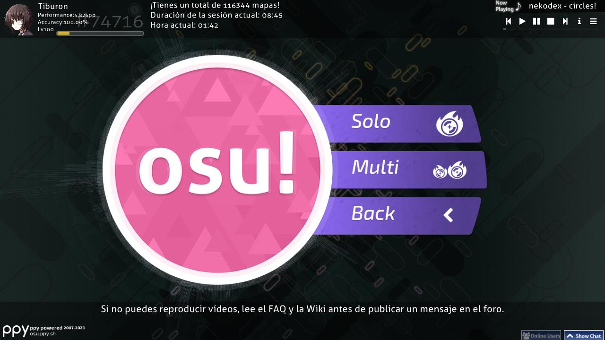

Después de seleccionar `Play` en el menú principal, puedes elegir entre tres opciones:

- Haz clic en `Solo` (o presiona `P`) para jugar por tu cuenta. Esto te lleva a la [pantalla del selector de canciones](#selector-de-canciones).
- Haz clic en `Multi` (o presiona `M`) para jugar con otras personas. Serás dirigido a la sala de [multijugador](/wiki/Client/Interface/Multiplayer).
- Haz clic en `Back` para volver al menú principal.

## Sala multijugador

*Página principal: [Multijugador](/wiki/Client/Interface/Multiplayer)*

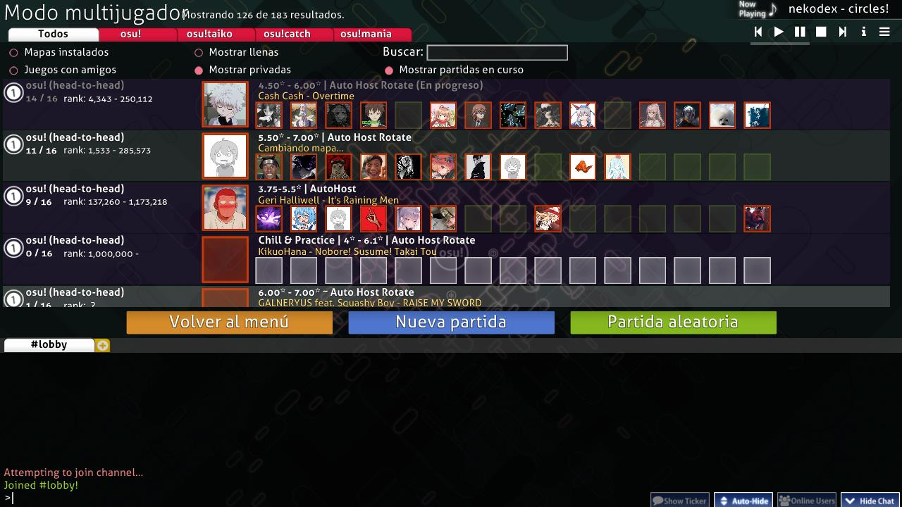

La sala multijugador te permite jugar con y contra otros jugadores.

## Selector de canciones

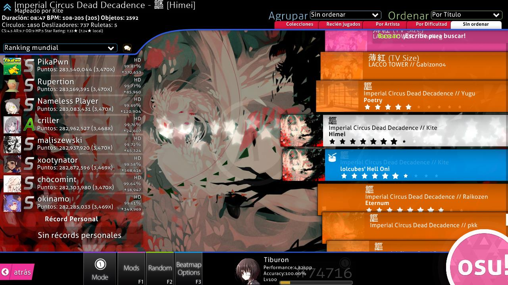

El icono del [modo de juego](/wiki/Game_mode) actualmente seleccionado se puede ver en las opciones de la parte inferior izquierda, arriba de `Mode`. El icono del modo también se ve débilmente en el centro de la pantalla. Estos son los cuatro que verá:

-  es [osu!](/wiki/Game_mode/osu!)
-  es [osu!taiko](/wiki/Game_mode/osu!taiko)
-  es [osu!catch](/wiki/Game_mode/osu!catch)
-  es [osu!mania](/wiki/Game_mode/osu!mania)

Antes de continuar, esta pantalla tiene demasiados elementos para anotar con números fácilmente perceptibles. Las subsecciones a continuación se centrarán en una parte de la pantalla a la vez, comenzando de arriba a abajo y de izquierda a derecha.

### Información del beatmap

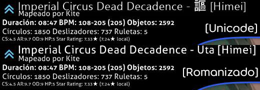

Esta área muestra **información sobre la dificultad del beatmap seleccionada actualmente.** Al ingresar a la pantalla del selector de canciones, la canción que se está reproduciendo en la rocola se selecciona de forma predeterminada. El icono superior izquierdo muestra la [categoría del beatmap](/wiki/Beatmap/Category), donde este en particular está [clasificado](/wiki/Beatmap/Category#ranked).

El título de la canción normalmente se muestra romanizado (imagen inferior), pero si seleccionas `Mostrar datos de canciones en su idioma original` en las [opciones](/wiki/Client/Options), se mostrará el título Unicode (imagen superior). El nombre de la dificultad del beatmap se muestra entre corchetes (`[]`). El creador que mapeó el beatmap se muestra debajo del título, e incluso se incluye más información a continuación. De izquierda a derecha, los valores son los siguientes:

- **Duración**: La duración total del beatmap, de principio a fin, incluidos los descansos. No debe confundirse con el [tiempo de drenaje](/wiki/Beatmap/Drain_time).
- **BPM**: *Pulsos por minuto*, el tempo de la canción. Si hay dos valores de BPM además de uno entre paréntesis, significa que el BPM cambia a lo largo de la canción. Muestra el BPM más lento y el más rápido, y el valor entre paréntesis es el BPM más común en el beatmap.
- **Objetos**: La cantidad total de [objetos](/wiki/Gameplay/Hit_object) en el beatmap.
- **Círculos**: La cantidad total de [círculos](/wiki/Gameplay/Hit_object/Hit_circle) (osu! y osu!taiko), [frutas](/wiki/Gameplay/Hit_object/Fruit) (osu!catch), o notas regulares (osu!mania) en el beatmap.
- **Sliders**: La cantidad total de [sliders](/wiki/Gameplay/Hit_object/Slider) (osu!), redobles de tambores (osu!taiko), [corrientes de jugo](/wiki/Gameplay/Hit_object/Juice_stream) (osu!catch), o notas para sostener (osu! mania) en el beatmap.
- **Spinners**: La cantidad total de [spinners](/wiki/Gameplay/Hit_object/Spinner) (osu!), dendens (osu!taiko), o [lluvia de plátanos](/wiki/Gameplay/Hit_object/Banana) (osu!catch) en el beatmap.
- **OD**: La [dificultad general](/wiki/Beatmap/Overall_difficulty) del beatmap.
- **HP**: La [tasa de drenaje de HP](/wiki/Beatmap/HP_drain_rate). Véase el artículo sobre la [salud](/wiki/Gameplay/Health) para obtener más detalles.
- **Estrellas**: La [calificación por estrellas](/wiki/Beatmap/Star_rating) del beatmap. La cantidad de estrellas también es fácilmente visible en el carrusel del beatmap.

### Agrupar y Ordenar

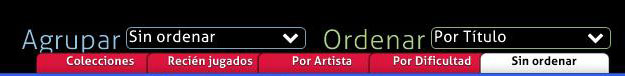

Haz clic en una de las pestañas para **ordenar tu lista de canciones según el criterio seleccionado**.

#### Agrupar

Estas opciones organizan los beatmaps en varios grupos expandibles:

| Agrupamiento | Descripción |
| :-: | :-- |
| `Sin ordenar` | Los beatmaps no se agruparán, pero aún se ordenarán en el orden especificado por Ordenar. |
| `Por Dificultad` | Los beatmaps se agruparán por su calificación por estrellas, redondeada a un número entero. |
| `Por Artista` | Los beatmaps se agruparán por el primer carácter del nombre del artista. |
| `Recién jugados` | Los beatmaps se agruparán según la última vez que los jugaste. |
| `Colecciones` | Esto mostrará las colecciones que has creado. *¡Ten en cuenta que esto ocultará los beatmaps que no figuren en una colección!* |
| `Por BPM` | Los beatmaps se agruparán según su BPM en múltiplos de 60. |
| `Por Creador` | Los beatmaps se agruparán por el primer carácter del nombre del creador del beatmap. |
| `Por Fecha de adición` | Los beatmaps se agruparán según el momento en que se agregaron, desde hoy hasta hace más de 5 meses. |
| `Por Duración` | Los beatmaps se agruparán según su duración: 1 minuto o menos, 2 minutos o menos, 3, 4, 5, 10, y 10 minutos o más. |
| `Por Modo` | Los beatmaps se agruparán según su modo de juego. |
| `Por Rango obtenido` | Los beatmaps se agruparán por el [rango](/wiki/Gameplay/Grade) más alto alcanzado en ellos. |
| `Por Título` | Los beatmaps se agruparán por el primer carácter del título. |
| `Favoritos` | Solo se mostrarán los beatmaps que hayas marcado como favoritos en línea. |
| `Mis mapas` | Solo se mostrarán los beatmaps que hayas mapeado (es decir, cuyo creador coincida con tu nombre de perfil). |
| `Estado de aprobación` | Los beatmaps se agruparán por su estado: clasificado, pendiente, no enviado, desconocido o amado. |

Las primeras cinco agrupaciones están disponibles en las pestañas debajo de Agrupar y Ordenar.

#### Ordenar

Ordena los beatmaps en un orden determinado.

| Criterio de orden | Descripción |
| :-: | :-- |
| `Por Artista` | Los beatmaps se ordenarán alfabéticamente por artista. |
| `Por BPM` | Los beatmaps se ordenarán de menor a mayor por su BPM. Para los mapas con BPM cambiantes, se utilizará el más alto. |
| `Por Creador` | Los beatmaps se ordenarán alfabéticamente por creador. |
| `Por Fecha de adición` | Los beatmaps se ordenarán según el momento en que se agregaron, del más antiguo al más nuevo. |
| `Por Dificultad` | Los beatmaps se ordenarán por su calificación por estrellas, del más fácil al más difícil. *¡Ten en cuenta que esto dividirá las dificultades del beatmap!* |
| `Por Duración` | Los beatmaps se ordenarán por duración, del más corto al más largo. |
| `Por Rango obtenido` | Los beatmaps se ordenarán por el rango más alto alcanzado en ellos, de peor a mejor. |
| `Por Título` | Los beatmaps se ordenarán alfabéticamente por el título de la canción. |

### Buscar

*Artículo principal: [Búsqueda de beatmaps](/wiki/Beatmap_search)*

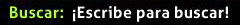

La barra de búsqueda permite filtrar las dificultades que coinciden con algunos criterios. Por defecto, osu! ejecuta una búsqueda de texto completo y solo muestra resultados que contienen todas las palabras especificadas. Además de eso, es posible buscar por [tasa de aproximación](/wiki/Beatmap/Approach_rate), [calificación por estrellas](/wiki/Beatmap/Star_rating) y muchos más valores usando un conjunto de filtros como `ar=8` o `stars>=5`.

Para buscar beatmaps, simplemente comienza a escribir cuando estés en la pantalla del selector de canciones (sin las opciones ni el panel de chat abiertos).

### Clasificaciones

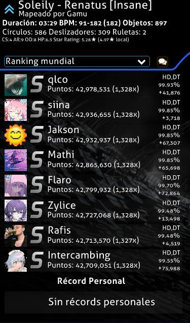

Una variedad de cosas pueden aparecer en este espacio:

- Un cuadro de `Not Submitted` denota a un beatmap que no se ha subido al sitio web de osu! utilizando el [sistema de envío de beatmaps](/wiki/Beatmapping/Beatmap_submission) o fue eliminado por el mapper.
- Un cuadro de `Update to latest version` aparece si hay una nueva versión del beatmap disponible para descargar. Haz clic en el botón para actualizar.
  - *Aviso: una vez que actualices el beatmap, se borrarán las puntuaciones locales. Las repeticiones de las puntuaciones locales se pueden exportar haciendo clic con el botón derecho en ellas.*
- Un cuadro de `Latest pending version` significa que el beatmap ha sido subido al sitio web de osu! pero aún no está clasificado.
- Si existen repeticiones que coincidan con la configuración de vista del beatmap, se mostrarán en lugar de un cuadro que indique el estado clasificado/jugado del beatmap. Esto se muestra en la imagen de arriba.
  - En las clasificaciones públicas (por ejemplo, Global, Amigos, etc.), tu puntaje más alto se mostrará en la parte inferior, así como tu posición en la tabla de clasificación.
- Un cuadro de `No records set!` significa que no hay repeticiones para la configuración de vista actual (esto generalmente se ve en la configuración de vista local si acabas de descargar o editar el beatmap).

Estos son los ajustes de vista:

- Ranking local
- Ranking nacional\*
- Ranking mundial
- Ranking mundial (mods actuales)\*
- Ranking entre amigos\*

\*Requiere [osu!supporter](/wiki/osu!supporter).

Haz clic en el icono de la burbuja de palabras para acceder a la pantalla de **acceso web rápido** para el beatmap seleccionado:

- Presiona `1` o haz clic en `Puntuaciones del mapa` para ver la página del beatmap para la dificultad seleccionada en tu navegador.
- Presiona `2` o haz clic en `Hilo del mapa` para ver la página de [modeo](/wiki/Modding) del beatmap.
- Presiona `3` o `Esc` o haz clic en `Cancelar` para volver a la pantalla del selector de canciones.

### Carrusel de beatmaps

El carrusel de beatmaps muestra todos los beatmaps disponibles. Diferentes beatmaps pueden tener cuadros de diferentes colores:

| Color del cuadro | Descripción |
| :-: | :-- |
| **Rosa** | Este beatmap aún no se ha jugado. |
| **Naranja** | Se ha completado al menos una dificultad del beatmap. |
| **Celeste** | Otras dificultades en el mismo beatmap, mostradas cuando se expande un beatmap. |
| **Blanco** | Dificultad actualmente seleccionada. |

Puede navegar por la lista de beatmaps usando la rueda del ratón, usando las teclas de flecha arriba y abajo, arrastrándola mientras mantienes presionado el botón izquierdo del ratón o haciendo clic en el botón derecho del ratón (conocido como desplazamiento absoluto), que moverá la barra de desplazamiento a la posición Y de su ratón. Haz clic en un beatmap para seleccionarlo, luego vuelve a hacer clic en él, presiona `Enter` o haz clic en la osu! cookie en la esquina inferior derecha para jugar el beatmap.

### Caja de herramientas de juego

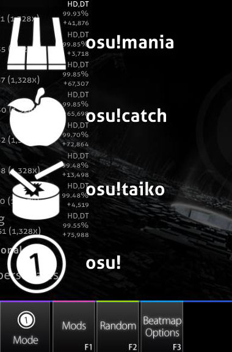

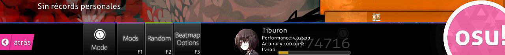

Esta sección se puede llamar la caja de herramientas de juego. Cubriremos el uso de cada botón de izquierda a derecha.

Pulsa `Esc` o haz clic en el botón `Atrás` para volver al menú principal.

Haz clic en el botón `Mode` para abrir una lista de modos de juego disponibles en osu!. Alternativamente, puedes presionar `Ctrl` y `1` (osu!), `2` (osu!taiko), `3` (osu!catch), o `4` (osu!mania) para cambiar el modo de juego. Cambiar a otro modo también cambiará tus [tablas de clasificación](/wiki/Ranking), como se puede observar al ver el cambio de rango mostrado.

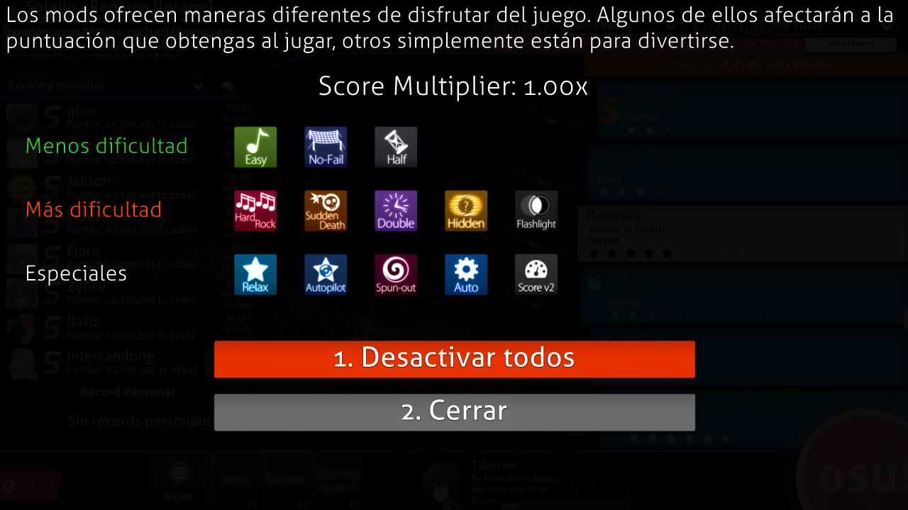

Haz clic en el botón `Mods` o presiona `F1` para abrir la **[pantalla de selección de mods](/wiki/Gameplay/Game_modifier)**.

En esta pantalla, puedes aplicar modificaciones («mods» para abreviar) al juego. Algunos mods reducen la dificultad y aplican un multiplicador que reduce la puntuación que logras. Por el contrario, algunos mods aumentan la dificultad, pero aplican un multiplicador que aumenta la puntuación que logras. Finalmente, algunos mods modifican el juego de una manera diferente. [Relax](/wiki/Gameplay/Game_modifier/Relax) y [Auto Pilot](/wiki/Gameplay/Game_modifier/Autopilot) entran en esa categoría.

Coloca tu ratón sobre el icono de un mod para ver una breve descripción de su efecto. Haz clic en un icono para seleccionar o deseleccionar ese mod. Algunos mods, como Double Time, tienen múltiples variaciones: haz clic en el mod nuevamente para recorrerlas. El valor del multiplicador de puntuación muestra el efecto combinado que todos los mods seleccionados tendrán en tu puntuación. Haz clic en `Desactivar todos` o presiona `1` para anular la selección de todos los mods seleccionados actualmente. Haz clic en `Cerrar` o presiona `2` o `Esc` para volver a la pantalla del selector de canciones.

Haz clic en el botón `Random` o presiona `F2` para que el juego **se desplace aleatoriamente por todos tus beatmaps y elija uno.**

*Nota: Puedes presionar `Shift` + el botón `Random` o `F2` para volver al beatmap que habías seleccionado antes de aleatorizar tu selección.*

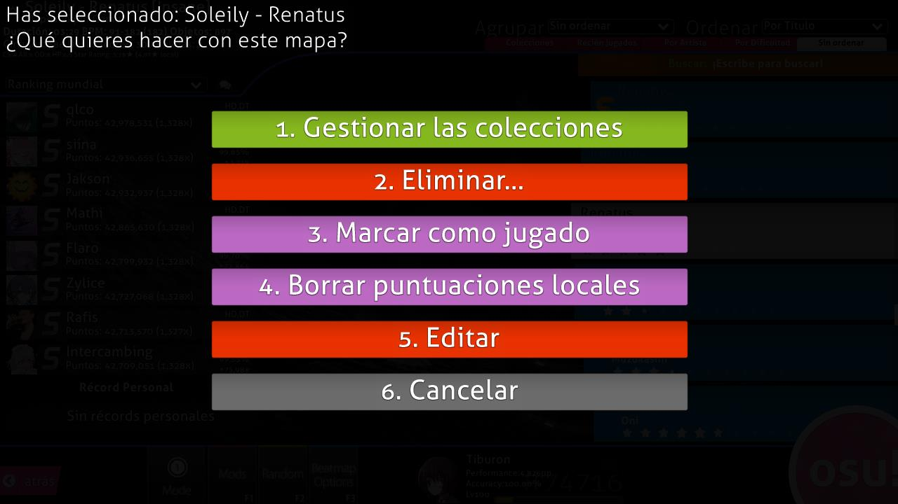

Haz clic en el botón `Beatmap Options`, presiona `F3` o haz clic con el botón derecho del ratón mientras te desplazas sobre el beatmap para que aparezca el **menú de opciones de un beatmap para las opciones en el beatmap actualmente seleccionado**.

- Presiona `1` o haz clic en el botón `Gestionar las colecciones` para que aparezca el administrador de colecciones. Aquí, puedes administrar colecciones preexistentes, así como agregar o eliminar el beatmap o el conjunto de mapas seleccionado actualmente hacia o desde una colección.
- Presiona `2` o haz clic en `Eliminar...` para eliminar la \[1\] dificultad seleccionada actualmente, \[2\] eliminar el beatmap seleccionado actualmente, o \[3\] eliminar **todos los mapas VISIBLES**.
  - Ten en cuenta que los beatmaps eliminados se mueven a la papelera de reciclaje.
- Presiona `3` o haz clic en `Marcar como jugado` para marcar un beatmap no jugado como jugado (es decir, cambia el color de su cuadro de rosa a naranja).
- Presiona `4` o haz clic en `Borrar puntuaciones locales` para eliminar todos los registros de las puntuaciones que ha logrado en este beatmap.
- Presiona `5` o haz clic en `Editar` para abrir el beatmap seleccionado en el editor de osu!.
- Presiona `6` o `Esc` o haz clic en `Cerrar` para volver a la pantalla del selector de canciones.

Haz clic en **tu panel de usuario** para acceder al **menú de opciones de usuario**.

Haz clic en la **[osu! cookie](/wiki/Client/Interface/Cookie)** para **comenzar a jugar el beatmap seleccionado**.

## Pantalla de resultados

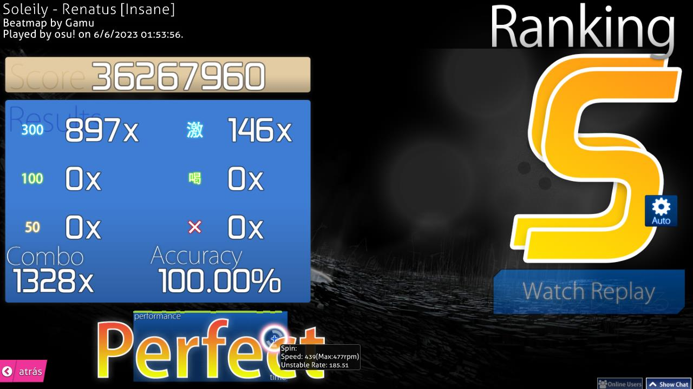

Esta es la pantalla de resultados que se muestra después de haber pasado con éxito el beatmap. Puedes acceder a tus resultados en línea desplazándote hacia abajo o presionando el botón obvio.

A continuación se muestran las pantallas de resultados de los otros modos de juego.

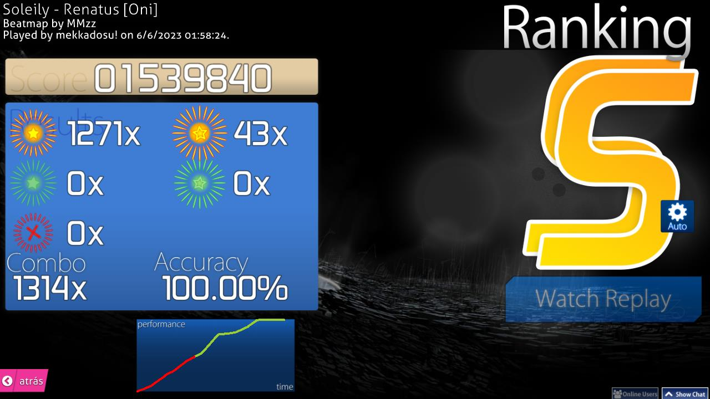

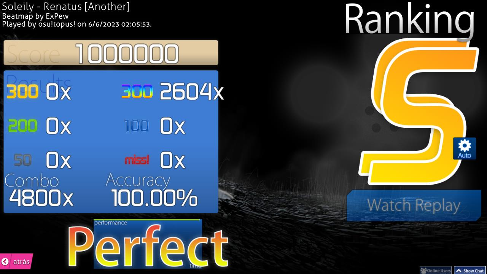

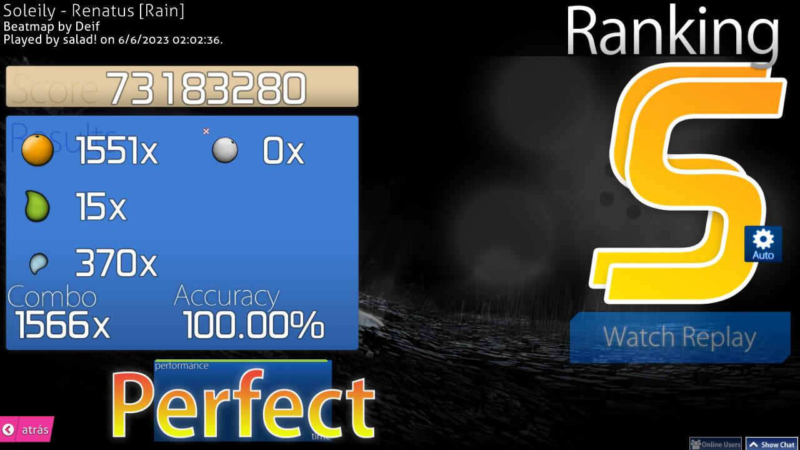

### Pantalla de resultados extendida

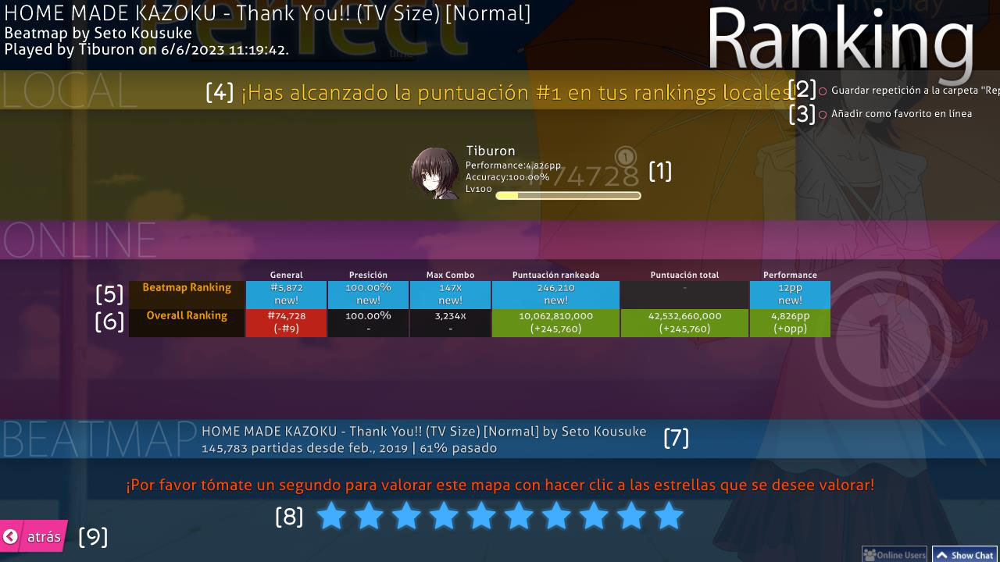

Esta es tu tabla de clasificación en línea. Puedes ir aquí desplazándote hacia abajo desde la pantalla de resultados. Tu marcador local mostrará tu nombre y la puntuación como de costumbre.

- \[1\] Tu panel de usuario. Muestra tus [puntos de rendimiento (pp)](/wiki/Performance_points), clasificación global, puntuación total, [precisión](/wiki/Gameplay/Accuracy) general y barra de nivel.
- \[2\] `Guardar repetición a la carpeta "Replays"`: Puedes ver la repetición más tarde abriéndola desde una tabla de clasificación local, o yendo al directorio `Replays` y haciendo doble clic en ella.
- \[3\] `Añadir como favorito en línea`: Incluye el beatmap en tu lista de favoritos, que se encuentra en tu página de perfil de osu! en la sección `Mapas`.
- \[4\] Tabla de clasificación local: Todos tus resultados se almacenan en tu computadora. Para verlos, navega hasta la [pantalla del selector de canciones](#selector-de-canciones) y selecciona `Ranking local` en el menú desplegable sobre el marcador.
- \[5\] Sección de `Beatmap Ranking`. Disponible solo para beatmaps con tablas de clasificación en línea ([calificados](/wiki/Beatmap/Category#qualified), [clasificados](/wiki/Beatmap/Category#ranked) o [amados](/wiki/Beatmap/Category#loved)). También necesitas estar en línea para ver esta sección. Ve a continuación para obtener más detalles.
- \[6\] Sección de `Overall Ranking`. Está disponible solo para beatmaps con tablas de clasificación en línea. También necesitas estar en línea para ver esta sección. Ve a continuación para obtener más detalles.
- \[7\] Información sobre el beatmap con su número de jugadas y tasa de aprobación al pasarlo.
- \[8\] Valoración del beatmap. Usa tu discreción personal en función de si disfrutaste el beatmap o no. Es mejor dejarlo en paz si no puedes decidir.
- \[9\] Haz clic aquí para volver a la pantalla del selector de canciones.

---

Las categorías en el panel de clasificación son las siguientes:

| Categoría | Beatmap Ranking | Overall Ranking |
| :-: | :-- | :-- |
| `General` | Tu posición en la tabla de clasificación del mapa. Ten en cuenta que las puntuaciones con [mods](/wiki/Gameplay/Game_modifier) también aparecen en esta misma tabla de clasificación. | Tu [clasificación global](/wiki/Ranking#clasificación-por-puntos-de-rendimiento) contra todos en el mundo. |
| [`Precisión`](/wiki/Gameplay/Accuracy) | Con qué precisión jugaste el beatmap. Esto solo se cuenta cuando superas tu puntuación anterior. | Un promedio ponderado de la precisión de tus mejores puntuaciones. |
| `Max Combo` | El combo más largo en el mapa que jugaste. | El combo más largo de todos los beatmaps que hayas jugado. |
| [`Puntuación rankeada`](/wiki/Gameplay/Score/Ranked_score) | Tu [mejor resultado](/wiki/Gameplay/Score/Ranked_score) en el beatmap. | La cantidad de puntos obtenidos de todos los beatmaps clasificados que hayas jugado alguna vez, contando cada mapa exactamente una vez. |
| [`Puntuación total`](/wiki/Gameplay/Score/Total_score) | No se tiene en cuenta, ya que no afecta tu posición en las clasificaciones en línea. | Igual que la puntuación rankeada, pero tiene en cuenta todos los beatmaps disponibles en el sitio web de osu!, incluidos los beatmaps infrautilizados o fallidos. Esto cuenta para tu [nivel](/wiki/Gameplay/Score/Total_score#nivel). |
| [`Performance`](/wiki/Performance_points) | La cantidad de [pp no ponderados](/wiki/Performance_points#¿por-qué-no-he-ganado-toda-la-cantidad-de-pp-de-un-mapa-que-he-jugado?) que recibirás por la jugada. | Tu cantidad total de puntos de rendimiento, y cuánto pp valió la jugada enviada. |

### Medallas

*Página principal: [Medallas](/wiki/Medals)*

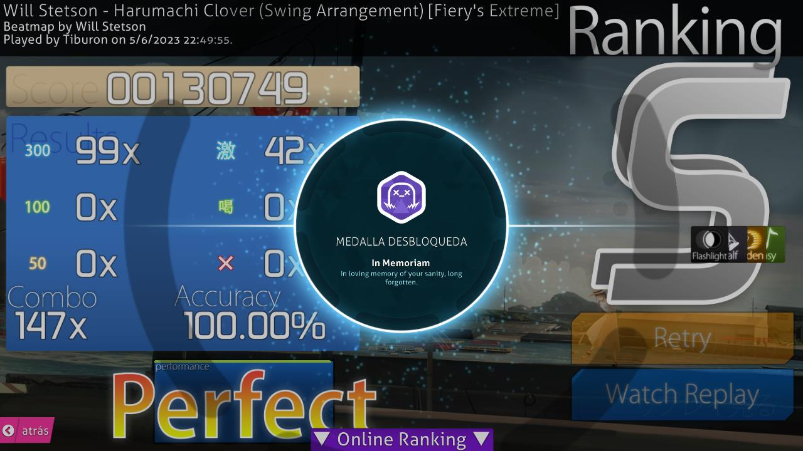

A veces, cuando se cumplen condiciones específicas, puedes recibir una medalla.
