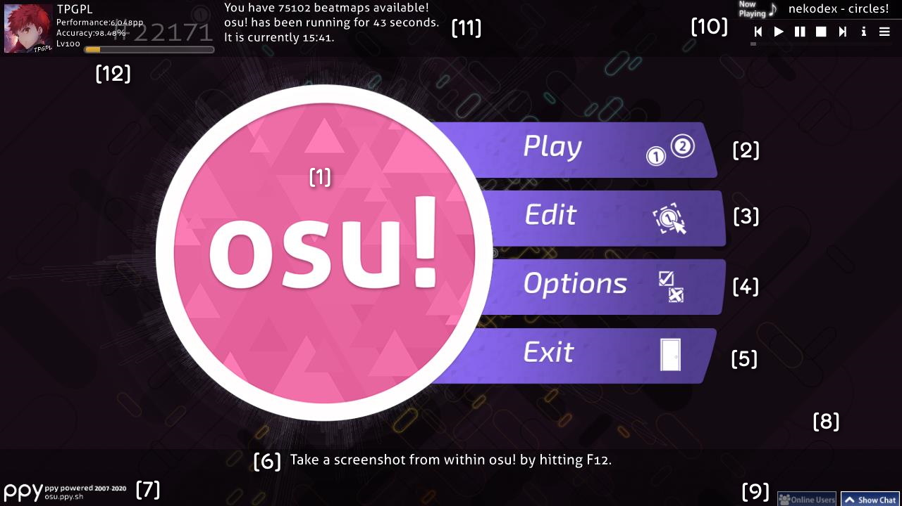
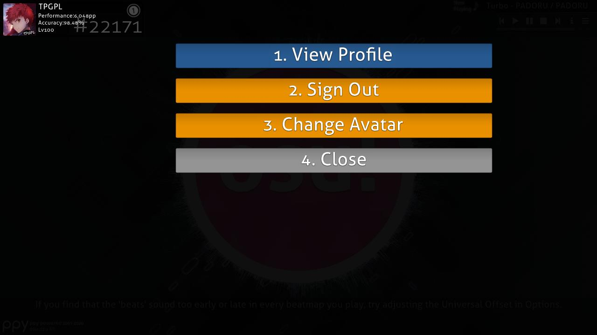
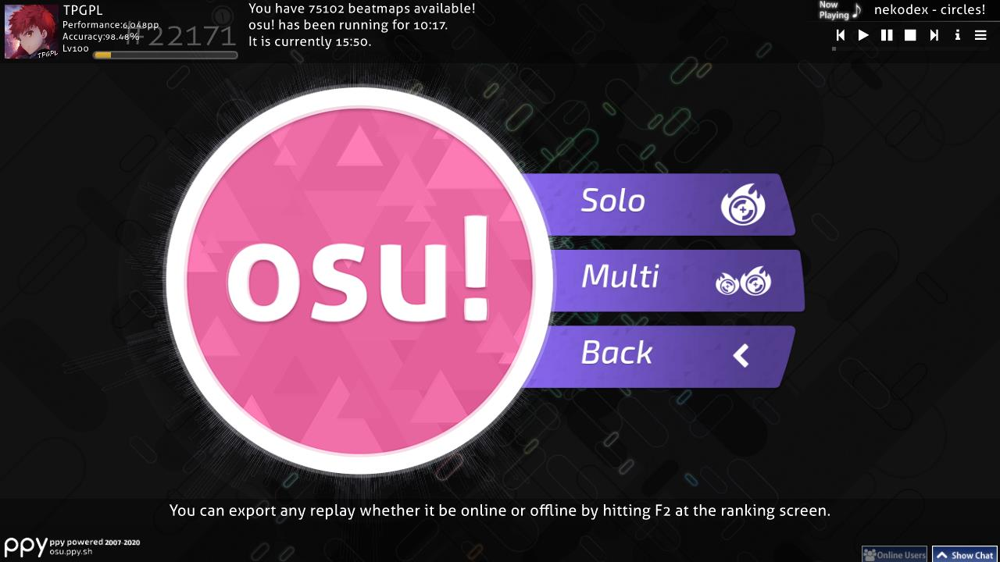
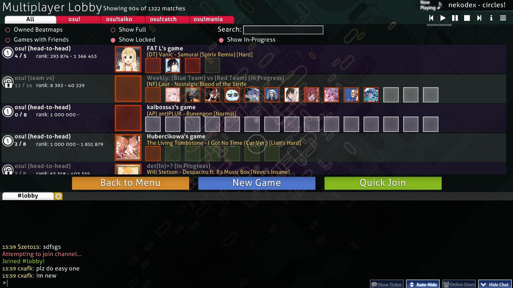
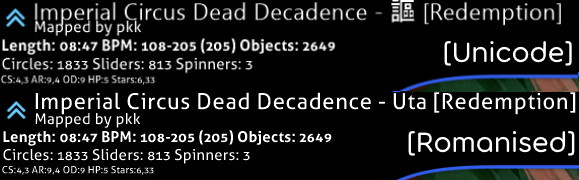
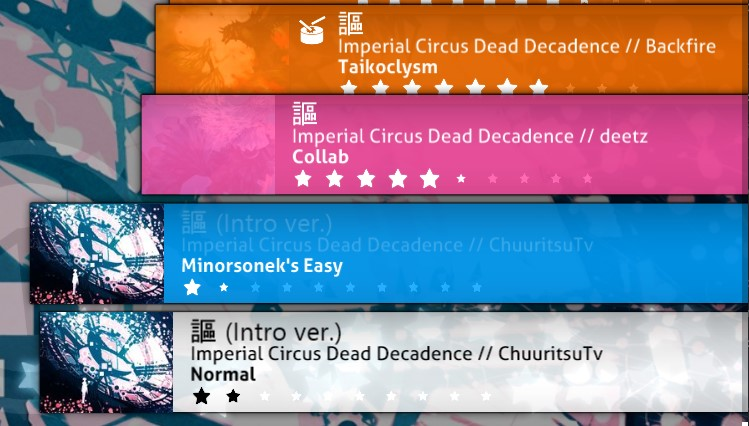
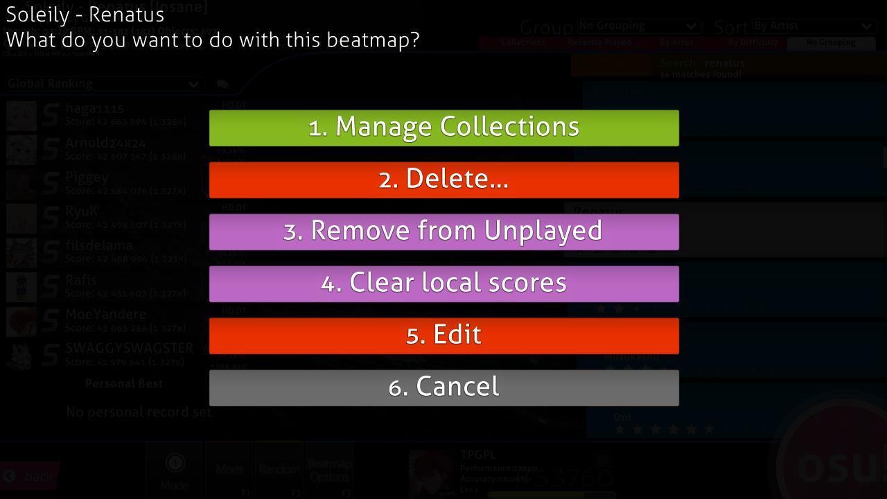
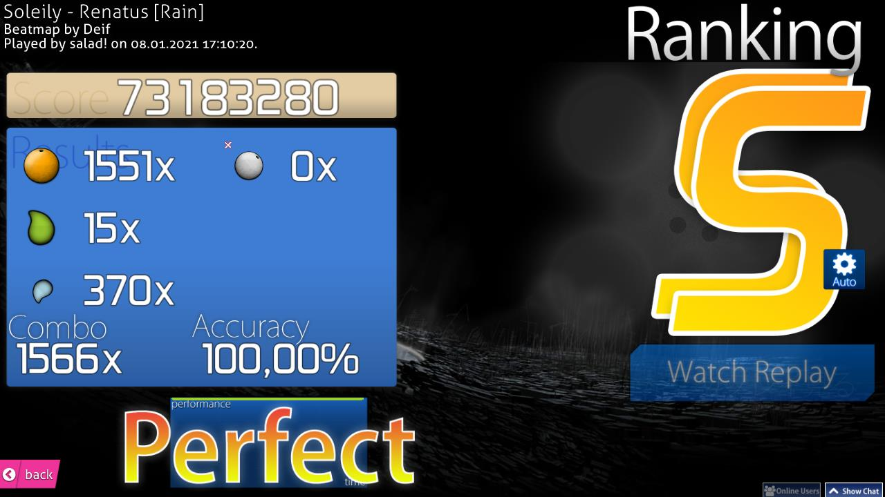
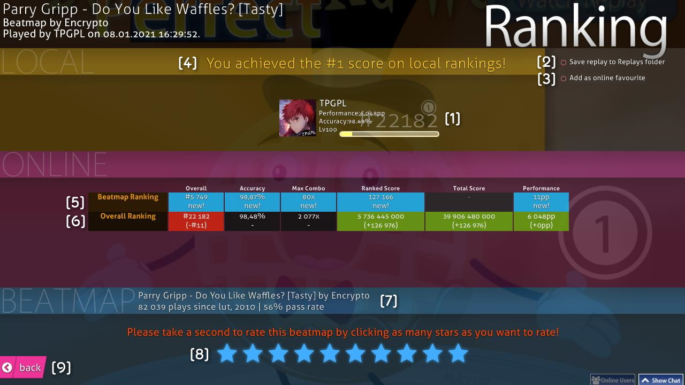

# Tampilan antarmuka

Artikel ini akan menjelaskan segalanya yang perlu kamu ketahui seputar tampilan antarmuka klien permainan osu! dan berbagai fiturnya, mulai dari layar pemilihan lagu, tampilan peringkat, hingga layar hasil permainan. Pada saat osu! pertama kali terbuka, kamu akan disambut dengan layar berikut:

## Menu utama

- \[1\] [osu! cookie](/wiki/Client/Interface/Cookie). Apabila diklik, menu utama akan terbuka. *Cookie* ini akan berdenyut sesuai dengan [BPM](/wiki/Music_theory/Tempo) lagu yang sedang diputar, yang disertai dengan tampilan spektrum audio di lingkar luar *cookie*. Apabila kamu tidak sedang memutar lagu, *cookie* akan berdenyut dengan kecepatan 60 BPM.
- \[2\] Klik `Play` (atau tekan `P`) untuk memainkan osu! baik secara solo ataupun bersama pengguna lain (*multiplayer*).
- \[3\] Klik `Edit` (atau tekan `E`) untuk menyunting [beatmap](/wiki/Beatmap).
- \[4\] Klik `Options` (atau tekan `O`) untuk membuka [menu pengaturan](/wiki/Client/Options).
- \[5\] Klik `Exit` (atau tekan `Esc`) untuk keluar dari permainan.
- \[6\] [Tips permainan](/wiki/Client/Menu_tips) yang dimunculkan secara acak.
- \[7\] Logo [ppy](https://ppy.sh/) beserta informasi hak cipta yang terkait. Apabila diklik, [situs web osu!](https://osu.ppy.sh/home) akan terbuka.
- \[8\] Apabila terdapat masalah koneksi dengan [server Bancho](/wiki/Bancho_(server)), ikon rantai yang terputus akan muncul di sini.
- \[9\] Tombol untuk memunculkan [kolom *chat*](/wiki/Client/Interface/Chat_console) utama (kanan) dan kolom *chat* yang diperluas (kiri), yang juga memunculkan daftar pengguna yang sedang *online*. Kedua kolom ini juga dapat dimunculkan dengan menekan `F8` dan `F9`.
- \[10\] Pemutar lagu (*jukebox*). Pada menu utama, pemutar lagu akan berpindah dari lagu ke lagu secara acak. Lihat penjelasan di bawah ini untuk informasi lebih lanjut seputar berbagai tombol yang ada pada menu ini.
- \[11\] Jumlah [tingkat kesulitan beatmap](/wiki/Beatmap/Difficulty) yang kamu miliki, lama waktu kamu telah bermain, dan jam yang terpasang pada sistem perangkat milikmu.
- \[12\] Profil aktif yang kamu gunakan. Apabila diklik, menu [pengaturan pengguna](#pengaturan-pengguna) akan terbuka.

---

Pemutar lagu osu! dilengkapi dengan berbagai tombol berikut:

| Tombol | Keterangan |
| :-: | :-- |
|  | Lagu sebelumnya |
|  | Putar |
|  | Jeda |
|  | Menghentikan dan memutar ulang lagu yang sedang diputar dari awal |
|  | Lagu selanjutnya |
|  | Menentukan apakah informasi seputar lagu yang sedang diputar akan muncul secara permanen atau hanya selama beberapa detik. |
|  | Beralih ke lagu tertentu secara spesifik. Kamu dapat mencari atau menyaring lagu berdasarkan daftar koleksi yang kamu miliki. |

Pemutar lagu ini juga dapat dikontrol dengan menggunakan [pintasan keyboard](/wiki/Client/Keyboard_shortcuts#pemutar-lagu-(jukebox)).

## Pengaturan pengguna

Akses layar ini dengan mengklik profilmu pada pojok kiri atas menu utama. Kamu dapat memilih pilihan yang tersedia dengan menekan angka yang sesuai sebagai berikut:

- `1. Lihat Profil`: Menampilkan laman profilmu pada situs web osu!.
- `2. Keluar`: Keluar dari akun yang sedang aktif. Setelah keluar, osu! akan menampilkan layar *sign-in*.
- `3. Ubah Gambar Profil (Avatar)`: Membuka [laman pengaturan avatar](https://osu.ppy.sh/home/account/edit#avatar) pada situs web osu!.
- `4. Tutup`: Menutup menu dialog ini.

## Menu permainan

Setelah memilih `Play` pada menu utama, kamu dapat memilih salah satu dari tiga pilihan berikut:

- Klik `Solo` (atau tekan `P`) untuk bermain sendiri. Kamu akan diarahkan ke [layar pemilihan lagu](#pemilihan-lagu).
- Klaik `Multi` (atau tekan `M`) untuk bermain bersama dengan pemain lain. Kamu akan diarahkan ke lobi [multiplayer](/wiki/Client/Interface/Multiplayer).
- Klik `Back` untuk kembali ke menu utama.

## Lobi multiplayer

*Laman utama: [Multiplayer](/wiki/Client/Interface/Multiplayer)*

Lobi multiplayer memungkinkan kamu untuk bermain bersama ataupun melawan pemain lain.

## Pemilihan lagu

Kamu dapat melihat ikon [mode permainan](/wiki/Game_mode) yang sedang aktif pada pojok kiri bawah layar, di atas tulisan `Mode`. Ikon ini juga akan terlihat secara samar di tengah layar, dengan ikon untuk masing-masing mode permainan adalah sebagai berikut:

-  menandakan mode [osu!](/wiki/Game_mode/osu!)
-  menandakan mode [osu!taiko](/wiki/Game_mode/osu!taiko)
-  menandakan mode [osu!catch](/wiki/Game_mode/osu!catch)
-  menandakan mode [osu!mania](/wiki/Game_mode/osu!mania)

Berhubung layar ini memiliki terlalu banyak elemen untuk dijelaskan dengan sistem nomor seperti yang ada di atas, sub-bagian di bawah ini akan menjelaskan seluruh komponen pada layar ini secara satu persatu mulai dari atas ke bawah hingga kiri ke kanan.

### Informasi beatmap

Area ini menampilkan **informasi seputar tingkat kesulitan beatmap yang sedang dipilih.** Pada saat kamu pertama memasuki layar ini, lagu yang sedang diputar pada pemutar lagu akan terpilih secara *default*. Ikon yang terdapat pada pojok kiri atas menampilkan [kategori dan status beatmap](/wiki/Beatmap/Category), di mana beatmap yang dicontohkan di atas memiliki status [Ranked](/wiki/Beatmap/Category#ranked).

Pada umumnya, judul lagu akan ditampilkan dengan huruf Latin (gambar bawah). Meskipun demikian, apabila kamu mengaktifkan pilihan `Utamakan aksara non-Latin untuk metadata` pada menu [Options](/wiki/Client/Options), judul lagu akan ditampilkan dengan huruf aslinya mengikuti format penulisan Unicode (gambar atas). Nama tingkat kesulitan beatmap akan tertera dalam kurung siku (`[]`). Nama pembuat beatmap akan dapat terlihat di bawah judul, yang disertai dengan berbagai informasi berikut setelahnya:

- **Durasi**: Durasi total beatmap dari awal hingga akhir (termasuk *break*). Tidak untuk disamakan dengan [*drain time*](/wiki/Beatmap/Drain_time).
- **BPM**: *Beats Per Minute*, atau yang umum disebut sebagai *tempo*. Apabila terdapat dua nilai BPM yang disertai dengan angka dalam kurung, hal ini berarti lagu tersebut memiliki pergantian tempo. Kedua angka tersebut masing-masing menandakan nilai BPM terlambat dan tercepat, dengan angka dalam kurung menandakan nilai BPM yang paling umum dijumpai.
- **Objek**: Jumlah [objek permainan](/wiki/Gameplay/Hit_object) yang terdapat pada beatmap.
- **Circle**: Jumlah [hit circle](/wiki/Gameplay/Hit_object/Hit_circle) (osu! dan osu!taiko), [fruit](/wiki/Gameplay/Hit_object/Fruit) (osu!catch), atau not (osu!mania) yang terdapat pada beatmap.
- **Slider**: Jumlah [slider](/wiki/Gameplay/Hit_object/Slider) (osu!), drumroll (osu!taiko), [juice stream](/wiki/Gameplay/Hit_object/Juice_stream) (osu!catch), atau hold note (osu!mania) yang terdapat pada beatmap.
- **Spinner**: Jumlah [spinner](/wiki/Gameplay/Hit_object/Spinner) (osu!), denden (osu!taiko), atau [banana shower](/wiki/Gameplay/Hit_object/Banana) (osu!catch) yang terdapat pada beatmap.
- **OD**: Nilai pengaturan [overall difficulty](/wiki/Beatmap/Overall_difficulty) beatmap.
- **HP**: Nilai pengaturan [HP drain rate](/wiki/Beatmap/HP_drain_rate) beatmap. Lihat artikel [Health](/wiki/Gameplay/Health) untuk penjelasan lebih lanjut.
- **Star Rating**: Nilai [star rating](/wiki/Beatmap/Star_rating) beatmap. The amount of stars is also easily visible on the beatmap carousel.

### Pengelompokan dan pengurutan

Klik pada salah satu tab untuk **mengurutkan daftar lagu milikmu berdasarkan kriteria yang kamu pilih**.

#### Grup

Pilihan berikut akan mengorganisir beatmap ke dalam berbagai grup:

| Pengelompokan | Keterangan |
| :-: | :-- |
| `Tanpa pengelompokan` | Beatmap tidak akan dikelompokkan, namun akan tetap diurut berdasarkan jenis pengurutan yang terpilih. |
| `Level Kesulitan` | Beatmap akan dikelompokkan berdasarkan nilai star rating mereka (dibulatkan ke bawah). |
| `Artis` | Beatmap akan dikelompokkan berdasarkan huruf pertama yang terdapat pada nama artis. |
| `Baru Dimainkan` | Beatmap akan dikelompokkan berdasarkan waktu terakhir kamu memainkannya. |
| `Koleksi` | Pilihan ini akan menampilkan daftar koleksi yang kamu miliki. *Harap diperhatikan bahwa beatmap yang tidak termasuk dalam koleksi manapun akan disembunyikan pada mode tampilan ini!* |
| `BPM` | Beatmap akan dikelompokkan berdasarkan nilai BPM mereka (dalam kelipatan 60). |
| `Pembuat` | Beatmap akan dikelompokkan berdasarkan huruf pertama yang terdapat pada nama pembuat beatmap. |
| `Waktu Ditambahkan` | Beatmap akan dikelompokkan berdasarkan waktu mereka ditambahkan ke dalam permainan, mulai dari hari ini hingga 5+ bulan yang lalu. |
| `Durasi` | Beatmap akan dikelompokkan berdasarkan durasi mereka: 1 menit atau kurang, 2 menit atau kurang, 3, 4, 5, 10, dan 10 menit atau lebih. |
| `Mode Permainan` | Beatmap akan dikelompokkan berdasarkan mode permainan mereka. |
| `Peringkat yang Dicapai` | Beatmap akan dikelompokkan berdasarkan [peringkat](/wiki/Gameplay/Grade) tertinggi yang ditorehkan. |
| `Judul` | Beatmap akan dikelompokkan berdasarkan huruf pertama yang terdapat pada judul lagu. |
| `Favorit` | Memunculkan beatmap yang telah kamu tandai sebagai favorit pada situs web osu!. |
| `Map Saya` | Memunculkan beatmap yang kamu buat (yang nama pembuatnya sesuai dengan nama profilmu). |
| `Status Ranked` | Beatmap akan dikelompokkan berdasarkan status mereka: Ranked, Pending, Loved, tidak diunggah (*not submitted*), atau tidak diketahui (*unknown*). |

Lima kelompok pertama pada tabel di atas dapat diakses secara cepat melalui tab yang tertera di bawah menu pengelompokan dan pengurutan.

#### Pengurutan

Pilihan berikut akan mengurutkan beatmap berdasarkan berbagai daftar urutan tertentu:

| Pengurutan | Keterangan |
| :-: | :-- |
| `Artis` | Beatmap akan diurutkan secara alfabetis berdasarkan nama artis mereka. |
| `BPM` | Beatmap akan diurutkan berdasarkan nilai BPM mereka, mulai dari yang terendah hingga yang tertinggi. Untuk beatmap yang berganti tempo, nilai BPM tertinggi akan digunakan. |
| `Pembuat` | Beatmap akan diurutkan secara alfabetis berdasarkan nama pembuatnya. |
| `Waktu Ditambahkan` | Beatmap akan diurutkan berdasarkan waktu mereka ditambahkan ke dalam permainan, mulai dari yang terlama hingga yang terbaru. |
| `Level Kesulitan` | Beatmap akan diurutkan berdasarkan nilai star rating mereka, mulai dari yang termudah hingga yang tersulit. *Harap diperhatikan bahwa pilihan ini akan memisahkan tingkat kesulitan yang terdapat pada beatmap!* |
| `Durasi` | Beatmap akan diurutkan berdasarkan durasi mereka, mulai dari yang terpendek hingga yang terpanjang. |
| `Peringkat yang Dicapai` | Beatmap akan diurutkan berdasarkan peringkat tertinggi yang ditorehkan, mulai dari yang terburuk hingga yang terbaik. |
| `Judul` | Beatmap akan diurutkan secara alfabetis berdasarkan judul lagu. |

### Pencarian

*Catatan: Kamu tidak dapat melakukan pencarian pada saat kolom chat atau menu pengaturan sedang aktif.*

Kamu dapat mencari beatmap berdasarkan kriteria pencarian yang kamu inginkan. Secara *default*, hasil pencarian akan dicocokkan dengan nama artis, judul lagu, nama pembuat beatmap, dan tag yang terdapat pada beatmap.

Di samping itu, kamu juga dapat menggunakan filter tertentu untuk mempersempit pencarian dengan menentukan rentang nilai yang sesuai untuk filter yang digunakan (contoh: `ar=9`).

Berikut merupakan berbagai filter pencarian yang didukung:

| Filter | Keterangan |
| :-: | :-- |
| `artist` | Nama artis |
| `creator` | Nama pembuat beatmap |
| `title` | Judul lagu |
| `difficulty` | Nama tingkat kesulitan beatmap |
| `ar` | [Approach Rate](/wiki/Beatmap/Approach_rate) |
| `cs` | [Circle Size](/wiki/Beatmap/Circle_size) |
| `od` | [Overall Difficulty](/wiki/Beatmap/Overall_difficulty) |
| `hp` | [HP drain rate](/wiki/Beatmap/HP_drain_rate) |
| `key`, `keys` | Jumlah key (khusus osu!mania and beatmap convert) |
| `star`, `stars` | [Star rating](/wiki/Beatmap/Star_rating) |
| `bpm` | Beats per minute |
| `length` | Durasi dalam detik |
| `drain` | [Drain time](/wiki/Beatmap/Drain_time) dalam detik |
| `mode` | Mode permainan. Kamu dapat mencari berdasarkan mode `osu`, `taiko`, `catch`, atau `mania`, atau `o`/`t`/`c`/`m`. |
| `status` | Status beatmap. Kamu dapat mencari berdasarkan status `ranked`, `approved`, `pending`, `notsubmitted`, `unknown`, atau `loved`, atau `r`/`a`/`p`/`n`/`u`/`l`. |
| `played` | Waktu permainan terakhir dalam hari |
| `unplayed` | Menampilkan hanya beatmap yang belum dimainkan. Kamu harus menambahkan tanda sama dengan di akhir (`unplayed=`) agar filter pencarian ini dapat bekerja. |
| `speed` | *Scroll speed* osu!mania yang disimpan. Argumen ini akan selalu bernilai 0 pada beatmap yang belum dimainkan atau apabila pilihan [`Ingat kecepatan scroll osu!mania per beatmap`](/wiki/Client/Options#gameplay) dinonaktifkan. |

Berikut merupakan berbagai operator pembanding yang dapat kamu gunakan:

| Operator | Keterangan |
| :-: | :-- |
| `=` atau `==` | Sama dengan |
| `!=` | Tidak sama dengan |
| `<` | Kurang dari |
| `>` | Lebih dari |
| `<=` | Kurang dari atau sama dengan |
| `>=` | Lebih dari atau sama dengan |

Kamu juga dapat memasukkan nomor ID beatmap atau tingkat kesulitan untuk memperoleh hasil pencarian yang spesifik.

### Peringkat

 Terdapat berbagai hal yang dapat muncul pada ruang ini:

- Boks bertuliskan `Not Submitted` akan muncul apabila beatmap yang bersangkutan belum diunggah ke situs osu! melalui [Beatmap Submission System](/wiki/Beatmapping/Beatmap_submission) atau telah dihapus oleh pembuatnya.
- Boks bertuliskan `Update to latest version` akan muncul apabila terdapat versi beatmap baru yang tersedia. Klik tombol ini untuk memperbarui beatmap.
  - *Catatan: Setelah kamu memperbarui beatmap, seluruh skor lokal yang ada akan dihapus. Pastikan kamu telah mengekspor seluruh tayangan ulang lokal yang hendak kamu simpan sebelum memperbarui beatmap.*
- Boks bertuliskan `Latest pending version` akan muncul apabila beatmap telah diunggah ke situs osu! namun belum berstatus Ranked.
- Apabila terdapat skor/tayangan ulang yang tersedia untuk mode tampilan yang dipilih, skor/tayangan ulang ini akan ditampilkan sebagaimana yang terlihat pada contoh di atas.
  - Pada mode tampilan selain Peringkat Lokal, skor terbaik yang kamu miliki beserta peringkat yang kamu torehkan akan ditampilkan pada bagian bawah papan peringkat.
- Boks bertuliskan `No records set!` akan muncul apabila tidak ada skor/tayangan ulang yang tersedia untuk mode tampilan yang dipilih (yang pada umumnya terlihat pada mode peringkat lokal untuk beatmap yang baru diunduh atau disunting).

Berikut merupakan mode tampilan yang dapat kamu pilih:

- Peringkat Lokal
- Peringkat Negara\*
- Peringkat Global
- Peringkat Global (Mod Terpilih)\*
- Peringkat Teman\*

\*Memerlukan [osu!supporter](/wiki/osu!supporter).

Kamu juga dapat mengklik ikon gelembung yang ada untuk memanggil menu **akses web kilat** (*quick web access*) sebagai berikut:

- Tekan `1` atau klik `Daftar Beatmap/Skor` untuk memuat laman tingkat kesulitan beatmap yang dipilih pada browser.
- Tekan `2` atau klik `Beatmap Modding` untuk memuat laman [modding](/wiki/Modding) beatmap.
- Tekan `3` atau `Esc` atau klik `Cancel` untuk kembali ke layar pemilihan lagu.

### Roda lagu

Roda lagu (*beatmap carousel*) menampilkan daftar seluruh beatmap yang kamu miliki. Masing-masing beatmap akan ditandai dengan warna boks yang berbeda sebagai berikut:

| Warna boks | Keterangan |
| :-: | :-- |
| **Merah Jambu** | Beatmap ini belum pernah dimainkan. |
| **Jingga** | Setidaknya satu tingkat kesulitan yang terdapat pada beatmap ini telah diselesaikan. |
| **Biru Muda** | Tingkat kesulitan lainnya yang terdapat pada beatmap yang dipilih. |
| **Putih** | Tingkat kesulitan yang dipilih. |

Kamu dapat menelusuri daftar beatmap dengan menggunakan roda mouse, tombol panah atas dan bawah, menyeret mouse sambil menahan tombol mouse kiri, atau mengklik kanan pada ruang yang kosong untuk menyesuaikan roda lagu dengan posisi sumbu-Y kursor (yang dikenal dengan istilah *absolute scrolling*). Klik pada salah satu beatmap untuk memilihnya, lalu klik beatmap tersebut sekali lagi, tekan `Enter`, atau klik logo osu! cookie pada pojok kanan bawah layar untuk mulai bermain.

### Perkakas permainan

Bagian ini pada umumnya disebut sebagai perkakas permainan (*gameplay toolbox*). Berikut merupakan penjelasan seputar masing-masing tombol dari kiri ke kanan.

Tekan `Esc` atau klik tombol `Back` untuk kembali ke menu utama.

Klik tombol `Mode` untuk membuka daftar mode permainan yang tersedia. Kamu juga dapat menahan `Ctrl` dan menekan `1` (osu!), `2` (osu!taiko), `3` (osu!catch), atau `4` (osu!mania) untuk mengubah mode permainan. Dengan beralih ke mode lain, [papan peringkat](/wiki/Ranking) yang aktif juga akan berubah sesuai dengan mode permainan yang dipilih.

Klik tombol `Mods` atau tekan `F1` untuk membuka **[layar pemilihan mod](/wiki/Gameplay/Game_modifier)**.

Pada layar ini, kamu dapat mengaktifkan berbagai pilihan modifikasi (atau yang umum disebut sebagai "mod") ke dalam permainan. Sebagian mod akan mempermudah permainan dan mengurangi skor yang dapat kamu raih, namun sebagian mod lainnya akan meningkatkan kesulitan dan perolehan skor. Di samping itu, terdapat juga beberapa mod khusus seperti [Relax](/wiki/Gameplay/Game_modifier/Relax) and [Auto Pilot](/wiki/Gameplay/Game_modifier/Autopilot) yang mengubah permainan dengan cara yang berbeda.

Layangkan kursormu di atas ikon mod untuk menampilkan penjelasan singkat seputar mod yang bersangkutan. Klik ikon tersebut untuk mengaktifkan atau menonaktifkan mod. Sebagian mod, seperti Double Time, memiliki beberapa variasi — klik ikon mod ini sekali lagi untuk mengaktifkan variasi yang tersedia. Nilai pengali skor yang muncul merupakan gabungan dari seluruh mod yang aktif. Klik `Atur ulang seluruh mod` atau tekan `1` untuk menonaktifkan seluruh mod yang terpilih. Klik `Tutup` atau tekan `2` atau `Esc` untuk kembali ke layar pemilihan lagu.

Klik tombol `Random` atau tekan `F2` untuk **memilih beatmap secara acak**.

*Catatan: Kamu dapat menekan `Shift` + tombol `Random` atau `F2` setelah pengacakan untuk kembali ke beatmap yang sebelumnya terpilih.*

Klik tombol `Beatmap Options` (atau tekan `F3`/klik kanan beatmap pada roda lagu) untuk menampilkan **menu pengaturan beatmap bagi beatmap yang terpilih**.

- Tekan `1` atau klik `Kelola Koleksi` untuk membuka jendela pengelolaan daftar koleksi — pada jendela ini, kamu dapat membuat koleksi baru, menghapus koleksi, serta menambahkan atau menghapus beatmap atau mapset dari koleksi tertentu.
- Tekan `2` atau klik `Hapus...` untuk \[1\] menghapus tingkat kesulitan yang sedang terpilih, \[2\] menghapus beatmap yang sedang terpilih, atau \[3\] menghapus **seluruh beatmap yang tertera pada layar**.
  - Seluruh beatmap yang dihapus akan dipindahkan ke Recycle Bin.
- Tekan `3` atau klik `Hilangkan status "Belum Dimainkan"` untuk menandai beatmap sebagai beatmap yang telah dimainkan (dan mengubah warna boks beatmap dari merah jambu menjadi jingga).
- Tekan `4` atau klik `Hapus skor lokal` untuk menghapus seluruh rekaman skor lokal yang tercatat pada beatmap.
- Tekan `5` atau klik `Sunting` untuk membuka beatmap yang terpilih pada editor osu!.
- Tekan `6` atau `Esc` atau klik `Tutup` untuk kembali ke layar pemilihan lagu.

Klik **panel pengguna** untuk mengakses **menu pengaturan pengguna**.

Terakhir, klik **[osu! cookie](/wiki/Client/Interface/Cookie)** untuk **mulai bermain**.

## Layar hasil permainan

Layar ini akan muncul pada saat kamu menyelesaikan suatu beatmap. Kamu dapat mengakses papan peringkat *online* dengan menggulirkan layar ini ke bawah atau menekan tombol yang tertera.

Berikut merupakan contoh layar hasil permainan untuk berbagai mode permainan lainnya:

### Lanjutan dari layar hasil permainan

Layar ini merupakan papan peringkat *online* untuk skor yang kamu torehkan. Kamu dapat mengakses layar ini dengan cara menggulirkan layar hasil ke bawah. Papan peringkat lokalmu akan menampilkan nama dan skor seperti pada umumnya.

- \[1\] Panel pengguna milikmu. Panel ini akan menampilkan informasi [performance point (pp)](/wiki/Performance_points), peringkat global, skor total, [akurasi](/wiki/Gameplay/Accuracy) keseluruhan, dan indikator persentase level.
- \[2\] `Simpan tayangan ulang ke folder Replay`: Kamu dapat menyaksikan kembali tayangan ulang untuk skor ini baik dengan mengaksesnya pada papan peringkat lokal atau dengan membuka folder `Replays` dan mengklik dua kali berkas tayangan ulang yang bersangkutan.
- \[3\] `Tambahkan sebagai favorit`: Menambahkan beatmap ke daftar favoritmu, yang dapat kamu temui pada laman profil osu! milikmu di bawah bagian `Beatmap`.
- \[4\] Papan peringkat lokal: Seluruh skor yang kamu torehkan akan tersimpan pada komputermu. Untuk mengaksesnya, tuju [layar pemilihan lagu](#pemilihan-lagu) dan pilih `Peringkat Lokal` pada menu *drop-down* yang tersedia.
- \[5\] Kolom `Beatmap Ranking`. Hanya tersedia bagi beatmap yang memiliki papan peringkat *online* ([Qualified](/wiki/Beatmap/Category#qualified), [Ranked](/wiki/Beatmap/Category#ranked), atau [Loved](/wiki/Beatmap/Category#loved)). Kamu harus *online* untuk dapat melihat kolom ini. Lihat penjelasan di bawah ini untuk informasi lebih lanjut.
- \[6\] Kolom `Overall Ranking`. Hanya tersedia bagi beatmap yang memiliki papan peringkat *online*. Kamu harus *online* untuk dapat melihat kolom ini. Lihat penjelasan di bawah ini untuk informasi lebih lanjut.
- \[7\] Informasi seputar beatmap, yang meliputi jumlah permainan (*play count*) dan tingkat keberhasilan (*pass rate*) beatmap.
- \[8\] Nilai pengguna (*rating*) beatmap. Harap bijak dalam menilai beatmap berdasarkan pengalaman bermainmu. Apabila kamu tidak dapat menilai secara yakin, kamu disarankan untuk mengabaikan bagian ini.
- \[9\] Klik tombol ini untuk kembali ke layar pemilihan lagu.

---

Berikut merupakan kategori yang terdapat pada kedua kolom *ranking* di atas:

| Kategori | Beatmap Ranking | Overall Ranking |
| :-: | :-- | :-- |
| `Keseluruhan` | Posisimu pada papan peringkat beatmap. Harap diperhatikan bahwa skor dengan [mod](/wiki/Gameplay/Game_modifier) juga akan muncul pada papan peringkat yang sama. | [Peringkat globalmu](/wiki/Ranking#peringkat-performance-point) dari seluruh pemain di dunia. |
| [`Akurasi`](/wiki/Gameplay/Accuracy) | Seberapa akurat kamu memainkan beatmap. Nilai ini hanya akan muncul apabila kamu mencetak rekor permainan baru pada beatmap. | Ratar-rata nilai akurasi yang dihitung dari seluruh skor terbaikmu. |
| `Max Combo` | Jumlah kombo maksimal yang berhasil kamu raih pada beatmap. | Jumlah kombo maksimal yang pernah kamu raih sepanjang kamu bermain. |
| [`Skor Ranked`](/wiki/Gameplay/Score/Ranked_score) | [Skor terbaik](/wiki/Gameplay/Score/Ranked_score) yang kamu miliki pada beatmap. | Total skor terbaik dari seluruh beatmap Ranked yang pernah kamu mainkan, dengan masing-masing map dihitung satu kali. |
| [`Skor Total`](/wiki/Gameplay/Score/Total_score) | Tidak ditampilkan, karena tidak berdampak apapun terhadap peringkatmu. | Sama dengan Skor Ranked, namun dengan tambahan seluruh skor yang tercatat di situs web osu! (termasuk skor dari permainan yang tidak diselesaikan ataupun yang gagal). Skor ini merupakan skor yang digunakan pada perhitungan [level](/wiki/Gameplay/Score/Total_score#level). |
| [`Performance`](/wiki/Performance_points) | Jumlah [pp yang tidak terbobotkan](/wiki/Performance_points#kenapa-saya-tidak-mendapatkan-seluruh-jumlah-pp-dari-map-yang-saya-telah-mainkan?) yang kamu peroleh dari skor ini. | Total performance point yang kamu miliki, yang disertai dengan jumlah penambahan pp yang kamu peroleh dari skor ini. |

### Medali

*Laman utama: [Medali](/wiki/Medals)*

Terkadang, medali tertentu akan terbuka apabila kamu berhasil memenuhi kriteria yang dipersyaratkan oleh medali tersebut.
