# Interfejs

Ten artykuł zawiera wszystko, co musisz wiedzieć o korzystaniu z klienta osu!. Znajdziesz tutaj informacje na temat ekranu wyboru piosenki, panelu rankingowego oraz ekranu z wynikiem. Gdy otworzysz klienta gry, zobaczysz poniższy ekran:

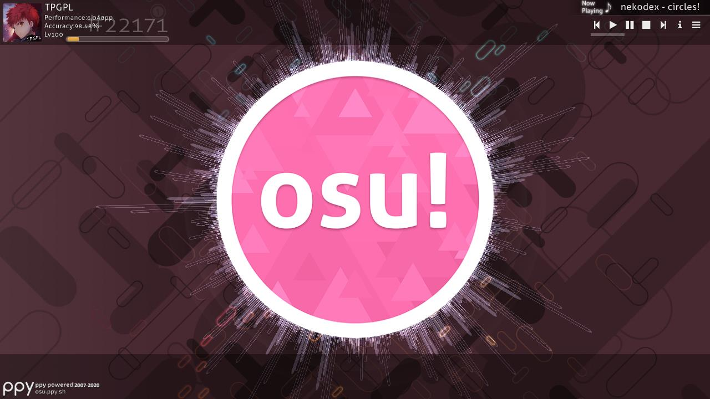

## Menu główne

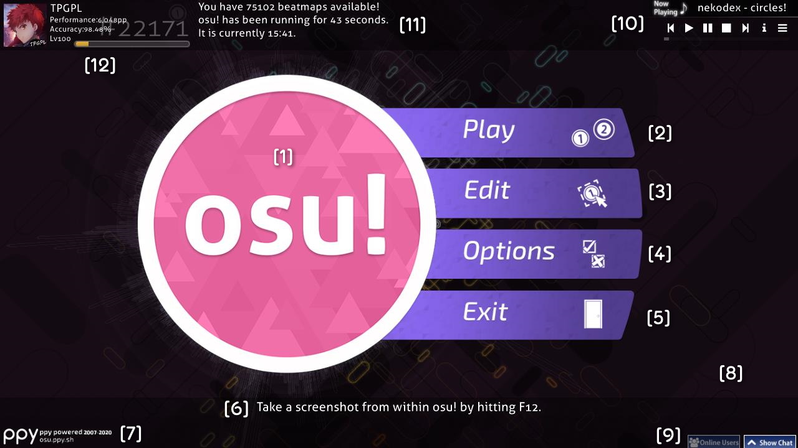

- \[1\] ["Ciastko"](/wiki/Client/Interface/Cookie) osu!. Jego kliknięcie otwiera menu główne. Pulsuje zgodnie z [tempem](/wiki/Music_theory/Tempo) utworu, a wokół niego znajduje się wizualizator muzyki. Jeśli w danym momencie nie gra żaden utwór, pulsuje z szybkością 60 uderzeń na minutę.
- \[2\] Kliknij `Play` (lub naciśnij `P`), aby grać w osu!, zarówno samemu, jak i razem z innymi graczami.
- \[3\] Kliknij `Edit` (lub naciśnij `E`), aby edytować [beatmapy](/wiki/Beatmap).
- \[4\] Kliknij `Options` (lub naciśnij `O`), aby otworzyć [opcje](/wiki/Client/Options).
- \[5\] Kliknij `Exit` (lub naciśnij `Esc`), aby wyjść z gry.
- \[6\] Losowa [wskazówka](/wiki/Client/Menu_tips).
- \[7\] Logo [ppy](https://ppy.sh/) wraz z informacjami dotyczącymi praw autorskich. Jego kliknięcie przekierowuje na [stronę główną osu!](https://osu.ppy.sh/home).
- \[8\] W tym miejscu pojawi się ikona urwanego łańcucha, jeżeli pojawią się problemy z połączeniem z [serwerem Bancho](/wiki/Bancho_(server)).
- \[9\] [Czat](/wiki/Client/Interface/Chat_console), a po jego lewej przycisk otwierający rozszerzone okno czatu, które wyświetla aktualnie online użytkowników. Okna czatu można przełączać również za pomocą klawiszy, odpowiednio `F8` i `F9`.
- \[10\] Odtwarzacz muzyki, który odtwarza piosenki w losowej kolejności. Zjedź niżej, aby dowiedzieć się więcej na temat znajdujących się tutaj przycisków.
- \[11\] Liczba pobranych (wbrew temu, co napisano) [poziomów trudności](/wiki/Beatmap/Difficulty), ile czasu już grasz oraz czas systemowy.  
- \[12\] Twój profil. Jego kliknięcie otwiera [opcje użytkownika](#opcje-użytkownika).

---

W odtwarzaczu muzyki znajdują się następujące przyciski:

| Przycisk | Opis |
| :-: | :-- |
|  | Poprzedni utwór |
|  | Odtwórz |
|  | Pauza |
|  | Zatrzymaj muzykę i cofnij bieżący utwór do początku |
|  | Następny utwór |
|  | Przełącz pomiędzy stałym wyświetlaniem informacji o bieżącym utworze a ich ukrywaniu po chwili. |
|  | Przejdź do konkretnego utworu. Możesz szukać piosenek za pomocą wyszukiwarki lub filtrować je według kolekcji. |

Odtwarzaczem można sterować również za pomocą [skrótów klawiszowych](/wiki/Client/Keyboard_shortcuts#odtwarzacz-muzyki).

## Opcje użytkownika

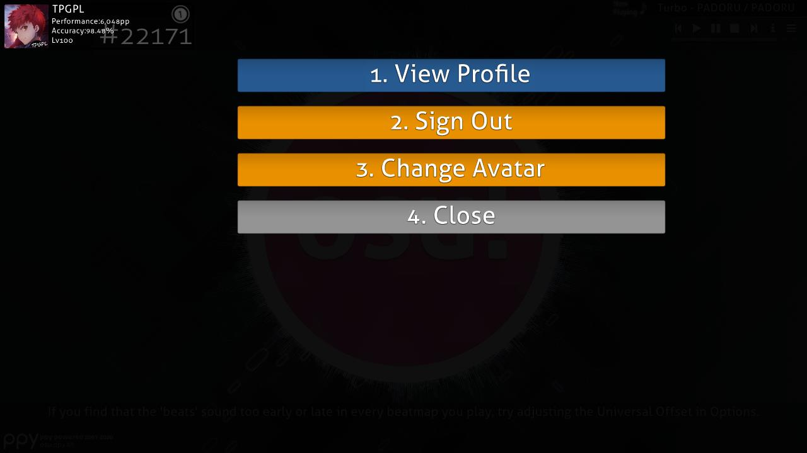

Aby otworzyć to menu, kliknij w swój profil w lewym górnym rogu menu głównego. Poszczególne opcje można wybrać również za pomocą odpowiednich klawiszy numerycznych:

- `1. Zobacz profil`: Wyświetl swój profil na stronie internetowej.
- `2. Wyloguj się`: Wyloguj się ze swojego konta. Po wylogowaniu się gra poprosi cię o ponowne zalogowanie.
- `3. Zmień avatar`: Otwiera [ustawienia dotyczące awatara](https://osu.ppy.sh/home/account/edit#avatar) na stronie internetowej.
- `4. Zamknij`: Zamyka to menu.

## Menu gry

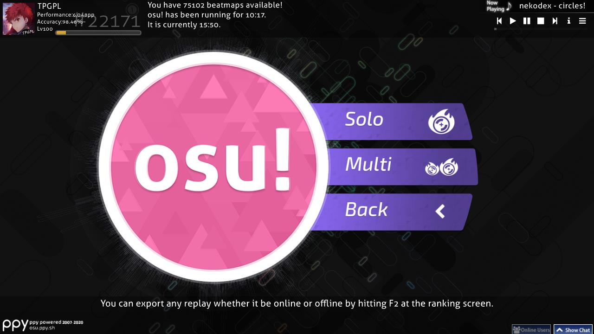

Kliknięcie `Play` w menu głównym pozwala na wybranie jednej z trzech opcji:

- Kliknij `Solo` (lub naciśnij `P`), aby grać samemu. Ta opcja zabierze cię do [ekranu wyboru piosenki](#wybór-piosenki).
- Kliknij `Multi` (lub naciśnij `M`), aby grać razem z innymi graczami. Ta opcja przekieruje cię do poczekalni [trybu wieloosobowego](/wiki/Client/Interface/Multiplayer).
- Kliknij `Back`, aby powrócić do menu głównego.

## Tryb wieloosobowy

::: alert-note
**Główny artykuł:** [Tryb wieloosobowy](/wiki/Client/Interface/Multiplayer)
:::

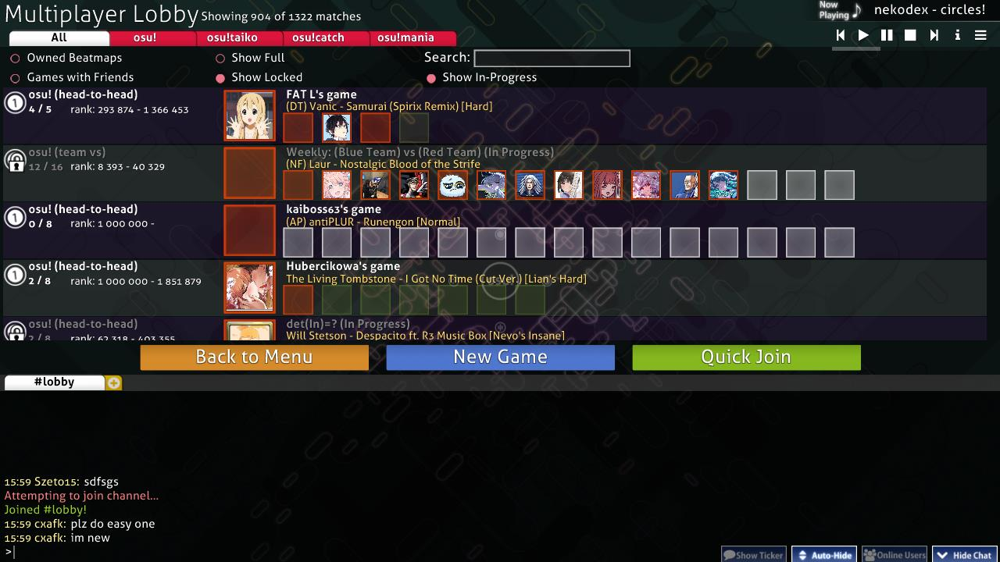

Tryb wieloosobowy pozwala grać zarówno z innymi graczami, jak i przeciwko nim.

## Wybór piosenki

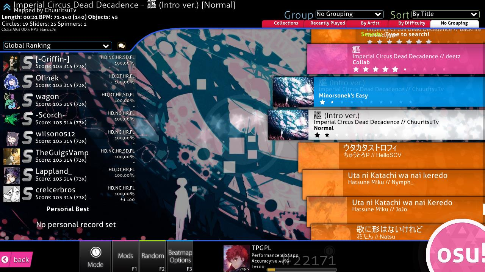

W lewym dolnym rogu (powyżej napisu `Mode`) widać obecnie wybrany [tryb gry](/wiki/Game_mode). Ikona trybu jest również delikatnie widoczna pośrodku ekranu. Poniżej znajdują się ikony poszczególnych trybów:

-  to [osu!](/wiki/Game_mode/osu!)
-  to [osu!taiko](/wiki/Game_mode/osu!taiko)
-  to [osu!catch](/wiki/Game_mode/osu!catch)
-  to [osu!mania](/wiki/Game_mode/osu!mania)

Ekran zawiera zbyt dużo elementów, aby dało się je oznaczyć za pomocą liczb, dlatego każda jego część zostanie opisana osobno we własnym podpunkcie, idąc od góry do dołu i od lewej do prawej.

### Informacje o beatmapie

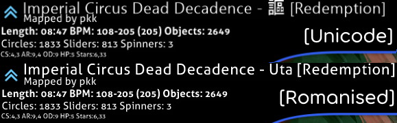

Ta część ekranu wyświetla **informacje o obecnie wybranym poziomie trudności beatmapy**. Beatmapa utworu, który był odtwarzany w menu głównym zostanie wybrana automatycznie po przejściu do tego ekranu. Ikona w lewym górnym rogu przedstawia [kategorię beatmapy](/wiki/Beatmap/Category). W tym przypadku oznacza, że beatmapa jest [rankingowa](/wiki/Beatmap/Category#rankingowe).

Wyświetlany tytuł piosenki jest domyślnie zapisany alfabetem łacińskim (dolne zdjęcie), jednak można to zmienić w [opcjach](/wiki/Client/Options) zaznaczając `Preferuj oryginalne nazewnictwo` (dając rezultat jak na górnym zdjęciu). Nazwa poziomu trudności zawarta jest w nawiasach kwadratowych (`[]`), a pod tytułem widnieje nazwa twórcy beatmapy. Niżej znajdują się następujące informacje (czytane od lewej do prawej):

- **Długość**: Całkowita długość beatmapy od początku do końca, wliczając przerwy. Nie mylić z [długością aktywnej gry](/wiki/Beatmap/Drain_time).
- **BPM**: Uderzenia na minutę (ang. *Beats Per Minute*), czyli tempo piosenki. Jeśli tempo piosenki zmienia się w jej trakcie, zostaną wyświetlone dwie wartości – najwolniejszego i najszybszego tempa – oraz jedna w nawiasie, określająca główne tempo piosenki.
- **Obiekty**: Łączna liczba [obiektów](/wiki/Gameplay/Hit_object) w beatmapie.
- **Kółka**: Łączna liczba [kółek](/wiki/Gameplay/Hit_object/Hit_circle) (osu! oraz osu!taiko), [owoców](/wiki/Gameplay/Hit_object/Fruit) (osu!catch) lub nut (osu!mania) w beatmapie.
- **Slidery**: Łączna liczba [sliderów](/wiki/Gameplay/Hit_object/Slider) (osu!), drumrolli (osu!taiko), [juice streamów](/wiki/Gameplay/Hit_object/Juice_stream) (osu!catch) lub LN-ów (osu!mania) w beatmapie.
- **Spinnery**: Łączna liczba [spinnerów](/wiki/Gameplay/Hit_object/Spinner) (osu!), dendenów (osu!taiko) lub [bananów](/wiki/Gameplay/Hit_object/Banana) (osu!catch) w beatmapie.
- **OD**: [Precyzja](/wiki/Beatmap/Overall_difficulty) beatmapy.
- **HP**: [Spadek HP](/wiki/Beatmap/HP_drain_rate). Więcej informacji znajdziesz w artykule o [życiu](/wiki/Gameplay/Health).
- **Trudność**: [Trudność](/wiki/Beatmap/Star_rating) beatmapy, łatwo widoczna również na liście beatmap.

### Opcje `Grupuj` i `Sortuj`

Kliknij na jedną z zakładek, aby **posegregować beatmapy według wybranego kryterium**.

#### Grupuj

Opcje te pozwalają na podzielenie beatmap na różne rozwijane grupy:

| Tryb grupowania | Opis |
| :-: | :-- |
| `Bez grup` | Beatmapy nie zostaną pogrupowane, jednak wciąż będą posortowane według wybranego trybu sortowania. |
| `Po trudności` | Beatmapy zostaną pogrupowane według trudności zaokrąglonej do liczby całkowitej. |
| `Po wykonawcy` | Beatmapy zostaną pogrupowane według pierwszego znaku nazwy wykonawcy. |
| `Ost. zagrane` | Beatmapy zostaną pogrupowane według tego, kiedy je ostatnio zagrałeś. |
| `Zbiory` | Ta opcja wyświetli stworzone przez ciebie kolekcje beatmap.  *Pamiętaj, że opcja ta ukryje beatmapy niebędące częścią żadnej kolekcji!* |
| `Po BPM` | Beatmapy zostaną pogrupowane według BPM piosenki w przedziałach będących wielokrotnościami liczby 60. |
| `Po twórcy` | Beatmapy zostaną pogrupowane według pierwszego znaku nazwy użytkownika twórcy. |
| `Po dacie dodania` | Beatmapy zostaną pogrupowane według tego, kiedy zostały dodane, od dziś do 5+ miesięcy temu. |
| `Po długości` | Beatmapy zostaną pogrupowane według długości: 1, 2, 3, 4, 5, 10 minut lub mniej oraz ponad 10 minut.  |
| `Po trybie gry` | Beatmapy zostaną pogrupowane według trybu gry. |
| `Po uzyskanej ocenie` | Beatmapy zostaną pogrupowane według uzyskanej na nich [ocenie](/wiki/Gameplay/Grade). |
| `Po tytule` | Beatmapy zostaną pogrupowane według pierwszego znaku tytułu utworu. |
| `Ulubione` | Zostaną wyświetlone jedynie beatmapy, które dodałeś do ulubionych na stronie internetowej. |
| `Moje mapy` | Zostaną wyświetlone jedynie beatmapy, które stworzyłeś (innymi słowy, których nazwa użytkownika twórcy jest taka sama jak twoja). |
| `Stan rankingu` | Beatmapy zostaną pogrupowane według statusu: rankingowe, oczekujące, nieopublikowane, nieznane oraz ulubione społeczności. |

Pięć pierwszych opcji grupowania można włączyć również za pomocą zakładek znajdujących się poniżej przycisków `Grupuj` i `Sortuj`.

#### Sortuj

Sortuje beatmapy według określonej kolejności.

| Tryb sortowania | Opis |
| :-: | :-- |
| `Po wykonawcy` | Beatmapy zostaną posortowane alfabetycznie według nazwy wykonawcy. |
| `Po BPM` | Beatmapy zostaną posortowane od najmniejszego do największego BPM. Dla map ze zmiennym tempem zostanie wzięta pod uwagę największa wartość. |
| `Po twórcy` | Beatmapy zostaną posortowane alfabetycznie według nazwy użytkownika twórcy. |
| `Po dacie dodania` | Beatmapy zostaną posortowane według tego, kiedy zostały dodane, od najstarszych do najnowszych. |
| `Po trudności` | Beatmapy zostaną posortowane według ilości gwiazdek, od najłatwiejszej do najtrudniejszej. *Pamiętaj, że ten tryb sortowania rozdzieli poziomy trudności beatmapy!* |
| `Po długości` | Beatmapy zostaną posortowane według długości, od najkrótszej do najdłuższej. |
| `Po uzyskanej ocenie` | Beatmapy zostaną posortowane według najwyższej uzyskanej na nich oceny, od najgorszej do najlepszej. |
| `Po tytule` | Beatmapy zostaną posortowane alfabetycznie według tytułu utworu. |

### Wyszukiwarka

::: alert-note
**Główny artykuł:** [Wyszukiwanie beatmap](/wiki/Beatmap_search)
:::

Wyszukiwarka pozwala na filtrowanie poziomów trudności, które spełniają podane kryteria. Domyślnie osu! korzysta z wyszukiwania pełnotekstowego, wyświetlając jedynie wyniki zawierające wszystkie podane słowa. Istnieje również możliwość wyszukiwania według [prędkości otoczki](/wiki/Beatmap/Approach_rate), [trudności](/wiki/Beatmap/Star_rating) i wielu innych kryteriów używając filtrów takich jak `ar=8` lub `stars>=5`.

Aby wyszukać beatmapę, po prostu zacznij pisać na klawiaturze będąc w ekranie wyboru piosenki. Upewnij się, że opcje oraz panel czatu są zamknięte.

### Rankingi

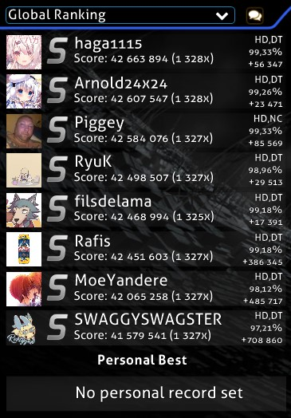

W tym miejscu mogą pojawić się różne elementy:

- Napis `Not Submitted` oznacza beatmapę, która nie została wysłana na stronę osu! przy użyciu [Beatmap Submission System](/wiki/Beatmapping/Beatmap_submission), lub która została usunięta przez twórcę.
- Napis `Update to latest version` pojawia się, gdy dostępna jest nowa wersja beatmapy. Kliknij przycisk, aby ją zaktualizować.
  - *Uwaga: Po zaktualizowaniu beatmapy wszystkie lokalne wyniki zostaną usunięte. Powtórki lokalnych wyników można wyeksportować, klikając je prawym przyciskiem myszy.*
- Napis `Latest pending version` oznacza, że beatmapa została wysłana na stronę osu!, ale nie jest jeszcze rankingowa.
- Jeśli istnieją powtórki dla wybranego widoku rankingu, zostaną one wyświetlone zamiast statusu beatmapy (pokazane na zdjęciu wyżej).
  - W przypadku rankingów publicznych (np. globalnego, znajomych) twój najlepszy wynik oraz miejsce w rankingu zostaną wyświetlone na samym dole tabeli wyników.
- Napis `No records set!` oznacza, że nie ma jeszcze żadnych powtórek dla wybranego widoku rankingu. Zwykle pojawia się w przypadku rankingu lokalnego zaraz po tym, jak pobierzesz lub edytujesz daną beatmapę.

Można wybierać spośród następujących widoków rankingu:

- Ranking lokalny
- Ranking krajowy\*
- Ranking globalny
- Ranking globalny (wybrane mody)\*
- Ranking znajomych

\*Wymaga [aktywnego statusu donatora osu!](/wiki/osu!supporter).

Kliknij ikonę dymka tekstowego, aby uzyskać **szybki dostęp do beatmapy w internecie**:

- Naciśnij `1` lub kliknij `Lista map/wyniki`, aby otworzyć stronę beatmapy dla wybranego poziomu trudności w przeglądarce.
- Naciśnij `2` lub kliknij `Temat beatmapy na forum`, aby wyświetlić [dyskusję](/wiki/Modding) beatmapy.
- Naciśnij `3` lub kliknij `Anuluj`, aby powrócić do ekranu wyboru piosenki.

### Lista beatmap

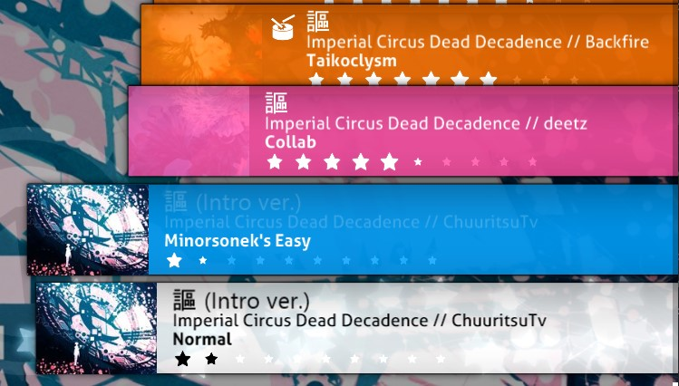

Lista beatmap wyświetla wszystkie dostępne beatmapy. Beatmapy są oznaczone różnymi kolorami:

| Kolor | Opis |
| :-: | :-- |
| **Różowy** | Na tej beatmapie nie ustanowiono jeszcze żadnego wyniku. |
| **Pomarańczowy** | Ustanowiono wynik na przynajmniej jednym z poziomów trudności danej beatmapy. |
| **Jasnoniebieski** | Inne poziomy trudności tej samej beatmapy, które pokazują się po jej rozwinięciu. |
| **Biały** | Obecnie wybrany poziom trudności. |

Listę beatmap możesz przewijać za pomocą kółka myszy, strzałek góra/dół lub poprzez przytrzymanie lewego przycisku myszy i przeciągnięcie myszką. Możesz też użyć prawego przycisku myszy, aby przesunąć pasek przewijania do pozycji kursora. Kliknij beatmapę, aby ją wybrać. Następnie kliknij ją ponownie, naciśnij `Enter` lub kliknij na logo osu! w prawym dolnym rogu, aby ją zagrać.

### Pasek narzędzi rozgrywki

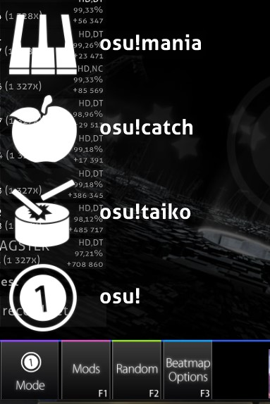

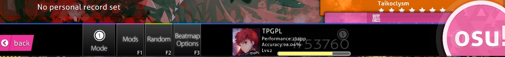

Nazwa tej sekcji to pasek narzędzi rozgrywki. Wszystkie znajdujące się tu przyciski zostaną omówione od lewej do prawej.

Naciśnij `Esc` lub kliknij przycisk `Back`, aby powrócić do głównego menu.

Kliknij na przycisk z napisem `Mode`, aby otworzyć listę dostępnych trybów gry. Możesz również użyć skrótów klawiszowych, aby szybko przełączać się pomiędzy nimi: `Ctrl` + `1` dla osu!, `Ctrl` + `2` dla osu!taiko, `Ctrl` + `3` dla osu!catch oraz `Ctrl` + `4` dla osu!manii. Zmiana trybu gry spowoduje również przełączenie [tabeli wyników](/wiki/Ranking) na tę odpowiadającą danemu trybowi oraz zaktualizowanie twojej pozycji w rankingu globalnym.

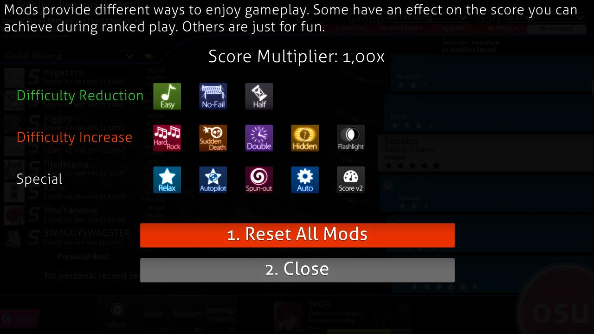

Kliknij przycisk z napisem `Mods` lub naciśnij `F1`, aby otworzyć **[ekran wyboru modów](/wiki/Gameplay/Game_modifier)**.

Możesz tutaj wybrać różne modyfikacje (w skrócie "mody"). Niektóre z nich obniżają trudność i redukują liczbę zdobywanych punktów. Inne z kolei utrudniają rozgrywkę, ale jednocześnie zwiększają mnożnik zdobywanych punktów. Są również mody, które wpływają na rozgrywkę w zupełnie inny sposób, na przykład [Relax](/wiki/Gameplay/Game_modifier/Relax) czy [Auto Pilot](/wiki/Gameplay/Game_modifier/Autopilot).

Najedź kursorem na ikonę moda, aby zobaczyć jego krótki opis. Kliknij, aby zaznaczyć lub odznaczyć go. Niektóre mody (np. Double Time) posiadają kilka wariantów, które może przewijać klikając ponownie na ikonę moda. U góry znajduje się mnożnik wyniku (`Score Multiplier`) dla wybranej kombinacji modów. Kliknij `Resetuj mody` lub naciśnij `1`, aby odznaczyć wszystkie wybrane mody. Kliknij `Zamknij` lub naciśnij `2` albo `Esc`, aby powrócić do ekranu wyboru piosenki.

Kliknij przycisk z napisem `Random` lub naciśnij `F2`, aby **losowo wybrać jedną z pobranych beatmap.**

::: alert-notice
Możesz nacisnąć `Shift` + przycisk `Random` lub `Shift` + `F2`, aby powrócić do beatmapy, która była wybrana przed wylosowaniem nowej.
:::

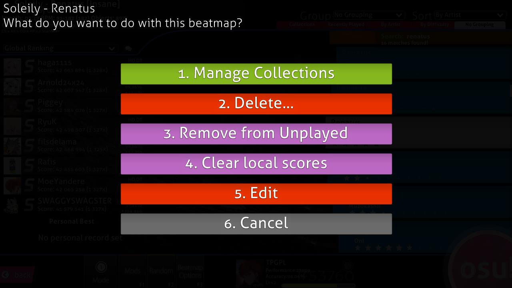

Kliknij na przycisk z napisem `Beatmap Options`, naciśnij `F3` lub najedź kursorem na beatmapę i kliknij ją prawym przyciskiem myszy, aby otworzyć **menu opcji dla wybranej beatmapy**.

- Naciśnij `1` lub kliknij `Zarządzaj kolekcjami`, aby otworzyć menedżer kolekcji. Możesz tutaj zarządzać wcześniej utworzonymi kolekcjami oraz dodać lub usunąć obecnie wybraną beatmapę z danej kolekcji.
- Naciśnij `2` lub kliknij `Usuń...` aby usunąć \[1\] obecnie wybrany poziom trudności, \[2\] obecnie wybraną beatmapę lub \[3\] **wszystkie WIDOCZNE mapy**.
  - Usunięte beatmapy zostaną przeniesione do kosza.
- Naciśnij `3` lub kliknij `Zaznacz jako zagrane`, aby oznaczyć daną beatmapę jako zagraną i zmienić jej kolor z różowego na pomarańczowy.
- Naciśnij `4` lub kliknij `Wyczyść wyniki lokalne`, aby usunąć wszystkie wyniki, które kiedykolwiek osiągnąłeś na danej beatmapie.
- Naciśnij `5` lub kliknij `Edytuj`, aby otworzyć daną beatmapę w edytorze.
- Naciśnij `6` lub `Esc` albo kliknij `Anuluj`, aby powrócić do ekranu wyboru piosenki.

Kliknij na **panel użytkownika**, aby otworzyć **opcje użytkownika**.

Kliknij na **[logo osu!](/wiki/Client/Interface/Cookie)**, aby **zagrać wybraną beatmapę**.

## Ekran z wynikiem

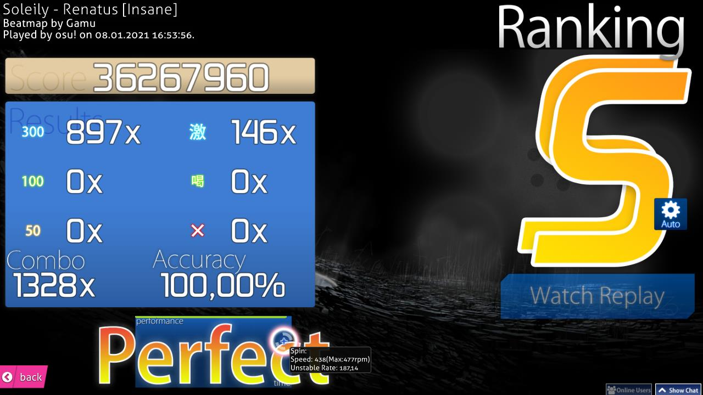

Ekran z wynikiem jest wyświetlany po udanym przejściu beatmapy. Do swojego wyniku online możesz przejść przewijając w dół lub klikając `Online Ranking`.

Poniżej pokazano ekrany wyniku dla pozostałych trybów gry.

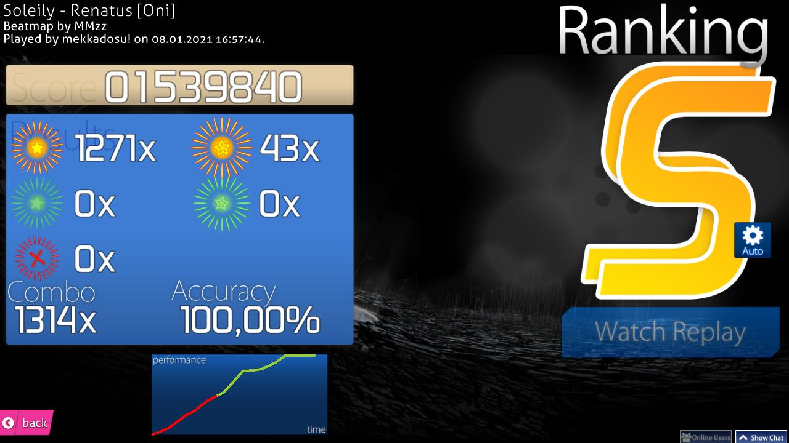

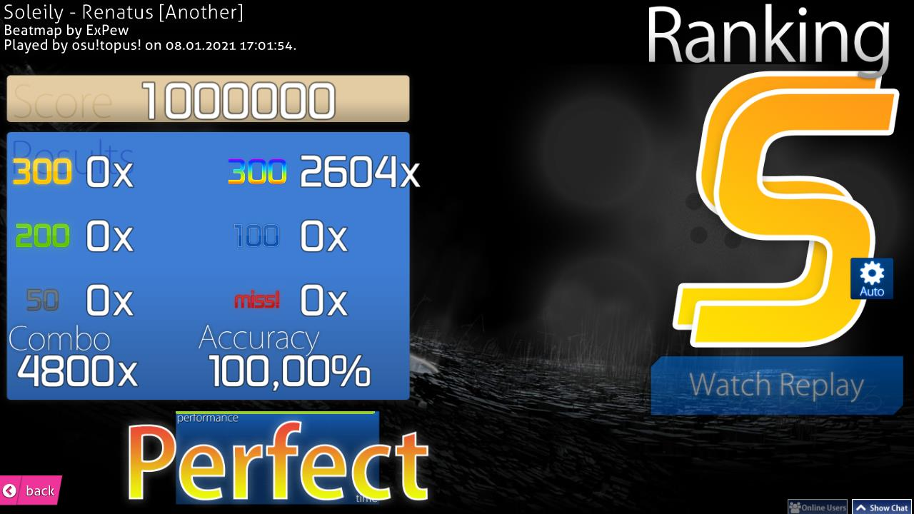

### Rozszerzenie ekranu z wynikiem

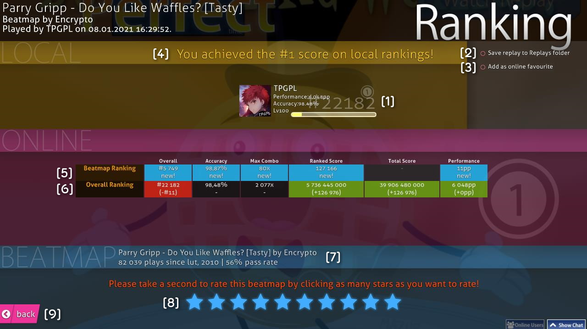

Na tym zdjęciu przedstawiony jest ranking online. Możesz tu przejść przewijając w dół na ekranie z wynikiem. Na lokalnej tabeli wyników zobaczysz jak zwykle swoją nazwę i wynik.

- \[1\] Twój panel użytkownika. Pokazuje, ile [pp](/wiki/Performance_points) posiadasz, twoją pozycję w rankingu globalnym, łączny wynik, ogólną [celność](/wiki/Gameplay/Accuracy) oraz pasek pokazujący postęp do następnego poziomu.
- \[2\] `Zapisz powtórkę do folderu Replays`: Możesz obejrzeć powtórkę później zarówno otwierając ją z rankingu lokalnego, jak i poprzez podwójne kliknięcie pliku w folderze `Replays`.
- \[3\] `Oznacz mapę jako ulubiona`: Dodaje beatmapę do twojej listy ulubionych beatmap, która znajduje się na twoim profilu osu! w sekcji `Beatmapy`.
- \[4\] Ranking lokalny: Wszystkie twoje wyniki są przechowywane na twoim komputerze. Aby je zobaczyć, przejdź do [ekranu wyboru piosenki](#wybór-piosenki) i wybierz `Ranking lokalny` z rozwijanej listy znajdującej się nad tabelą wyników.
- \[5\] Sekcja `Beatmap Ranking`. Dostępna jedynie dla beatmap z tabelą wyników ([zakwalifikowanych](/wiki/Beatmap/Category#zakwalifikowane), [rankingowych](/wiki/Beatmap/Category#rankingowe) oraz [ulubionych społeczności](/wiki/Beatmap/Category#ulubione-społeczności)). Żeby ją zobaczyć, musisz być również połączony z internetem. Więcej informacji znajdziesz poniżej.
- \[6\] Sekcja `Overall Ranking`. Dostępna jedynie dla beatmap z tabelą wyników. Żeby ją zobaczyć, musisz być również połączony z internetem. Więcej informacji znajdziesz poniżej.
- \[7\] Informacje o beatmapie, jej liczba zagrań oraz procent przejść.
- \[8\] Ocena beatmapy. Możesz tutaj wskazać, jak bardzo ci się podobała. Z oceną lepiej się wstrzymać, jeżeli nie potrafisz się zdecydować.
- \[9\] Kliknij tutaj, aby powrócić do ekranu wyboru piosenki.

---

W panelu rankingowym znajdziesz następujące kategorie:

| Nazwa kategorii | Sekcja Beatmap Ranking | Sekcja Overall Ranking |
| :-: | :-- | :-- |
| `Ogólne` | Twoja pozycja w rankingu beatmapy. Wyniki osiągnięte przy użyciu [modów](/wiki/Gameplay/Game_modifier) również pojawią się w tym rankingu. | Twoja pozycja w [rankingu globalnym](/wiki/Ranking#ranking-pp). |
| [`Celność`](/wiki/Gameplay/Accuracy) | Pokazuje, jak celnie trafiałeś w obiekty beatmapy. | Średnia ważona celności twoich najlepszych wyników. |
| `Max Combo` | Najdłuższe combo, które udało ci się osiągnąć na tej beatmapie. | Najdłuższe combo, jakie udało ci się osiągnąć kiedykolwiek. |
| [`Rankingowy wynik`](/wiki/Gameplay/Score/Ranked_score) | Największa [liczba punktów](/wiki/Gameplay/Score/Ranked_score), jaką udało ci się osiągnąć na beatmapie. | Liczba punktów zdobyta ze wszystkich kiedykolwiek zagranych rankingowych beatmap. Każda beatmapa liczy się do sumy tylko raz. |
| [`Łączny wynik`](/wiki/Gameplay/Score/Total_score) | Nie jest brany pod uwagę, gdyż nie wpływa na twoją pozycję w rankingach online. | Tak samo jak przy rankingowym wyniku, przy czym łączny wynik bierze pod uwagę wszystkie beatmapy dostępne na stronie osu!, wliczając nieukończone przejścia. Liczy się do twojego [poziomu](/wiki/Gameplay/Score/Total_score#level). |
| [`Performance`](/wiki/Performance_points) | Liczba [ważonych punktów pp](/wiki/Performance_points#why-didn't-i-gain-the-full-amount-of-pp-from-a-map-i-played?) otrzymanych za dany wynik. | Łączna liczba posiadanych pp, a także ile pp wart był dany wynik. |

### Medale

::: alert-note
**Główny artykuł:** [Medale](/wiki/Medals)
:::

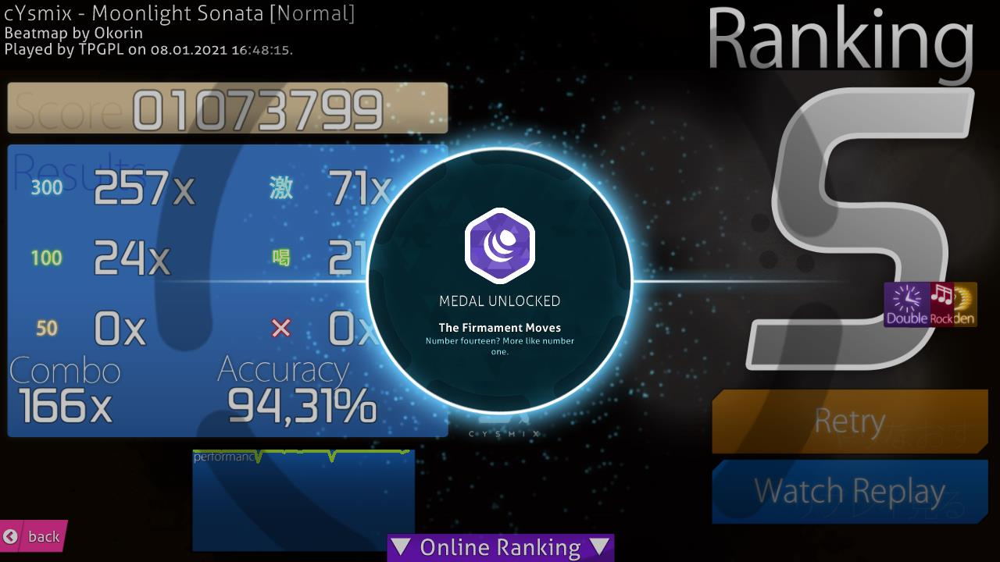

Przy spełnieniu określonych wymagań możesz czasem otrzymać medal.
