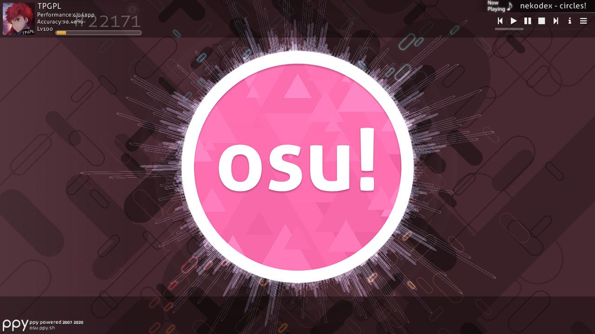
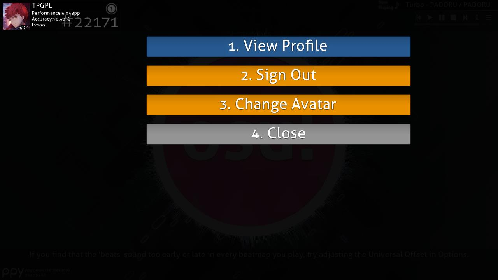
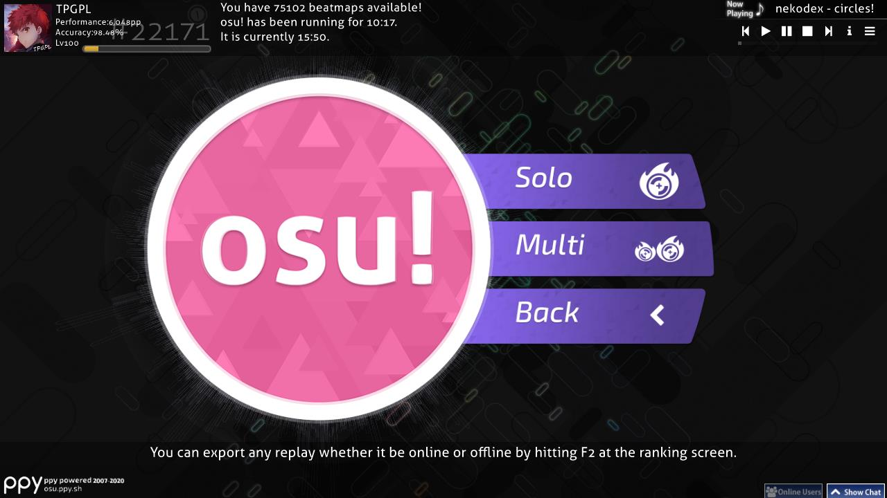
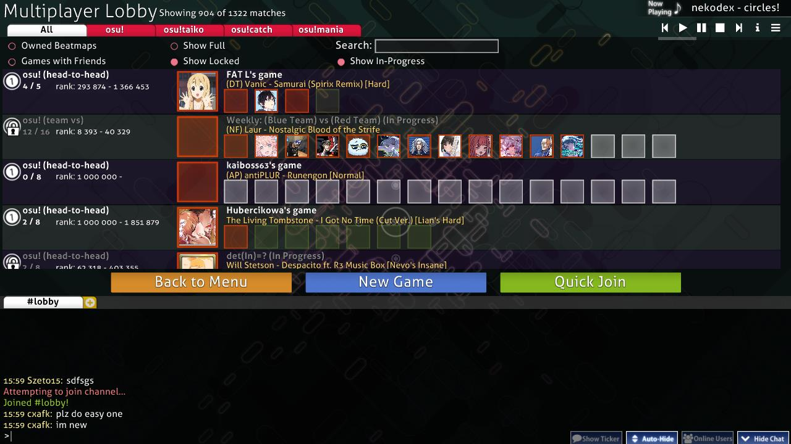
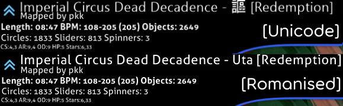
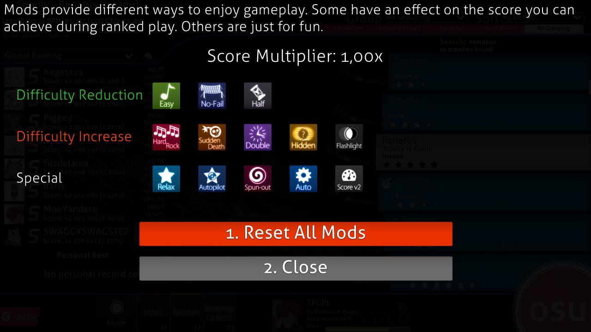
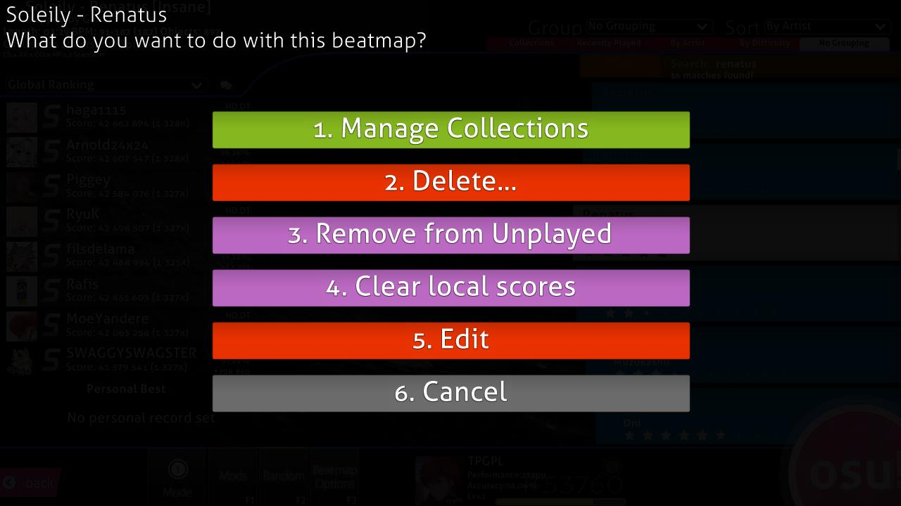
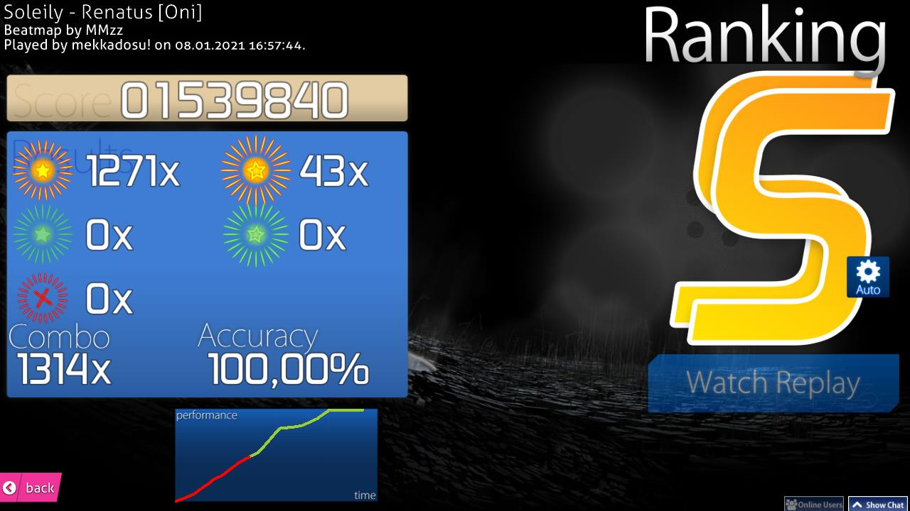
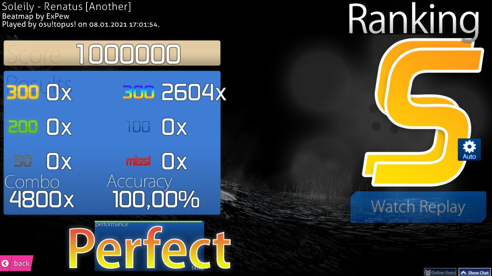
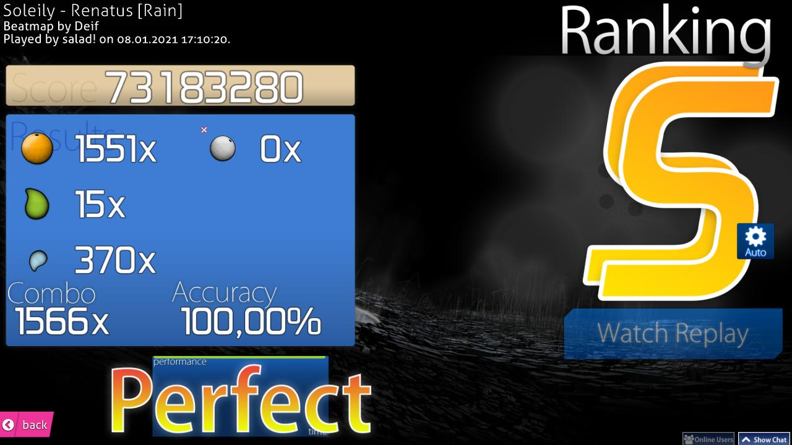

# Интерфейс

В этой статье описано всё, что нужно знать об использовании игрового клиента osu!: то, как устроен экран выбора песни, таблицы рекордов, а также экран с результатами прохождения карты. При запуске клиента вы увидите следующее:

## Главное меню

- \[1\] [Логотип osu!](/wiki/Client/Interface/Cookie) (англ. *osu! cookie*). Нажатие на него открывает главное меню. Логотип пульсирует в такт [BPM](/wiki/Music_theory/Tempo) играющей музыки, а полоски вокруг него отображают звуковой спектр аудио. Если музыка не играет, он медленно пульсирует раз в секунду.
- \[2\] Нажмите `Play` (или клавишу `P`), чтобы играть в osu! в одиночку или по сети.
- \[3\] Нажмите `Edit` (или клавишу `E`), чтобы перейти в режим редактирования [карт](/wiki/Beatmap).
- \[4\] Нажмите `Options` (или клавишу `O`), чтобы открыть [боковую панель настроек](/wiki/Client/Options).
- \[5\] Нажмите `Exit` (или клавишу `Esc`), чтобы выйти из игры.
- \[6\] Случайный полезный [совет](/wiki/Client/Menu_tips).
- \[7\] Логотип [ppy](https://ppy.sh/) и информация об авторских правах. При нажатии на логотип откроется [сайт osu!](https://osu.ppy.sh/home).
- \[8\] При проблемах с подключением к [серверу Bancho](/wiki/Bancho_(server)) здесь показывается иконка в виде разорванной цепи.
- \[9\] [Чат](/wiki/Client/Interface/Chat_console), а слева от него — кнопка расширенного окна чата, где показывается список игроков, находящихся сейчас в сети. Чат можно открывать клавишами `F8` и `F9` соответственно.
- \[10\] Аудиоплеер. В главном меню он играет песни в случайном порядке (подробнее о кнопках см. ниже).
- \[11\] Число скачанных [сложностей карт](/wiki/Beatmap/Difficulty) (несмотря на подпись), время, в течение которого запущена игра, и текущее системное время.
- \[12\] Ваш профиль. Нажатие на него открывает [меню пользователя](#меню-пользователя).

---

У плеера есть следующие кнопки:

| Кнопка | Описание |
| :-: | :-- |
|  | Предыдущий трек |
|  | Воспроизведение |
|  | Пауза |
|  | Остановить и перемотать текущую песню в начало |
|  | Следующий трек |
|  | Переключение между двумя режимами: название и исполнитель текущего трека либо всегда видны, либо пропадают через некоторое время. |
|  | Открыть окно с выбором конкретной песни, где можно искать их по названию или фильтровать по коллекциям. |

Плеером также можно управлять с помощью [горячих клавиш](/wiki/Client/Keyboard_shortcuts#проигрыватель).

## Меню пользователя

Открыть это меню можно, нажав на свой профиль в левом верхнем углу главного меню. Любой пункт можно выбрать, нажав на указанную цифру на клавиатуре:

- `1. View Profile`: открыть ваш профиль на сайте osu!.
- `2. Sign Out`: выйти из аккаунта. После выхода игра предложит снова войти.
- `3. Change Avatar`: открыть [страницу смены аватара](https://osu.ppy.sh/home/account/edit#avatar) на сайте.
- `4. Close`: закрыть меню.

## Игровое меню

После выбора `Play` в главном меню доступно три варианта:

- Нажмите `Solo` (или клавишу `P`), чтобы играть в одиночку — это откроет [экран выбора песни](#экран-выбора-песни).
- Нажмите `Multi` (или клавишу `M`), чтобы играть с другими — это откроет лобби [мультиплеера](/wiki/Client/Interface/Multiplayer).
- Нажмите `Back`, чтобы вернуться в главное меню.

## Лобби

::: alert-note
**Основная статья:** [Мультиплеер](/wiki/Client/Interface/Multiplayer)
***

В лобби можно играть как вместе с другими игроками, так и против них.

## Экран выбора песни

Значок выбранного сейчас [режима игры](/wiki/Game_mode) виден в левом нижнем углу, над кнопкой `Mode`. Его прозрачная версия также отображается в центре экрана. Всего значков в игре четыре:

-  — [osu!](/wiki/Game_mode/osu!)
-  — [osu!taiko](/wiki/Game_mode/osu!taiko)
-  — [osu!catch](/wiki/Game_mode/osu!catch)
-  — [osu!mania](/wiki/Game_mode/osu!mania)

На этом экране слишком много элементов, чтобы удобно пронумеровать их все, поэтому в подразделах ниже они разбираются последовательно — сверху вниз и слева направо.

### Информация о карте

В этой области показана **информация о выбранной сложности карты.** При переходе на экран выбора песни открывается та, что сейчас играет в плеере. Значок в левом верхнем углу показывает [категорию карты](/wiki/Beatmap/Category) — в данном случае [Ranked](/wiki/Beatmap/Category#ranked).

Название песни обычно показывается в романизированном виде (см. картинку внизу), но если включить `Prefer metadata in original language` в [настройках](/wiki/Client/Options), оно будет в оригинале, в Unicode (см. картинку наверху). Название сложности карты указывается в квадратных скобках (`[]`). Под названием песни указан создатель карты, а ещё ниже — остальная информация. Слева направо:

- **Length (длина)**: полная длительность карты от начала до конца, включая перерывы. Не путать с [игровым временем](/wiki/Beatmap/Drain_time).
- **BPM** (англ. *beats per minute*) — темп песни. Если показаны два значения BPM и ещё одно в скобках, значит, BPM меняется на протяжении песни: указываются минимальный и максимальный BPM, а в скобках — наиболее частый BPM карты.
- **Objects (объекты)**: общее число [игровых объектов](/wiki/Gameplay/Hit_object).
- **Circles (ноты)**: общее число [нот](/wiki/Gameplay/Hit_object/Hit_circle) (osu! и osu!taiko), [фруктов](/wiki/Gameplay/Hit_object/Fruit) (osu!catch) или одиночных нот (osu!mania).
- **Sliders (слайдеры)**: общее число [слайдеров](/wiki/Gameplay/Hit_object/Slider) (osu!), барабанных дробей (osu!taiko), [стримов из капель](/wiki/Gameplay/Hit_object/Juice_stream) (osu!catch) или длинных нот (osu!mania).
- **Spinners (спиннеры)**: общее число [спиннеров](/wiki/Gameplay/Hit_object/Spinner) (osu!), денденов (osu!taiko) или [бананов](/wiki/Gameplay/Hit_object/Banana) (osu!catch).
- **OD**: [общая сложность](/wiki/Beatmap/Overall_difficulty) карты.
- **HP**: [скорость убывания HP](/wiki/Beatmap/HP_drain_rate) (подробнее см. [Здоровье](/wiki/Gameplay/Health)).
- **Stars**: [сложность карты в звёздах](/wiki/Beatmap/Star_rating). Число звёзд также указано в самом списке карт.

### Группировка и сортировка

Нажмите на одну из вкладок, чтобы **упорядочить список карт по выбранному критерию**.

#### Группировка

Эти варианты объединяют карты в группы, которые можно сворачивать и разворачивать:

| Группировка | Описание |
| :-: | :-- |
| `No grouping` | Карты не группируются, но всё равно сортируются по правилу из списка Sort. |
| `By Difficulty` | Карты группируются по сложности в звёздах, округлённой вниз до целого числа. |
| `By Artist` | Карты группируются по первой букве названия исполнителя. |
| `Recently Played` | Карты группируются по периоду, когда их последний раз играли. |
| `Collections` | Показывает созданные вами коллекции. *Обратите внимание: карты, не добавленные ни в одну коллекцию, при этом скрываются!* |
| `By BPM` | Карты группируются по BPM с шагом в 60. |
| `By Creator` | Карты группируются по первой букве ника автора карты. |
| `By Date Added` | Карты группируются по дате добавления: от сегодняшнего дня до 5 и более месяцев назад. |
| `By Length` | Карты группируются по длительности: менее 1 минуты, менее 2, 3, 4, 5 и 10 минут, и, наконец, 10 и более минут. |
| `By Mode` | Карты группируются по режиму игры. |
| `By Rank Achieved` | Карты группируются по наилучшей заработанной на них [оценке](/wiki/Gameplay/Grade). |
| `By Title` | Карты группируются по первой букве названия. |
| `Favourites` | Показываются только карты, добавленные вами в избранное на сайте. |
| `My Maps` | Показываются только созданные вами карты (то есть те, где имя автора совпадает с именем вашего профиля). |
| `Ranked Status` | Карты группируются по статусу: ranked, pending, not submitted, unknown или loved. |

Первые пять вариантов группировки также можно выбрать, кликая по вкладках под блоком «Группировка и сортировка».

#### Сортировка

Сортирует карты в указанном порядке.

| Сортировка | Описание |
| :-: | :-- |
| `By Artist` | Карты сортируются в алфавитном порядке по названию исполнителя. |
| `By BPM` | Карты сортируются по возрастанию BPM. Для карт с меняющимся BPM берётся наибольшее значение. |
| `By Creator` | Карты сортируются в алфавитном порядке по нику автора. |
| `By Date Added` | Карты сортируются по времени добавления: от старых к новым. |
| `By Difficulty` | Карты сортируются по сложности в звёздах: от простых к сложным. *Обратите внимание: сложности, входящие в одну карту, будут разделены!* |
| `By Length` | Карты сортируются по длительности: от коротких к длинным. |
| `By Rank Achieved` | Карты сортируются по наивысшей полученной оценке: от худшей к лучшей. |
| `By Title` | Карты сортируются в алфавитном порядке по названию песни. |

### Поиск

*Основная статья: [Поиск карт](/wiki/Beatmap_search)*

Строка поиска позволяет отфильтровать сложности по заданным критериям. По умолчанию osu! ведёт полнотекстовый поиск и показывает только те карты, которые содержат все указанные слова. Кроме того, по картам можно искать по [Approach Rate](/wiki/Beatmap/Approach_rate), [сложности в звёздах](/wiki/Beatmap/Star_rating) и многим другим параметрам с помощью фильтров вроде `ar=8` или `stars>=5`.

Чтобы искать карты, просто начните печатать на экране выбора песни (при закрытых боковой панели настроек и чате).

### Рекорды

В этой области может находиться несколько разных вещей:

- Надпись `Not Submitted` означает, что карта не была загружена на сайт osu! через [систему публикации карт](/wiki/Beatmapping/Beatmap_submission) или была удалена её создателем.
- Надпись `Update to latest version` появляется, если доступна новая версия сложности. Её можно скачать, нажав на надпись.
  - *Обратите внимание: после обновления карты все локальные рекорды на ней стираются. Реплеи локальных рекордов можно экспортировать, нажав на них правой кнопкой мыши.*
- Надпись `Latest pending version` означает, что карта загружена на сайт osu!, но ещё не была ранкнута.
- Если есть реплеи, соответствующие выбранному режиму игры, они будут показаны вместо надписи о статусе карты, как на скриншоте выше.
  - В публичных таблицах (например, топ мира, топ друзей и т.д.) внизу показывается ваш лучший результат и место в топе.
- Надпись `No records set!` означает, что для выбранного режима игры нет ни одного реплея (обычно появляется в локальном топе, если вы только что скачали или отредактировали карту).

Режимы просмотра:

- Локальный топ
- Топ страны\*
- Топ мира
- Топ мира (выбранные моды)\*
- Топ друзей\*

\*Требует [osu!supporter](/wiki/osu!supporter).

Нажмите на кнопку с облачком, чтобы открыть меню **быстрого доступа к сайту** для выбранной карты:

- Нажмите клавишу `1` или `Beatmap Listing/Scores`, чтобы открыть в браузере страницу карты для выбранной сложности.
- Нажмите клавишу `2` или `Beatmap Modding`, чтобы открыть страницу [моддинга](/wiki/Modding) карты.
- Нажмите клавишу `3` или `Esc` или кнопку `Cancel`, чтобы вернуться на экран выбора песни.

### Карусель карт

В карусели карт показаны все доступные карты. Они выделены разными цветами:

| Цвет | Описание |
| :-: | :-- |
| **Розовый** | Карта ещё не сыграна. |
| **Оранжевый** | Пройдена хотя бы одна сложность карты. |
| **Голубой** | Другие сложности той же самой карты. Показываются при её разворачивании. |
| **Белый** | Сложность, которая сейчас выбрана. |

Перемещаться по списку карт можно с помощью колёсика мыши, стрелок вверх и вниз на клавиатуре, а также перетаскиванием при зажатой левой кнопке мыши. Правая кнопка мыши активирует режим абсолютной прокрутки, который «перематывает» список туда, где находится курсор мыши. Чтобы запустить карту, сперва выберите её левой кнопкой мыши, а затем нажмите на неё саму, на логотип osu! в правом нижнем углу, либо на клавишу `Enter` на клавиатуре.

### Настройки геймплея

Этот раздел можно назвать настройками геймплея. Ниже — описание всех кнопок, слева направо.

Нажмите `Esc` или `Back`, чтобы вернуться в главное меню.

Нажмите на кнопку `Mode`, чтобы открыть список доступных в osu! режимов игры. Сменить режим можно, нажав клавиши `Ctrl + 1` (osu!), `Ctrl + 2` (osu!taiko), `Ctrl + 3` (osu!catch) или `Ctrl + 4` (osu!mania). При переключении на другой режим меняются и его [таблицы рекордов](/wiki/Ranking), что заметно по тому, как меняется показываемая оценка.

Нажмите кнопку `Mods` или клавишу `F1`, чтобы открыть **[меню выбора модов](/wiki/Gameplay/Game_modifier)**.

На этом экране можно менять процесс игры с помощью модификаций, или модов. Некоторые моды облегчают игру, но взамен понижают количество очков за карту. И наоборот, некоторые моды усложняют игру, но повышают количество очков за карту. Наконец, некоторые моды меняют геймплей особым образом — к этой категории относятся [Relax](/wiki/Gameplay/Game_modifier/Relax) и [Auto Pilot](/wiki/Gameplay/Game_modifier/Autopilot).

Чтобы увидеть краткое описание мода, наведите курсор на его иконку. Нажмите на иконку, чтобы выбрать или отменить мод. У некоторых модов, например, Double Time, есть несколько вариантов — нажимайте на мод повторно, чтобы переключаться между ними. Множитель наверху экрана показывает суммарное влияние всех выбранных модов на очки, даваемые за карту. Нажмите `Reset all mods` или клавишу `1`, чтобы снять все выбранные моды. Нажмите `Close` или клавиши `2` или `Esc`, чтобы вернуться на экран выбора песни.

Нажмите кнопку `Random` или клавишу `F2`, чтобы игра **прокрутила список карт случайным образом и выбрала одну из них.**

::: alert-notice
**Обратите внимание**
Нажав клавишу `Shift` и кнопку `Random` или клавишу `F2`, можно вернуться к предыдущей случайной карте.
:::

Нажмите кнопку `Beatmap Options`, клавишу `F3`, либо кликните по карте правой кнопку мыши, чтобы открыть **меню действий над картой**.

- Нажмите клавишу `1` или `Manage Collections`, чтобы открыть менеджер коллекций. В нём можно управлять уже созданными коллекциями, а также добавлять и удалять текущую сложность или всю карту из коллекции.
- Нажмите клавишу `2` или `Delete...`, чтобы удалить \[1\] выбранную сложность, \[2\] выбранную карту или \[3\] **ВСЕ ВИДИМЫЕ КАРТЫ**.
  - Удалённые карты перемещаются в корзину.
- Нажмите клавишу `3` или `Remove from Unplayed`, чтобы пометить несыгранную карту как сыгранную, то есть сменить её цвет с розового на оранжевый.
- Нажмите клавишу `4` или `Clear local scores`, чтобы удалить все локальные рекорды, поставленные вами на этой карте.
- Нажмите клавишу `5` или `Edit`, чтобы открыть выбранную карту в редакторе.
- Нажмите клавишу `6` или `Esc` или выберите `Close`, чтобы вернуться на экран выбора песни.

Нажмите на **панель пользователя**, чтобы открыть **меню настроек пользователя**.

Нажмите на **[логотип osu!](/wiki/Client/Interface/Cookie)**, чтобы **начать играть выбранную карту**.

## Экран результатов

Экран результатов показывается после успешного прохождения карты. Открыть онлайн-результаты можно, прокрутив страницу вниз или нажав соответствующую кнопку.

Ниже показаны экраны результатов остальных режимов игры.

### Расширенный экран результатов

Эта область показывает поставленный вами рекорд. Сюда можно попасть, пролистав вниз экран результатов. В локальной таблице, как обычно, показаны только ваш ник и счёт.

- \[1\] Панель пользователя. Показывает ваши [очки производительности (pp)](/wiki/Performance_points), место в мировом рейтинге, общий счёт, суммарную [точность](/wiki/Gameplay/Accuracy) и шкалу уровня.
- \[2\] `Save replay to Replays folder`: реплей можно посмотреть позже, открыв его из локальной таблицы результатов или дважды нажав на файл в папке `Replays`.
- \[3\] `Add as online favourite`: добавляет карту в список избранного, который находится в разделе `Beatmaps` на странице вашего профиля osu!.
- \[4\] Локальная таблица результатов: все ваши результаты хранятся на компьютере. Чтобы увидеть их, перейдите на [экран выбора песни](#экран-выбора-песни) и выберите `Local Rankings` в меню над таблицей.
- \[5\] Раздел `Beatmap Ranking`. Доступен только для карт с онлайн-рекордами ([Qualified](/wiki/Beatmap/Category#qualified), [Ranked](/wiki/Beatmap/Category#ranked) или [Loved](/wiki/Beatmap/Category#loved)). Для просмотра нужно подключение к интернету. Подробнее см. ниже.
- \[6\] Раздел `Overall Ranking`. Доступен только для карт с онлайн-рекордами. Для просмотра нужно подключение к интернету. Подробнее см. ниже.
- \[7\] Информация о карте: число игр и процент прохождений.
- \[8\] Оценка карты. Ставьте её на своё усмотрение, исходя из того, понравилась вам карта или нет. Если не можете определиться, лучше не голосуйте.
- \[9\] Нажмите сюда, чтобы вернуться на экран выбора песни.

---

Категории в таблице расшифровываются так:

| Категория | Beatmap Ranking | Overall Ranking |
| :-: | :-- | :-- |
| `Overall` | Ваше место в таблице рекордов карты. Учтите, что все рекорды, даже с [модами](/wiki/Gameplay/Game_modifier), попадают в общую таблицу. | Ваше [место в мировом рейтинге](/wiki/Ranking#performance-points-ranking) среди всех игроков. |
| [`Accuracy`](/wiki/Gameplay/Accuracy) | Насколько точно вы сыграли карту. Учитывается, только когда вы побиваете свой прошлый рекорд. | Взвешенное среднее значение точности среди ваших лучших результатов. |
| `Max Combo` | Наибольшее комбо, которое вы набрали на этой карте. | Наибольшее комбо среди всех сыгранных вами карт. |
| [`Ranked Score`](/wiki/Gameplay/Score/Ranked_score) | Ваш [лучший рекорд](/wiki/Gameplay/Score/Ranked_score) на карте. | Сумма очков рекордов, поставленных на всех ранкнутых картах, которые вы когда-либо играли. Каждая карта учитывается ровно один раз. |
| [`Total Score`](/wiki/Gameplay/Score/Total_score) | Не учитывается, так как не влияет на ваше место в онлайн-рейтинге. | То же, что и Ranked Score, но учитываются все доступные на сайте osu! карты, включая недоигранные и проваленные попытки. Влияет на ваш [уровень](/wiki/Gameplay/Score/Total_score#уровень). |
| [`Performance`](/wiki/Performance_points) | Число [pp до взвешивания](/wiki/Performance_points#почему-мне-не-дали-за-карту-полное-число-pp?), которые вы получите за это прохождение. | Общее число ваших очков производительности и то, сколько pp принесла засчитанная попытка. |

### Медали

::: alert-note
**Основная статья:** [Медали](/wiki/Medals)
:::

Иногда при выполнении определённых условий за прохождение карты можно получить медаль.
