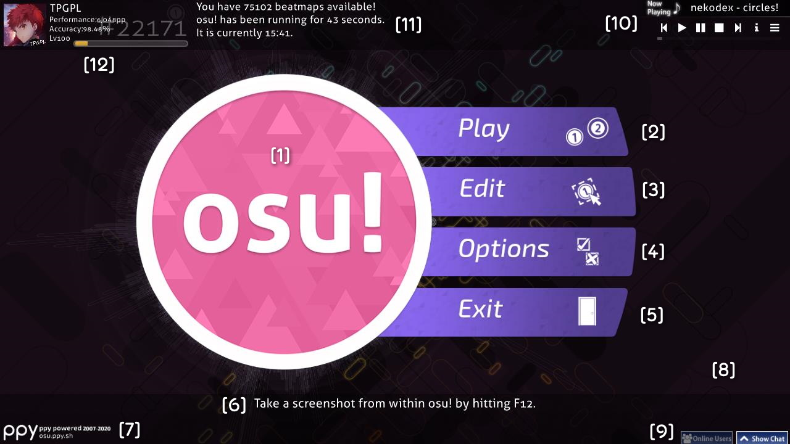
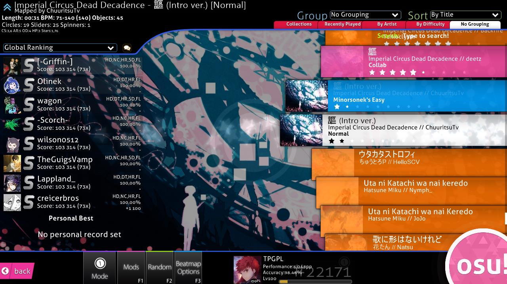
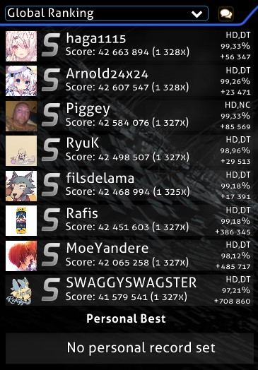
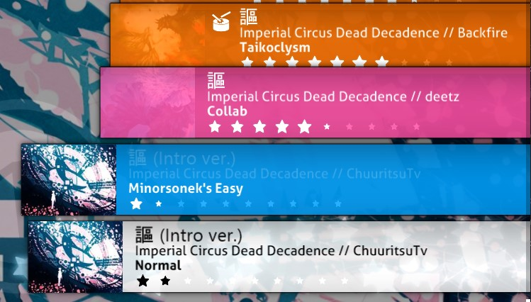
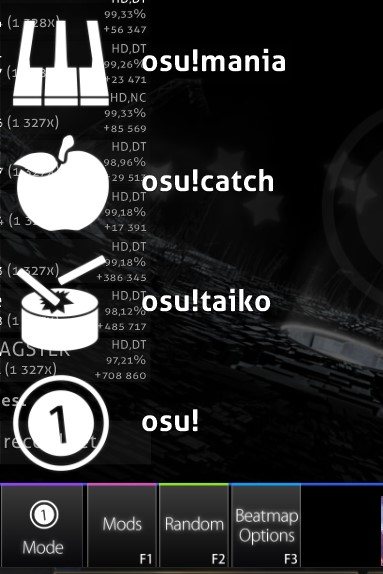
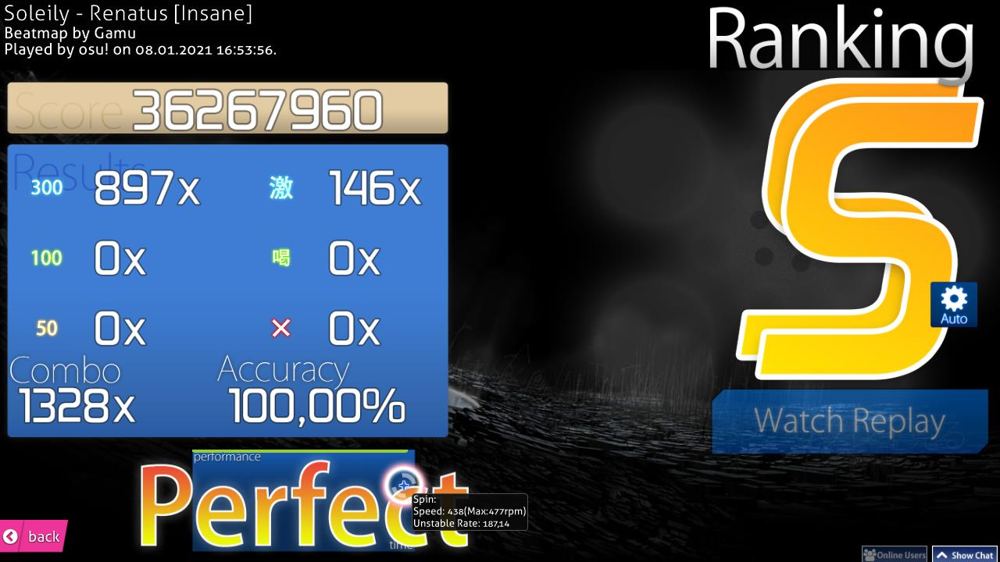
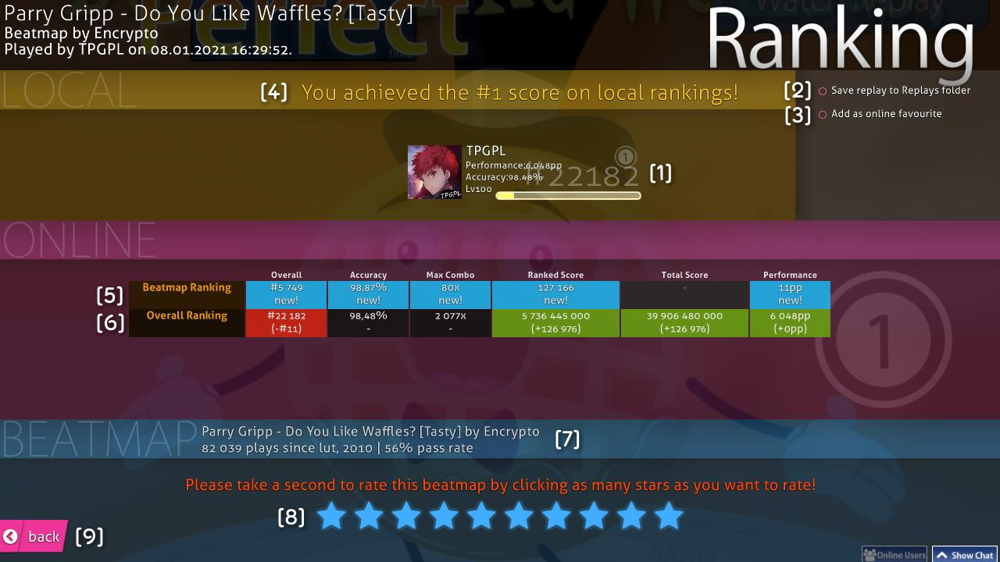
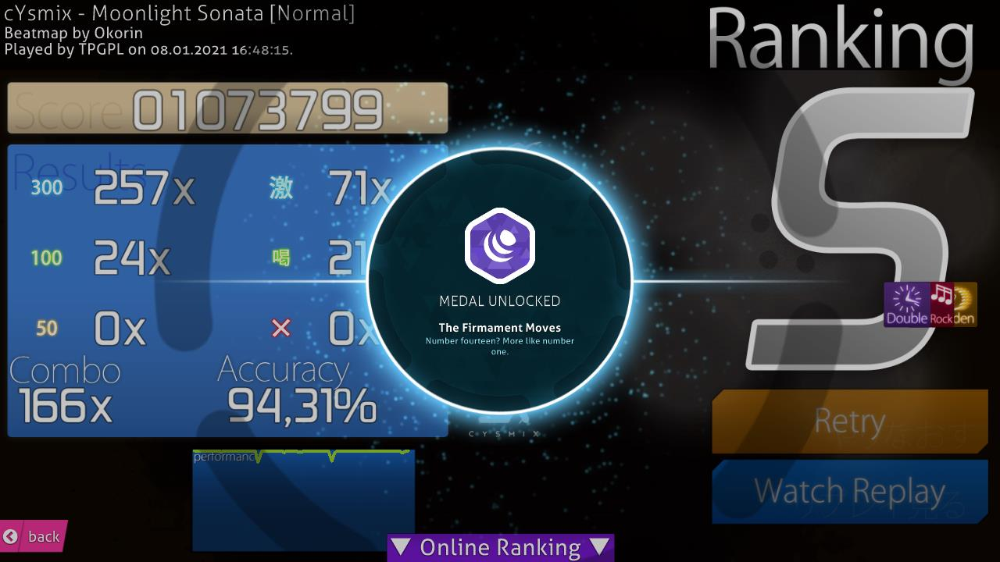

# อินเทอร์เฟซ (Interface)

อินเทอร์เฟซของ osu! ประกอบด้วยหน้าจอหลักและเมนูต่างๆ ที่ผู้เล่นจะได้พบเจอในระหว่างการใช้งานตัวเกม

## เมนูหลัก (Main menu) {#main-menu}

{#beatmap-information}
{#search}

::: Infobox

:::

เมนูหลักคือหน้าแรกที่ปรากฏขึ้นหลังจากเปิดตัวเกมและโหลดข้อมูลเสร็จสิ้น

### osu! cookie {#osu!-cookie}

*บทความหลัก: [osu! cookie](/wiki/Client/Interface/Cookie)*

ตรงกลางของเมนูหลักคือ **osu! cookie** ซึ่งเป็นสัญลักษณ์รูปวงกลมที่มีคำว่า "osu!" อยู่ข้างใน คุกกี้จะเต้นตามจังหวะของเพลงที่กำลังเล่นอยู่ (BPM) หากคุกกี้มีเส้นขอบกระพริบ แสดงว่าตัวเกมกำลังประมวลผลบางอย่าง (เช่น การดาวน์โหลดหรือการประมวลผลแมพ)

เมื่อคุณวางเมาส์เหนือคุกกี้ จะมีแถบเมนูหลักขยายออกมา และหากคลิกที่คุกกี้ จะเป็นการเข้าสู่เมนูเลือกโหมดการเล่น

### เมนูนำทาง (Navigation menu) {#navigation-menu}

เมื่อคลิกที่ osu! cookie เมนูต่อไปนี้จะปรากฏขึ้น:

- **Play:** เข้าสู่หน้าเลือกโหมดการเล่น (Solo, Multi, Special)
- **Edit:** เข้าสู่ [ตัวแก้ไข Beatmap (Beatmap editor)](/wiki/Client/Beatmap_editor)
- **Options:** เข้าสู่หน้าต่าง [ตัวเลือกและการตั้งค่า (Options)](/wiki/Client/Options)
- **Exit:** ออกจากตัวเกม

นอกจากนี้ยังมีปุ่มลัดขนาดเล็กที่มุมล่างของคุกกี้:

- **ไอคอน Pippi:** เข้าสู่หน้าจอ `Play` โดยตรง
- **ไอคอนรูปเฟือง:** เปิดหน้าต่าง `Options`
- **ไอคอนลูกศร:** กลับสู่หน้าจอเริ่มต้น

### ข้อมูลผู้ใช้ (User profile) {#user-profile}

ที่มุมซ้ายบนของหน้าจอจะแสดงแผงข้อมูลผู้ใช้ ซึ่งประกอบด้วย:

- รูปโปรไฟล์ (คลิกเพื่อเข้าสู่เมนูสถานะหรือเปิดหน้าโปรไฟล์บนเว็บ)
- ชื่อผู้ใช้
- สัญลักษณ์ธงชาติ
- ระดับเลเวลและแถบความคืบหน้าของเลเวล
- จำนวน [Performance points (pp)](/wiki/Performance_points) และอันดับโลก

### แผงควบคุมเพลง (Music player) {#music-player}

ที่มุมขวาบนคือเครื่องเล่นเพลงพื้นฐาน ซึ่งแสดงชื่อเพลงและศิลปินที่กำลังเล่นอยู่ คุณสามารถใช้ปุ่มควบคุม (ย้อนกลับ, เล่น/หยุด, ถัดไป, หยุดถาวร) เพื่อเปลี่ยนเพลงที่ฟังในเมนูได้

### ข้อมูลระบบ (System info) {#system-info}

ที่มุมขวาล่างจะแสดงเวอร์ชันของตัวเกม และสัญลักษณ์การเชื่อมต่อกับ [Bancho (เซิร์ฟเวอร์)](/wiki/Bancho_(server))

## หน้าเลือกเพลง (Song selection) {#song-selection}

{#song-select}

::: Infobox

:::

หน้าจอเลือกเพลง (มักเรียกกันว่า *Song Select*) คือที่ที่คุณสามารถเลือก Beatmap ที่ต้องการเล่นได้ แถบค้นหาช่วยให้คุณสามารถกรองระดับความยากตามเกณฑ์ที่กำหนดได้ โดยปกติ osu! จะค้นหาจากข้อความทั้งหมด แต่คุณสามารถค้นหาแบบเจาะจงได้ เช่น `ar=8` หรือ `stars>=5`

หากต้องการค้นหา เพียงแค่เริ่มพิมพ์ข้อความในขณะที่อยู่ในหน้าเลือกเพลง (โดยที่ไม่ได้เปิดหน้าต่างตัวเลือกหรือแผงแชทอยู่)

###Rankings {#rankings}

ในส่วนนี้อาจแสดงข้อมูลที่แตกต่างกันไปตามสถานะของแมพ:

- **Not Submitted:** แมพที่ยังไม่ได้ถูกส่งขึ้นเว็บไซต์ หรือถูกลบโดย Mapper
- **Update to latest version:** มีแมพเวอร์ชันใหม่ให้อัปเดต (หากอัปเดตแล้ว คะแนนในเครื่องจะถูกลบทิ้ง)
- **Latest pending version:** แมพถูกส่งขึ้นเว็บแล้วแต่ยังไม่ได้รับการจัดอันดับ
- **อันดับคะแนน:** หากมีคะแนนการเล่นบันทึกไว้ จะแสดงรายการคะแนนสูงสุดแทน

คุณสามารถเลือกดูตารางคะแนนได้หลายประเภท:

- Local Ranking (คะแนนในเครื่อง)
- Country Ranking* (คะแนนเฉพาะประเทศ)
- Global Ranking (คะแนนระดับโลก)
- Global Ranking (Selected Mods)* (คะแนนระดับโลกตาม Mod ที่เลือก)
- Friend Ranking* (คะแนนเฉพาะเพื่อน)

*\*จำเป็นต้องมี [osu!supporter](/wiki/osu!supporter)*

คลิกไอคอนรูปคำพูดเพื่อเข้าสู่เมนู **ทางลัดบนเว็บ**:

- กด `1` เพื่อเปิดหน้าเว็บ Beatmap บนเบราว์เซอร์
- กด `2` เพื่อดูหน้าการ Modding ของแมพนั้น
- กด `3` หรือ `Esc` เพื่อยกเลิก

### รายการ Beatmap (Beatmap carousel) {#beatmap-carousel}

รายการ Beatmap จะแสดงแมพทั้งหมดที่คุณมี โดยมีการแยกสีของกล่องดังนี้:

| สีของกล่อง | ความหมาย |
| :-: | :-- |
| **ชมพู** | ยังไม่เคยเล่นแมพนี้ |
| **ส้ม** | เคยเล่นผ่านอย่างน้อยหนึ่งระดับความยากในชุดแมพนี้แล้ว |
| **ฟ้าอ่อน** | ระดับความยากอื่นๆ ในชุดแมพเดียวกัน (แสดงเมื่อขยายชุดแมพออก) |
| **ขาว** | ระดับความยากที่เลือกอยู่ในปัจจุบัน |

คุณสามารถเลื่อนดูรายการแมพได้ด้วยล้อเมาส์, ปุ่มลูกศร ขึ้น/ลง หรือลากเมาส์ซ้าย คลิกหนึ่งครั้งเพื่อเลือก และคลิกซ้ำอีกครั้ง (หรือกด `Enter` หรือคลิกคุกกี้) เพื่อเริ่มเล่น

### แถบเครื่องมือด้านล่าง (Gameplay toolbox) {#gameplay-toolbox}

- **Back:** กลับสู่เมนูหลัก (หรือกด `Esc`)
- **Mode:** เลือกโหมดการเล่น (osu!, Taiko, Catch, Mania) หรือกด `Ctrl` ค้างไว้แล้วกดเลข `1` ถึง `4`
- **Mods:** เปิดหน้าจอ **[เลือกตัวปรับแต่งเกม (Game modifiers)](/wiki/Gameplay/Game_modifier)** (หรือกด `F1`)
- **Random:** สุ่มเลือกแมพ (หรือกด `F2`) หากกด `Shift` + `Random` จะย้อนกลับไปยังแมพก่อนหน้าที่จะสุ่ม
- **Beatmap Options:** เปิดเมนูจัดการแมพ (หรือกด `F3` หรือคลิกขวาที่ชื่อแมพ)
  - `Manage Collections`: จัดการชุดสะสมเพลง
  - `Delete...`: ลบความยากที่เลือก, ลบทั้งชุดแมพ หรือลบแมพทั้งหมดที่มองเห็นอยู่
  - `Remove from Unplayed`: ทำเครื่องหมายว่าเล่นแล้ว (เปลี่ยนสีกล่องจากชมพูเป็นส้ม)
  - `Clear local scores`: ล้างคะแนนในเครื่องของแมพนี้
  - `Edit`: เปิดแมพในตัวแก้ไข

## หน้าสรุปผล (Results screen) {#results-screen}

นี่คือหน้าจอที่จะแสดงขึ้นหลังจากที่คุณเล่นแมพผ่านสำเร็จ คุณสามารถดูผลคะแนนออนไลน์ได้โดยการเลื่อนหน้าจอลง

### หน้าสรุปผลแบบละเอียด (Extended results screen) {#extended-results-screen}

- **\[1] แผงข้อมูลผู้ใช้:** แสดง pp, อันดับโลก, คะแนนรวม และเลเวล
- **\[2] Save replay to Replays folder:** บันทึกไฟล์ Replay ลงในเครื่อง
- **\[3] Add as online favourite:** เพิ่มแมพนี้ลงในรายการโปรดบนหน้าโปรไฟล์ของคุณ
- **\[4] Local leaderboard:** รายการคะแนนที่บันทึกไว้ในเครื่องของคุณ
- **\[5] Beatmap Ranking:** อันดับของคุณในแมพนี้ (เฉพาะแมพ Ranked/Qualified/Loved)
- **\[6] Overall Ranking:** อันดับรวมของคุณเทียบกับผู้เล่นทั่วโลก
- **\[7] ข้อมูล Beatmap:** แสดงจำนวนครั้งการเล่นรวมและอัตราการเล่นผ่านของแมพนั้น
- **\[8] การให้คะแนน:** ให้คะแนนความพึงพอใจต่อแมพนี้
- **\[9] ปุ่มย้อนกลับ:** กลับสู่หน้าเลือกเพลง

---

รายละเอียดในแผงการจัดอันดับ:

| หมวดหมู่ | Beatmap Ranking (อันดับแมพ) | Overall Ranking (อันดับรวม) |
| :-: | :-- | :-- |
| `Overall` | อันดับของคุณในตารางคะแนนของแมพนั้น | [อันดับโลก](/wiki/Ranking#performance-points-ranking) ของคุณ |
| [`Accuracy`](/wiki/Gameplay/Accuracy) | ความแม่นยำที่คุณทำได้ในรอบนี้ | ค่าเฉลี่ยความแม่นยำรวมจากคะแนนที่ดีที่สุดของคุณ |
| `Max Combo` | คอมโบสูงสุดที่ทำได้ในรอบนี้ | คอมโบสูงสุดที่เคยทำได้จากทุกแมพที่เคยเล่น |
| [`Ranked Score`](/wiki/Gameplay/Score/Ranked_score) | [ผลคะแนนที่ดีที่สุด](/wiki/Gameplay/Score/Ranked_score) ของคุณในแมพนี้ | ผลรวมคะแนนจากทุกแมพ Ranked ที่คุณเคยเล่น (นับแมพละหนึ่งครั้ง) |
| [`Total Score`](/wiki/Gameplay/Score/Total_score) | ไม่นำมาคำนวณในอันดับออนไลน์ | ผลรวมคะแนนจากทุกแมพรวมถึงแมพที่เล่นไม่ผ่าน ซึ่งใช้ในการคำนวณ [เลเวล](/wiki/Gameplay/Score/Total_score#level) |
| [`Performance`](/wiki/Performance_points) | จำนวน pp ที่คุณจะได้รับจากรอบนี้ | จำนวน pp รวมทั้งหมดของคุณ |

###Medals {#medals}

*บทความหลัก: [เหรียญรางวัล (Medals)](/wiki/Medals)*

ในบางครั้ง เมื่อคุณทำตามเงื่อนไขที่กำหนดสำเร็จ คุณจะได้รับเหรียญรางวัลปรากฏขึ้นในหน้าสรุปผล
