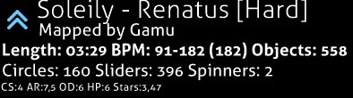

# Arayüz

## Ana Menü

[osu!cookie](/wiki/Client/Interface/Cookie) \[1\] ana menü üzerinde o anda çalan şarkının [BPM](/wiki/Music_theory/Tempo)'ine göre titreşir. Ek olarak, şarkının ses seviyesine göre osu!cookie'nin dışına doğru çubuklar çıkar. Eğer hiç bir şarkı çalmıyorsa, 60 BPM hızında titreşir. Ana menüyü oluşturan elemanlar aşağıdaki gibidir:

- \[2\] Solo modu şarkı seçim ekranına geçmek için Play'e (`P`) veya logoya tıklayın.
- \[3\] Düzenleyici modu şarkı seçim ekranına geçmek için Edit'e (`E`) tıklayın.
- \[4\] Ayarlar ekranına gitmek için Options'a (`O`) tıklayın.
- \[5\] osu!'dan çıkmak için Exit'e (`Esc`) tıklayın.
- \[6\] Menünün alt kısmında işe yarar rastgele bir [tavsiye](/wiki/Client/Menu_tips) görüntülenir.
- \[7\] Sol-alt kısımda osu! web sayfasına bir link, aynı zamanda telif hakkı bilgisi bulunur.
- \[8\] [Bancho](/wiki/Bancho_(server))'ya bağlantı sonucu! Bu resimde gösterilmiyor, ama bağlantı sonucu bir dizi linke benziyor.
- \[9\] Sağ-alt kısımda genişletilmiş [sohbet penceresi](/wiki/Client/Interface/Chat_console) (burada "Player List" olarak geçiyor) ve sıradan sohbet penceresi (sırasıyla `F9` & `F8`) için sohbet kontrolleri bulunur.
- \[10\] Sağ-üstte şarkıları rastgele sırayla çalan osu! müzik kutusu bulunur. Üst kısım şu anda çalan şarkıyı gösterir. Butonlar, soldan sağa aşağıdaki gibi çalışır:
  - Önceki Parça
  - Oynat
  - Duraklat
  - Durdur (Duraklat ve Durdur arasındaki fark Durdur şarkıyı sil baştan sıfırlarken, Duraklat sadece şarkıyı duraklatır)
  - Sonraki Parça
  - Şarkı Bilgisini Gör. Bu üstteki çubukta şarkı bilgisini kalıcı veya geçici gösterme arasında geçiş yapar. Kalıcı olduğunda, bilgi çubuğu arayüzün geri kalanıyla birlikte kaybolana kadar görünür. Geçici olduğunda, şarkı seçildikten bir süre sonra kaybolur. Tekrar ayarlanana, ya da başka bir şarkı çalana kadar gizli kalır.
- \[11\] Sahip olduğunuz beatmaplerin sayısı, osu! istemcinizin ne kadar süredir çalıştığı, ve sizin sistem saatiniz.
- \[12\] Profiliniz, Kullanıcı Seçenekleri'ni (aşağıda) görüntülemek için üzerine tıklayın.

## Kullanıcı Seçenekleri

Ana menünün sol üst kısmında bulunan profilinize tıklayarak bu ekranı görüntüleyin. Kullanıcı seçenek ekranını görüntülerken Sohbet Konsoluna erişemezsiniz. Seçenekler üzerinde belirtilen numaralara basarak herhangi bir ögeyi seçebilirsiniz:

1. `Profili Görüntüle`: Varsayılan internet tarayıcısında profil sayfasını aç.
2. `Çıkış Yap`: Hesaptan çıkış yap (çıkış yaptıktan sonra, [Seçenekler](/wiki/Client/Options) yan çubuğu size giriş yapmanız için istemde bulunur).
3. `Avatarı Değiştir`: Varsayılan internet tarayıcısında avatar düzenleme sayfasını aç.
4. `Kapat`: Bu pencereyi kapat

## Oynama Menüsü

- Yalnız oynamak için `Solo` butonuna (`P`) tıklayın.
- Diğer insanlarla oynamak için `Multi` butonuna (`M`) tıklayın. [Çoklu](/wiki/Client/Interface/Multiplayer) Lobisine yönlendirileceksiniz (aşağıda).
- Ana menüye geri dönmek için `Back` butonuna tıklayın.

## Çoklu Lobisi

*Ana sayfa: [Çoklu](/wiki/Client/Interface/Multiplayer)*

1. Maç içerisindeki sıralamanız. Bu aynı zamanda isminizin yanında da gözükür.
2. Sizin profil bilginiz.
3. Müzik kutusu.
4. Oyuncu listesi - oyuncuların isimlerini, onların sıralamasını (oda sahibi veya oyuncu), seçtikleri modlar (eğer varsa, \#7'ye bakınız), osu! sıralamaları, ve bulundukları takımlar (eğer mevcutsa).
5. Maçın ismi ve şifre ayarları.
6. Seçilen beatmap. Beatmapi solo şarkı seçme ekranında olduğu gibi gösterir.
7. Seçtiğiniz modlar (bakınız \#12), aynı zamanda onları ayarlayabileceğiniz bir seçenek. "Free Mods" yazan seçenek oyuncuların kendi istediği modları seçip seçemeyeceğini ayarlar. Eğer seçiliyse, *Double Time gibi hız değiştiren modlar hariç* her türlü mod kombinasyonu seçilebilir. Eğer seçili değilse, oda sahibi hangi modların kullanılacağını belirler. Oda sahibi Free Mods açık olsun veya olmasın hız değiştiren modları seçebilir.
8. Takım modu ve zafer koşulları.
9. Hazır butonu.
10. [Sohbet konsolu](/wiki/Client/Interface/Chat_console).
11. Çıkış butonu.
12. Seçtiğiniz modların göründüğü yer.

## Şarkı Seçme Ekranı

Seçilen oyun modunu sol alttaki, Mode yazısının üzerinde bulunan ikondan, veya ekranın ortasındaki saydam ikona bakarak ayırt edebilirsiniz. Aşağıdakiler görebileceğiniz dört modu oluşturur:

-  is [osu!](/wiki/Game_mode/osu!)
-  is [osu!taiko](/wiki/Game_mode/osu!taiko)
-  is [osu!catch](/wiki/Game_mode/osu!catch)
-  is [osu!mania](/wiki/Game_mode/osu!mania)

Devam etmeden önce, bu ekranda kolayca anlaşılabilen numaralarla not edilebilecek çok fazla element bulunmaktadır. Aşağıdaki altbölümler bu ekranın her bir kısmını teker teker, yukarıdan aşağıya ve sağdan sola işleyecektir.

### Beatmap Bilgisi

Bu bölüm **seçilen beatmap zorluğunun bilgisini** görüntüler. Varsayılan olarak, osu! müzik kutusunda çalan müziğin beatmapi şarkı seçme ekranına girerken seçili olarak açılır. Sol üstte beatmapin derecelendirme durumu bulunur. Hemen yanında başlık bulunur. Normalde, latin alfabeye çevirilmiş başlık gösterilir, ancak eğer [Ayarlarda](/wiki/Client/Options) `Kendi dilindeki metaveriyi tercih et` seçiliyse, Unicode başlığı görüntüler; bu ise bir üstteki resimde mevcuttur. Beatmapper da görüntülenir, ve beatmap bilgisi ise aşağıda görüntülenir. Soldan sağa, veriler aşağıdaki gibidir:

- **Uzunluk**: Beatmapin toplam uzunluğudur, molalar dahil baştan sona. [Akış süresi (drain time)](/wiki/Beatmap/Drain_time) ile karıştırılmamalıdır.
- **BPM**: Beatmapin BPM'idir (dakika başı vuruş sayısı). Eğer (bir alttaki resimde olduğu gibi) biri parantez içinde iki BPM varsa, bu şarkı boyunca BPM'in değiştiğini gösterir. Bunlar en yavaş ve en hızlı BPM'leri gösterir, ve parantez içindeki değer ise beatmapin başlangıcındaki BPM'dir.
- **Objeler**: Beatmap içerisindeki toplam [vuruş objesi](/wiki/Gameplay/Hit_object) sayısı.
- **Circle sayısı**: Beatmap içerisindeki toplam vuruş çemberi sayısı.
- **Slider sayısı**: Beatmap içerisindeki toplam slider sayısı.
- **Spinner sayısı**: Beatmap içerisindeki toplam spinner sayısı.
- **OD**: Beatmapin Genel Zorluğu (Overall Difficulty).
- **HP**: HP'nizin azalma oranı. osu!'da, bir nota kaçırdığınızda ne kadar HP kaybedeceğinizi, durağan halde can çubuğunuzun ne kadar çabuk tükeneceğini, ve isabetli bir notanın ardından ne kadar HP kazanacağınızı gösterir. osu!mania'da, durağan halde HP'nin tükenmemesi hariç tamamen aynıdır. osu!taiko'da, HP çubuğunun ne kadar yavaş dolacağını ve bir nota kaçırıldığında ne kadar HP azalacağını belirler. osu!catch, osu! ile aynıdır.
- **Stars**: Beatmapin yıldız zorluğu. Bu beatmapin dikdörtgen göstergesi üzerinde grafik olarak görülebilir.

### Grup ve Çeşit

**Seçilen kriterlere göre şarkı listenizi sıralamak için** sekmelerden birine tıklayın.

**Grup** - Pek çok seçenek beatmapleri çeşitli genişleyebilen gruplara ayırır:

- `Gruplandırılmamış` - Beatmapler gruplanmayacak ama yine de Çeşit sekmesinde belirlenene göre sıralanacaktır.
- `Zorluğuna Göre` - Beatmapler, en yakın tam sayıya yuvarlanarak, yıldız zorluklarına göre gruplanacaktır.
- `Sanatçıya Göre` - Beatmapler sanatçıların isimlerinin ilk harflerine göre gruplanacaktır.
- `Son Oynananlar` - Beatmapler onları en son oynadığınız zamana göre gruplanacaktır.
- `Koleksiyonlar` - Bu oluşturduğunuz koleksiyonları görüntüleyecektir. *Bir koleksiyon içerisinde listelenmeyen beatmaplerin gizleneceğini unutmayın!*
- `BPM'e göre` - Beatmapler, 120'den başlayarak, 60'ın katları şeklinde gruplanacaktır.
- `Yaratıcısına Göre` - Beatmapler, beatmap yaratıcılarının isimlerinin ilk karakterine göre gruplanacaktır.
- `Eklenen Tarih'e göre` - Beatmapler, bugünden 4+ ay öncesine kadar, eklendikleri tarihe göre gruplanacaktır.
- `Süresine Göre` - Beatmapler sürelerine göre gruplanacaktır: 1 dakika veya daha az, 2 dakika veya daha az, 3, 4, 5, ve 10.
- `Moduna Göre` - Beatmapler oyun modlarına göre gruplanacaktır.
- `Ulaşılan Dereceye Göre` - Beatmapler ulaşılan en yüksek dereceye göre sıralanacaktır.
- `İsime Göre` - Beatmapler isimlerinin ilk harfine göre gruplanacaktır.
- `Favoriler` - Sadece çevrimiçi favorilerinize eklediğiniz beatmapler gösterilecektir.
- `Kendi Haritalarım` - Sadece sizin maplediğiniz beatmapler (yani, yaratıcısı sizin profil isminizle eşleşenler) gösterilecektir.
- `Ranked Durumu` - Beatmapler derecelendirme durumuna göre gruplanacaktır: dereceli, beklemede, gönderilmemiş, bilinmeyen, veya sevilen.

Grup ve Çeşit'in altındaki sekmelerde bunların ilk beş tanesi mevcuttur.

**Çeşit** - Beatmapleri belirli bir sıraya dizer.

- `Sanatçıya Göre` - Beatmapler sanatçı isminin ilk karakterine göre alfabetik olarak sıralanacaktır.
- `BPM'e göre` - Beatmapler BPM'lerine göre en düşükten en yükseğe sıralanacaktır. Birden fazla BPM'i olan maplerde, en yüksek olan kullanılacaktır.
- `Yaratıcısına Göre` - Beatmapler yaratıcı isminin ilk karakterine göre alfabetik olarak sıralanacaktır.
- `Eklenen Tarih'e göre` - Beatmapler eklendikleri tarihe göre en eskiden en yeniye sıralanacaktır.
- `Zorluğuna Göre` - Beatmapler yıldız zorluklarına göre en kolaydan en zora sıralanacaktır. *Bunun map setlerini ayıracağını unutmayın!*
- `Süresine Göre` - Beatmapler sürelerine göre en kısadan en uzuna sıralanacaktır.
- `Ulaşılan Dereceye Göre` - Beatmapler ulaşılan en yüksek dereceye göre en kötüden en iyiye sıralanacaktır.
- `İsime Göre` - Beatmapler isimlerinin ilk karakterine göre alfabetik olarak sıralanacaktır.

### Ara

*Not: Aramak istiyorsanız sohbet konsolunu veya seçenekler yan çubuğunu açık bırakamazsınız; aksi halde, yazdığınız her şey sohbet metni veya seçenekler arama sorgusu olarak algılanır.*

Sadece aramanızın kriterleriyle eşleşen sonuçlar gösterilecektir. Varsayılan olarak, herhangi bir arama beatmaplerin sanatçıları, isimleri, yaratıcıları, ve etiketleri ile eşleştirilecektir.

Bu alanlarda aramaya ek olarak, desteklenen filtreler ile bir değerin karşılaştırmasını (mesela, `ar=9`) birleştirerek diğer metaveri üzerinde arama yapmak için filtreleri kullanabilirsiniz.

Desteklenen filtreler:

- `artist`: Sanatçının ismi
- `creator`: Beatmap yaratıcısının ismi
- `ar`: Yaklaşım Oranı (Approach Rate)
- `cs`: Daire Boyutu (Circle Size)
- `od`: Genel Zorluk (Overall Difficulty)
- `hp`: HP Azalma Oranı (HP Drain Rate)
- `keys`: Tuş sayısı (yalnızca osu!mania maplerinde)
- `stars`: Yıldız Zorluğu
- `bpm`: Dakika başı vuruş sayısı
- `length`: Saniye olarak süre
- `drain`: Saniye olarak Akış Süresi (Drain Time)
- `mode`: Mod. Belirtilen değer `osu`, `taiko`, `catchthebeat`, veya `mania`, ya da kısaca `o`/`t`/`c`/`m` olabilir.
- `status`: Derecelendirme durumu. Belirtilen değer `ranked`, `approved`, `pending`, `notsubmitted`, `unknown`, veya `loved`, ya da kısaca `r`/`a`/`p`/`n`/`u`/`l` olabilir.
- `played`: Gün olarak en son oynanan tarihten bu yana geçen süre
- `unplayed`: Oynanmamış mapler. Değer yok (oynanmamış mapler için `unplayed=`, oynanmış mapler için ise `unplayed!=` filtresini kullanın)
- `speed`: Kayıtlı osu!mania kayma hızı. Oynanmamış maplerde veya [osu!mania hızını her beatmap için hatırla](/wiki/Client/Options#gameplay) opsiyonu kapalı olduğunda her zaman 0'dır

Desteklenen karşılaştırmalar:

- `=` ya da `==`: Eşittir
- `!=`: Eşit değildir
- `<`: Küçüktür
- `>`: Büyüktür
- `<=`: Küçük eşittir
- `>=`: Büyük eşittir

Aynı zamanda beatmap veya beatmap seti ID'sini arama kutucuğuna girerek tek sonuç elde edebilirsiniz.

### Dereceler

Bu alanda çeşitli şeyler görebilirsiniz:

- "Not Submitted" kutucuğu beatmapin Beatmap Gönderme Sistemi kullanılarak osu! sitesine karşıya aktarılmadığını belirtir.
- Eğer beatmapin indirilebilen yeni bir sürümü varsa "Update to latest version" kutucuğu ortaya çıkar. Güncellemek için butona tıklayın.
  - **Not:** Beatmapi güncellediğinizde, geri alınamaz. Eğer bir nedenden dolayı eski sürümünü bulundurmak istiyorsanız (diyelim ki, skorları saklamak için), o zaman güncellemeyin.
- "Latest pending version" kutucuğu beatmap osu! web sayfasına karşıya yüklenmiş ancak dereceli değil anlamına gelir.
- Eğer görüntüleme seçenekleriyle eşleşen tekrarlar varsa, beatmapin derecelendirme/oynanma durumunu belirten bir kutucuk yerine onlar görüntülenecektir. Bu üstteki resimde gösterilmektedir.
  - Herkese açık sıralamaların altında (örn. Küresel, Arkadaşlar, vb.), lider tablosundaki sıralamanızla beraber, sizin en yüksek skorunuz görünecektir.
- "No records set!" kutucuğu şu anki görüntüleme seçeneği için herhangi bir tekrarın olmadığı anlamına gelir (bu, eğer beatmapi henüz indirdiyseniz veya düzenlediyseniz Yerel görüntüleme seçeneğinde sıklıkla görülür).
  - Not: Çoklu'da yapılan skorlar rekor olarak sayılmaz.

Aşağıdakiler görüntüleme seçenekleridir:

- Yerel Dereceler
- Ülkesel Dereceler\*
- Küresel Dereceler
- Küresel Dereceler (seçilen mod için)\*
- Arkadaş Sıralaması\*

\*Erişebilmeniz için [osu!supporter](/wiki/osu!supporter) olmanız gerekir.

Seçilen beatmap için **Hızlı İnternet Erişimi** ekranın görüntülemek için konuşma baloncuğu ikonuna tıklayın:

- `1`'e veya `Beatmap Listesi/Skorlar` butonuna tıklayın ve varsayılan internet tarayıcınız sizi seçtiğiniz beatmapin ait olduğu Beatmap Listesi ve skor sayfasına iletecek.
- `2`'ye veya `Beatmap Başlığı` butonuna tıklayın ve varsayılan internet tarayıcınız sizi seçtiğiniz beatmapin ait olduğu beatmap setinin forum başlığına iletecek.
- `3`'e veya `Hızlı Yanıt` butonuna tıklayın ve varsayılan internet tarayıcınız sizi seçtiğiniz beatmapin ait olduğu beatmap setinin forum başlığına bir yanıt hazırlayabileceğiniz bir sayfaya iletecek.
- Şarkı Seçme Ekranına geri dönmek için `4`'e veya `Esc`'ye ya da `İptal` butonuna tıklayın.

Hızlı İnternet Erişimi Ekranındayken, Sohbet ve Genişletilmiş Sohbet Konsollarına erişemezsiniz.

### Şarkı

Şarkı listesi uygun tüm beatmapleri görüntüler. Farklı beatmapler farklı renkli kutucuklara sahip olabilir:

- **Pembe**: Bu beatmap henüz oynanmamış.
- **Turuncu**: Bu beatmap oynanmış, veya bu map setindeki tüm beatmapler oynanmış.
- **Açık Mavi**: Aynı set içerisindeki diğer beatmapler, map seti genişletildiğinde gösterilir.
- **Beyaz**: Şu anda seçili beatmap.

Beatmap listesini fare tekerleği kullanarak, yukarı ve aşağı yön tuşlarını kullanarak, sol fare butonunu basılı tutarak sürükleyerek veya, kaydırma çubuğunu farenin Y eksenindeki konumuna hareket ettiren sağ fare butonuna tıklayarak (eski adıyla Absolute Scrolling) gezinti yapabilirsiniz. Beatmapi seçmek ve sol üstte onun bilgisini, solda (varsa) en yüksek skorları ve, eğer tamamladıysanız, en yüksek skorunuzun harf notunu görüntülemek için kutucuğun üzerine tıklayın. Beatmapi oynamaya başlamak için kutucuğa tekrar tıklayın, `Enter` tuşuna basın veya sağ alttaki osu!cookie'nin üzerine tıklayın.

### Oynama araç çubuğu

Bu kısım oynama araç çubuğu olarak isimlendirilebilir. Soldan sağa her bir butonun işlevine değineceğiz.

Ana menüye dönmek için `Esc` tuşuna veya `Geri` butonuna tıklayın.

osu!'daki mevcut oyun modlarının bir listesini açmak için `Mode` butonuna tıklayın. Arzu ettiğiniz oyun moduna tıklayın ve osu! seçtiğiniz oyun modu tarzına dönüşecek - skor tablosu da buna göre değişecek. Alternatif olarak, oyun modunu değiştirmek için `Ctrl` ile `1` (osu!), `2` (osu!taiko), `3` (osu!catch), veya `4` (osu!mania) tuşlarına basabilirsiniz.

Şeffaf arkaplan ikonu ve "Mode" kutucuğu hangi modun seçili olduğunu belirtmek için değişecektir.

**[Mod Seçme Ekranını](/wiki/Gameplay/Game_modifier)** açmak için `Mods` butonuna veya `F1` tuşuna basın.

Bu ekranda, oyununuza modifikasyonlar (kısaca "modlar") ekleyebilirsiniz. Bazı modlar zorluğu düşürür ve elde ettiğiniz skoru düşüren bir katsayı uygular. Diğer yandan, bazı modlar zorluğu arttırır, ancak aynı zamanda elde ettiğiniz skoru arttıran bir katsayı da uygular. Son olarak, bazı modlar oyunu farklı bir yönde etkiler. [Relax](/wiki/Gameplay/Game_modifier/Relax) ve [Auto Pilot](/wiki/Gameplay/Game_modifier/Autopilot) bu kategoriye girer.

Efektinin kısa bir açıklamasını görüntülemek için farenizi bir modun ikonu üzerine yerleştirin. Bir mod seçmek veya seçimini kaldırmak için o modun ikonuna tıklayın. Bazı modlar, Double Time gibi, birden fazla varyasyona sahiptir; sırayla görüntülemek için modun üzerine tekrar tıklayın. Skor katsayı değeri seçtiğiniz modların katsayı değerlerinin skorunuz üzerindeki efekti görüntüler. Seçilen tüm modlardaki seçimi kaldırmak için `Tüm modları sıfırla` butonuna veya `1`'e basın. Şarkı Seçme Ekranına dönmek için `Kapat` butonuna veya `2`'ye basın.

Mod Seçme Ekranındayken, Sohbet ve Genişletilmiş Sohbet Konsollarına erişemezsiniz. Buna ek olarak, temalar modların metinlerini ve/veya ikonlarını değiştirebilir, ancak efektler aynı kalır.

Oyunun **tüm maplerinizi kaydırarak rastgele bir tanesini seçmesi** için `Random` butonuna tıklayın veya `F2` tuşuna basın. Kaydırma işlemi bitmeden kendiniz bir beatmap seçemezsiniz.

*Not: Seçiminizi rastgele yapmanızdan önceki seçilen beatmape dönmek için `Shift` + `Random` butonuna veya `F2` tuşuna basabilirsiniz.*

**Mevcut seçilen beatmapin seçenekleri için Beatmap Seçenekleri Menüsünü** açmak için `Beatmap Options` butonuna tıklayın veya `F3` tuşuna basın ya da farenizle sağ-tıklayın.

- Koleksiyonlar ekranını görüntülemek için `1`'e basın veya `Koleksiyonları Düzenle` butonuna tıklayın - burada, mevcut koleksiyonları düzenleyebilir, aynı zamanda seçili beatmap veya map setini bir koleksiyona ekleyebilir veya bir koleksiyondan çıkartabilirsiniz.
- `2` tuşuna basarak veya `Delete...` butonuna tıklayarak \[1\] şu anda seçili map setini silebilir, \[2\] şu anda seçili beatmapi silebilir, veya \[3\] tüm beatmapleri silebilirsiniz. Son seçenek şaka amaçlıdır; ona tıklamanız oyunun size beatmaplerin tamamını birden silemeyeceğinizi bildirmesine sebep olur.
- Silinen beatmaplerin Geri Dönüşüm Kutusuna taşındığını unutmayın.
- Oynanmamış bir beatmapi oynanmış olarak işaretlemek için (yani, kutucuk rengini pembeden turuncuya dönüştürür) `3` tuşuna basın veya `Oynanmamışlardan Çıkar` butonuna tıklayın.
- Seçtiğiniz beatmap üzerindeki tüm skor kayıtlarını silmek için `4` tuşuna basın veya `Bütün yerel skorları sil` butonuna tıklayın.
- Seçilen beatmapi osu!'nun Düzenleyicisinde açmak için `5` tuşuna basın veya `Düzenle` butonuna tıklayın.
- Şarkı Seçme Ekranına dönmek için `6` veya `Esc` tuşuna basın ya da `İptal` butonuna tıklayın.

**Kullanıcı Seçenekleri Menüsüne** erişmek için **kendi kullanıcı panelinize** tıklayın.

**Seçilen beatmapi oynamaya başlamak için [osu!cookie](/wiki/Client/Interface/Cookie)** üzerine tıklayın.

## Sıralama Ekranı

### Sonuç Ekranı

Bu beatmapi başarıyla tamamladığınızda gösterilen sonuç ekranıdır. Aşağıya kaydırarak veya ilgili butona basarak çevrimiçi sonuçlarınıza erişebilirsiniz.

**Not:** Harf notu teması kullanılan temaya göre değişiklik gösterebilir.

Aşağıdakiler diğer oyun modlarının sonuç ekranlarıdır.

### Çevrimiçi Lider Tablosu

 düzenlenmiştir.")

Bu sizin çevrimiçi lider tablonuzdur. Buraya gelmek için sonuç ekranından aşağı kaydırabilirsiniz. Yerel Skor Tablonuz her zamanki gibi isminizi ve skorunuzu görüntüleyecektir.

1. Buradan tekrar için kaydedilen ismi değiştirebilirsiniz.
2. Oyuncu paneliniz. Sizin [PP](/wiki/Performance_points)'niz, Küresel Sıralamanız, Toplam Skorunuz, Ortalama [İsabet Oranınız](/wiki/Gameplay/Accuracy), ve seviye göstergeniz bulunur.
3. Beatmap ile ilgili seçenekler.
   1. Tekrar dosyasını `.osr` olarak çıkar: Çevrimiçi kullanılabilen tekrarı kaydet.
   2. Çevrimiçi Favorilere ekle: Beatmapi Çevrimiçi Favorilerine ekle. Çevrimiçi profilinde Beatmapler->Favori Beatmapler kısmında gözükecektir
4. Burada profilinize yapılan değişiklik bulunuyor. Bu sizin Küresel Sıralamada ne kadar yükseldiğinizi veya alçaldığınızı, Toplam Skorunuza ne kadar eklendiğini, ve Ortalama İsabet Oranınızın ne kadar değiştiğini gösterir. Metin nispeten çabuk bir şekilde kaybolur, bu yüzden kaçrımayın!
5. Gayet açıklayıcı. Çevrimdışıysanız, ya da beatmap karşıya yüklenmemişse gözükmez.
   1. Map Sıralaması: Mapteki sıralamanız. Sıralama modların kullanıldığı tekrarları da içerir, kendiniz kullanmamış bile olsanız.
   2. Genel: Yalnızca beatmap değil, oynadığınız oyun modundaki profil durumunuz.
   3. İsabet Oranı: Sadece eski skorunuz geçildiğinde hesaba katılır. İsabet Oranı tamamlanan tüm beatmaplerin ortalamasıdır.
   4. Dereceli Skor: Dereceli Skorunuz. Eğer onaylanmış bir şarkıysa, artmayacaktır.
   5. Toplam Skor: Genel Toplam Skorunuzdur. Bir beatmapte başarısız olduğunuzda veya yüksek skorunuzu geçemediğinizde bile her zaman artacaktır. Bu sizin seviyenizin bütününü etkiler.
   6. Sonraki Sıralamaya: Şu anki map sıralamasındaki pozisyonunuzu yükseltmek için ne kadar daha skora ihtiyaç duyduğunuz.
6. \#4 ile aynı, ancak aylık [Sıralama Tablosu](https://osu.ppy.sh/rankings/osu/charts) için ayrılmıştır.
7. Oynanma ve tamamlama oranı geçmişi ile birlikte beatmap şarkısı.
8. Beatmap Reytingi. Beatmapi sevip sevmediğiniz konusuna bağlı olarak kişisel takdirinizi kullanın. Karar veremiyorsanız en iyisi olduğu gibi bırakmak.
9. Return to Song Selection.

Madalya almak yukarıdaki gibi görünür.
