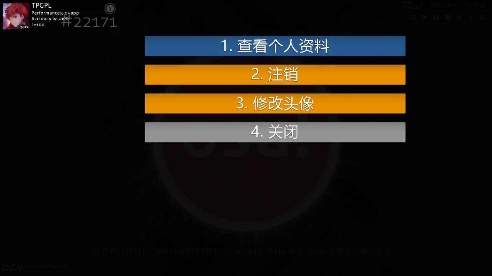
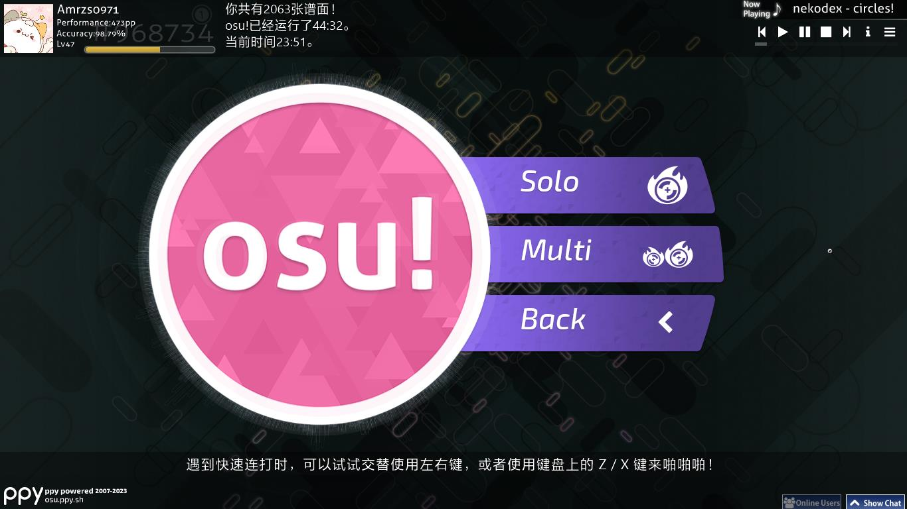
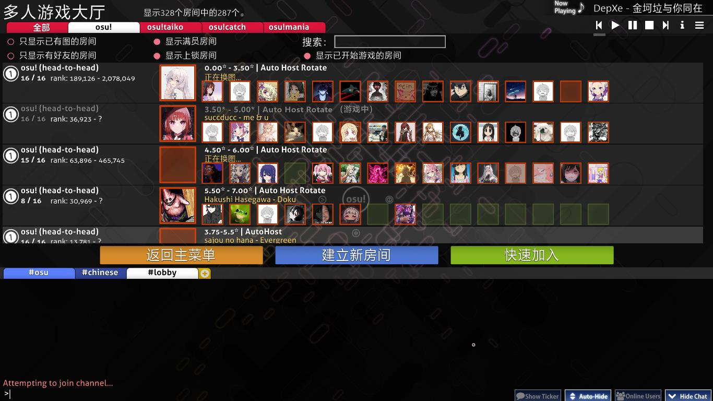
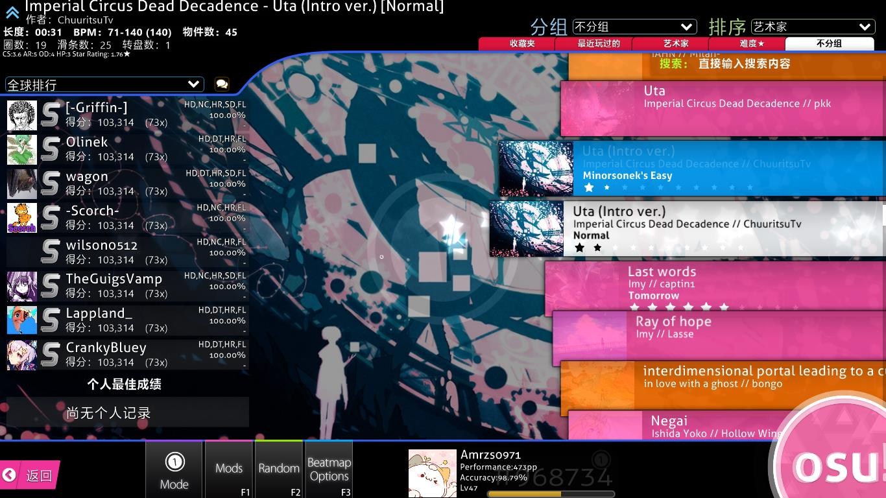
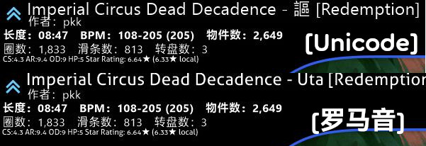
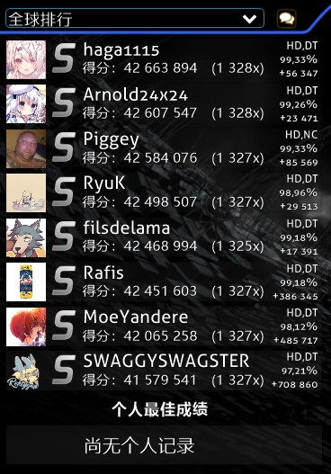

# 界面

本文将解释关于使用 osu! 游戏客户端的方法，你需要了解的所有事情。在这里，你会找到关于歌曲选择页面、排行榜显示与结果屏幕的信息。当启动客户端时，你会看到如下界面：

## 主菜单

- \[1\] [osu! 粉饼](/wiki/Client/Interface/Cookie)。点击后会打开主菜单。它随着音乐的 [BPM](/wiki/Music_theory/Tempo) 跳动，延伸出的长条将音频频谱可视化。如果没有播放歌曲，就会以 60 BPM 的速度缓慢跳动。
- \[2\] 点击 `Play` （或者按 `P`）单人或多人游玩 osu!。
- \[3\] 点击 `Edit` （或者按 `E`）编辑[谱面](/wiki/Beatmap)。
- \[4\] 点击 `Option` （或者按 `O`）打开[设置侧边栏](/wiki/Client/Options)。
- \[5\] 点击 `Exit` （或者按 `Esc`）退出游戏。
- \[6\] 一条随机的有用[提示](/wiki/Client/Menu_tips)。
- \[7\] [ppy](https://ppy.sh/) 的标志与版权信息
- \[8\] 当与 [Bancho 服务器](/wiki/Bancho_(server))的连接出现问题时，会在此处显示断掉的链接图标。
- \[9\] [聊天窗口](/wiki/Client/Interface/Chat_console)按钮，左侧有一个按钮可以打开扩展聊天窗口，显示在线用户。可以分别使用 `F8` 和 `F9` 来开关。
- \[10\] 音乐播放器。在主菜单中会随机播放歌曲。关于此菜单中的按钮详情，参见下文。
- \[11\] 可用[谱面难度](/wiki/Beatmap/Difficulty)数量（尽管并不是这样显示的）、osu! 的运行时间和系统时间。
- \[12\] 用户面板，点击显示[用户选项](#用户选项)。

---

音乐播放器有如下按钮：

| 按钮 | 描述 |
| :-: | :-- |
|  | 上一曲 |
|  | 播放 |
|  | 暂停 |
|  | 停止播放歌曲，并将播放时间重置到开始位置 |
|  | 下一曲 |
|  | 在永久显示歌曲信息与一段时间后渐隐间切换。 |
|  | 播放特定的歌曲。可以搜索歌曲，也可以按收藏夹筛选。 |

也可以使用[键盘快捷键](/wiki/Client/Keyboard_shortcuts#主菜单播放器)控制播放器。

## 用户选项

点击主菜单左上角的用户面板以打开用户选项。可以按各选项对应的数字来进行选择：

- `1. 查看个人资料`：在网页中查看个人资料。
- `2. 注销`：退出登录。退出登录后，游戏会提醒你再次登录。
- `3. 修改头像`：在网页中打开[头像编辑页面](https://osu.ppy.sh/home/account/edit#avatar)。
- `4. 关闭`：关闭此对话框。

## 游玩菜单

在主菜单选择 `Play` 后，可以在如下三个选项间选择：

- 点击 `Solo`（或按 `P` 键）以进行单机游戏。会转到[歌曲选择界面](#选歌界面)。
- 点击 `Multi`（或按 `M` 键）以进行多人游戏。会转到[多人游戏](/wiki/Client/Interface/Multiplayer)大厅。
- 点击 `Back` (或按 `B` 键) 以返回主菜单。

## 联机大厅

*主页面： [多人游戏](/wiki/Client/Interface/Multiplayer)*

联机大厅让你能与其他玩家一起游玩，可以合作也可以对抗。

## 选歌界面

左下角 `Mode` 上方显示了当前选中的[游戏模式](/wiki/Game_mode)。游戏模式的图标也会在屏幕中央闪烁。你一共可以看到四个模式：

-  是 [osu!](/wiki/Game_mode/osu!) 模式。
-  是 [osu!taiko](/wiki/Game_mode/osu!taiko) 模式。
-  是 [osu!catch](/wiki/Game_mode/osu!catch) 模式。
-  是 [osu!mania](/wiki/Game_mode/osu!mania) 模式。

在继续之前，这个界面的元素太多，以至于很难使用简单明显的数字标记。下面的子节将从上到下，从左到右来介绍界面的每一部分。

### 谱面信息

这里显示**你所选的谱面难度信息**。默认会选中音乐播放器正在播放的歌。左上角图标显示[谱面分类](/wiki/Beatmap/Category)，上图中的谱面处于[上架 (ranked)](/wiki/Beatmap/Category#ranked) 状态。

正常情况下会显示罗马化标题（如下图），但是如果在[设置](/wiki/Client/Options)中选择了`以原语言显示歌曲信息`时，则会显示 Unicode 标题（如上图）。谱面难度名显示在方括号（`[]`）中。制图者显示在标题下方，再下面则列出了更多信息。从左到右如下：

- **长度**：谱面从开始到结束包括休息时段的总长度。不要与[掉血时间](/wiki/Beatmap/Drain_time)混淆。
- **BPM**：*每分钟节拍数 (Beats Per Minute)*，也就是谱面的节奏速度。如果谱面有两个 BPM 而一个在括号里，就意味着整首歌的 BPM 是变化的。它显示这个谱面最慢和最快的 BPM，而括号里的 BPM 是谱面最常见的 BPM。
- **物件数**：谱面中[打击物件](/wiki/Gameplay/Hit_object)的总数。
- **圈数**：谱面中[圆圈](/wiki/Gameplay/Hit_object/Hit_circle) (osu! 与 osu!taiko)、[大果](/wiki/Gameplay/Hit_object/Fruit) (osu!catch) 或普通音符 (osu!mania) 的总数。
- **滑条数**：谱面中[滑条](/wiki/Gameplay/Hit_object/Slider) (osu!)、黄条 (osu!taiko)、[水果串](/wiki/Gameplay/Hit_object/Juice_stream) (osu!catch) 或长按音符 (osu!mania) 的总数。
- **转盘数**：谱面中[转盘](/wiki/Gameplay/Hit_object/Spinner) (osu! 与 osu!taiko) 或[香蕉雨](/wiki/Gameplay/Hit_object/Banana) (osu!catch) 的总数。
- **OD**：谱面的[总体难度](/wiki/Beatmap/Overall_difficulty)。
- **HP**：[掉血速度](/wiki/Beatmap/HP_drain_rate)。详情参见[血量](/wiki/Gameplay/Health)相关文章。
- **Stars**：谱面的[星级](/wiki/Beatmap/Star_rating)。很容易在谱面卡片上看到星数。

### 分组和排序

点击其中一个标签来**按所选标准给你的歌曲列表排序**。

#### 分组

这些选项将谱面分成可扩展的组：

| 分组 | 描述 |
| :-: | :-- |
| `不分组` | 谱面将不会分组，但仍会按排序设置进行排序。 |
| `难度⭐` | 谱面将会按难度星级分组，取决于整数位。 |
| `艺术家` | 谱面将会按艺术家的首字母分组。 |
| `最近玩过的` | 谱面将会按上一次游玩时间分组。 |
| `收藏夹` | 会显示你创建的收藏夹。*注意：会隐藏没有添加到收藏夹的谱面！* |
| `BPM` | 谱面将按 BPM 值以 60 的倍数分组。 |
| `作图者` | 谱面将按作图者首字母分组。 |
| `添加日期` | 谱面将会按添加时间分组，从今天到 5 个月前。 |
| `长度` | 谱面将会按长度分组：小于 1 分钟，小于 2 分钟，3，4，5，直到大于 10 分钟。 |
| `游戏模式` | 谱面将会按游戏模式分组。 |
| `成绩评级` | 谱面将会按获得的最高[评价](/wiki/Gameplay/Grade)分组。 |
| `标题` | 谱面将会按标题首字母分组。 |
| `在线收藏` | 只会显示你在线收藏的谱面。 |
| `我做的图` | 只会显示你做的图（谱面制作者的用户名与你的相符）。 |
| `Ranked 状态` | 谱面将会按状态分组：上架、待定、未提交、未知与社区喜爱。 |

前五个分组方式在分组和排序选项下面的标签中可用。

#### 排序

以特定顺序给谱面排序。

| 排序原则 | 描述 |
| :-: | :-- |
| `艺术家` | 谱面将会按艺术家的首字母顺序排序。 |
| `BPM` | 谱面将按 BPM 从低到高排序，对于 BPM 变化的谱面，会使用最高值。 |
| `作图者` | 谱面将按作图者的首字母排序。 |
| `添加日期` | 谱面将按添加日期从最晚到最早排序。 |
| `难度⭐` | 谱面将按难度从易到难排序。*注意这将会分割谱面集！* |
| `长度` | 谱面将按长度从短到长排序。 |
| `成绩评级` | 谱面将按最高评级从差到好排序。 |
| `标题` | 谱面将按标题的首字母排序。 |

### 搜索

*主页面：[谱面搜索](/wiki/Beatmap_search)*

可以使用搜索栏筛选符合条件的难度。默认情况下，osu! 进行全文搜索，只显示包含所有搜索词的结果。除此之外，你也可以使用一组筛选条件（例如 `ar=8` 或 `stars>=5`），按[缩圈速度 (AR)](/wiki/Beatmap/Approach_rate)、[星数评价](/wiki/Beatmap/Star_rating)与很多其他数值进行搜索。

要搜索谱面，只需在选歌界面内（设置与聊天面板未打开时）直接输入即可。

### 排名

各种各样的东西可以出现在这里：

- `未提交 (Not Submitted)` 框意味着此谱面还没有通过[谱面提交系统](/wiki/Beatmapping/Beatmap_submission)提交到 osu! 网站，或者已经被制图者删除。
- 如果有新版本谱面可供下载，会出现`更新到最新版本 (Update to latest version)` 框。点击按钮以更新。
  - *注意：一旦你更新了谱面，将会删除此谱面的所有本地分数。可以右击本地分数导出回放。*
- `最新待定版本 (Latest pending version)` 框意味着此谱面已被上传到 osu! 网站，但还没上架。
- 如果对应谱面有符合排名设置的回放，就会显示回放，而非谱面的排名/游玩状态的框，如上图所示。
  - 在公开排行榜（例如全球排名，好友排名等等）中，会在底部显示你的最好成绩及排名。
- `还没有记录！ (No records set!)` 意味着没有目前排名设置的回放（你通常会在刚刚下载或者编辑谱面后在本地排名看到）。

有以下排名显示设置：

- 本地排名
- 国内排名\*
- 全球排名
- 全球排名（所选 Mods）\*
- 好友排名\*

\*需要 [osu! 支持者标签](/wiki/osu!supporter)。

点击旁边的对话泡按钮将唤出所选谱面的**快捷访问**屏幕：

- 按 `1` 键或点击`歌曲列表/成绩`可以在默认浏览器中查看所选难度的谱面信息页。
- 按 `2` 键或点击`该谱面的官方讨论帖`来查看此谱面的[摸图](/wiki/Modding)页。
- 按 `3` 或 `Esc` 键或点击`取消`返回到选歌界面。

### 谱面卡片架

谱面卡片架显示所有可用谱面。不同的谱面可能会有不同颜色的框：

| 框颜色 | 描述 |
| :-: | :-- |
| **粉色** | 还没玩过这张谱面。 |
| **橙色** | 已经玩过谱面中的至少一个难度。 |
| **亮蓝色** | 此谱面的其他难度，谱面被展开时会显示。 |
| **白色** | 当前选中的谱面。 |

你可以通过使用鼠标滚轮、上下箭头键、按住鼠标左键拖动或单击鼠标右键（以前称为绝对滚动，将使滚动条移动到您的鼠标的 Y 坐标位置）来导航谱面列表。单击谱面来进行选择，再点一下、按 `Enter` 键或点击右下角的 osu! 粉饼来游玩谱面。

### 游玩工具箱

这一部分叫做游玩工具箱。我们将会从左到右依次讲述各个按钮的功能。

按下 `Esc` 键或点击`返回`按钮返回到主界面。

点击 `Mode` 按钮来打开可用的游戏模式列表。或者你也可以按 `Ctrl` 和 `1` (osu!)、 `2` (osu!taiko)、 `3` (osu!catch) 和 `4` (osu!mania) 来切换游戏模式。[排行榜](/wiki/Ranking)也会随游戏模式切换，可以观察显示排名的改变发现这一点。

点击 `Mods` 按钮或者按 `F1` 键来打开 **[Mod 选择界面](/wiki/Gameplay/Game_modifier)**。

在这个界面，你可以应用模组（缩写为 “mods”）。一些模组会降低难度并且会应用分数倍增器降低你获得的分数。相反，一些模组会增加难度，但是会应用分数倍增器增加你获得的分数。最后，一些模组会更改你的游戏方式。例如 [Relax](/wiki/Gameplay/Game_modifier/Relax) 和 [Auto Pilot](/wiki/Gameplay/Game_modifier/Autopilot) 都属于这一类。

把光标放在模组的图标上，可以看到其效果的简短描述。点击一个图标来选择或取消选择此模组。有些模组（比如Double Time）有多种变体——再次点击模组可以在这些变体间循环。分数乘数值显示你所选择的所有模组对分数的影响。点击`重置所有 mod` 或按 `1` 取消选择所有模组。点击`关闭`或按 `2` 或 `Esc` 返回到歌曲选择界面。

点击 `Random` 按钮或者按下 `F2` 让游戏**滚动所有谱面，然后随机选择一张**。

*注意：你可以按 `Shift` 然后点击 `Random` 按钮或者按 `F2` 来回到你随机选择前选中的谱面。*

点击 `Beatmap Options` 按钮或按下 `F3` 或者右击谱面可以呼出**当前选中谱面的选项菜单**。

- 按下 `1` 或者点击`管理收藏夹`按钮来打开收藏夹界面 - 在这里你可以管理先前存在的收藏，也可以从收藏夹添加或者删除你当前选择的谱面。
- 按下 `2` 或者点击`删除......`来删除 \[1\] 当前选择的难度， \[2\] 当前选择的谱面集，或者 \[3\] 删除**所有可见的谱面**。
  - 注意被删除的谱面会被移动到回收站。
- 按下 `3` 或者点击`从“未玩过的歌曲”中移除`将会标记这张未游玩谱面为游玩过了（也会更改颜色从粉红至橙色）。
- 按下 `4` 或点击`清除本地成绩`会删除你在此谱面上获得的所有分数记录。
- 按下 `5` 或点击`编辑`将会在 osu! 的编辑器中打开当前谱面。
- 按下 `6` 或按下 `Esc` 或点击`取消`会返回选歌界面。

点击**你的用户面板**以唤出**用户选项**。

点击 **[osu! 粉饼](/wiki/Client/Interface/Cookie)** 来**游玩当前选择的谱面**

## 结算界面

这是在成功完成谱面之后显示的等级界面。可以通过下滑或者点击底部的按钮来查看在线结算结果。

下面是其他游戏模式的成绩界面。

### 在线排行榜

这是你的在线排行榜，可以通过下滑或者点击底部的按钮来查看。你的本地分数榜通常将会显示你的名字和你的分数。

- \[1\] 玩家信息面板。这里会显示你的[表现分 (PP)](/wiki/Performance_points)、全球排名、总分数、总体[准确度](/wiki/Gameplay/Accuracy)和经验条。
- \[2\] `存储回放到回放文件夹`：你稍后可以在本地排行榜中观看回放，也可以在 `Replays` 文件夹中双击打开。
- \[3\] `设置为线上最爱`：添加谱面到线上收藏夹，它位于你 osu! 个人资料界面的`谱面`部分下方。
- \[4\] 本地排行榜：你所有的分数都会保存在电脑上。要查看他们，转到[选歌界面](#选歌界面)，然后在排行榜上方的下拉菜单中点击`本地排行`。
- \[5\] `谱面排名 (Beatmap Ranking)` 部分。仅当谱面拥有在线排行榜（处于[过审 (Qualified)](/wiki/Beatmap/Category#qualified)、[上架 (Ranked)](/wiki/Beatmap/Category#ranked) 或者[社区喜爱 (Loved)](/wiki/Beatmap/Category#loved) 状态）时可用。你也需要在处于在线状态时查看，详情见下。
- \[6\] `整体排名 (Overall Ranking)` 部分。仅当谱面拥有在线排行榜时可用。你也需要在处于在线状态时查看，详情见下。
- \[7\] 谱面的总游玩数和通过率。
- \[8\] 谱面评分。按你是否喜欢谱面进行评价。如果你不能决定，最好不要管它。
- \[9\] 点击返回选歌界面。

---

排名面板中的类别如下：

| 类别 | 谱面排名 (Beatmap Ranking) | 整体排名 (Overall Ranking) |
| :-: | :-- | :-- |
| `整体 (Overall)` | 你在此谱面排行榜上的位置。请注意，也会显示使用[模组](/wiki/Gameplay/Game_modifier)的分数。 | 与世界上其他人相比，你的[全球排名](/wiki/Ranking#performance-points-ranking)。 |
| [`准确度 (Accuracy)`](/wiki/Gameplay/Accuracy) | 游玩谱面时的准确度。只会在新分数超过旧分数时计算。 | 所有最好分数经加权后的平均准确度。 |
| `最大连击数 (Max Combo)` | 此谱面中你获得的最大连击数。 | 所有已游玩谱面中获得的最大连击数。 |
| [`排名分数 (Ranked Score)`](/wiki/Gameplay/Score/Ranked_score) | 你在这张谱面获得的[最好成绩](/wiki/Gameplay/Score/Ranked_score) | 你在所有已上架谱面中游玩获得分数的总和。每张谱面只计算一次。 |
| [`总分数 (Total Score)`](/wiki/Gameplay/Score/Total_score) | 不考虑，因为不会影响你的在线排名。 | 与排名分数相同，但会计算 osu! 网站所有可用谱面的游玩分数，包括未游玩完整或失败的谱面。这会影响你的[等级](/wiki/Gameplay/Score/Total_score#等级). |
| [`表现分 (Performance)`](/wiki/Performance_points) | 此次游玩获得的[未加权表现分](/wiki/Performance_points#为什么我不能获得一张谱面的所有表现分-(pp)？)值。 | 你的总表现分数，以及本次游玩获得的表现分数。 |

### 成就

*主页面： [成就](/wiki/Medals)*

有时当满足特定条件时，你会获得新成就。
