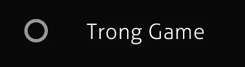
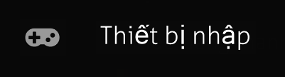

# Tùy chọn

")

Trong menu chính, nhấp vào `Options` hoặc nhấn `O` (hoặc nhấn `Ctrl` + `O` để truy cập từ hầu hết mọi màn hình) để truy cập thanh tùy chọn và thay đổi các tùy chọn có sẵn trong osu!. Khi menu tùy chọn được mở, bạn có thể gõ để tìm kiếm một thiết lập cụ thể. Văn bản trong thanh tìm kiếm sẽ rung lắc nếu không có kết quả nào khớp với truy vấn tìm kiếm.

Khi một cài đặt có giá trị mặc định bị thay đổi, thanh dọc màu xám ở bên trái sẽ phát sáng màu vàng cho cài đặt đó. Nhấp vào đây sẽ đưa giá trị trở về giá trị mặc định.

## Cài đặt chung

Phần này liên quan đến tài khoản của bạn, cài đặt ngôn ngữ, và cập nhật cho osu!

### Đăng nhập

Nếu bạn chưa đăng nhập vào trò chơi, menu tùy chọn khi khởi động sẽ được tự động mở, yêu cầu bạn đăng nhập. Bạn có thể bỏ qua điều này bằng cách nhấn `Esc`, nhấp vào nút quay lại, hoặc chuyển đến màn hình chọn bài. Nếu không đăng nhập, trò chơi sẽ đánh dấu bạn là "Khách" và bạn sẽ không thể xem bảng xếp hạng trực tuyến, gửi điểm, hoặc chơi [Multi](/wiki/Client/Interface/Multiplayer).

Nếu bạn là khách, các tùy chọn sau sẽ hiển thị:

| Tên | Mô tả | Loại | Mặc định |
| :-- | :-- | :-- | :-- |
| `Tên đăng nhập` | Ô nhập tên người dùng của bạn. | Văn bản | *(trống)* |
| `Mật khẩu` | Ô nhập mật khẩu của bạn. | Mật khẩu | *(trống)* |
| `Nhớ tên đăng nhập` | Nếu chọn, trò chơi sẽ ghi nhớ tên người dùng đã nhập. | Hộp kiểm | `Bật` |
| `Nhớ mật khẩu` | Nếu chọn, trò chơi sẽ ghi nhớ mật khẩu đã nhập. Điều này cũng giữ bạn đăng nhập vào trò chơi. | Hộp kiểm | `Tắt` |
| `Đăng nhập` | Đăng nhập vào osu! với thông tin đã cung cấp. Nhấn `Enter` trong ô nhập tên người dùng hoặc mật khẩu cũng hoạt động. | Nút |  |
| `Tạo tài khoản` | Mở màn hình [đăng ký tài khoản](/wiki/Registration). | Nút |  |

---

Nếu bạn đã đăng nhập, bạn sẽ thấy:

| Tên | Mô tả | Loại |
| :-- | :-- | :-- |
| `Đã đăng nhập bằng tên {username}` | Hiển thị menu người dùng, xem bên dưới. | Nút |

---

Nếu bạn nhấp vào thông báo `Đã đăng nhập bằng tên {username}`, nó sẽ hiển thị menu với các nút sau:

| Tên | Mô tả | Loại |
| :-- | :-- | :-- |
| `1. Xem trang thông tin người chơi` | Xem hồ sơ của bạn trên trang web. | Nút |
| `2. Đăng xuất` | Đăng xuất khỏi trò chơi này. | Nút |
| `3. Thay hình đại diện` | Thay đổi ảnh đại diện của bạn (sẽ dẫn đến trang web). | Nút |
| `4. Đóng` | Đóng hộp thoại này. Bạn cũng có thể nhấn `Esc`. | Nút |

Bạn có thể truy cập menu này bằng cách nhấp vào thẻ người chơi của bạn ở các vị trí có sẵn.

### Ngôn ngữ

| Tên | Mô tả | Loại | Mặc định |
| :-- | :-- | :-- | :-- |
| `Chọn ngôn ngữ` | Hiển thị danh sách các ngôn ngữ để chọn. | Danh sách thả xuống |  |
| `Dùng thông tin bài hát theo ngôn ngữ ban đầu` | Trong màn hình chọn bài hát, các beatmap sẽ hiển thị thông tin gốc hoặc chưa dịch, nếu có. | Hộp kiểm | `Tắt` |
| `Sử dụng font thay thế trong khung chat` | Sử dụng phông chữ cũ (Tahoma) thay vì phông chữ hiện tại (Aller) trong [bảng chat](/wiki/Client/Interface/Chat_console). | Hộp kiểm | `Tắt` |

### Cập nhật

| Tên | Mô tả | Loại | Mặc định |
| :-- | :-- | :-- | :-- |
| `Phiên bản` | Hiển thị danh sách các bản dựng bạn muốn sử dụng. | Danh sách thả xuống | `Stable` |
| `osu! đang chạy phiên bản mới nhất` | Nhấp vào để buộc trò chơi kiểm tra và tải xuống các bản cập nhật nếu có. | Nút |  |
| `Mở thư mục chứa osu!` | Mở thư mục osu! cục bộ, chứa skin, beatmap của bạn, v.v. | Nút |  |

---

Khi mở danh sách `Phiên bản`, bạn sẽ thấy các tùy chọn sau:

| Tên | Mô tả |
| :-- | :-- |
| `Ổn định` | Bản phát hành công khai ổn định. |
| `Beta` | Bản phát triển - có các tính năng mới sớm, nhưng có thể có nhiều lỗi hơn. |
| `Thử nghiệm` | Bản phát triển - có các tính năng mới hơn nữa, nhưng có thể có nhiều lỗi nghiêm trọng hơn. |

## Đồ họa

Phần này liên quan đến giao diện của trò chơi, các phần của giao diện và cài đặt video.

### Trình render

| Tên | Mô tả | Loại | Mặc định |
| :-- | :-- | :-- | :-- |
| `Giới hạn FPS` | Đặt giới hạn tốc độ khung hình. Xem chi tiết bên dưới. | Danh sách thả xuống | `Optimal` |
| `Số đếm FPS` | Bật/tắt hiển thị FPS. Điều này được thấy ở góc dưới bên phải của màn hình. | Hộp kiểm | `Tắt` |
| `Chế độ tương thích` | Sử dụng bộ xử lý đồ họa cũ mà osu! sử dụng cho các máy tính cũ. Điều này sẽ khởi động lại trò chơi. | Hộp kiểm | `Tắt` |
| `Giảm giật khung hình` | Điều chỉnh cài đặt đồ họa để giảm số khung hình bị rớt/giật. | Hộp kiểm | `Tắt` |
| `Phát hiện vấn đề về hiệu suất hoạt động` | Cảnh báo bạn nếu một chương trình khác trên máy tính của bạn có thể gây hại đến hiệu suất của trò chơi. | Hộp kiểm | `Bật` |

---

*Lưu ý: Khi trò chơi không phải là cửa sổ đang hoạt động, giới hạn fps sẽ tự động giảm xuống 30fps.*\
*Cảnh báo cho người dùng laptop: sử dụng `Không giới hạn (khi chơi)` có thể khiến laptop của bạn quá nhiệt!*

Khi mở danh sách `Giới hạn FPS`, bạn sẽ thấy các tùy chọn sau:

| Tên | Mô tả |
| :-- | :-- |
| `VSync` | Giới hạn trò chơi ở tốc độ làm mới của màn hình của bạn. Xem giải thích bên dưới để biết chi tiết. |
| `Power Saving` | Giới hạn trò chơi ở gấp đôi tốc độ làm mới của màn hình của bạn. |
| `Optimal` | Giới hạn trò chơi ở gấp tám lần tốc độ làm mới của màn hình của bạn, tối đa là 960fps. |
| `Không giới hạn (khi chơi)` | Giới hạn trò chơi ở tốc độ làm mới của màn hình của bạn. Xem giải thích bên dưới để biết chi tiết. |

- Giải thích `VSync`: Nói một cách đơn giản, việc sử dụng VSync sẽ buộc trò chơi đợi toàn bộ khung hình tải xong trước khi hiển thị.
  - Bạn có thể muốn sử dụng tính năng này nếu bạn thấy hiện tượng "xé hình" (chẳng hạn như khi phần dưới của trò chơi bị trễ so với phần trên của trò chơi).
  - Dù vậy, việc này có thể gây ra hiện tượng lag hoặc chậm vì trò chơi phải đợi từng khung hình tải xong.
- Giải thích `Không giới hạn (khi chơi)`: Giới hạn này chỉ áp dụng khi bạn đang chơi một beatmap.
  - Khi không chơi beatmap, tốc độ khung hình sẽ bị giới hạn ở gấp đôi tốc độ làm mới của màn hình của bạn, hoặc 240fps, tùy theo cái nào cao hơn.
  - Tùy chọn này **không được khuyến khích**. Sử dụng tùy chọn `Không giới hạn (khi chơi)` có thể gây ra hiện tượng giật.
  - Sử dụng tùy chọn `Optimal` sẽ mang lại sự thay đổi không đáng kể về độ trễ hệ thống (từ nhập liệu đến xuất đầu ra) so với `Không giới hạn (khi chơi)`.

### Độ phân giải

| Tên | Mô tả | Loại | Mặc định |
| :-- | :-- | :-- | :-- |
| `Chọn độ phân giải` | Đặt độ phân giải của trò chơi. Các độ phân giải được liệt kê bị giới hạn bởi những gì màn hình/GPU của bạn hỗ trợ. | Danh sách thả xuống |  |
| `Toàn màn hình` | Chạy trò chơi ở chế độ toàn màn hình (thường giảm độ trễ đầu vào). | Hộp kiểm | `Bật` |
| `Render at native resolution` | Sử dụng độ phân giải gốc nhưng hiển thị osu! ở một phần nhỏ hơn của màn hình. | Hộp kiểm | `Bật` |
| `Minimise on alt-tab during fullscreen` | Thu nhỏ cửa sổ chính khi nhấn `Alt` + `Tab`. | Hộp kiểm | `Bật` |
| `Vị trí ngang` | Điều chỉnh độ lệch ngang cho chế độ letterboxing. Chỉ hiển thị khi `Render at native resolution` được bật. | Thanh trượt | `0%` |
| `Vị trí dọc` | Điều chỉnh độ lệch dọc cho chế độ letterboxing. Chỉ hiển thị khi `Render at native resolution` được bật. | Thanh trượt | `0%` |

- Nếu `Toàn màn hình` bị tắt, thông báo `Không dùng chế độ toàn màn hình sẽ làm tăng độ trễ của bạn!` sẽ xuất hiện bên dưới.

### Thiết lập chi tiết

| Tên | Mô tả | Loại | Mặc định |
| :-- | :-- | :-- | :-- |
| `Nốt dài trượt` | Các nốt dài sẽ trượt ra từ điểm bắt đầu của chúng. | Hộp kiểm | `Bật` |
| `Video nền` | Cho phép phát video nền của beatmap trong khi chơi (có thể tắt theo từng beatmap). | Hộp kiểm | `Bật` |
| `Storyboard` | Cho phép phát storyboard của beatmap (có thể tắt theo từng beatmap). | Hộp kiểm | `Bật` |
| `Hình mốc combo` | Một bức ảnh sẽ hiện ra từ phía bên màn hình khi đạt được mốc combo. | Hộp kiểm | `Tắt` |
| `Hiệu ứng sáng` | Một vùng sáng nhẹ sẽ xuất hiện đằng sau note khi nhấp trúng. Hiệu ứng này không mất đi trong Kiai Time. | Hộp kiểm | `Bật` |
| `Hiệu ứng Shader` | Hiển thị các hiệu ứng kiểu concert. Tuỳ chọn này có thể tự động tắt nếu máy tính của bạn không thể xử lý được. | Hộp kiểm | `Tắt` |
| `Hiệu ứng làm mềm` | Điều chỉnh shader để ít chói mắt hơn. Bật tuỳ chọn này sẽ tự động bật `Hiệu ứng Shader`. | Hộp kiểm | `Tắt` |
| `Định dạng chụp màn hình` | Đặt định dạng file cho ảnh chụp màn hình. | Danh sách thả xuống | `JPEG (thân thiện với web)` |

### Menu chính

| Tên | Mô tả | Loại | Mặc định |
| :-- | :-- | :-- | :-- |
| `Tuyết rơi` | Hiển thị hiệu ứng tuyết rơi trong menu chính (luôn bật trong mùa đông). | Hộp kiểm | `Tắt` |
| `Hiệu ứng Parallax` | Hiển thị hiệu ứng parallax nhẹ theo con trỏ chuột trong menu trò chơi (không có tác dụng khi đang chơi). | Hộp kiểm | `Bật` |
| `Hiển thị các trợ giúp về menu` | Hiển thị mẹo mỗi khi bạn truy cập vào menu chính. (Các mẹo không hiển thị trong các phiên bản thử nghiệm.) | Hộp kiểm | `Bật` |
| `Phát giọng nói giao diện` | Phát âm thanh "chào mừng" và "tạm biệt" khi mở và đóng trò chơi tương ứng. | Hộp kiểm | `Bật` |
| `Sử dụng nhạc nền của osu!` | Nếu được bật, bài hát chủ đề sẽ phát sau khi mở trò chơi. Khi bài hát thay đổi, bạn không thể phát lại cho đến khi khởi động lại trò chơi. | Hộp kiểm | `Bật` |
| `Seasonal backgrounds` | Sử dụng ảnh nền từ các cuộc thi fanart làm nền trong menu chính (và cho các beatmap không có hình nền). Hình ảnh sẽ thay đổi khi bài hát thay đổi. | Danh sách thả xuống | `Sometimes` |

---

Khi mở danh sách `Seasonal backgrounds`, bạn sẽ thấy các tùy chọn sau:

| Tên | Mô tả |
| :-- | :-- |
| `Sometimes` | Bạn sẽ thấy ảnh nền theo mùa trong vài tuần đầu mỗi mùa. Đội ngũ phát triển osu! sẽ chọn khi nào chúng sẽ bị loại bỏ, thay thế bằng những ảnh nền mà bạn đã quen thuộc. |
| `Never` | Bạn sẽ không bao giờ thấy ảnh nền theo mùa, và nền mặc định sẽ được sử dụng trong mọi trường hợp. |
| `Always` | Bạn sẽ luôn có ảnh nền của mùa hiện tại. |

### Lựa chọn bài nhạc

| Tên | Mô tả | Loại | Mặc định |
| :-- | :-- | :-- | :-- |
| `Xem các hình thu nhỏ` | Hiển thị ảnh xem trước của nền beatmap. Điều này yêu cầu skin đã chọn phải từ phiên bản 2.2 trở lên. | Hộp kiểm | `Bật` |

## Trong Game

Phần này liên quan đến các thiết lập ảnh hưởng đến gameplay.

### Cài đặt chung

| Tên | Mô tả | Loại | Mặc định |
| :-- | :-- | :-- | :-- |
| `Độ tối hình nền` | Điều chỉnh mức độ làm mờ áp dụng cho nền và storyboard khi chơi (có thể thiết lập theo từng beatmap). | Thanh trượt | `80%` |
| `Don't change dim level during breaks` | Không giảm độ tối của hình nền trong các khoảng nghỉ. | Hộp kiểm | `Tắt` |
| `Show leaderboard during gameplay` | Hiển thị bảng xếp hạng bên trái khi chơi, cả ở chế độ solo và multi. | Hộp kiểm | `Bật` |
| `Vị trí thanh tiến trình` | Thiết lập nơi và cách thanh tiến độ bài hát hiển thị. Xem chi tiết bên dưới. | Danh sách thả xuống | `Trên - phải (Tròn)` |
| `Kiểu dáng thanh hiển thị điểm` | Thiết lập loại thanh đo độ chính xác xuất hiện dưới beatmap. Lưu ý rằng osu!catch sẽ luôn sử dụng `Màu sắc`. | Danh sách thả xuống | `Thanh lỗi` |
| `Kích thước của thanh điểm` | Thiết lập kích thước thanh đo độ chính xác. | Thanh trượt | `1x` |
| `Luôn hiện bảng hiển thị phím bấm` | Hiển thị trạng thái bấm phím ngay cả khi chơi bình thường. | Hộp kiểm | `Tắt` |
| `Hiện Approach Circle trên nốt đầu tiên của chế độ Hidden` | Khi chơi với mod "Hidden", hiển thị Approach Circle của nốt đầu tiên. | Hộp kiểm | `Bật` |
| `Căn chỉnh tốc độ scroll của osu!mania phù hợp với BPM` | Điều chỉnh tốc độ cuộn của osu!mania theo BPM của beatmap. | Hộp kiểm | `Tắt` |
| `Nhớ tốc độ cuộn của mỗi beatmap osu!mania` | Ghi nhớ tốc độ cuộn bạn đã đặt cho từng beatmap. | Hộp kiểm | `Tắt` |

---

Khi mở danh sách `Vị trí thanh tiến trình`, bạn sẽ thấy các tùy chọn sau:

| Tên | Mô tả |
| :-- | :-- |
| `Trên - phải (Tròn)` | Sử dụng biểu đồ hình tròn để hiển thị thời gian còn lại trước khi bài hát bắt đầu và thời gian còn lại trước khi hoàn thành. Hiển thị bên trái độ chính xác. |
| `Trên - phải (Đường)` | Sử dụng thanh ngang ngắn để hiển thị thời gian còn lại trước khi hoàn thành. Điều này được thấy bên dưới điểm số và phía trên độ chính xác. |
| `Dưới - Phải` | Sử dụng thanh ngang ngắn để hiển thị thời gian còn lại trước khi hoàn thành. Hiển thị ở góc dưới bên phải. |
| `Dưới (Đường)` | Sử dụng thanh ngang dài để hiển thị thời gian còn lại trước khi hoàn thành. Hiển thị ở phía dưới của màn hình. |

---

Khi mở danh sách `Kiểu dáng thanh hiển thị điểm`, bạn sẽ thấy các tùy chọn sau:

| Tên | Mô tả |
| :-- | :-- |
| `Không có` | Không sử dụng thước đo để hiển thị hit timing của người chơi. |
| `Màu sắc` | Sử dụng các khối màu để hiển thị hit timing. (osu!catch sẽ luôn sử dụng tùy chọn này nếu `Thanh lỗi` được chọn.) |
| `Thanh lỗi` | Sử dụng đồng hồ đo để hiển thị hit timing. Hiển thị cho người chơi thấy mình đã bấm sớm hoặc muộn. |

### Lựa chọn bài nhạc

| Tên | Mô tả | Loại | Mặc định |
| :-- | :-- | :-- | :-- |
| `Hiển thị beatmap từ` | Điều chỉnh beatmap có độ khó **thấp nhất** sẽ được hiển thị trong chọn bài hát. | Thanh trượt | `0 sao` |
| `lên đến` | Điều chỉnh beatmap có độ khó **cao nhất** sẽ được hiển thị trong chọn bài hát. | Thanh trượt | `10+ sao` |

## Âm thanh

Phần này liên quan đến các tùy chọn âm thanh.

### Các thiết bị

| Tên | Mô tả | Loại | Mặc định |
| :-- | :-- | :-- | :-- |
| `Thiết bị đầu ra` | Chọn thiết bị xuất âm thanh. (Các tùy chọn dựa trên những gì máy tính của bạn cung cấp.) | Danh sách thả xuống | `Mặc định` |
| `Audio compatibility mode` | Sử dụng engine âm thanh cũ với độ trễ cao hơn nhưng tương thích hơn. | Hộp kiểm | `Tắt` |

### Âm lượng

| Tên | Mô tả | Loại | Mặc định |
| :-- | :-- | :-- | :-- |
| `Tổng quát` | Điều chỉnh âm lượng chính. | Thanh trượt | `100%` |
| `Nhạc nền` | Điều chỉnh âm lượng nhạc. | Thanh trượt | `80%` |
| `Hiệu ứng` | Điều chỉnh hitsound và hiệu ứng âm thanh in-game. | Thanh trượt | `80%` |
| `Không dùng hitsound của beatmap` | Ưu tiên hitsound từ skin hiện tại thay vì hitsound đi kèm beatmap. | Hộp kiểm | `Tắt` |

Âm lượng chính, nhạc và hitsound có thể được thay đổi ở nơi khác bằng cách nhấn `Alt` và cuộn lên hoặc xuống hoặc bằng cách nhấn `Alt` và nhấn `Lên` hoặc `Xuống`.

### Độ trễ

| Tên | Mô tả | Loại | Mặc định |
| :-- | :-- | :-- | :-- |
| `Độ trễ` | Độ trễ (tính bằng mili giây) mà tất cả các beatmap sẽ sử dụng (ngoài độ trễ cục bộ). | Thanh trượt | `0ms` |
| `Kiểm tra độ trễ` | Mở trình điều chỉnh độ trễ. | Nút |  |

- Để biết chi tiết về trình điều chỉnh độ trễ, xem [Kiểm tra độ trễ](/wiki/Client/Options/Offset_Wizard).
- Để biết chi tiết về cách sử dụng trình điều chỉnh độ trễ, xem [Cách sử dụng trình điều chỉnh độ trễ](/wiki/Guides/How_to_use_the_Offset_Wizard).

## Giao diện

Phần này liên quan đến các tùy chọn về skin.

### Skin

| Tên | Mô tả | Loại | Mặc định |
| :-- | :-- | :-- | :-- |
| `Ảnh mẫu của skin` | Hiển thị các thành phần khác nhau từ skin đã chọn. Nhấp vào để chuyển qua các thành phần khác nhau của skin. | Nút |  |
| `Chọn skin` | Thay đổi skin. Các mục trong danh sách thả xuống dựa trên những gì có trong thư mục `osu!/Skins`. (Tên dựa trên tên thư mục.) | Danh sách thả xuống | `Default` |
| `Xem trước skin` | Xem trước skin bằng cách chơi một beatmap ngẫu nhiên với auto mod. Chế độ được xác định dựa trên những gì được chọn trong chọn bài hát. | Nút |  |
| `Mở thu mục skin` | Mở thư mục skin đã chọn. | Nút |  |
| `Xuất ra với định dạng .osk` | Xuất skin hiện tại dưới dạng file `.osk` để chia sẻ. Khi trò chơi xuất xong, nó sẽ mở thư mục chứa file `.osk`. | Nút |  |
| `Không dùng skin của tất cả các map` | Ưu tiên skin đã chọn hơn skin đi kèm beatmap. Điều này không bao gồm hitsound (xem tùy chọn tiếp theo bên dưới). | Hộp kiểm | `Tắt` |
| `Sử dụng âm thanh của skin` | Luôn sử dụng hitsound của skin đã chọn thay vì hitsound đi kèm beatmap. | Hộp kiểm | `Bật` |
| `Sử dụng skin Taiko cho chế độ Taiko` | Sử dụng các thành phần skin dành riêng cho osu!taiko, nếu có sẵn trong skin đã chọn. Xem [Skinning/osu!taiko](/wiki/Skinning/osu!taiko) để biết thêm chi tiết. | Hộp kiểm | `Tắt` |
| `Luôn sử dụng con trỏ của skin` | Ưu tiên con trỏ của skin hiện tại hơn bất kỳ con trỏ nào đi kèm beatmap. | Hộp kiểm | `Tắt` |
| `Độ lớn con trỏ` | Điều chỉnh kích thước con trỏ. | Thanh trượt | `1x` |
| `Tự động điều chỉnh kích thước con trỏ` | Tự động điều chỉnh kích thước con trỏ dựa trên kích thước hitcircle của beatmap. | Hộp kiểm | `Tắt` |
| `Sử dụng màu của combo làm màu cho bóng slider` | Các bóng slider sẽ sử dụng màu combo hiện tại (thường là trong suốt). Chỉ có tác dụng với những skin hỗ trợ việc này. | Hộp kiểm | `Bật` |

## Thiết bị nhập

Phần này liên quan đến các thiết bị ngoại vi đầu vào.

### Chuột

| Tên | Mô tả | Loại | Mặc định |
| :-- | :-- | :-- | :-- |
| `Độ nhạy chuột` | Điều chỉnh độ nhạy của con trỏ chuột. Nếu thay đổi, nó có thể tự động bật `Raw Input`. | Thanh trượt | `1x` |
| `Raw Input` | Đọc giá trị vị trí của chuột/bảng vẽ trực tiếp từ phần cứng, không qua xử lý hậu kỳ (để bỏ qua việc gia tốc chuột). | Hộp kiểm | `Tắt` |
| `Chỉnh Raw Input chính xác vào cửa sổ của osu!` | Giới hạn vùng hoạt động của thiết bị đầu vào có vị trí tuyệt đối (ví dụ: bảng vẽ) chỉ nằm trong cửa sổ trò chơi. | Hộp kiểm | `Tắt` |
| `Hạn chế khu điều khiển chuột` | Ngăn con trỏ chuột rời khỏi cửa sổ trò chơi. Xem chi tiết bên dưới. | Danh sách thả xuống | `Chỉ khi toàn màn hình` |
| `Vô hiệu hoá con lăn chuột khi chơi` | Vô hiệu hóa con lăn chuột trong khi chơi. Sử dụng con lăn chuột có thể thay đổi giá trị âm lượng chính. | Hộp kiểm | `Tắt` |
| `Vô hiệu hoá nút chuột khi chơi` | Vô hiệu hóa các nút chuột trong khi chơi. Điều này hữu ích cho người chơi bằng bàn phím. | Hộp kiểm | `Tắt` |
| `Hiệu ứng giọt nước khi bấm chuột` | Hiển thị hiệu ứng gợn sóng nhẹ khi bấm chuột. | Hộp kiểm | `Tắt` |

- Khi `Raw Input` được bật, nó sẽ hiển thị số báo cáo nhận được mỗi giây và độ trễ tính bằng mili giây.
- Hiệu ứng giọt nước của con trỏ có thể được kích hoạt bằng cách nhấn `M1` và `M2` trong khi chơi.

---

Khi mở danh sách `Hạn chế khu điều khiển chuột`, bạn sẽ thấy các tùy chọn sau:

| Tên | Mô tả |
| :-- | :-- |
| `Không bao giờ` | Không bao giờ ngăn chuột rời khỏi trò chơi. |
| `Chỉ khi toàn màn hình` | Chỉ ngăn chuột rời khỏi trò chơi khi ở chế độ toàn màn hình (điều này cũng bao gồm chế độ letterboxing). |
| `Luôn luôn` | Luôn ngăn chuột rời khỏi trò chơi ở mọi độ phân giải. |

### Bàn phím

| Tên | Mô tả | Loại |
| :-- | :-- | :-- |
| `Cài đặt phím` | Hiển thị hộp thoại cho phép bạn xem hoặc thay đổi các phím tắt trên bàn phím. Xem [Phím tắt bàn phím](/wiki/Client/Options/Keyboard_bindings) để biết thêm chi tiết. | Nút |
| `Thay đổi bố trí phím osu!mania` | Hiển thị hộp thoại cho phép bạn xem hoặc thay đổi thiết lập phím cho osu!mania. Xem [osu!mania layout](/wiki/Game_mode/osu!mania) để biết thêm chi tiết. | Nút |

### Thiết lập thêm

| Tên | Mô tả | Loại | Mặc định |
| :-- | :-- | :-- | :-- |
| `Bật hỗ trợ TabletPC của OS` | Cải thiện khả năng tương thích với bảng vẽ đồ họa và máy tính bảng. | Hộp kiểm | `Tắt` |
| `Bật hỗ trợ Wiimote/TaTaCon Drum` | Bật hỗ trợ cho bộ điều khiển trống Taiko của Nintendo Wii và Wiimotes. Kết nối thiết bị qua Bluetooth trước khi bật. | Hộp kiểm | `Tắt` |

## Editor

Phần này liên quan đến [trình chỉnh sửa beatmap](/wiki/Client/Beatmap_editor).

Các tùy chọn này chỉ ảnh hưởng khi làm việc trong trình chỉnh sửa beatmap hoặc ở chế độ kiểm tra (test một beatmap).

### Cài đặt chung

| Tên | Mô tả | Loại | Mặc định |
| :-- | :-- | :-- | :-- |
| `Video nền` | Phát video nền của beatmap khi đang chỉnh sửa. | Hộp kiểm | `Tắt` |
| `Sử dụng skin mặc định` | Sử dụng skin mặc định của osu! khi đang chỉnh sửa, bất kể cài đặt của skin hiện tại. | Hộp kiểm | `Tắt` |
| `Nốt dài trượt` | Nốt dài trườn ra ngoài từ vị trí xuất phát trong Editor. | Hộp kiểm | `Bật` |
| `Hiệu ứng động khi nhấn trúng` | Bật hoạt ảnh động khi nhấn trúng trong khi đang chỉnh sửa. | Hộp kiểm | `Tắt` |
| `Các đường dẫn` | Hiển thị các đường dẫn khi đang chỉnh sửa. | Hộp kiểm | `Bật` |
| `Chồng nhau` | Xếp chồng các hit circle như khi chơi. | Hộp kiểm | `Bật` |

Các tùy chọn này có thể được ghi đè thủ công bằng cách sử dụng menu `View` trong trình chỉnh sửa beatmap.

## Trực tuyến

Phần này liên quan đến chat, theo dõi, multi, và osu!direct.

### Cảnh báo và Sự riêng tư

| Tên | Mô tả | Loại | Mặc định |
| :-- | :-- | :-- | :-- |
| `Hiện khung nháy chat` | Hiển thị tin nhắn chat gần nhất ở dưới cùng của màn hình. Tin nhắn hiển thị là từ kênh hiện tại mà bạn đang xem. | Hộp kiểm | `Tắt` |
| `Tự động ẩn chat khi đang chơi` | Nếu chat được mở trong khoảng nghỉ hoặc menu trong trò chơi, trò chơi sẽ tự động ẩn nó khi vào màn chơi. | Hộp kiểm | `Bật` |
| `Hiện thông báo khi tên bạn được nhắc đến` | Khi ai đó [đề cập đến tên người dùng của bạn](/wiki/Client/Interface/Chat_console/Highlight) trong chat, một thông báo sẽ xuất hiện. | Hộp kiểm | `Bật` |
| `Hiển thị thông báo tin nhắn` | Hiển thị thông báo khi có tin nhắn chat mới. | Hộp kiểm | `Bật` |
| `Phát âm thanh khi tên bạn được nhắc đến` | Khi ai đó [đề cập đến tên người dùng của bạn](/wiki/Client/Interface/Chat_console/Highlight) trong chat, một âm thanh sẽ phát ra. | Hộp kiểm | `Bật` |
| `Chia sẻ địa điểm thành phố của bạn với người khác` | Chia sẻ vị trí thành phố của bạn trong thẻ người dùng (lưu ý rằng quốc gia của bạn đã được chia sẻ trước đó). | Hộp kiểm | `Tắt` |
| `Hiện danh sách người theo dõi` | Hiển thị danh sách những người theo dõi hiện tại ở bên trái màn hình khi chơi. | Hộp kiểm | `Bật` |
| `Tự động gửi link beatmap cho những người quan sát` | Gửi beatmap đang chơi tới kênh `#spectator` khi bạn có người theo dõi. | Hộp kiểm | `Bật` |
| `Hiện thông báo ngay trong khi chơi` | Cho phép thông báo đẩy hiển thị trong khi chơi. Nếu tắt, trò chơi sẽ đợi đến khi bạn chơi xong. | Hộp kiểm | `Bật` |
| `Hiện thông báo khi bạn bè online hoặc offline` | Hiển thị thông báo khi bạn bè của bạn online hoặc offline. | Hộp kiểm | `Bật` |
| `Cho phép nhận lời mời chơi online từ tất cả` | Cho phép lời mời chơi multi từ bất kỳ ai. Tắt tùy chọn này sẽ giới hạn chỉ nhận lời mời chơi multi từ bạn bè. | Hộp kiểm | `Bật` |

### Đồng bộ

| Tên | Mô tả | Loại | Mặc định |
| :-- | :-- | :-- | :-- |
| `Discord Rich Presence` | Cung cấp [dữ liệu rich presence cho Discord](/wiki/Guides/Discord_Rich_Presence). | Hộp kiểm | `Bật` |
| `Đồng bộ status với Yahoo!` | Trình nhắn tin Yahoo! của bạn sẽ hiển thị bài hát bạn đang chơi hoặc nghe. Điều này cần được thiết lập từ trang web. | Hộp kiểm | `Tắt` |
| `Đồng bộ hóa với trạng thái của MSN Messenger` | Trình nhắn tin Windows Live của bạn sẽ hiển thị bài hát bạn đang chơi hoặc nghe. | Hộp kiểm | `Tắt` |
| `Tự động tải từ osu!direct` | Dành cho [osu!supporters](/wiki/osu!supporter). Khi theo dõi hoặc chơi multi, beatmap sẽ được tải xuống tự động. | Hộp kiểm | `Bật` |
| `Không download video` | Dành cho [osu!supporters](/wiki/osu!supporter). Tải xuống từ osu!direct sẽ giới hạn ở phiên bản không có video của beatmap. | Hộp kiểm | `Tắt` |

### Chat trong trò chơi

| Tên | Mô tả | Loại | Mặc định |
| :-- | :-- | :-- | :-- |
| `Lọc từ ngữ xúc phạm` | Thay thế các từ ngữ xúc phạm bằng `*beep*`. | Hộp kiểm | `Tắt` |
| `Lọc những kí tự nước ngoài` | Loại bỏ bất kỳ ký tự ASCII không chuẩn nào trong chat. | Hộp kiểm | `Tắt` |
| `Lưu lại tin nhắn riêng` | Tin nhắn riêng sẽ được lưu vào thư mục `osu!/Logs`. | Hộp kiểm | `Tắt` |
| `Chặn tin nhắn riêng từ người không phải bạn bè` | Bật tính năng này sẽ giới hạn chỉ nhận tin nhắn riêng từ bạn bè. | Hộp kiểm | `Tắt` |
| `Danh sách phớt lờ (phân tách bằng dấu cách)` | Những từ bạn nhập vào đây sẽ bị bỏ qua. | Văn bản | *(trống)* |
| `Các từ nhấn mạnh (phân tách bằng dấu cách)` | Những từ bạn nhập vào đây sẽ được [làm nổi bật](/wiki/Client/Interface/Chat_console/Highlight) trong chat. | Văn bản | *(trống)* |

## Bảo trì

Phần này liên quan đến beatmap và cập nhật.

### Cài đặt chung

| Tên | Mô tả | Loại |
| :-- | :-- | :-- |
| `Xoá toàn bộ các map chưa xếp hạng` | Xóa tất cả các beatmap chưa xếp hạng trong thư mục bài hát của bạn. | Nút |
| `Cấp phép cho thư mục` | Cấp quyền đọc/ghi cho trò chơi để truy cập vào các thư mục của nó. (Yêu cầu quyền quản trị để hoàn thành.) | Nút |
| `Xem toàn bộ các map như đã chơi` | Đánh dấu tất cả các beatmap là "đã chơi". | Nút |
| `Cập nhật osu!` | Đóng trò chơi và mở trình cập nhật để tìm kiếm các bản cập nhật và tải xuống nếu có. | Nút |

Ở dưới cùng, số phiên bản sẽ được hiển thị. Nhấp vào đây sẽ mở [nhật ký thay đổi](/wiki/Changelog) cho phiên bản đó trong trình duyệt internet của bạn.

### Gỡ lỗi

#### Phiên bản

Xem phiên bản mà trò chơi hiện tại đang có và loại cập nhật mà trò chơi sẽ nhận được. Nhấp vào đây sẽ dẫn bạn đến ghi chú phát hành bằng trình duyệt ưa thích của bạn.

Các phiên bản được đánh số theo sơ đồ phiên bản này:

b{YYYY}{MM}{DD}.{revision}{type}

- `{YYYY}` là năm xây dựng
- `{MM}` là tháng xây dựng
- `{DD}` là ngày xây dựng
- `{revision}` là bản sửa đổi xây dựng
  - Nếu không có số bản sửa đổi xây dựng, dấu chấm sẽ bị loại bỏ.
- `{type}` là loại xây dựng
  - Nếu không có giá trị loại bản dựng, nó sẽ là `Stable`.

## Trivia

- Nếu bạn nhập tên người dùng nhưng để trống ô mật khẩu, osu! sẽ sử dụng tên đó khi lưu điểm cục bộ.
- Mở thanh tùy chọn sẽ tự động kích hoạt chức năng của `osu! is up-to-date!` (nó sẽ bắt đầu kiểm tra các bản cập nhật).
- Tùy chọn `Seasonal backgrounds` được thêm vào sau khi nhận được phản hồi tích cực từ đội ngũ phát triển osu!.
  - Chi tiết hơn: [thay đổi nền menu chính](https://osu.ppy.sh/community/forums/topics/606931)

### Lịch sử

- Màn hình cài đặt cũ là một màn hình thực tế có tab, nút và nền xanh nhạt tối.
- Màn hình cài đặt cũ cũng có một màn hình chọn skin cho phép bạn xem trước trực tiếp khi chơi một beatmap trong osu!.
  - Sau khi màn hình cài đặt được chuyển sang thanh bên, màn hình này vẫn có thể truy cập bằng cách mở một file skin.
  - Quyền truy cập vào điều này sau đó đã bị loại bỏ sau khi các chức năng xem trước skin và xem trước trực tiếp được tạo ra.
