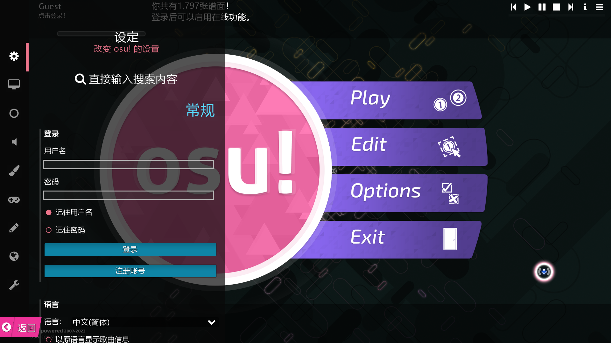

# 设置



在主菜单中，点击 `Options` 或者按 `O` （也可以按 `Ctrl` + `O`，几乎在所有界面都可以）可以打开设置侧栏，改变 osu! 可用的设置。打开菜单后，你可以打字搜索特定设置。如果没有搜索到结果，搜索栏的文字会摇晃。

当改变具有默认值的设置时，设置项左侧的灰色竖条会发出黄光。点击竖条可以将其恢复默认值。

## 常规


这一节主要是关于你的账户、语言和 osu! 更新的设置。

### 登录

如果你还没登录到游戏客户端，启动时就会自动打开设置菜单来提醒你登录。你可以按 `Esc` 键、点击返回按钮或转到歌曲选择页面忽略它。如果没有登录，客户端会将你标为“游客 (Guest) ”，你也无法获取在线分数、上传分数与玩[多人模式](/wiki/Client/Interface/Multiplayer)。

如果你是游客，则会显示以下设置：

| 名称 | 描述 | 类型 | 默认值 |
| :-- | :-- | :-- | :-- |
| `用户名` | 登录用户名的输入框。 | 文本 | *（空）* |
| `密码` | 登录密码的输入框。 | 密码 | *（空）* |
| `记住用户名` | 如果勾选了，客户端会记住输入的用户名。 | 复选框 | `启用` |
| `记住密码` | 如果勾选了，客户端会记住输入的密码，也会让你在客户端中保持登录状态。 | 复选框 | `禁用` |
| `登录` | 用给定信息登录 osu!。也可以在用户名或密码输入框中按`回车`键。 | 按钮 |  |
| `注册账号` | 打开[账户注册](/wiki/Registration)页面/ | 按钮 |  |

---

如果你已登录，会看到：

| 名称 | 描述 | 类型 |
| :-- | :-- | :-- |
| `哈喽，{username}。欢迎来到 osu!` | 显示用户菜单，见下。 | 按钮 |

---

如果你点击上述提示，会显示带如下按钮的菜单：

| 名称 | 描述 | 类型 |
| :-- | :-- | :-- |
| `1. 查看个人资料` | 在网页中查看个人资料。 | 按钮 |
| `2. 注销` | 从本客户端中注销 | 按钮 |
| `3. 修改头像` | 改变用户头像（会重定向到网站） | 按钮 |
| `4. 关闭` | 关闭对话框。也可以按 `Esc` 键。 | 按钮 |

点击你的用户卡片也可以打开此菜单。

### 语言

| 名称 | 描述 | 类型 | 默认值 |
| :-- | :-- | :-- | :-- |
| `语言` | 显示可供选择的语言列表。 | 下拉菜单 |  |
| `以原语言显示歌曲信息` | 如果可用，会在歌曲选择页面显示谱面原有（或未翻译）的元数据。 | 复选框 | `禁用` |
| `聊天窗口使用 Tahoma 字体` | 在[聊天面板](/wiki/Client/Interface/Chat_console)中使用旧字体 (Tahoma) 而非当前字体 (Aller)。 | 复选框 | `禁用` |

### 更新

| 名称 | 描述 | 类型 | 默认值 |
| :-- | :-- | :-- | :-- |
| `更新版本` | 显示想要使用的版本列表。 | 下拉菜单 | `Stable` |
| `osu! 已经是最新版！` | 点击这里来让客户端强制检查更新。如果有则下载更新。 | 按钮 |  |
| `打开 osu! 所在文件夹` | 打开本地 osu! 文件夹，存有你的皮肤、谱面等文件。 | 按钮 |  |

---

打开`更新版本`的下拉菜单后，会看到如下选项：

| 名称 | 描述 |
| :-- | :-- |
| `正式版（每月更新）` | 面向大众的稳定发行版。 |
| `候选版（每周更新）` | 开发版——较早获得新功能，但可能有 bug。 |
| `测试版（不定期更新）` | 开发版——更早获得新功能，但可能有大量 bug。 |

## 画面


This section is about the appearance of your game client, parts of the interface and video settings.

### 渲染器

| 名称 | 描述 | 类型 | 默认值 |
| :-- | :-- | :-- | :-- |
| `帧数限制` | Set the frame rate limit. See below for details. | 下拉菜单 | `Optimal` |
| `显示帧数 (FPS)` | Toggle the FPS counter. This is seen in the bottom-right corner of the screen. | 复选框 | `禁用` |
| `兼容模式` | Use the old renderer that osu! used before with older computers. This will restart your game client. | 复选框 | `禁用` |
| `减少掉帧` | Adjust graphical settings to decrease dropped/stuttered frames. | 复选框 | `禁用` |
| `检测到性能问题` | Warn you if another program on your computer may harm your client's performance. | 复选框 | `启用` |

---

*注意：When the game client is not the active window, the fps limit is dropped to 30fps automatically.*\
*使用笔记本电脑的玩家请注意：使用using `Unlimited (gameplay)` 可能会导致你的电脑过热！*

If you open the dropdown list for `Frame Limiter`, you will be presented with these options:

| 名称 | 描述 |
| :-- | :-- |
| `垂直同步` | Limits the game client to the refresh rate of your monitor. See explanation below for details. |
| `节能 (Power Saving)` | Limits the game client to twice the refresh rate of your monitor. |
| `最佳 (Optimal)` | Limits the game client to eight times the refresh rate of your monitor, capping at 960fps. |
| `无限制（游戏中）` | Limits the game client to the refresh rate of your monitor. See explanation below for details. |

- `VSync` explanation: In layman terms, using VSync will force the game wait for the entire frame to load before displaying it.
  - You may want to use this if you see some "tearing" (when the bottom portion of the game is lagging behind the upper portion of the game).
  - Despite what the point above stated, this may cause some lag or slowdowns because the game client has to wait for each frame to load.
- `Unlimited (gameplay)` explanation: Unlimited only applies to when you are playing a beatmap.
  - When you are not playing a beatmap, the frame rate is limited to twice the refresh rate of your monitor, or 240fps, whichever is higher.
  - This option is **not recommended**. Using the `Unlimited (gameplay)` option can lead to stutters.
  - Using the `Optimal` option instead offers imperceivable changes in system (input to output) latency when compared to `Unlimited (gameplay)`.

### 屏幕分辨率

| 名称 | 描述 | 类型 | 默认值 |
| :-- | :-- | :-- | :-- |
| `分辨率` | Set the game client resolution. The listed resolutions are limited to what your monitor/GPU supports. | 下拉菜单 |  |
| `全屏模式` | Run the game client in fullscreen (usually decreases input latency). | 复选框 | `启用` |
| `按本地分辨率渲染 (Render at native resolution)` | Use the full native resolution but will display osu! in a smaller centred portion of the screen. | 复选框 | `启用` |
| `水平位置` | Adjust horizontal offset for letterboxing mode. Only appears if `Render at native resolution` is enabled. | 滑块 | `0%` |
| `垂直位置` | Adjust vertical offset for letterboxing mode. Only appears if `Render at native resolution` is enabled. | 滑块 | `0%` |

- If `Fullscreen mode` is disabled, `非全屏模式下可能会有输入延迟！` will appear underneath it.

### 详细设置

| 名称 | 描述 | 类型 | 默认值 |
| :-- | :-- | :-- | :-- |
| `渐出滑条` | 滑块s will "snake out" from their starting position. | 复选框 | `启用` |
| `背景视频` | Allow the beatmap background video to play during gameplay (can be disabled per-beatmap). | 复选框 | `启用` |
| `故事板 (Storyboards)` | Allow beatmap storyboards to be played (can be disabled per-beatmap). | 复选框 | `启用` |
| `连击提示图` | Allow combo bursts to display upon reaching a combo milestone. | 复选框 | `禁用` |
| `击打闪光` | Display a subtle glow behind each hit explosion. Does not disable lighting during Kiai Time. | 复选框 | `启用` |
| `着色器效果` | Display, graphically speaking, concert-type effects. This may automatically be disabled if your computer cannot handle it. | 复选框 | `禁用` |
| `柔化滤镜` | Adjusts the shaders to be less flashy. This will automatically enable `Shaders`. | 复选框 | `禁用` |
| `截图格式` | Sets the screenshot file format. | 下拉菜单 | `JPEG （空间较小）` |

### 主菜单

| 名称 | 描述 | 类型 | 默认值 |
| :-- | :-- | :-- | :-- |
| `飘雪效果` | Show snow effects on the main menu (forcibly enabled during the winter). | 复选框 | `禁用` |
| `视差效果` | Show a slight parallax while navigating in-game menus (not during gameplay). | 复选框 | `启用` |
| `显示提示` | Show a tip every time you visit the main menu. (Tips are not displayed in the cuttingedge builds.) | 复选框 | `启用` |
| `问候语` | Play the "welcome" and "see ya" sounds upon opening and closing the game respectively. | 复选框 | `启用` |
| `osu! 主题音乐` | If enabled, the main theme song will play after the game client is opened. Once the song changes, you cannot play it again until the game client has been restarted. | 复选框 | `启用` |
| `季节性背景 (Seasonal backgrounds)` | Use fanart contest winners as the background in the main menu (and for beatmaps without background images). The images will cycle when the song is changed. | 下拉菜单 | `Sometimes` |

---

If you open the dropdown list for `Seasonal backgrounds`, you will be presented with these options:

| 名称 | 描述 |
| :-- | :-- |
| `偶尔显示 (Sometimes)` | You will see seasonal backgrounds for a few weeks at the beginning of each season. The osu!dev team will choose when they will be removed, replaced with more plain backgrounds you are used to. |
| `从不显示 (Never)` | You will never see seasonal backgrounds, and defaults will be used in all cases. |
| `总是显示 (Always)` | You will always have the current season's backgrounds. |

### 选歌页面

| 名称 | 描述 | 类型 | 默认值 |
| :-- | :-- | :-- | :-- |
| `显示缩略图` | Display a preview image of each beatmap's background. This requires the selected skin's version to 2.2+. | 复选框 | `启用` |

## 游戏


This section is about settings that affect gameplay.

### 常规

| 名称 | 描述 | 类型 | 默认值 |
| :-- | :-- | :-- | :-- |
| `背景暗化` | Adjust the level of dimming applied to the background and storyboard while playing (can be set per-beatmap). | 滑块 | `80%` |
| `休息时段不改变背景暗度 (Don't change dim level during breaks)` | Disable brightening the dim level during breaks, making the background never visible. | 复选框 | `禁用` |
| `进度条位置` | Configure where and how the song progress bar is displayed. See below for details. | 下拉菜单 | `Top-Right (Pie)` |
| `分数计模式` | Configure accuracy meter appearing below the beatmap. Note that osu!catch will always use `Colour`. | 下拉菜单 | `Hit error` |
| `分数计大小` | Configure size of score meter. | 滑块 | `1x` |
| `显示按键表示框` | Show the key status overlay even while playing normally. | 复选框 | `禁用` |
| `在 Hidden Mod 下显示第一个物件的缩圈` | When playing with the "hidden" mod, show only the first note's approach circle. | 复选框 | `启用` |
| `按 BPM 调整 osu!mania 下落速度` | Adjust speed of osu!mania's scrolling depending on the BPM of the beatmap. | 复选框 | `禁用` |
| `记住每张地图的 osu!mania 下落速度` | Remember the scroll speed you had set per-beatmap. | 复选框 | `禁用` |

---

If you open the dropdown list for `Progress Display`, you will be presented with these options:

| 名称 | 描述 |
| :-- | :-- |
| `右上角（饼状）` | Use a pie chart to show the remaining duration before the song starts and the time left before completion. This is seen left of the accuracy. |
| `右上角（条状）` | Use a short horizontal bar to display the time left before completion. This is seen underneath the score but above the accuracy. |
| `右下角` | Use a short horizontal bar to display the time left before completion. This is seen in the bottom-right corner. |
| `底部（长条）` | Use a long horizontal bar to display the time left before completion. This is seen on the bottom. |

---

If you open the dropdown list for `Score meter type`, you will be presented with these options:

| 名称 | 描述 |
| :-- | :-- |
| `无` | Do not use a meter to display the player's hit timing. |
| `色块模式` | Use coloured blocks to display hit timing. (osu!catch will always use this if `Hit error` is selected.) |
| `打击偏差` | Use a meter to display hit timing. This shows if the player had hit too early or too late. |

### 选歌页面

| 名称 | 描述 | 类型 | 默认值 |
| :-- | :-- | :-- | :-- |
| `最低显示星数` | This adjusts the **lowest** difficulty beatmap that will be displayed in song select. | 滑块 | `0 stars` |
| `最高显示星数` | This adjusts the **highest** difficulty beatmap that will be displayed in song select. | 滑块 | `10+ stars` |

## 音频


This section is about audio related options.

### 设备

| 名称 | 描述 | 类型 | 默认值 |
| :-- | :-- | :-- | :-- |
| `音频设备` | Select the preferred output device for audio. (Options given are based on what your computer reports.) | 下拉菜单 | `Default` |
| `兼容音频模式 (Audio compatibility mode)` | Uses the legacy audio engine which has higher latency but is more compatible. | 复选框 | `禁用` |

### 音量

| 名称 | 描述 | 类型 | 默认值 |
| :-- | :-- | :-- | :-- |
| `整体` | Controls the main volume. | 滑块 | `100%` |
| `音乐` | Controls the music volume. | 滑块 | `80%` |
| `音效` | Controls the hitsounds and in-game sounds. | 滑块 | `80%` |
| `禁用谱面自带音效` | Favour hitsounds supplied by the current skin instead of the beatmap's included hitsounds. | 复选框 | `禁用` |

The master, music, and effect volume can be changed elsewhere by pressing `Alt` and scrolling up or down or by pressing `Alt` and pressing `Up` or `Down`.

### 偏移量 (Offset) 调节

| 名称 | 描述 | 类型 | 默认值 |
| :-- | :-- | :-- | :-- |
| `全局偏移量 (Offset)` | The offset (in milliseconds) that all beatmaps will use (in addition to the local offset). | 滑块 | `0ms` |
| `偏移量(Offset) 设置向导` | Opens the offset wizard. | 按钮 |  |

- For details about the offset wizard, see [Offset Wizard](/wiki/Client/Options/Offset_Wizard).
- For details on using the offset wizard, see [How to use Offset Wizard](/wiki/Guides/How_to_Use_the_Offset_Wizard).

## 外观


This section is about skin related things.

### 皮肤

| 名称 | 描述 | 类型 | 默认值 |
| :-- | :-- | :-- | :-- |
| `皮肤示例图` | Display various gameplay elements from the selected skin. Click to cycle through different element sets. | 按钮 |  |
| `当前皮肤` | Changes the skin. Items in dropdown are based on what is in the `osu!/Skins` folder. (Names are based on folder name.) | 下拉菜单 | `Default` |
| `预览皮肤` | Previews the skin by playing a random beatmap with auto mod. Mode is determined on what was selected in song selection. | 按钮 |  |
| `打开皮肤文件夹` | Opens the selected skin folder. | 按钮 |  |
| `导出 .osk` | Exports the current skin as a `.osk` file to share. Once your game client is done exporting, it will open the directory containing the `.osk` file. | 按钮 |  |
| `忽略所有谱面自带的皮肤` | Favour the selected skin over the beatmap's included skin. This does not include hitsounds (see next option below). | 复选框 | `禁用` |
| `使用皮肤中的音效` | Always use the selected skin's hitsounds instead of the beatmap's included hitsounds. | 复选框 | `启用` |
| `太鼓模式中使用太鼓皮肤` | Use osu!taiko-specific skin elements, if supplied by the selected skin. See [皮肤设置ning/osu!taiko](/wiki/皮肤设置ning/osu!taiko) for details. | 复选框 | `禁用` |
| `总是使用皮肤中的光标` | Favour the current skin's cursor over any cursors supplied by beatmaps. | 复选框 | `禁用` |
| `光标大小` | Adjust the cursor size. | 滑块 | `1x` |
| `自动缩放光标` | Automatically adjusts the cursor size based on the circle size of the beatmap. | 复选框 | `禁用` |
| `拖球的颜色随滑条改变` | 滑块 balls will use the current combo colour (usually transparent). Requires skin support. | 复选框 | `启用` |

## 输入


This section is about input peripherals.

### 鼠标

| 名称 | 描述 | 类型 | 默认值 |
| :-- | :-- | :-- | :-- |
| `鼠标灵敏度` | Adjust the sensitivity of the mouse cursor. If changed, it may automatically enable `Raw 输入设置`. | 滑块 | `1x` |
| `原始输入 (Raw input)` | Read mouse/tablet positional values directly from the hardware, without any post-processing (this is to ignore mouse acceleration). | 复选框 | `禁用` |
| `绝对坐标只映射在 osu! 窗口中` | Confine input devices with absolute positioning (e.g. pen tablets) to the game client window only. | 复选框 | `禁用` |
| `开启光标边界` | Prevent mouse cursor from leaving the game client window. See below for details. | 下拉菜单 | `只在全屏模式时` |
| `在游戏中禁用鼠标滚轮` | Disable mouse wheel during gameplay. Using the mouse wheel can change the master volume value. | 复选框 | `禁用` |
| `在游戏中禁用鼠标按键` | Disable mouse buttons during gameplay. This is helpful for keyboard users. | 复选框 | `禁用` |
| `点击波纹` | Show subtle ripple effect when the mouse is clicked. | 复选框 | `禁用` |

- When `Raw 输入设置` is enabled, it will display the number of reports it receives per second and the latency in milliseconds.
- The cursor ripple effect can be triggered by pressing `M1` and `M2` during game play.

---

If you open the dropdown list for `Confine mouse cursor`, you will be presented with these options:

| 名称 | 描述 |
| :-- | :-- |
| `从不` | Never prevent the mouse from leaving the game client. |
| `只在全屏模式时` | Only prevent the mouse from leaving the game client when fullscreen (this also includes `Letterboxing`). |
| `总是` | Always prevent the mouse from leaving the game client in any resolution. |

### 键盘

| 名称 | 描述 | 类型 |
| :-- | :-- | :-- |
| `按键设置` | Displays a dialog which allows you to see or change your keyboard bindings. See [Keyboard Bindings](/wiki/Client/Options/Keyboard_bindings) for more details. | 按钮 |
| `osu!mania 键位排列` | Displays a dialog which allows you to see or change your osu!mania bindings. See [osu!mania layout](/wiki/Game_mode/osu!mania) for more details. | 按钮 |

### 其它

| 名称 | 描述 | 类型 | 默认值 |
| :-- | :-- | :-- | :-- |
| `强制启用触屏 / 数位板支持` | Improves compatibility with graphic tablets and tablet PCs. | 复选框 | `禁用` |
| `启动 Wiimote / TaTaCon 支持` | Enable support for Nintendo's Wii Taiko Drum controller and Wiimotes. Pair device via Bluetooth before enabling. | 复选框 | `禁用` |

## 编辑器


This section is about the [beatmap editor](/wiki/Client/Beatmap_editor).

These options only affect while working inside the beatmap editor or in test mode (test playing a beatmap).

### 常规

| 名称 | 描述 | 类型 | 默认值 |
| :-- | :-- | :-- | :-- |
| `背景视频` | Play the beatmap's background video while editing. | 复选框 | `禁用` |
| `使用默认皮肤` | Use osu!'s default skin while editing, despite the current skin's settings. | 复选框 | `禁用` |
| `渐出滑条` | Enable snaking sliders while editing. | 复选框 | `启用` |
| `击打动画` | Enable hit animations while editing. | 复选框 | `禁用` |
| `物件间轨迹 (Follow points)` | Enable follow points while editing. | 复选框 | `启用` |
| `堆叠效果` | Stack the hit circles as if in gameplay. | 复选框 | `启用` |

These options can be manually overwritten by using the `View` menu in the beatmap editor.

## 在线


This section is about chat, spectators, multi, and osu!direct.

### 提示与隐私

| 名称 | 描述 | 类型 | 默认值 |
| :-- | :-- | :-- | :-- |
| `聊天消息提示` | Display the most recent chat message at the bottom of the screen. The message that displays is from the current channel you are viewing. | 复选框 | `禁用` |
| `游戏中自动隐藏聊天窗口` | If chat is open during breaks or in-game menus, the game client will automatically hide it when gameplay starts again. | 复选框 | `启用` |
| `当其他玩家提到你的名字是弹出通知` | When someone [mentions your username](/wiki/Client/Interface/Chat_console/Highlight) in chat, a notification will appear. | 复选框 | `启用` |
| `显示新消息提醒` | Display a notification, when new chat messages arrive. | 复选框 | `启用` |
| `当其他人提到你的名字时播放音效` | When someone [mentions your username](/wiki/Client/Interface/Chat_console/Highlight) in chat, a sound will play. | 复选框 | `启用` |
| `显示你的所在城市或地区` | Share your city location in your user card (note that your country is already shared). | 复选框 | `禁用` |
| `显示旁观者` | Show a list of current spectators on the left of the screen during gameplay. | 复选框 | `启用` |
| `自动向观众发送图的下载地址` | Send currently-playing beatmap to `#spectator` channel when you have spectators. | 复选框 | `启用` |
| `游戏中实时显示通知` | Allow a push notification to display during gameplay. If disabled, the game client will wait until you are done playing. | 复选框 | `启用` |
| `显示好友上线/离线通知` | Display a notification, whenever your friend goes online or offline. | 复选框 | `启用` |
| `允许来自所有玩家的多人游戏邀请` | Allow multi game invites from anyone. Disabling this will limit multiplayer invites to friends only. | 复选框 | `启用` |

### 关联

| 名称 | 描述 | 类型 | 默认值 |
| :-- | :-- | :-- | :-- |
| `Discord Rich Presence` | Provides [rich presence data to Discord](/wiki/Guides/Discord_Rich_Presence). | 复选框 | `启用` |
| `关联到雅虎通状态` | Your Yahoo! messenger will show the song you are currently playing or listening to. This needs to be set from the website. | 复选框 | `禁用` |
| `关联到 MSN Live 状态` | Your Windows Live Messenger will show the song you are currently playing or listening to. | 复选框 | `禁用` |
| `自动开始 osu!direct 下载` | For [osu!supporters](/wiki/osu!supporter) only. When spectating or multiplaying, the beatmap will be downloaded automatically. | 复选框 | `启用` |
| `游戏内下载不带视频` | For [osu!supporters](/wiki/osu!supporter) only. osu!direct downloads will be confined to no-video versions of beatmaps. | 复选框 | `禁用` |

### 游戏内聊天

| 名称 | 描述 | 类型 | 默认值 |
| :-- | :-- | :-- | :-- |
| `过滤冒犯性词汇` | Replace offensive words with `*beep*`. | 复选框 | `禁用` |
| `过滤非英文字符` | Removes any non-standard ASCII characters in the chat. | 复选框 | `禁用` |
| `保存私聊记录` | Private messages will be saved to the `osu!/Logs` folder. | 复选框 | `禁用` |
| `只接收好友发来的私聊消息` | Enabling this will restrict private messages to friends only. | 复选框 | `禁用` |
| `屏蔽以下玩家的发言（以半角空格分隔）` | Words you put here will be ignored. | 文本 | *（空）* |
| `聊天高亮词汇（以半角空格分隔）` | Words you put here will be [highlighted](/wiki/Client/Interface/Chat_console/Highlight) in chat. | 文本 | *（空）* |

## 管理


This section is about beatmaps and updates.

### 常规

| 名称 | 描述 | 类型 |
| :-- | :-- | :-- |
| `删除所有非 Ranked 图` | Delete all unranked maps in your songs folder. | 按钮 |
| `修复文件夹权限` | Give read/write permission to the game client for access to its folders. (This will require the administrator password to complete.) | 按钮 |
| `将所有图标记为已玩过` | Mark all maps as "played". | 按钮 |
| `启动 osu! 更新程序` | Close the game client and open the updater to search for updates and download if any. | 按钮 |

At the bottom, the version number will be displayed. Clicking this will open the [changelog](/wiki/Changelog) for that version in your internet browser.

### 调试

#### 构建版本

See which build version the game client currently has and which type of build updates the game client receives. Clicking on this will direct you to the release notes using your preferred browser.

The builds are versioned using this versioning scheme:

```
b{YYYY}{MM}{DD}.{revision}{type}
```

- `{YYYY}` is the build year
- `{MM}` is the build month
- `{DD}` is the build day
- `{revision}` is the build revision
  - If there is no build revision number, the decimal point will be removed.
- `{type}` is the build type
  - If there is no build type value, assume it is `Stable`.

## 杂项

- If you type in a username but leave the password textbox empty, osu! will use that name when saving the score locally.
- Opening the options sidebar will automatically trigger `osu! is up-to-date!`'s function (it will begin checking for updates).
- The `Seasonal backgrounds` option was added after positive feedback was given to the osu!dev team.
  - More details: [main menu background changes](https://osu.ppy.sh/community/forums/topics/606931)

### 历史

- The old options screen was an actual screen that had tabs, buttons, and a dark pale blue background.
- The old options screen also featured a skin selection screen that also allows you to preview live play of a beatmap in osu!.
  - After the options screen was moved over to a sidebar, this screen was still accessible by opening a skin file.
  - Access to this was later removed after skin previews and the live preview functions came to be.
