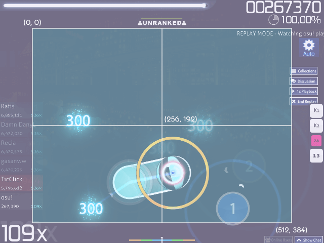
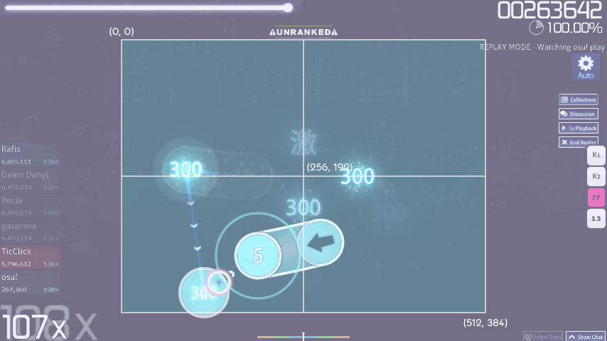

---
tags:
  - play field
  - game field
  - gamefield
  - gamepixel
  - game pixel
  - osupixel
  - osu!pixel
  - osu! pixel
  - coordinate system
  - screen
  - 游戏区域
  - 游玩区域
  - 坐标系统
---

# 游戏区域

游戏区域是游戏窗口中[打击物件](/wiki/Gameplay/Hit_object)所放置的区域。在 4:3 的屏幕比例中，部分游戏区域会被[界面](/wiki/Client/Interface)元素遮挡，比如排行榜、按键计数器、[回放](/wiki/Gameplay/Replay)面板等等。

## 游戏机制

::: Infobox

:::

::: Infobox

:::

游戏区域的坐标系统使用独立于分辨率的单位，称为**游戏像素**（*game pixels，或 osu! pixels*）。单位游戏像素的尺寸等于 osu! 以 640x480 分辨率运行时的像素尺寸。更高的分辨率上，游戏像素的尺寸在视觉上是相同的。游戏区域在垂直方向略微偏移，比游戏窗口低 8 个游戏像素。

[谱面编辑器](/wiki/Client/Beatmap_editor)网格的尺寸为 512x384 游戏像素。

| 游戏区域左上角 | 游戏区域右下角 | 游戏区域中点 |
| :-- | :-- | :-- |
| (0, 0) | (512, 384) | (256, 192) |

可以通过编辑 [`.osu` 文件](/wiki/Client/File_formats/osu_(file_format))或[堆叠度](/wiki/Beatmap/Stack_leniency)控制的自动堆叠将打击物件放在游戏区域之外。但是这样在 4:3 屏幕比例上会导致游戏元素超出屏幕，违反了[上架标准](/wiki/Ranking_criteria)。

注意，谱面编辑器的游戏区域是缩小过的，与游玩时的背景并不对齐；将物件对齐和背景图、故事板或视频时，一定要记得看一眼游玩时是什么样子。

## 故事板

故事板使用的坐标系统的原点稍有不同，不过尺寸和游戏区域的坐标系统相同（即单位像素的尺寸相同）。

| 屏幕比例 | 界面左上角 | 界面右下角 | 界面中点 | 显示分辨率 |
| :-- | :-- | :-- | :-- | :-- |
| **4:3** | (0, 0) | (640, 480) | (320, 240) | 640x480 |
| **16:9** | (-107, 0) | (747, 480) | (320, 240) | 854x480 |

从游戏区域的坐标转换成故事板的坐标，只需加一个 (64,56) 的偏移向量，得到故事板坐标系统的左上角位置。
