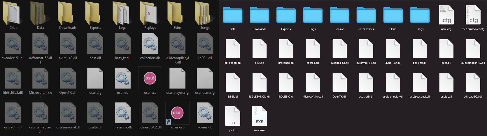

# osu!-Programmdateien

*Siehe auch: [osu!-Dateiformate](/wiki/Client/File_formats)*

Die **osu!-Programmdateien** sind eine Reihe von Dateien, die für die Ausführung von osu! erforderlich sind und die verschiedenen Aktivitäten des Benutzers speichern.

## Installationspfade

Standardmäßig ist osu! an den folgenden Orten installiert:

| Windows | macOS |
| :-- | :-- |
| `C:\Users\<Benutzername>\AppData\Local\osu!` | `/Applications/osu!.app/Contents/Resources/drive_c/osu!` |

## Ordner

### Chat

Der Ordner Chat erscheint nur, wenn der Spieler "Private Nachrichten automatisch speichern" in den Optionen aktiviert hat oder der Spieler den Befehl "/savelog" in der [Chatkonsole](/wiki/Client/Interface/Chat_console) eingibt.

Die Namensstruktur einer Datei ist `{Name des Tabs}-{YYYYMMDD}-{HHMMSS}` und kann in jedem Texteditor geöffnet werden. Ein Beispiel ist unten zu sehen:

`#multiplayer-20121115-040845` (/savelog im Tab #multiplayer am 15. November 2012 um 4 Uhr, 8 Minuten und 45 Sekunden).

### Downloads

Der Ordner Downloads beinhaltet die über osu!direct heruntergeladenen Beatmaps (erfordert [osu!supporter](/wiki/osu!supporter)). Sie werden nach Abschluss in den Ordner Songs verschoben.

### Exports

Der Ordner Exports erscheint, wenn Spieler die Funktion ["Als .osk exportieren" in der Skinauswahl](/wiki/Client/Options) oder ["Packet exportieren" im Beatmap-Editor](/wiki/Client/Beatmap_editor/Menu) anwählen. Er enthält die vom Spieler exportierten Beatmaps und Skins.

### Localisation

Der Ordner Localisation erscheint, wenn der Spieler seine Sprache in den Einstellungen ändert. Dort werden die übersetzten Textdateien gespeichert, die jeweils verwendet werden können, um den englischen Text auf der Grundlage der vom Benutzer gewählten Lokalisierung zu ersetzen. Beim Wechsel der Sprache werden die übersetzten Textdateien generiert.

### Replays

*Anmerkung: Replays wurden früher mit einer niedrigeren Samplingrate wiedergegeben, aber sind jetzt für ein besseres Spielerlebnis optimiert.*

Der Ordner Replays bewahrt die Replay-Dateien des Spielers auf. Eine Replay-Datei funktioniert nicht, wenn die verlinkte Beatmap fehlt. Das Replay enthält die Ergebnisdaten und stellt die Cursorbewegung des Spielers während des Ansehens nach. Um ein Replay zu erstellen, drücke F2 in der Ergebnisanzeige oder klicke auf 'Save replay to Replays folder' (nur im Einzelspielermodus verfügbar).

*Für Spieler, die daran interessiert sind, ihr Replay auf YouTube hochzuladen, siehe: [Osr2mp4 public release. Automatically convert replay file to video.](https://osu.ppy.sh/community/forums/topics/1104243)*

Die Namensstruktur einer Datei ist `{Lokaler Spielername} - {Künstler} - {Titel} {[Schwierigkeitsgrad]}{(YYYY-MM-DD)} {Spielmodus}`. Ein Beispiel ist unten zu sehen:

`dummytest1 - Loituma - Ievan Polkka \[SPINNER-MADNESS\] (2013-08-12) OsuMania`

### Screenshots

Der Ordner Screenshots enthält Screenshots, die der Spieler in osu! erstellt hat. Standardmäßig ist die gespeicherte Screenshot-Datei im Format `.jpg`, dies kann jedoch im Optionsmenü auch zu `.png` geändert werden.

*Anmerkung: Um einen Screenshot zu erstellen, drücke die Screenshot-Taste (standardmäßig F12).*

Die Namensstruktur einer Datei ist `screenshot###`, wobei "###" die Anzahl der Screenshots ist.

### Skins

Der Ordner Skins verwaltet vom Nutzer angelegte Skins, die dazu verwendet werden können, die Benutzeroberfläche im Spiel anzupassen. Spieler können Skins aus dem [Skinning-Subforum](https://osu.ppy.sh/community/forums/15) herunterladen. Durch Doppelklicken in einem Dateimanager können die Skins installiert werden. "osu! by peppy" ist der einzige Skin ohne einen Ordner und kann nicht gelöscht werden.

*Für weitere Informationen, siehe [Skinning](/wiki/Skinning).*

### Songs

Der Ordner Songs speichert die osu!-Beatmaps des Spielers. Er enthält in der Regel Dateien mit den Formaten `.osu` (Schwierigkeitslevel), `.mp3`/`.ogg` (Musikdateien), `.jpg`/`.png`/`.gif` (Hintergrundbilder), `.osb` (Storyboard-Dateien) und `.mp4`/`.flv` (Videodateien). Auch können Dateien mit dem Format `.wav`/`.ogg` (Hitsound-Dateien) und Ordner (Storyboard-Sprites und/oder Skin-Ordner) vorhanden sein.

Die Namensstruktur einer Datei ist `{Beatmap-ID} {Künstler} - {Songtitel}`.
**Beispiel:** [57950 SOUND HOLIC - Drive My Life](https://osu.ppy.sh/beatmapsets/57950)

Bitte beachte, dass einige sehr alte Beatmaps (zum Beispiel [Kenji Ninuma - DISCO PRINCE](https://osu.ppy.sh/beatmapsets/1) oder [Dudelstudios - Angry Video Game Nerd Theme [MATURE CONTENT]](https://osu.ppy.sh/beatmapsets/66)), sowie nicht eingereichte Beatmaps, nicht diesem Format folgen.

## Versteckte Ordner

Diese Ordner werden ausgeblendet, weil jede Änderung dazu führen könnte, dass osu! nicht mehr richtig oder überhaupt nicht mehr startet.

### Data

Die Datenbestände von osu!. Enthält den Cache von osu!, wie beispielsweise zu Beatmap-Hintergründen und Avataren. Der Cache sollte nicht gelöscht werden, da er möglicherweise von osu! verwendet wird.

## Dateien

*Vorsicht: Sei vorsichtig bei diesen Dateien! Du könntest osu! kaputt machen, wenn du nicht behutsam damit umgehst.*

### Datenbankdateien (.db)

Die Datenbankdateien sind Datenbanken, die osu! benötigt, um richtig zu funktionieren. Die Dateien enthalten wesentliche Informationen, die osu! braucht, wie zum Beispiel hinterlegte Scores und die zwischengespeicherte Liste der Beatmaps, die auf dem Gerät des Spielers vorhanden sind.

- `collections.db`: Verwaltet die Sammlungen des Spielers im Spiel.
- `osu!.db`: Speichert die Beatmap-Datenbank von osu!.
- `presence.db`: Führt einen Cache der osu!-Spieler, die in der Chatkonsole eingeloggt sind.
- `scores.db`: Enthält die lokalen Bestenlisten.

### .cfg (Konfigurationsdateien)

Konfigurationsdateien stellen die Standardeinstellungen bereit, damit osu! funktioniert. Die Dateien können mit einem Texteditor geöffnet werden.

- `osu!.cfg`: Speichert Sicherheitsinformationen über die osu!-Anwendungsdateien und die aktuelle Updatequelle. Dies sollte niemals manuell bearbeitet werden.
- `osu!.<Benutzername im Betriebssystem>.cfg`: Speichert Daten zu den [Optionen](/wiki/Client/Options) und anderen Spieleinstellungen (siehe [Nutzerkonfigurationsdatei](/wiki/Client/Program_files/User_configuration_file)).

### .exe (Anwendung)

Das Kernstück. Klicke darauf, um es zu starten (gilt nur für Windows). Die .exe-Dateien können ohne Bedenken geöffnet werden, vorausgesetzt, es wurde das osu!-Installationsprogramm von der offiziellen Webseite verwendet.

osu!.exe (Starte osu!)

### .dll (Anwendungserweiterung)

Diese .dll-Dateien sind die Komponenten und Dependencies von osu!.
