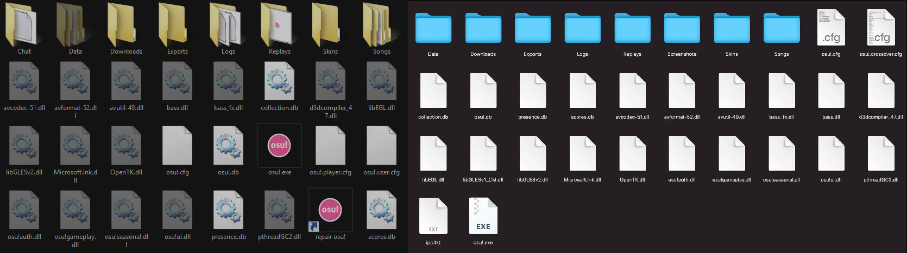

# osu! program files

::: alert-note
**See also:** [osu! file formats](/wiki/Client/File_formats)
:::

The **osu! program files** are a set of files that osu! uses to run the game and keep track of different user activities. These files come prepackaged with osu!'s installation and are crucial for the game's routine operations.

## Location

All of osu!'s program files are present in the game's [installation folder](/wiki/Client/Installation), which by default can be found in the following locations:

| Windows | macOS |
| :-- | :-- |
| `C:\Users\<Username>\AppData\Local\osu!` | `/Applications/osu!.app/Contents/Resources/drive_c/osu!` |

## Files

::: alert-caution
**Caution**
Be careful when dealing with these files manually, as you might break osu! if you are not careful.
:::

### .cfg (Configuration files)

Configuration files are files that regulate the initial settings for osu! upon launch. Unlike the other program files, these files are human-readable and can be opened (and modified) by using a text editor.

| File name | Function |
| --: | :-- |
| `osu!.cfg` | Stores security information about the osu! application files and the current release stream (*Note: The contents of this file should never be modified manually unless absolutely necessary*) |
| `osu!.<operating system username>.cfg` | Stores [Options](/wiki/Client/Options) data and other game settings (*See also: [User configuration file](/wiki/Client/Program_files/User_configuration_file)*) |
| `tournament.cfg` | Stores data related to [osu!tourney](/wiki/osu!_tournament_client/osu!tourney) and the [osu! tournament client](/wiki/osu!_tournament_client) |

### .db (Database files)

Database files are databases that osu! requires to function properly. These files contain vital information that are necessary for the game, such as saved scores and the cached list of beatmaps saved on the player's device.

| File name | Function |
| --: | :-- |
| `collections.db` | Stores the player's beatmap collections in-game |
| `osu!.db` | Stores osu!'s database of beatmaps |
| `presence.db` | Stores the list of players logged into the chat console in a form of a cache |
| `scores.db` | Stores the player's local leaderboards |

### .dll (Application extension)

.dll files, or [dynamic link-library](https://en.wikipedia.org/wiki/Dynamic-link_library) files, are files that constitute osu!'s components and dependencies. Except for the .dll files that are attributed to osu!, these files all originated from a third-party source and were subsequently integrated into the game's framework.

| File name | Function |
| --: | :-- |
| `avcodec-51.dll` | Allows osu! to encode/decode audio and video files |
| `avformat-52.dll` | Allows osu! to read different audio and video formats |
| `avutil-49.dll` | Provides core utilities for osu! to handle the processing of multimedia files |
| `bass.dll` | Allows osu! to play and record `.mp3` and `.ogg` audio files |
| `bass_fx.dll` | An add-on for the `bass.dll` that allows osu! to do signal processing functions, such [tempo](/wiki/Music_theory/Tempo) quantisation and reverse playback |
| `d3dcompiler_47.dll` | Allows osu!'s shader codes to be processed by the player's GPU/graphics card |
| `libEGL.dll` | Allows osu!'s display to be natively rendered over different operating systems |
| `libEGLESv2.dll` | Helps osu! in processing hardware-accelerated 3D graphics rendering |
| `Microsoft.lnk.dll` | Shared code module that osu! uses to perform certain system tasks parallel with other applications |
| `OpenTK.dll` | Allows osu! to utilize various [OpenGL](https://en.wikipedia.org/wiki/OpenGL) functions such as keyboard and mouse tracking |
| `osu!auth.dll` | Handles osu!'s client-side player authorisation |
| `osu!gameplay.dll` | Various modules related to osu!'s gameplay features |
| `osu!seasonal.dll` | Stores information related to osu!'s seasonal backgrounds |
| `osu!ui.dll` | Various modules related to osu!'s user interface display |
| `pthreadgc2.dll` | Allows osu! to use [multithreading support](https://en.wikipedia.org/wiki/Multithreading_(computer_architecture)) |

### .exe (Application files)

Application files are osu!'s main user-facing components. These files are safe to run assuming the player obtained the game from the official [download page](https://osu.ppy.sh/home/download).

| File name | Function |
| --: | :-- |
| `osu!.exe` | Boots up osu! |
| `osume.exe` | Allows players to update and repair osu! installations manually (*Note: Has been deprecated in favor of `osu!.exe`'s own built-in updater*) |

## Folders

### Chat

The Chat folder stores the logs of chats that have been saved by the user. This folder will only appear if the player has the `Automatically log private messages` options enabled, or if they have run the `/savelog` command in the [chat console](/wiki/Client/Interface/Chat_console) at least once.

Chat logs are named following the `{Tab_name}-{YYYYMMDD}-{HHMMSS}` format, and are preserved in a plain text (`.txt`) format that can be opened in any text editor. For example, a chat log with the name 
``#multiplayer-20121115-040845.txt`` indicates that it comes from a `#multiplayer` chat and was saved on Thursday, 15 November 2012 at 04:08:45 local time.

### Downloads

The Downloads folder stores the beatmap files that are in the process of being downloaded by [osu!direct](/wiki/osu!supporter#osu!direct) (requires [osu!supporter](/wiki/osu!supporter)). These beatmap files will be transferred to the Songs folder once the download is finished.

### Exports

The Exports folder stores the beatmaps and skins the player has exported from the game client. This folder will only appear if the player has used the [skin selector's "Export as .osk"](/wiki/Client/Options) or [beatmap editor's "Export Package"](/wiki/Client/Beatmap_editor/Menu) option at least once.

### Localisation

The Localisation folder stores the files that are used to replace the game's English texts to the user's selected language. This folder will only appear if the player has switched their language in the options at least once.

### Replays

::: alert-notice
**Notice**
Certain older replay files may not play as smoothly during playback, as they were recorded at a lower sample rate.
:::

The Replays folder stores the player's replay files, which contains the play's results data and the player's cursor movement during gameplay. These replay files can be generated by pressing `F2` or clicking on `Save replay to Replays folder` at the results screen, and cannot be played when the beatmaps linked to it is missing.

Replays are named following the `{Local player name} - {Artist} - {Title} {[Difficulty]}{(YYYY-MM-DD)} {Game Mode}` format. For example, a replay with the name `dummytest1 - Loituma - Ievan Polkka [SPINNER-MADNESS] (2013-08-12) OsuMania` indicates that it comes from a play of the beatmap "[Loituma - Ievan Polkka](https://osu.ppy.sh/beatmapsets/36323)" on Monday, 12 August 2013 in the osu!mania game mode.

### Screenshots

The Screenshots folder stores the screenshots the player has created in osu!. These screenshots can be captured in-game at any window by pressing the screenshot key (F12 by default).

Screenshots are named following the `screenshot###` format, where "###" is the screenshot number count. By default, all screenshots taken will be saved as `.jpg`, although this can be changed to `.png` in the Options menu.

### Skins

::: alert-note
**See also:** [Skinning](/wiki/Skinning)
:::

The Skins folder stores user-created skins, which can be used to customise the in-game interface. Players can download skins as `.osk` files from the [Skinning subforum](https://osu.ppy.sh/community/forums/15) and install them by double-clicking on it from a file manager application.

Please note that the default skin that comes with the game, "osu! by peppy", does not have its own folder and cannot be deleted.

### Songs

The Songs folder stores the player's osu! beatmaps, which by itself contains `.osu` (difficulties), `.mp3`/`.ogg` (audio), and `.jpg`/`.png`/`.gif` (background) files at the very least. Certain beatmaps may also include `.wav`/`.ogg` (hitsound), `.osb` (storyboard), and `.mp4`/`.flv` (video) files as well as some additional sub-folders for storyboard assets and/or custom beatmap skins.

By default, beatmap folders are named following the `{Beatmap number} {Artist} - {Song Title}` format. For example, a beatmap folder with the name `57950 SOUND HOLIC - Drive My Life` indicates that it is belongs to the beatmap "[SOUND HOLIC - Drive My Life](https://osu.ppy.sh/beatmapsets/57950)". Please note that certain very old beatmaps (as well as unsubmitted beatmaps) do not necessarily follow this format.

## Hidden folders

The following folder is hidden because any modifications made to it could prevent osu! from starting correctly (or at all).

### Data

The Data folder stores some of osu!'s most important system files. It also contains some of osu!'s cache files, such as the beatmap background cache and the avatar caches. These files should **not** be deleted while osu! is running, as they may be in use by osu! at any point.
