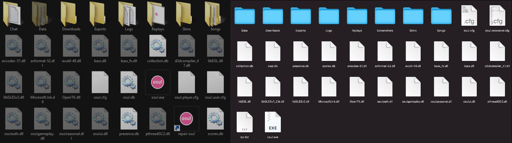

# ไฟล์โปรแกรมของ osu! (osu! program files)

*ดูเพิ่มเติม: [รูปแบบไฟล์ของ osu!](/wiki/Client/File_formats)*

**ไฟล์โปรแกรมของ osu!** คือชุดไฟล์ที่ใช้ในการรันตัวเกม osu! และใช้สำหรับบันทึกกิจกรรมต่างๆ ในขณะที่ผู้เล่นกำลังเล่นเกม

## ตำแหน่งที่ติดตั้ง (Installation paths)

โดยปกติแล้ว osu! จะถูกติดตั้งไว้ที่ตำแหน่งดังนี้:

| Windows | macOS |
| :-- | :-- |
| `C:\Users\<Username>\AppData\Local\osu!` | `/Applications/osu!.app/Contents/Resources/drive_c/osu!` |

## โฟลเดอร์ (Folders)

### Chat

โฟลเดอร์ Chat จะปรากฏขึ้นก็ต่อเมื่อผู้เล่นเปิดใช้งานตัวเลือก "Automatically log private messages" ในเมนู Options หรือผู้เล่นพิมพ์คำสั่ง "/savelog" ใน [หน้าต่างแชท (Chat Console)](/wiki/Client/Interface/Chat_console)

โครงสร้างชื่อไฟล์คือ `{ชื่อแถบแชท}-{YYYYMMDD}-{HHMMSS}` และสามารถเปิดอ่านได้ด้วยโปรแกรมแก้ไขข้อความทั่วไป ตัวอย่างเช่น:

`#multiplayer-20121115-040845` (ไฟล์บันทึกจากคำสั่ง /savelog ในแถบ #multiplayer เมื่อวันที่ 15 พฤศจิกายน 2012 เวลา 04:08:45 น.)

### Downloads

โฟลเดอร์ Downloads ใช้สำหรับเก็บไฟล์ Beatmap ที่กำลังดาวน์โหลดผ่าน osu!direct (เฉพาะผู้ที่มี [osu!supporter](/wiki/osu!supporter)) เมื่อดาวน์โหลดเสร็จสิ้น ไฟล์จะถูกย้ายไปยังโฟลเดอร์ Songs โดยอัตโนมัติ

### Exports

โฟลเดอร์ Exports จะปรากฏขึ้นหากผู้เล่นใช้คำสั่ง "Export as .osk" ในเมนูเลือก Skin หรือใช้คำสั่ง "Export Package" ในตัวแก้ไข Beatmap โดยจะเป็นที่เก็บไฟล์แมพและสกินที่คุณส่งออกมาจาก osu!

### Localisation

โฟลเดอร์ Localisation จะปรากฏขึ้นเมื่อผู้เล่นเปลี่ยนภาษาในเมนูการตั้งค่า ภายในจะเก็บไฟล์ข้อความแปลภาษาต่างๆ ที่ใช้แทนที่ข้อความภาษาอังกฤษดั้งเดิมตามภาษาที่ผู้เล่นเลือก ไฟล์เหล่านี้จะถูกสร้างขึ้นเมื่อคุณสลับภาษา

### Replays

*หมายเหตุ: ในสมัยก่อนไฟล์ Replay จะถูกบันทึกด้วยความละเอียดที่ต่ำกว่าปัจจุบัน แต่ตอนนี้ได้รับการปรับปรุงให้ดีขึ้นมากแล้ว*

โฟลเดอร์ Replays ใช้เก็บไฟล์บันทึกการเล่นของผู้เล่น ไฟล์ Replay จะใช้งานไม่ได้หากไม่มีไฟล์ Beatmap ที่เกี่ยวข้องอยู่ในเครื่อง ไฟล์นี้บรรจุข้อมูลผลคะแนนและแอนิเมชันการเคลื่อนที่ของเคอร์เซอร์ในขณะเล่น คุณสามารถสร้างไฟล์ Replay ได้โดยการกดปุ่ม F2 ในหน้าสรุปผลคะแนน หรือคลิกปุ่ม 'Save replay to Replays folder' (เฉพาะโหมด Solo)

โครงสร้างชื่อไฟล์คือ `{ชื่อผู้เล่นในเครื่อง} - {ศิลปิน} - {ชื่อเพลง} {[ความยาก]}{(YYYY-MM-DD)} {โหมดเกม}` ตัวอย่างเช่น:

`dummytest1 - Loituma - Ievan Polkka [SPINNER-MADNESS] (2013-08-12) OsuMania`

### Screenshots

โฟลเดอร์ Screenshots ใช้เก็บภาพหน้าจอที่ผู้เล่นถ่ายไว้ในเกม โดยค่าเริ่มต้นไฟล์จะเป็นนามสกุล `.jpg` แต่สามารถเปลี่ยนเป็น `.png` ได้ในเมนูการตั้งค่า

*หมายเหตุ: ถ่ายภาพหน้าจอได้โดยการกดปุ่ม F12 (ค่าเริ่มต้น)*

โครงสร้างชื่อไฟล์คือ `screenshot###` โดย "###" คือลำดับหมายเลขของภาพ

### Skins

โฟลเดอร์ Skins ใช้เก็บ Skin ที่ผู้เล่นสร้างขึ้นหรือดาวน์โหลดมาเพื่อปรับแต่งอินเทอร์เฟซในเกม ผู้เล่นสามารถดาวน์โหลด Skin ได้จาก [ฟอรัมเกี่ยวกับ Skin](https://osu.ppy.sh/community/forums/15) และติดตั้งได้ง่ายๆ เพียงดับเบิลคลิกไฟล์สกินจากในโฟลเดอร์ Skin "osu! by peppy" เป็นสกินเดียวที่ไม่มีโฟลเดอร์ของตัวเองและไม่สามารถลบได้

*ดูรายละเอียดเพิ่มเติมที่: [การทำ Skin (Skinning)](/wiki/Skinning)*

### Songs

โฟลเดอร์ Songs คือที่เก็บ Beatmap ทั้งหมดของผู้เล่น โดยปกติจะประกอบด้วยไฟล์ `.osu` (ระดับความยาก), `.mp3`/`.ogg` (ไฟล์เพลง), `.jpg`/`.png`/`.gif` (ภาพพื้นหลัง), `.osb` (ไฟล์ Storyboard) และ `.mp4`/`.flv` (ไฟล์วิดีโอ) นอกจากนี้อาจมีไฟล์ `.wav`/`.ogg` (Hitsound) และโฟลเดอร์ย่อยสำหรับรูปภาพประกอบ Storyboard

โครงสร้างชื่อไฟล์คือ `{รหัสชุดแมพ} {ศิลปิน} - {ชื่อเพลง}`
**ตัวอย่าง:** [57950 SOUND HOLIC - Drive My Life](https://osu.ppy.sh/beatmapsets/57950)

โปรดทราบว่าแมพที่เก่ามากบางอัน หรือแมพที่ยังไม่ได้ส่งขึ้นระบบ อาจจะไม่ได้ใช้รูปแบบชื่อไฟล์ตามข้างต้น

## โฟลเดอร์ที่ถูกซ่อนไว้ (Hidden folders)

โฟลเดอร์เหล่านี้ถูกซ่อนไว้เนื่องจากการแก้ไขไฟล์ภายในอาจทำให้ osu! ทำงานผิดพลาดหรือเปิดไม่ติด

### Data

เก็บไฟล์ข้อมูลของ osu! เช่น แคชของภาพพื้นหลังแมพ และแคชของรูปโปรไฟล์ผู้ใช้ ไม่ควรลบไฟล์ในนี้เนื่องจาก osu! อาจกำลังเรียกใช้งานอยู่

## ไฟล์ต่างๆ (Files)

*ข้อควรระวัง: โปรดระมัดระวังในการแก้ไขไฟล์เหล่านี้ เพราะอาจทำให้ osu! เสียหายได้*

### ไฟล์ฐานข้อมูล (.db)

เป็นไฟล์ที่ osu! จำเป็นต้องใช้เพื่อให้ระบบทำงานได้ถูกต้อง ภายในบรรจุข้อมูลสำคัญ เช่น คะแนนที่บันทึกไว้ และรายชื่อ Beatmap ที่มีอยู่ในเครื่อง

- `collections.db`: เก็บข้อมูล "ชุดสะสมเพลง" (Collections)
- `osu!.db`: ฐานข้อมูลหลักของ Beatmap ทั้งหมดในเครื่อง
- `presence.db`: แคชรายชื่อผู้เล่นที่ปรากฏในหน้าต่างแชท
- `scores.db`: เก็บข้อมูลตารางคะแนนในเครื่อง (Local leaderboards)

### ไฟล์ตั้งค่า (.cfg)

ใช้สำหรับกำหนดค่าเริ่มต้นในการทำงานของ osu! สามารถเปิดอ่านได้ด้วยโปรแกรมแก้ไขข้อความ

- `osu!.cfg`: เก็บข้อมูลความปลอดภัยเกี่ยวกับไฟล์โปรแกรมและสายการพัฒนาที่ใช้ ห้ามแก้ไขไฟล์นี้ด้วยตนเองโดยเด็ดขาด
- `osu!.<ชื่อผู้ใช้ในเครื่อง>.cfg`: เก็บข้อมูลการตั้งค่าจากเมนู [Options](/wiki/Client/Options) และการตั้งค่าเกมอื่นๆ ดูรายละเอียดที่ [ไฟล์ตั้งค่าผู้ใช้ (User Configuration File)](/wiki/Client/Program_files/User_configuration_file)

### ไฟล์โปรแกรม (.exe)

เป็นส่วนประกอบหลักสำหรับรันตัวเกม (เฉพาะบน Windows)

- `osu!.exe`: ไฟล์สำหรับเริ่มโปรแกรม osu!

### ไฟล์ส่วนขยาย (.dll)

ไฟล์นามสกุล .dll คือส่วนประกอบและไฟล์อ้างอิงที่จำเป็นสำหรับการทำงานของโปรแกรม osu!
