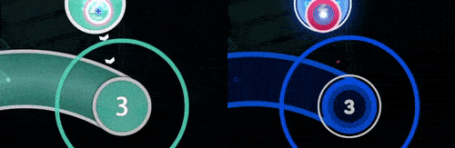
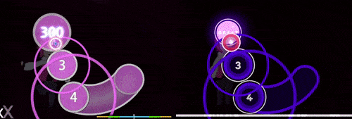
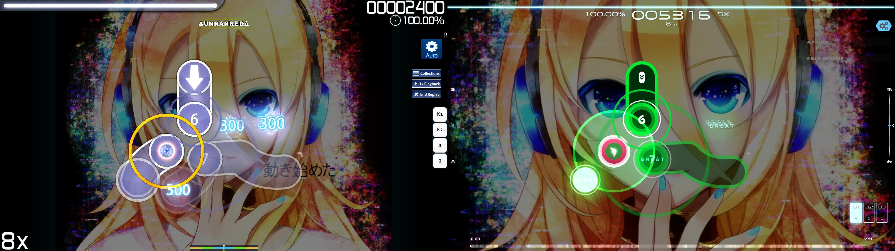
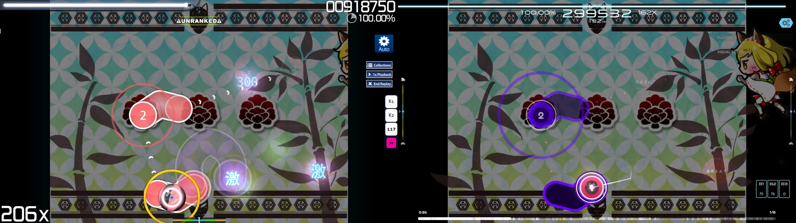

# osu!(lazer) feature comparison

*For a more condensed list of features, see [Help centre/Upgrading to lazer § Feature comparison](/wiki/Help_centre/Upgrading_to_lazer#feature-comparison)*

This page documents all new and missing features compared to osu!(stable), as well as differences affecting gameplay.

## New features

- Cross-platform support
  - Native Windows 8.1+, macOS, Linux, iOS, and Android support, 
  - Mobile input methods for all game modes
- Input
  - Built-in tablet driver
  - Midi controller support
  - Gamepad support
- Redesigned interface
  - First-run setup wizard
  - Storyboards in the main menu
  - Rewind F2
  - Hiding difficulties
  - Soft deletion
  - More screen scaling options
  - Settings can be changed everywhere and they'll take effect immediately
  - New statistics in the results and song select screens
- Website integration for leaderboards, news, wiki, changelog, beatmap listing, beatmap info, and profile pages
- Lots of new mods
- Mod customisation options
- New multiplayer features
  - New "playlist" feature
  - Unlimited lobby sizes
  - Automatic beatmap queues
- New editor features
  - Per-segment curve types for sliders
  - Slider splitting and merging
  - New "verify" tab
- Support for custom game modes
- Gameplay
  - Two new built-in skins
  - Replay seeking
  - Beatmap (local) offset auto-calibration
- Built-in skin editor with customisable skinning components 
  - Song density graph
  - Performance points counter
  - Unstable rate counter
  - Longest combo counter
  - Custom text components, beatmap information displays
  - Custom static sprites
  - Judgement counter
  - Clicks per second counter
- Snaking out sliders in the osu! mode
- No black bar behind the playfield in osu!taiko
- Timing-based note colouring in osu!mania

## Gameplay differences 

### General

#### Song playback ramps up and down when pausing and unpausing

This makes it harder to continue from a pause in the middle of active gameplay, preventing abuse of pausing to some extent.

|  |  |
| :-- | :-: |
| Breaks backwards compatibility | No |
| Classic mod revert support | No |
| Intentionally changed | Yes |
| Needs further consideration | Yes |

#### The Easy mod no longer pauses gameplay when recovering from failure

<!-- paragraph? -->

|  |  |
| :-- | :-: |
| Breaks backwards compatibility | No |
| Classic mod revert support | No |
| Intentionally changed | No |
| Needs further consideration | Yes |

#### The health system is different

This is mostly due to changes to the judgement system. For example, Geki and Katu judgements do not exist in lazer, which affected health on stable.

|  |  |
| :-- | :-: |
| Breaks backwards compatibility | Yes |
| Classic mod revert support | No |
| Intentionally changed | Yes |
| Needs further consideration | Yes |

#### All game modes use the same grading system

All game modes use a grading system similar to the one in osu!mania on stable (c.f. [Grade](/wiki/Gameplay/Grade)).

| Grade | Condition |
| :-: | :-- |
| SS | 100% accuracy |
| S | At least 95% accuracy |
| A | At least 90% accuracy |
| B | At least 80% accuracy |
| C | At least 70% accuracy |
| D | Anything else |

|  |  |
| :-- | :-: |
| Breaks backwards compatibility | Yes |
| Classic mod revert support | No |
| Intentionally changed | Yes |
| Needs further consideration | Yes |

#### Hit window edge calculations do not match stable

When a hit lands right at the edge of the hit window, a different judgement may be given depending on the client version.

| Game mode | Comparison (stable) | Comparison (lazer) | Comparison (lazer replay) |
| :-- | :-- | :-- | :-- |
| osu! | `abs(round(hit error)) < floor(hit window)` | `abs(hit error) <= hit window` | `abs(round(hit error)) <= hit window` |
| osu!taiko | `abs(round(hit error)) < floor(hit window)`, except for the miss window which uses `<=` | `abs(hit error) <= hit window` | `abs(round(hit error)) <= hit window` |
| osu!mania | `abs(round(hit error)) <= floor(hit window)` | `abs(hit error) <= hit window` | `abs(round(hit error)) <= hit window` |

|  |  |
| :-- | :-: |
| Breaks backwards compatibility | Yes |
| Classic mod revert support | No |
| Intentionally changed | Yes |
| Needs further consideration | Yes |

### osu!

#### Notelock has been adjusted to be more lenient

Recovering from a miss in dense patterns has been made easier.

|  |  |
| :-- | :-: |
| Breaks backwards compatibility | Yes |
| Classic mod revert support | Yes |
| Intentionally changed | Yes |
| Needs further consideration | No |

#### Slider head circles require accuracy when hitting

Until lazer, sliders have only required the accuracy of a 50/MEH judgement to reward a perfect score. This was done for historic reasons, but feels bad for a rhythm game. Going forward, sliders will require hit accuracy for their initial click.

|  |  |
| :-- | :-: |
| Breaks backwards compatibility | Yes |
| Classic mod revert support | Yes |
| Intentionally changed | Yes |
| Needs further consideration | No |

#### Slider head circle follows track snaking when not hit

When a slider reaches its start time, the slider head will begin to move along the slider track, moving the actual hit target with it. This compares to stable, where the hit target remains at the original location.

This kind of makes sense when you look at it, but adds complexity to computing gameplay (and potentially adds replay errors, especially with higher OD values and slider velocity).

The rationale behind this change is simple: without it, having `Snaking out sliders` enabled becomes very awkward to visualise when a player hits late. Do you leave the original circle in place and delay the outward snaking? How does it catch up to the actual location of the slider ball if so? And on the contrary, if you do not delay the snaking, do you leave the head circle detached from the slider (please no)?

|  |  |
| :-- | :-: |
| Breaks backwards compatibility | Yes |
| Classic mod revert support | Yes |
| Intentionally changed | Yes |
| Needs further consideration | Yes |

#### Slider ends do not contribute to combo nor cause misses

Slider ends used to have the quirk of not breaking combo (and not causing a MISS judgement) if missed. This meant that an S play, which among other things requires zero MISS judgements, would look like a full combo even if some slider ends were missed. Various debates over whether such a play should be called an FC ensued.

From now on slider ends will only affect score and accuracy, but have no effect on combo. This means that an S grade always signifies a full combo.

|  |  |
| :-- | :-: |
| Breaks backwards compatibility | Yes |
| Classic mod revert support | Yes |
| Intentionally changed | Yes |
| Needs further consideration | Yes |

#### Missing a slider head causes a miss

Missing a slider head (either by not hitting it or hitting it during its miss window) would previously break combo but not cause a MISS judgement, and a judgement could still be received for the missed slider by completing the rest of it. This allowed players to receive the S grade while having a low max combo.

In lazer, not hitting the slider head will give a MISS judgement for the whole slider. After missing a slider head, combo, score, and accuracy can still be gained from slider ticks and repeats, while only score and accuracy can still be gained from the slider end.

|  |  |
| :-- | :-: |
| Breaks backwards compatibility | Yes |
| Classic mod revert support | No |
| Intentionally changed | Yes |
| Needs further consideration | No |

#### Slider ends do not cause hitsounds when not hit

In stable, slider ends would play their hitsounds even if they were missed, as long as any part of the slider was hit. This has been changed such that hitsounds match inputs 1:1.

|  |  |
| :-- | :-: |
| Breaks backwards compatibility | No |
| Classic mod revert support | Yes |
| Intentionally changed | Yes |
| Needs further consideration | No |

#### The spinner spin speed cap of 477 RPM has been removed

Instead of a speed cap, spinners now have a score cap. This was done as a simple initial implementation which may be revised in the future.

|  |  |
| :-- | :-: |
| Breaks backwards compatibility | Yes |
| Classic mod revert support | No |
| Intentionally changed | Yes |
| Needs further consideration | Yes |

#### Aspire-like glitched sliders are not supported

Some adventurous beatmaps exploit glitches in the stable client that allowed for very weird slider mechanics. These range from zero-length sliders acting as invisible circles, to cross-screen stretched and squished sliders.

More discussion and consideration will be needed for how much of Aspire beatmaps will be compatible going forward. For example, invisible circles might become a properly supported feature in the future.

|  |  |
| :-- | :-: |
| Breaks backwards compatibility | Yes |
| Classic mod revert support | No |
| Intentionally changed | No |
| Needs further consideration | Yes |

### osu!taiko

#### Notes that overlap swells cannot be hit

Some gimmick maps make use of notes that overlap swells.

|  |  |
| :-- | :-: |
| Breaks backwards compatibility | Yes |
| Classic mod revert support | No |
| Intentionally changed | No |
| Needs further consideration | Yes |

#### Drumrolls do not prevent mashing

In stable, drumrolls could not be hit too quickly or too slowly. This restriction has been lifted, just like in ScoreV2.

|  |  |
| :-- | :-: |
| Breaks backwards compatibility | Yes |
| Classic mod revert support | No |
| Intentionally changed | Yes |
| Needs further consideration | Yes |

#### The Flashlight centre is aligned with the hit receptor

<!-- TODO: comparison image  -->

In stable, the Flashlight centre is offset a bit down and to the right, making more hit objects visible.

|  |  |
| :-- | :-: |
| Breaks backwards compatibility | No |
| Classic mod revert support | No |
| Intentionally changed | No |
| Needs further consideration | Yes |

### osu!catch

#### Hyperdash generation can be different in some cases

This may lead to inaccurate judgements in replays and increased difficulty.

|  |  |
| :-- | :-: |
| Breaks backwards compatibility | Yes |
| Classic mod revert support | No |
| Intentionally changed | No |
| Needs further consideration | Yes |

#### Juice stream generation can be different in some cases

This may lead to inaccurate judgements in replays.

|  |  |
| :-- | :-: |
| Breaks backwards compatibility | Yes |
| Classic mod revert support | No |
| Intentionally changed | No |
| Needs further consideration | Yes |

### osu!mania

#### Hold note heads and tails give judgements

This functions similarly to ScoreV2 in stable.

|  |  |
| :-- | :-: |
| Breaks backwards compatibility | Yes |
| Classic mod revert support | No |
| Intentionally changed | Yes |
| Needs further consideration | No |

#### Hold note ticks give score and are responsible for combo breaks

In stable, releasing during a hold note body would break combo immediately, but now it only breaks when missing a hold note tick.

This does allow for cheesing (a.k.a. "manipulating") by allowing wrist-jacking when a finger-jack with another finger held would be required otherwise.

|  |  |
| :-- | :-: |
| Breaks backwards compatibility | Yes |
| Classic mod revert support | No |
| Intentionally changed | Yes |
| Needs further consideration | Yes |

#### Extreme scroll speeds are limited

<!-- TODO: how exactly -->

Some beatmaps with SV gimmicks like teleports or stops do not look as intended, but are otherwise playable.

|  |  |
| :-- | :-: |
| Breaks backwards compatibility | No |
| Classic mod revert support | No |
| Intentionally changed | Yes |
| Needs further consideration | Yes |

#### The PERFECT judgement hit window scales with OD

This used to be a constant ±16 ms regardless of overall difficulty.

|  |  |
| :-- | :-: |
| Breaks backwards compatibility | Yes |
| Classic mod revert support | No |
| Intentionally changed | Yes |
| Needs further consideration | No? |

#### Converts no longer have different hit windows

Beatmaps converted from the osu! game mode into osu!mania had a set of hit windows that were not affected by OD.

|  |  |
| :-- | :-: |
| Breaks backwards compatibility | Yes |
| Classic mod revert support | No |
| Intentionally changed | Yes |
| Needs further consideration | No? |

#### Audio rate adjustments affect hit windows in osu!mania

In stable, osu!mania reverts changes to hit windows resulting from applications of DT/HT.

|  |  |
| :-- | :-: |
| Breaks backwards compatibility | Yes |
| Classic mod revert support | No |
| Intentionally changed | No |
| Needs further consideration | Yes |

#### The Flashlight mod does not have a gradient

<!-- TODO: comparison image  -->

|  |  |
| :-- | :-: |
| Breaks backwards compatibility | No |
| Classic mod revert support | No |
| Intentionally changed | No |
| Needs further consideration | Yes |

### Scoring, performance points and leaderboards

Scoring in lazer has been simplified with the main benefit of not requiring a replay to recompute. Two interchangeable systems have been added: *standardised* and *classic*. Standardised scoring limits score to a maximum of 1,000,000 points + bonus and score multipliers, while classic scoring is similar to standardised, but scaled quadratically with the amount of hit objects in a beatmap. These can be selected from the settings, with all places were score is displayed in-game changing accordingly.

There are also some differences in how much score each hit object and each judgement is responsible for relative to each other.

Features that depend on score such as [score ranking](/wiki/Ranking#score-ranking) and [levels](/wiki/Gameplay/Score/Total_score#level) need further discussion for how they will be affected.

Medals do not get awarded. This is a feature that will be enabled after anti-cheat measures have been implemented, and will need further consideration regarding the change in difficulty of some medals due to other gameplay changes.

Performance points are not integrated into global or beatmap-specific leaderboards, but are instead integrated in a separate version of the website for now: <https://lazer.ppy.sh/>.

### Multiplayer

#### TAG co-op mode is not implemented

This is planned, but no work has been started on this yet.

### Storyboarding

#### The storyboard editor is not implemented

There are [designs](https://www.figma.com/file/ytnnne2TH8Z956Jxhiypqq/Beatmap-Editor-2) for an upcoming built-in storyboard editor similar to the one in stable, but no work on this has started yet.

#### The trigger system is not implemented

#### Beatmap backgrounds do not have the correct fill mode for 4:3 storyboards

In stable, beatmap backgrounds and storyboards fill the height of the screen. In lazer, backgrounds fill the width of the screen, while storyboards still fill the height.

This discrepancy causes inconsistent fill modes when a storyboard is overlayed on top of an already existing beatmap background.

#### 4:3-only storyboards are not cropped to the intended aspect ratio

Some storyboards are not designed to support anything other than a 4:3 aspect ratio, but storyboards in lazer always render at 16:9.

## Some cosmetic features are missing

These are features that are planned to come back at some point, but have not due to low priority.

- [Niconico](https://en.wikipedia.org/wiki/Niconico)-style scrolling replay comments
- Combo bursts and their associated sounds
- Countdowns
- Cursor ripples
- Non-skinnable components
  - Gameplay leaderboard
  - Cutscene skip button
  - Section fail/pass
  - Results screen
  - Song select
  - Pause menu

## Technical differences

- Open source
- New user file storage structure
- `Unlimited` refresh rate setting is renamed to `Basically unlimited` and is limited to 1000 Hz
- The mouse cursor is always confined in fullscreen mode
- Support for wider range of aspect ratios
