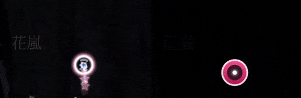
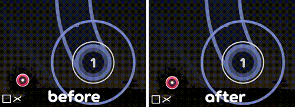
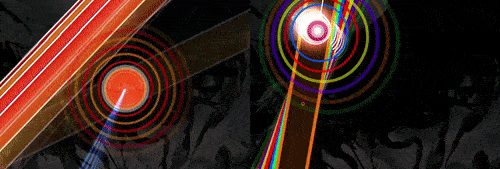

# Diferencias de jugabilidad en osu!(lazer)

*Para una lista comparativa de características entre lazer y stable, véase [Centro de ayuda/Actualizar a lazer § Comparación de características](/wiki/Help_centre/Upgrading_to_lazer#comparación-de-características)*

Esta página documenta diferencias que afectan la jugabilidad en osu!(lazer).

## General

### El mod Easy ya no pausa la partida al recuperarse de fallar

En lugar de detener el juego mientras se llena la barra de salud, la salud se recupera inmediatamente.

|  |  |
| :-- | :-: |
| Daña la retrocompatibilidad | ![No][false] |
| Reversible usando el mod Classic | ![No][false] |
| Cambiado intencionalmente | ![No][false] |
| Necesita más consideración | ![Sí][true] |

### Diferencias en el sistema de los grados

En stable, los requisitos de precisión (y juicio) para cada [grado](/wiki/Gameplay/Grade) son los siguientes:

| Grado | osu! / osu!taiko | osu!catch | osu!mania |
| :-: | :-- | :-- | :-- |
| SS | 100 % | 100 % | 100 % |
| S | >90 % de GREATs/300 (≤1 % de MEHs/50s, sin fallos) | >98 % | >95 % |
| A | >80 % de GREATs/300 (sin fallos) o >90 % de GREATs/300 | >94 % | >90 % |
| B | >70 % de GREATs/300 (sin fallos) o >80 % de GREATs/300 | >90 % | >80 % |
| C | >60 % de GREATs/300 | >85 % | >70 % |

Mientras tanto, osu!(lazer) ahora tiene los siguientes requisitos:

| Grado | osu! / osu!taiko | osu!catch | osu!mania |
| :-: | :-- | :-- | :-- |
| SS | 100 % | 100 % | 100 % |
| S | ≥95 % (sin fallos) | ≥98 % | ≥95 % |
| A | ≥90 % | ≥94 % | ≥90 % |
| B | ≥80 % | ≥90 % | ≥80 % |
| C | ≥70 % | ≥85 % | ≥70 % |

|  |  |
| :-- | :-: |
| Daña la retrocompatibilidad | ![Sí][true] |
| Reversible usando el mod Classic | ![No][false] |
| Cambiado intencionalmente | ![Sí][true] |
| Necesita más consideración | ![No][false] |

### Los cálculos de los límites de las ventanas de tiempo no coinciden con stable

Cuando un golpe aterriza justo en el límite de la ventana de tiempo, se puede recibir un juicio diferente dependiendo de la versión del cliente.

| Modo de juego | Comparación (stable) | Comparación (lazer) | Comparación (repetición en lazer) |
| :-- | :-- | :-- | :-- |
| osu! | `abs(round(hit error)) < floor(hit window)` | `abs(hit error) <= hit window` | `abs(round(hit error)) <= hit window` |
| osu!taiko | `abs(round(hit error)) < floor(hit window)`, excepto por la ventana de fallo la cual usa `<=` | `abs(hit error) <= hit window` | `abs(round(hit error)) <= hit window` |
| osu!mania | `abs(round(hit error)) <= floor(hit window)` | `abs(hit error) <= hit window` | `abs(round(hit error)) <= hit window` |

|  |  |
| :-- | :-: |
| Daña la retrocompatibilidad | ![Sí][true] |
| Reversible usando el mod Classic | ![No][false] |
| Cambiado intencionalmente | ![Sí][true] |
| Necesita más consideración | ![Sí][true] |

### Diferencias en el sistema de puntuación

La puntuación en lazer usará un sistema similar a ScoreV2 y todas las puntuaciones de ScoreV1 serán convertidas al nuevo sistema.

Hay dos modos de visualización para las puntuaciones: *estandarizado* y *clásico*. El sistema estandarizado limita la puntuación a un máximo de 1 000 000 de puntos + bonificación y multiplicadores de puntuación (similar a ScoreV2), mientras que el sistema clásico es lo mismo que el estandarizado, pero escalado cuadráticamente con la cantidad de objetos en un beatmap (similar a ScoreV1). Estos pueden ser seleccionados desde las configuraciones, todos los lugares en el juego donde se muestra puntuación cambian correspondientemente.

También hay algunas diferencias en cuanto a la puntuación de cada objeto y juicio en relación con los demás.

|  |  |
| :-- | :-: |
| Daña la retrocompatibilidad | ![Sí][true] |
| Reversible usando el mod Classic | ![No][false] |
| Cambiado intencionalmente | ![Sí][true] |
| Necesita más consideración | ![Sí][true] |

### Los elementos no están implementados en los storyboards

Algunos storyboards implementan elementos que reaccionan a la salud o las interacciones del jugador.

## osu!

### El notelock ha sido ajustado para ser más permisivo

Recuperarse de un fallo en patrones densos ahora es más fácil.

|  |  |
| :-- | :-: |
| Daña la retrocompatibilidad | ![Sí][true] |
| Reversible usando el mod Classic | ![Sí][true] |
| Cambiado intencionalmente | ![Sí][true] |
| Necesita más consideración | ![No][false] |

### Los slider head requieren precisión al golpear

Hasta la llegada de lazer, los sliders requerían como mínimo la precisión de un juicio 50/MEH para otorgar una puntuación perfecta. Esto se hizo por razones históricas, pero no se siente adecuado para un juego de ritmo. De ahora en adelante, los sliders requerirán precisión en el golpe inicial.

|  |  |
| :-- | :-: |
| Daña la retrocompatibilidad | ![Sí][true] |
| Reversible usando el mod Classic | ![Sí][true] |
| Cambiado intencionalmente | ![Yes][true] |
| Necesita más consideración | ![No][false] |

### Los slider head son más permisivos

Al hacer clic en un slider antes de tiempo, el círculo de seguimiento ahora comenzará inmediatamente en un estado de seguimiento incluso si el cursor abandona la bola del slider antes de que comience el slider.

Además, al hacer clic tarde en un slider, cualquier marca o repetidor que ya haya pasado se considerará completado.

Véase [este vídeo de YouTube](https://www.youtube.com/watch?v=xTRwM3zhhj0&t=243s) para obtener una explicación detallada.

|  |  |
| :-- | :-: |
| Daña la retrocompatibilidad | ![Sí][true] |
| Reversible usando el mod Classic | ![No][false] |
| Cambiado intencionalmente | ![Sí][true] |
| Necesita más consideración | ![No][false] |

### La tolerancia de los slider end es ahora más permisiva

En sliders muy rápidos, ahora solo es necesario realizar el seguimiento en algún punto de los últimos 36 ms, en lugar de hacerlo desde los 36 ms antes del final del slider.

Véase [este vídeo de YouTube](https://www.youtube.com/watch?v=SlWKKA-ltZY) para obtener una explicación detallada.

|  |  |
| :-- | :-: |
| Daña la retrocompatibilidad | ![Sí][true] |
| Reversible usando el mod Classic | ![No][false] |
| Cambiado intencionalmente | ![Sí][true] |
| Necesita más consideración | ![No][false] |

### Fallar un slider head ocasiona un fallo

Fallar un slider head (ya sea por no golpearlo o por golpearlo durante su ventana de fallo) previamente rompería el combo pero sin causar un juicio de MISS, y un juicio todavía podría ser obtenido del slider fallado por completar lo que quedara de él. Esto permitía a los jugadores obtener un menor combo máximo mientras que técnicamente no tenían fallos.

En lazer, no golpear un slider head dará un juicio de MISS para el slider completo. Después de fallar un slider head, todavía se puede obtener combo, puntuación y precisión de las marcas de los sliders, sliders inversos y slider ends.

|  |  |
| :-- | :-: |
| Daña la retrocompatibilidad | ![Sí][true] |
| Reversible usando el mod Classic | ![No][false] |
| Cambiado intencionalmente | ![Sí][true] |
| Necesita más consideración | ![No][false] |

### Los slider ends no ocasionan un hitsound cuando no se golpean

En stable, los slider ends reproducían su respectivo hitsound aunque se fallaran, siempre y cuando cualquier parte de este fuera golpeada. Esto ha sido cambiado de tal manera que los hitsounds coinciden con las interacciones 1:1.

|  |  |
| :-- | :-: |
| Daña la retrocompatibilidad | ![No][false] |
| Reversible usando el mod Classic | ![Sí][true] |
| Cambiado intencionalmente | ![Sí][true] |
| Necesita más consideración | ![No][false] |

### Se ha eliminado el límite de velocidad de 477 RPM en los giros de los spinners

En lugar de un límite de velocidad, los spinners ahora tienen un límite de puntuación determinado por la cantidad total de rotaciones que se pueden conseguir haciendo girar todo el spinner a una cantidad determinada de RPM dependiendo del OD.

Esto significa que la puntuación máxima puede ser obtenida antes al girar más rápido, sin recibir más puntos en lo que quede del spinner.

La cantidad requerida de RPM para obtener la máxima puntuación se muestra a continuación:

| OD | RPM |
| --: | --: |
| 0 | 250 |
| 5 | 380 |
| 10 | 430 |

|  |  |
| :-- | :-: |
| Daña la retrocompatibilidad | ![Sí][true] |
| Reversible usando el mod Classic | ![No][false] |
| Cambiado intencionalmente | ![Sí][true] |
| Necesita más consideración | ![Sí][true] |

### Los sliders de estilo Aspire no son soportados

Algunos beatmaps se aprovechan de lo fallos del cliente stable que permitían mecánicas de los sliders muy extrañas. Estos abarcan desde sliders de nula longitud actuando como círculos invisibles, hasta sliders estirados y aplastados a través de toda la pantalla.

Se necesitará de más discusión y consideración sobre cuántos beatmaps Aspire serán compatibles en el futuro. Por ejemplo, más adelante se podrían implementar círculos invisibles como una característica adecuadamente soportada.

|  |  |
| :-- | :-: |
| Daña la retrocompatibilidad | ![Sí][true] |
| Reversible usando el mod Classic | ![No][false] |
| Cambiado intencionalmente | ![No][false] |
| Necesita más consideración | ![Sí][true] |

## osu!taiko

### Las notas superpuestas no pueden ser golpeadas

Algunos mapas con trucos hacen uso de notas que se superponen.

|  |  |
| :-- | :-: |
| Daña la retrocompatibilidad | ![Sí][true] |
| Reversible usando el mod Classic | ![No][false] |
| Cambiado intencionalmente | ![No][false] |
| Necesita más consideración | ![No][false] |

### Los tambores no evitan el machacado

En stable, los tambores no podrían ser golpeados muy rápida o lentamente. Esta restricción se ha removido, tal como en ScoreV2.

|  |  |
| :-- | :-: |
| Daña la retrocompatibilidad | ![Sí][true] |
| Reversible usando el mod Classic | ![No][false] |
| Cambiado intencionalmente | ![Sí][true] |
| Necesita más consideración | ![Sí][true] |

### El centro del mod Flashlight está alineado con el receptor de golpe

En stable, el centro del mod Flashlight está ligeramente desalineado hacia abajo a la derecha, haciendo visible una mayor cantidad de objetos.

|  |  |
| :-- | :-: |
| Daña la retrocompatibilidad | ![No][false] |
| Reversible usando el mod Classic | ![No][false] |
| Cambiado intencionalmente | ![No][false] |
| Necesita más consideración | ![Sí][true] |

## osu!catch

### La aparición del hyperdash puede ser diferente en algunos casos

Esto puede ocasionar juicios imprecisos en las repeticiones y un aumento en la dificultad.

|  |  |
| :-- | :-: |
| Daña la retrocompatibilidad | ![Sí][true] |
| Reversible usando el mod Classic | ![No][false] |
| Cambiado intencionalmente | ![No][false] |
| Necesita más consideración | ![Sí][true] |

### La aparición de la corriente de jugo puede ser diferente en algunos casos

Esto puede ocasionar juicios imprecisos en las repeticiones.

|  |  |
| :-- | :-: |
| Daña la retrocompatibilidad | ![Sí][true] |
| Reversible usando el mod Classic | ![No][false] |
| Cambiado intencionalmente | ![No][false] |
| Necesita más consideración | ![Sí][true] |

## osu!mania

### Los comienzos y finales de las notas largas otorgan juicios

Esto funciona de manera similar a ScoreV2 en stable.

|  |  |
| :-- | :-: |
| Daña la retrocompatibilidad | ![Sí][true] |
| Reversible usando el mod Classic | ![No][false] |
| Cambiado intencionalmente | ![Sí][true] |
| Necesita más consideración | ![No][false] |

### Las marcas de las notas largas se eliminan

En stable, las notas largas dan un combo cada 100 ms, mientras que en lazer «las marcas de las notas largas» daban un combo cada intervalo de una marca.

Nada de eso existe en lazer, lo que significa que las notas largas solo dan combo en el inicio y el final. Sin embargo, al igual que en stable, los combos se rompen inmediatamente al soltar los sliders.

|  |  |
| :-- | :-: |
| Daña la retrocompatibilidad | ![Sí][true] |
| Reversible usando el mod Classic | ![No][false] |
| Cambiado intencionalmente | ![Sí][true] |
| Necesita más consideración | ![No][false] |

### Las velocidades de desplazamiento extremas están limitadas

Algunos beatmaps con trucos de SV, como teletransportes o detenimientos, no tienen el aspecto deseado, pero son jugables.

|  |  |
| :-- | :-: |
| Daña la retrocompatibilidad | ![No][false] |
| Reversible usando el mod Classic | ![No][false] |
| Cambiado intencionalmente | ![Sí][true] |
| Necesita más consideración | ![Sí][true] |

### La ventana de tiempo para los juicios PERFECT escala con el OD

Esto solía resultar en ±16 ms constantes independientemente de la dificultad general.

|  |  |
| :-- | :-: |
| Daña la retrocompatibilidad | ![Sí][true] |
| Reversible usando el mod Classic | ![No][false] |
| Cambiado intencionalmente | ![Sí][true] |
| Necesita más consideración | ![No][false] |

### Los beatmaps convertidos ya no tienen una ventana de tiempo diferente

En stable, los beatmaps convertidos desde el modo de juego osu! a osu!mania tenían una [ventana de tiempo diferente](/wiki/Gameplay/Judgement/osu!mania).

|  |  |
| :-- | :-: |
| Daña la retrocompatibilidad | ![Sí][true] |
| Reversible usando el mod Classic | ![No][false] |
| Cambiado intencionalmente | ![Sí][true] |
| Necesita más consideración | ![No][false] |

### El mod Flashlight no tiene degradado

|  |  |
| :-- | :-: |
| Daña la retrocompatibilidad | ![No][false] |
| Reversible usando el mod Classic | ![No][false] |
| Cambiado intencionalmente | ![No][false] |
| Necesita más consideración | ![Sí][true] |

[true]: /wiki/shared/true.png
[false]: /wiki/shared/false.png
