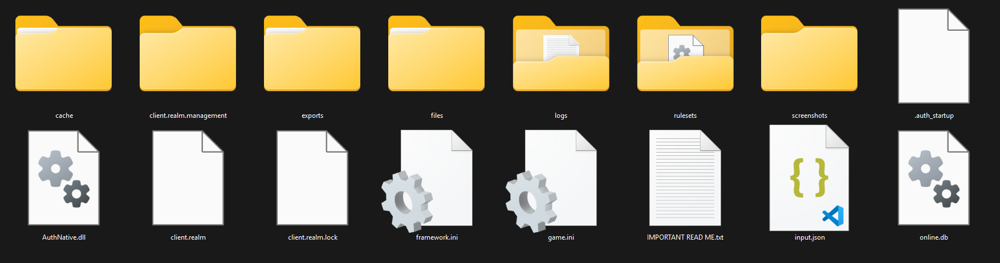

# osu! program files (lazer)

*For the osu!(stable) version of this article, see: [osu! program files](/wiki/Client/Program_files)*\
*See also: [osu! File Formats](/wiki/Client/File_formats)*



## Installation paths

By default, osu!(lazer) stores user data in the following directories:

- `%appdata%/osu` (Windows),
- `~/.local/share/osu` (Linux),
- `~/Library/Application Support/osu` (macOS),
- `Android/data/sh.ppy.osulazer/files` (Android).

On desktop platforms, the file store can also be moved in its entirety to another location, using the `Change folder location...` button in the client settings.

## Folders

| Name | Functionality |
| :-- | :-- |
| `cache` | Holds osu!'s cache, like fonts and shaders. |
| `client.realm.management` | Internal state management for realm (database library that osu! uses).[^realm-files] |
| `exports` | Holds any exported files, including logs and beatmaps. |
| `files` | Holds beatmaps, skins, and score replay files. These are stored under filenames that reflect their SHA-256 hashes. See [this section](#storage-structure) for more information. |
| `logs` | Holds game logs. |
| `rulesets` | Holds custom rulesets (`.dll` files). There is a [listing of them on the osu! GitHub repository](https://github.com/ppy/osu/discussions/13096). |
| `screenshots` | Holds screenshots taken in-game. |

## Top-level files

| Name | Functionality |
| :-- | :-- |
| `client.realm` | Contains mappings for the data in the `files` folder. |
| `client.realm.lock` | Keeps track of which versions of data in the `files` folder are actively in use.[^realm-files] |
| `framework.ini` | Contains [osu!framework](https://github.com/ppy/osu-frameworks) specific settings. |
| `game.ini` | Contains most user settings. |
| `IMPORTANT READ ME.txt` | Warning about modifying or [backing up](#backing-up-files) the directory. |
| `input.json` | Contains input settings |

## Storage structure

osu!(stable)'s storage structure, where data was directly accessible to users as standard files, resulted in a lot of teething issues due to having to explicitly handle unwanted modifications of key files. To avoid this, osu!(lazer) employs a more stringent method of file storage. As such, there is no equivalent of the `Songs` and `Skins` folders. All files that are imported to lazer are stored under filenames that reflect their [SHA-256 hashes](https://en.wikipedia.org/wiki/SHA-2). Mappings to these files are held inside a client database.

For example, a file with the SHA-256 hash of

```
1a47929b6056d34d25a95eeb2012395ceed66af6f40cc37c898a08482d6325d2
```

would be stored under the path of

```
files/1/1a/1a47929b6056d34d25a95eeb2012395ceed66af6f40cc37c898a08482d6325d2
```

This allows for saving storage space by preventing duplicates of the same file from being persisted to disk, and prevents users (or other applications) from easily tampering with files that should not be tampered with. All inconveniences compared to stable that arise from this choice have been addressed by either allowing exports or adding new in-game management features, or will be addressed in due time by new features.

For now, the correct procedure to manually modify skins or beatmaps outside of the facilities available in-game is to export the item, update it, and then reimport it again with the desired changes.

It is strongly advised to **not** manually modify files in the osu!(lazer) directory.

## Backing up files

If you want to back up or delete your game files, you need to back up your **entire** `osu` directory, not just the `files/` directory. If you copy only the `files/` directory, you will lose data.

## Migration from osu!(stable)

### Via hard links

On most systems, osu!(lazer) will be able to import data from the stable version of the game without having to create a second copy of the data on disk. This is possible thanks to an operating system feature called *hard links*.

A hard link is conceptually similar to a *shortcut* in that it is a method that allows a user to have the same file available from multiple different places on their filesystem. However, while shortcuts are just plain files that point to a different file (and therefore require additional space), hard links work one level deeper, at the level of the filesystem itself.

In simple terms, two hard-linked files are just two different names for the same piece of physical space on the hard drive. This means that once the migration completes using hard links, both the `Songs` folder in stable, and the `files` folder in lazer will contain files which will point to shared underlying data on the disk. Deleting files from one installation will not affect the other. Updating or editing files causes the files to become separate, and will therefore also not affect the other installation, as long as osu! is used to make the changes.

Note that if disk usage is checked using the `Properties` window in Explorer or any other similar method, it will appear that both the `Songs` directory and the `files` directory are consuming disk space, potentially misleading users to think that the data is stored twice. This is an artifact of file size accounting, and the actual underlying data is **not** duplicated. This can be verified by comparing the total amount of free space on the entire disk before and after the migration.

#### Supported systems

As hard links are a filesystem-level feature, it is required that the hard-linked files reside on a common drive.

- **Windows**: The drive must be formatted using NTFS.
- **macOS**: The file system must support hard links.
- **Linux**: The file system must support hard links.

### Via file copy

On other operating systems and filesystems where hard links are not available (or the functionality to create them has not been implemented yet), the migration from stable to lazer works by copying all files across from the old installation to the new. Both installs are therefore fully separated, but also consume up to twice the disk space.

## References

[^realm-files]: [Documentation file on the `realm/realm-dotnet` GitHub repository (2025-09-23) "Configure & Open a Realm - .NET SDK"](https://github.com/realm/realm-dotnet/blob/113c01264fc00f6cedf3c829caa9cfb30b963914/Guides/realm-files/realms.md#auxiliary-realm-files)
