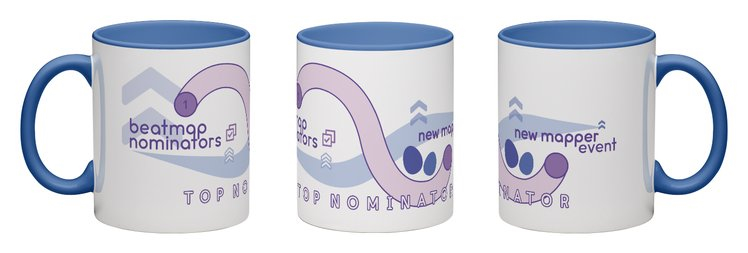

---
tags:
  - BN mug
---

# Nominierungs-Event für neue Mapper

Das **Nominierungs-Event für neue Mapper** (***New Mapper Nomination Event***) wurde vom **1. März 2021** bis zum **31. Mai 2021** veranstaltet.

Während des Events waren die Beatmap-Nominatoren damit beauftragt, Maps von Nutzern zu ranken, die vorher noch nie eine Map gerankt haben (in einem Spielmodus ihrer Wahl). Nur Maps die während des Events [qualifiziert](/wiki/Beatmap_ranking_procedure#qualifizierung) wurden, kamen für eine Nominierung infrage.

## Belohnungen

Nominatoren, die während des Events **mindestens 4 Maps** gerankt haben, erhielten einen Monat [Discord Nitro](https://discord.com/nitro). Darüber hinaus erhielten die 4 besten Nominatoren über alle Spielmodi hinweg und der beste Nominator in jedem Spielmodus eine exklusive BN-Tasse und ein Abzeichen dazu.

## Spitzenplatzierungen

### Alle Spielmodi

| Name | Spielmodus | Nominierungen |
| :-- | :-- | --: |
| ::{ flag=US }:: [Chanyah](https://osu.ppy.sh/users/5226970) |  | 18 |
| ::{ flag=AU }:: [Akito](https://osu.ppy.sh/users/5716327) |  | 12 |
| ::{ flag=SE }:: [Zer0-](https://osu.ppy.sh/users/4260033) |  | 11 |
| ::{ flag=SE }:: [Davvy](https://osu.ppy.sh/users/10047413) |  | 10 |
| ::{ flag=CA }:: [VINXIS](https://osu.ppy.sh/users/4323406) |  | 9 |
| ::{ flag=US }:: [rosario wknd](https://osu.ppy.sh/users/6341518) |  | 9 |
| ::{ flag=DE }:: [Mir](https://osu.ppy.sh/users/8688812) |  | 9 |
| ::{ flag=TN }:: [Hivie](https://osu.ppy.sh/users/14102976) |  | 9 |
| ::{ flag=GR }:: [Nokashi](https://osu.ppy.sh/users/5431196) |  | 3 |
| ::{ flag=NO }:: [Benita](https://osu.ppy.sh/users/4023183) |  | 3 |

###  osu!

| Name | Nominierungen |
| :-- | --: |
| ::{ flag=US }:: [Chanyah](https://osu.ppy.sh/users/5226970) | 18 |
| ::{ flag=AU }:: [Akito](https://osu.ppy.sh/users/5716327) | 12 |
| ::{ flag=SE }:: [Zer0-](https://osu.ppy.sh/users/4260033) | 11 |

###  osu!taiko

| Name | Nominierungen |
| :-- | --: |
| ::{ flag=TN }:: [Hivie](https://osu.ppy.sh/users/14102976) | 9 |
| ::{ flag=MY }:: [Jerry](https://osu.ppy.sh/users/605973) | 7 |
| ::{ flag=US }:: [ikin5050](https://osu.ppy.sh/users/4007649) | 5 |

###  osu!catch

| Name | Nominierungen |
| :-- | --: |
| ::{ flag=GR }:: [Nokashi](https://osu.ppy.sh/users/5431196) | 3 |
| ::{ flag=NO }:: [Benita](https://osu.ppy.sh/users/4023183) | 3 |
| ::{ flag=KR }:: [My Angel RangE](https://osu.ppy.sh/users/6336713) | 2 |

###  osu!mania

| Name | Nominierungen |
| :-- | --: |
| ::{ flag=SE }:: [Davvy](https://osu.ppy.sh/users/10047413) | 10 |
| ::{ flag=KR }:: [Dubstek](https://osu.ppy.sh/users/9555243) | 8 |
| ::{ flag=ID }:: [Mipha-](https://osu.ppy.sh/users/5767941) | 6 |
