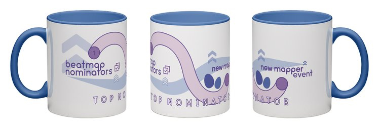

---
tags:
  - BN mug
---

# Nominierungs-Event für neue Mapper

Das **Nominierungs-Event für neue Mapper** (***New Mapper Nomination Event***) wurde vom **1. März 2021** bis zum **31. Mai 2021** veranstaltet.

Während des Events hatten die Beatmap-Nominatoren die Aufgabe, Beatmaps von Nutzern zu ranken, die vorher noch nie eine Beatmap gerankt haben (in einem Spielmodus ihrer Wahl). Nur Beatmaps die während des Events [qualifiziert](/wiki/Beatmap_ranking_procedure#qualifizierung) wurden, kamen für eine Nominierung infrage.

## Belohnungen

Nominatoren, die während des Events **mindestens 4 Beatmaps** gerankt haben, erhielten einen Monat [Discord Nitro](https://discord.com/nitro). Darüber hinaus erhielten die 4 besten Nominatoren über alle Spielmodi hinweg und der beste Nominator in jedem Spielmodus eine exklusive BN-Tasse und ein Abzeichen dazu.

## Spitzenplatzierungen

### Alle Spielmodi

| Name | Spielmodus | Nominierungen |
| :-- | :-- | --: |
| ::{ flag=US }:: ::Chanyah::{ user=5226970 } |  | 18 |
| ::{ flag=AU }:: ::Akito::{ user=5716327 } |  | 12 |
| ::{ flag=SE }:: ::Zer0-::{ user=4260033 } |  | 11 |
| ::{ flag=SE }:: ::Davvy::{ user=10047413 } |  | 10 |
| ::{ flag=CA }:: ::VINXIS::{ user=4323406 } |  | 9 |
| ::{ flag=US }:: ::rosario wknd::{ user=6341518 } |  | 9 |
| ::{ flag=DE }:: ::Mir::{ user=8688812 } |  | 9 |
| ::{ flag=TN }:: ::Hivie::{ user=14102976 } |  | 9 |
| ::{ flag=GR }:: ::Nokashi::{ user=5431196 } |  | 3 |
| ::{ flag=NO }:: ::Benita::{ user=4023183 } |  | 3 |

###  osu!

| Name | Nominierungen |
| :-- | --: |
| ::{ flag=US }:: ::Chanyah::{ user=5226970 } | 18 |
| ::{ flag=AU }:: ::Akito::{ user=5716327 } | 12 |
| ::{ flag=SE }:: ::Zer0-::{ user=4260033 } | 11 |

###  osu!taiko

| Name | Nominierungen |
| :-- | --: |
| ::{ flag=TN }:: ::Hivie::{ user=14102976 } | 9 |
| ::{ flag=MY }:: ::Jerry::{ user=605973 } | 7 |
| ::{ flag=US }:: ::ikin5050::{ user=4007649 } | 5 |

###  osu!catch

| Name | Nominierungen |
| :-- | --: |
| ::{ flag=GR }:: ::Nokashi::{ user=5431196 } | 3 |
| ::{ flag=NO }:: ::Benita::{ user=4023183 } | 3 |
| ::{ flag=KR }:: ::My Angel RangE::{ user=6336713 } | 2 |

###  osu!mania

| Name | Nominierungen |
| :-- | --: |
| ::{ flag=SE }:: ::Davvy::{ user=10047413 } | 10 |
| ::{ flag=KR }:: ::Dubstek::{ user=9555243 } | 8 |
| ::{ flag=ID }:: ::Mipha-::{ user=5767941 } | 6 |
