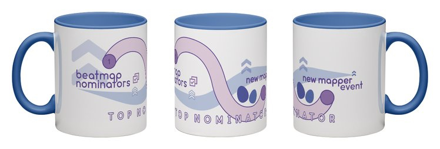

---
tags:
  - BN mug
---

# Evento de Nominación para Mappers Nuevos

El **Evento de Nominación para Mappers Nuevos** se llevó a cabo entre **marzo 1** y **mayo 31**, 2021.

Durante el evento, se les encargó a los Beatmap Nominators clasificar mapas de usuarios que nunca habían clasificado un mapa antes el modo de juego de su elección. Solo los mapas [calificados](/wiki/Beatmap_ranking_procedure#calificación) durante el evento eran elegibles para ser nominados.

## Recompensas

Los nominadores que rankearon **al menos 4 mapas** durante el evento, fueron previstos con 1 mes de [Discord Nitro](https://discord.com/nitro). Además, los 4 nominadores en el top general atreves de todos los modos de juego y el top 1 en cada modo de juego recibieron una taza de BN exclusiva y una emblema para acompañarla.

## Primeras posiciones

### Todos los modos de juego

| Nombre | Modo de juego | Nominaciones |
| :-- | :-- | --: |
| ::{ flag=US }:: [Chanyah](https://osu.ppy.sh/users/5226970) |  | 18 |
| ::{ flag=AU }:: [Akito](https://osu.ppy.sh/users/5716327) |  | 12 |
| ::{ flag=SE }:: [Zer0-](https://osu.ppy.sh/users/4260033) |  | 11 |
| ::{ flag=SE }:: [Davvy](https://osu.ppy.sh/users/10047413) |  | 10 |
| ::{ flag=CA }:: [VINXIS](https://osu.ppy.sh/users/4323406) |  | 9 |
| ::{ flag=US }:: [rosario wknd](https://osu.ppy.sh/users/6341518) |  | 9 |
| ::{ flag=DE }:: [Mir](https://osu.ppy.sh/users/8688812) |  | 9 |
| ::{ flag=TN }:: [Hivie](https://osu.ppy.sh/users/14102976) |  | 9 |
| ::{ flag=GR }:: [Nokashi](https://osu.ppy.sh/users/5431196) |  | 3 |
| ::{ flag=NO }:: [Benita](https://osu.ppy.sh/users/4023183) |  | 3 |

###  osu!

| Nombre | Nominaciones |
| :-- | --: |
| ::{ flag=US }:: [Chanyah](https://osu.ppy.sh/users/5226970) | 18 |
| ::{ flag=AU }:: [Akito](https://osu.ppy.sh/users/5716327) | 12 |
| ::{ flag=SE }:: [Zer0-](https://osu.ppy.sh/users/4260033) | 11 |

###  osu!taiko

| Nombre | Nominaciones |
| :-- | --: |
| ::{ flag=TN }:: [Hivie](https://osu.ppy.sh/users/14102976) | 9 |
| ::{ flag=MY }:: [Jerry](https://osu.ppy.sh/users/605973) | 7 |
| ::{ flag=US }:: [ikin5050](https://osu.ppy.sh/users/4007649) | 5 |

###  osu!catch

| Nombre | Nominaciones |
| :-- | --: |
| ::{ flag=GR }:: [Nokashi](https://osu.ppy.sh/users/5431196) | 3 |
| ::{ flag=NO }:: [Benita](https://osu.ppy.sh/users/4023183) | 3 |
| ::{ flag=KR }:: [My Angel RangE](https://osu.ppy.sh/users/6336713) | 2 |

###  osu!mania

| Nombre | Nominaciones |
| :-- | --: |
| ::{ flag=SE }:: [Davvy](https://osu.ppy.sh/users/10047413) | 10 |
| ::{ flag=KR }:: [Dubstek](https://osu.ppy.sh/users/9555243) | 8 |
| ::{ flag=ID }:: [Mipha-](https://osu.ppy.sh/users/5767941) | 6 |
