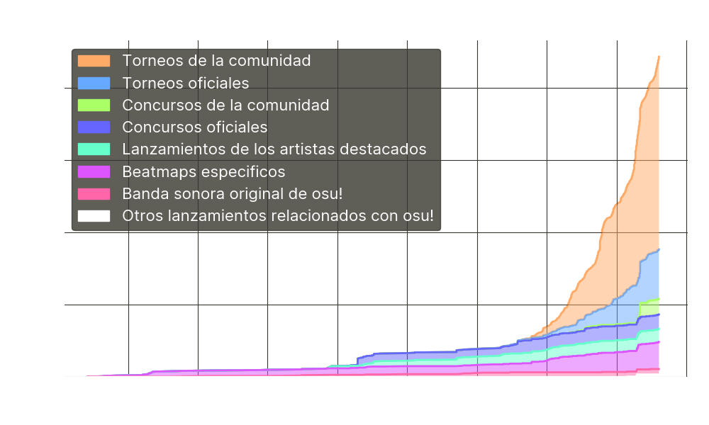

---
tags:
  - osu! original
  - osu! originals
  - originals
  - original
  - music
  - originales
  - original
  - música
---

# Música hecha a medida

Este artículo enumera las canciones creadas específicamente para (o lanzadas por primera vez en) osu! u otros eventos relacionados con osu!, como torneos, concursos y anuncios de [artistas destacados](/wiki/People/Featured_Artists).

Si bien no todas estas canciones tienen licencia oficial y están incluidas en la [biblioteca de artistas destacados](https://osu.ppy.sh/beatmaps/artists/tracks?exclusive_only=1), las canciones que sí la tienen se llaman «osu! originals», y se distinguen por la etiqueta  en las páginas de sus respectivos artistas ( en este artículo). Están autorizadas para su uso en osu! bajo términos no exclusivos según la [política de licenciamiento de música de osu!](/wiki/Legal/Music_licensing).

Por el contrario, el resto de canciones de esta lista no tienen licencia oficial del juego y pueden requerir permiso para su uso. Véase los [permisos de uso de contenido](/wiki/Rules/Content_usage_permissions) para más información.

## Estadísticas

Actualmente, hay un total de **883** canciones documentadas hechas dentro de osu!.

## Listado

### Banda sonora original de osu!

| Enlaces |  | Canción | Notas |
| --: | :-: | :-- | :-- |
|  |  | cYsmix - pumpkins\![^fa] | Tema de osu! para Halloween de 2016 |
|  |  | cYsmix - triangles | Tema principal actual de osu!(lazer) |
|    |  | nekodex - aureole | Tema de osu! para la Navidad/invierno de 2017 |
|    |  | nekodex - carol of the circles | Tema de osu! para la Navidad/invierno de 2019 |
|     |  | nekodex - circle the halls |  |
|   |  | nekodex - circles\! | Tema de osu! de 2015 |
|   |  | nekodex - Liquid Future | Composición original para [osu!stream](/wiki/osu!stream) |
|    |  | nekodex - Little Drummer Girl | Tema de osu! para la Navidad/invierno de 2020 |
|  |  | nekodex - Main Theme 2.0[^fa] | Tema principal de [osu!stream](/wiki/osu!stream) |
|  |  | nekodex - new beginnings[^fa] | Canción actual del tutorial |
|    |  | nekodex - osu!stream theme[^fa] | Antiguo tema principal de [osu!stream](/wiki/osu!stream) |
|  |  | nekodex - welcome to christmas\! | Tema de osu! para la Navidad/invierno de 2014 |
|  |  | nekodex - welcome to osu\![^fa] | Antiguo tema de osu! |
|  |  | Peter Lambert - osu! tutorial | Antigua canción del tutorial |
|    |  | Redside - beachballs\! | Tema de osu! para el verano de 2023 |

### Lanzamientos exclusivos de los artistas destacados

#### [cYsmix](https://osu.ppy.sh/beatmaps/artists/2)

*Para la publicación del anuncio, véase: [Mapping With Rewards (Sep. 2015)](https://blog.ppy.sh/post/129936251068/mapping-with-rewards-sep-2015)*

| Enlaces |  | Canción |
| --: | :-: | :-- |
|  |  | cYsmix - Arcade Busters |
|  |  | cYsmix - Behind the Walls |
|  |  | cYsmix - Breeze |
|  |  | cYsmix - Classic Pursuit |
|  |  | cYsmix - Disco Bawls |
|  |  | cYsmix - Dovregubben's Hall |
|  |  | cYsmix - Fright March |
|   |  | cYsmix - House With Legs |
|  |  | cYsmix - Little Knight |
|  |  | cYsmix - Manic |
|   |  | cYsmix - Moonlight Sonata |
|  |  | cYsmix - Peer Gynt |

#### [happy30](https://osu.ppy.sh/beatmaps/artists/317)

*Para la publicación del anuncio, véase: [New Featured Artist: happy30](https://osu.ppy.sh/home/news/2022-11-02-new-featured-artist-happy30)*

| Enlaces |  | Canción |
| --: | :-: | :-- |
|    |  | happy30 - Relentless |
|    |  | happy30 - Shoot the star |

#### [James Landino](https://osu.ppy.sh/beatmaps/artists/39)

*Para la publicación del anuncio, véase: [New Featured Artist: James Landino](https://osu.ppy.sh/home/news/2019-05-31-new-featured-artist-james-landino)*

Estas canciones forman parte del [EP osu! James Landino Collection](https://fanlink.to/osulandino)

| Enlaces |  | Canción |
| --: | :-: | :-- |
|  |  | James Landino & Kabuki - Birdsong |
|  |  | James Landino - Hide And Seek |
|  |  | James Landino - Hit That feat. Hentai Dude & Tofuku (osu! edit) |
|  |  | James Landino - Reaction feat. Slyleaf |
|  |  | James Landino - Shiba Island |
|  |  | James Landino - Spellbound |

#### [kiraku](https://osu.ppy.sh/beatmaps/artists/101)

*Para la publicación del anuncio, véase: [New Featured Artist: kiraku](https://osu.ppy.sh/home/news/2020-09-26-new-featured-artist-kiraku)*

| Enlaces |  | Canción |
| --: | :-: | :-- |
|  |  | kiraku - connection |

#### [Kitazawa Kyouhei](https://osu.ppy.sh/beatmaps/artists/165)

*Para la publicación del anuncio, véase: [New Featured Artist: Kitazawa Kyouhei](https://osu.ppy.sh/home/news/2021-05-15-new-featured-artist-kitazawa-kyouhei)*

| Enlaces |  | Canción |
| --: | :-: | :-- |
|     |  | Kitazawa Kyouhei - TRUE-QUEEN |

#### [Rabbit House](https://osu.ppy.sh/beatmaps/artists/242)

*Para la publicación del anuncio, véase: [New Featured Artist: Rabbit House](https://osu.ppy.sh/home/news/2022-02-23-new-featured-artist-rabbit-house)*

| Enlaces |  | Canción |
| --: | :-: | :-- |
|  |  | Rabbit House - Gehenna |

#### [tomspicy](https://osu.ppy.sh/beatmaps/artists/437)

*Para la publicación del anuncio, véase: [New Featured Artist: tomspicy](https://osu.ppy.sh/home/news/2024-09-14-new-featured-artist-tomspicy)*

Estas canciones forman parte del [EP tomspicy osu! collection 01](https://osu.ppy.sh/beatmaps/artists/437#album-2135)

| Enlaces |  | Canción |
| --: | :-: | :-- |
|  |  | tomspicy - dysthymia |
|  |  | tomspicy - lullaby |
|  |  | tomspicy - petal blizzard |

<!-- lint ignore no-heading-punctuation -->

#### [yuki.](https://osu.ppy.sh/beatmaps/artists/4)

*Para la publicación del anuncio, véase: [Community Mapping Contest #1 - yuki. (Nadeshiko Sensation)](https://osu.ppy.sh/home/news/2016-09-28-community-mapping-contest-1-yuki-nadeshiko)*

| Enlaces |  | Canción |
| --: | :-: | :-- |
|  |  | yuki. - Be Your Light |
|  |  | yuki. - Candy Girl |
|  |  | yuki. - daft |
|  |  | yuki. - forget you |
|  |  | yuki. - Have it All |
|  |  | yuki. - Hello! World (feat. setsunan) |
|  |  | yuki. - Nadeshiko Sensation |
|  |  | yuki. - Polaris |
|  |  | yuki. - Spring Signal |

#### [ZxNX](https://osu.ppy.sh/beatmaps/artists/288)

*Para la publicación del anuncio, véase: [New Featured Artist: ZxNX](https://osu.ppy.sh/home/news/2022-07-30-new-featured-artist-zxnx)*

| Enlaces |  | Canción |
| --: | :-: | :-- |
|     |  | ZxNX - Altair |

### Lanzamientos oficiales para torneos

####  [Lazer Grand Arena](/wiki/Tournaments/LGA/2024)

| Enlaces |  | Canción | Beatmap | Notas |
| --: | :-: | :-- | :-: | :-- |
|     |  | Sydosys - HONOR//REPROACH | [#1](https://osu.ppy.sh/beatmapsets/2222372) | Séptimo beatmap jugado en la gran final |
|    |  | WangleLine - Attacked by the Cosmic Beast | [#1](https://osu.ppy.sh/beatmapsets/2222345) | Séptimo beatmap jugado en las finales |

####  [osu! World Cup 2020](/wiki/Tournaments/OWC/2020)

| Enlaces |  | Canción | Beatmap | Notas |
| --: | :-: | :-- | :-: | :-- |
|    |  | Camellia - OOPARTS | [#1](https://osu.ppy.sh/beatmapsets/1312143) | Mapa de desempate de la gran final |

####  [osu! World Cup 2021](/wiki/Tournaments/OWC/2021)

| Enlaces |  | Canción | Beatmap | Notas |
| --: | :-: | :-- | :-: | :-- |
|  |  | katagiri - Buta Musou[^fa] | [#1](https://osu.ppy.sh/beatmapsets/1633225) | NM1 de la gran final |
|  |  | Raphlesia - Showdown | [#1](https://osu.ppy.sh/beatmapsets/1627494) | HR3 de las finales |
|    |  | Yooh - RPG | [#1](https://osu.ppy.sh/beatmapsets/1633250) | Mapa de desempate de la gran final |

####  [osu! World Cup 2022](/wiki/Tournaments/OWC/2022)

| Enlaces |  | Canción | Beatmap | Notas |
| --: | :-: | :-- | :-: | :-- |
|  |  | DJ Raisei - T.R.A.P. | [#1](https://osu.ppy.sh/beatmapsets/1889105) | NM4 de la gran final |
|  |  | Down - Down | [#1](https://osu.ppy.sh/beatmapsets/1880545) | FM4 de las semifinales |
|     |  | II-L feat. amelie xoxo - THE EARTH | [#1](https://osu.ppy.sh/beatmapsets/1889101) | NM5 de la gran final |
|   |  | Kurokotei feat. Sennzai - escape (the looking-glass, and what alice found there) | [#1](https://osu.ppy.sh/beatmapsets/1880652) | Mapa de desempate de las semifinales |
|   |  | NIWASHI - Harder Than Diamond | [#1](https://osu.ppy.sh/beatmapsets/1884920) | FM4 de las finales |
|  |  | Rabbit House - Sanctuary | [#1](https://osu.ppy.sh/beatmapsets/1889094) | HR2 de la gran final |
|    |  | Raimukun - Myths Orbis | [#1](https://osu.ppy.sh/beatmapsets/1889095) | NM2 de la gran final |
|    |  | Redside - Sidequest | [#1](https://osu.ppy.sh/beatmapsets/1880625) | HR3 de los cuartos de final |
|   |  | rN - onostrapha | [#1](https://osu.ppy.sh/beatmapsets/1884914) | FM2 de las finales |
|   |  | seatrus - EXXTRA JUDGEMENT | [#1](https://osu.ppy.sh/beatmapsets/1889132) | Mapa de desempate de la gran final |
|   |  | Sephid - Thunderstrike 1988 | [#1](https://osu.ppy.sh/beatmapsets/1889109) | HD3 de la gran final |
|   |  | Thaehan - All or Nothing | [#1](https://osu.ppy.sh/beatmapsets/1880625) | HR1 de las semifinales |

####  [osu! World Cup 2023](/wiki/Tournaments/OWC/2023)

| Enlaces |  | Canción | Beatmap | Notas |
| --: | :-: | :-- | :-: | :-- |
|   |  | A.SAKA - KAGUTSUCHI | [#1](https://osu.ppy.sh/beatmapsets/2091775) | NM1 de las finales |
|  |  | Aoi - Quartzshaper | [#1](https://osu.ppy.sh/beatmapsets/2091789) | HR3 de las finales |
|   |  | BilliumMoto - Amethyst Aurora | [#1](https://osu.ppy.sh/beatmapsets/2095140) | NM5 de la gran final |
|   |  | cygnus - Darkness Parade | [#1](https://osu.ppy.sh/beatmapsets/2078577) | HD1 de los dieciseisavos de final |
|  |  | Down - Kizan | [#1](https://osu.ppy.sh/beatmapsets/2085347) | Mapa de desempate de los cuartos de final |
|  |  | Kommisar - AKARI BEAM CANNON LAST BOSS | [#1](https://osu.ppy.sh/beatmapsets/2095159) | FM2 de la gran final |
|  |  | Lime - Pixel Planet | [#1](https://osu.ppy.sh/beatmapsets/2095123) | NM2 de la gran final |
|    |  | litmus* vs Ester - Requiem for the Aura | [#1](https://osu.ppy.sh/beatmapsets/2095119) | HD3 de la gran final |
|  |  | LV.4 - Burning Star | [#1](https://osu.ppy.sh/beatmapsets/2095154) | HR3 de la gran final |
|   |  | MYUKKE. - Mach Roger | [#1](https://osu.ppy.sh/beatmapsets/2085335) | NM4 de los cuartos de final |
|   |  | orangentle / Yu\_Asahina - OEFHEBEN | [#1](https://osu.ppy.sh/beatmapsets/2091787) | NM2 de las finales |
|   |  | polysha - Endverse | [#1](https://osu.ppy.sh/beatmapsets/2088576) | Mapa de desempate de las semifinales |
|    |  | Release Hallucination - VANITAS | [#1](https://osu.ppy.sh/beatmapsets/2095177) | Mapa de desempate de la gran final |
|  |  | Rohi - Gllensista | [#1](https://osu.ppy.sh/beatmapsets/2091797) | FM2 de las finales |
|  |  | seleP feat. Lily - Sara | [#1](https://osu.ppy.sh/beatmapsets/2088549) | NM3 de las semifinales |
|   |  | Sorry about my face - The last straw | [#1](https://osu.ppy.sh/beatmapsets/2088563) | HD3 de las semifinales |
|    |  | Sound piercer "ESPITZ" - NOVO HORIZONTE | [#1](https://osu.ppy.sh/beatmapsets/2091818) | FM3 de las finales |
|    |  | Sydosys - Wandered | [#1](https://osu.ppy.sh/beatmapsets/2085296) | NM3 de los cuartos de final |
|  |  | Toromaru - Ebb Tide | [#1](https://osu.ppy.sh/beatmapsets/2082040) | FM1 de los octavos de final |
|    |  | ZxNX - Fana | [#1](https://osu.ppy.sh/beatmapsets/2095138) | NM4 de la gran final |

####  [osu! World Cup 2024](/wiki/Tournaments/OWC/2024)

| Enlaces |  | Canción | Beatmap | Notas |
| --: | :-: | :-- | :-: | :-- |
|    |  | Attoclef - Naples Yellow Mango | [#1](https://osu.ppy.sh/beatmapsets/2288022) | NM2 de la gran final |
|    |  | Camellia - Operation: Zenithfall | [#1](https://osu.ppy.sh/beatmapsets/2287992) | Mapa de desempate de la gran final |
|  |  | Future Witness - Resolution | [#1](https://osu.ppy.sh/beatmapsets/2274925) | HR2 de los octavos de final |
|  |  | Gram vs. DJ Genki - XIchedelic Nova Trinity | [#1](https://osu.ppy.sh/beatmapsets/2287963) | HD3 de la gran final |
|  |  | Genkaku Aria - Whiteout | [#1](https://osu.ppy.sh/beatmapsets/2278209) | Mapa de desempate de los cuartos de final |
|   |  | Imy feat. Natsume Itsuki - Lies playing Truth | [#1](https://osu.ppy.sh/beatmapsets/2271658) | Mapa de desempate de los dieciseisavos de final |
|     |  | Lusumi - /data\_eraser.wav | [#1](https://osu.ppy.sh/beatmapsets/2284633) | NM4 de las finales |
|   |  | Minstrel - today is the day | [#1](https://osu.ppy.sh/beatmapsets/2281434) | Mapa de desempate de la semifinales |
|   |  | nagiha - VALDeS | [#1](https://osu.ppy.sh/beatmapsets/2281540) | NM3 de las semifinales |
|    |  | nm-y vs. Kry.exe - Kaiju | [#1](https://osu.ppy.sh/beatmapsets/2284698) | Mapa de desempate de las finales |
|   |  | passchooo - 7he osu! world cup 2 dariacore 7imeline (ft. Azer, Jade & Rain) | [#1](https://osu.ppy.sh/beatmapsets/2284644) | HD3 de las finales |
|   |  | Umeboshi Chazuke - AJITAMA Adventure OST | [#1](https://osu.ppy.sh/beatmapsets/2274953) | Mapa de desempate de los octavos de final |
|    |  | XH - Corrupted Paywall | [#1](https://osu.ppy.sh/beatmapsets/2287942) | NM5 de la gran final |

####  [osu!taiko World Cup 2021](/wiki/Tournaments/TWC/2021)

| Enlaces |  | Canción | Beatmap | Notas |
| --: | :-: | :-- | :-: | :-- |
|  |  | TWC Sound Team "Zeroth Powers" - One One | [#1](https://osu.ppy.sh/beatmapsets/1422682) | Mapa de desempate de la gran final |

####  [osu!taiko World Cup 2022](/wiki/Tournaments/TWC/2022)

| Enlaces |  | Canción | Beatmap | Notas |
| --: | :-: | :-- | :-: | :-- |
|  |  | 7\_7 - Meriba | [#1](https://osu.ppy.sh/beatmapsets/1744973) | NM2 de la gran final |
|  |  | agata - AMAIWTIWNKMS | [#1](https://osu.ppy.sh/beatmapsets/1744774) | NM6 de la gran final |
|   |  | breakchild - NEUROTYPICALSYSTEM | [#1](https://osu.ppy.sh/beatmapsets/1734223) | Mapa de desempate de las semifinales |
|  |  | J-CORE SLi//CER - "Ongaku purode\~yusa" no heikin-tekina seishin jotai | [#1](https://osu.ppy.sh/beatmapsets/1744775) | NM1 de la gran final |
|    |  | nujioh - PSYCHE | [#1](https://osu.ppy.sh/beatmapsets/1734235) | FM1 de las semifinales |
|   |  | onumi & Akira Complex - Ethereal Cyber Angel XV | [#1](https://osu.ppy.sh/beatmapsets/1744942) | Mapa de desempate de la gran final |

####  [osu!taiko World Cup 2023](/wiki/Tournaments/TWC/2023)

| Enlaces |  | Canción | Beatmap | Notas |
| --: | :-: | :-- | :-: | :-- |
|  |  | 7\_7 feat. kasane vavzed - 7D | [#1](https://osu.ppy.sh/beatmapsets/1980743) | NM3 de la gran final |
|  |  | Aquestion - Umami Blaze | [#1](https://osu.ppy.sh/beatmapsets/1976814) | NM3 de las finales |
|   |  | Gram - Sigrdrifa | [#1](https://osu.ppy.sh/beatmapsets/1981053) | Mapa de desempate de la gran final |
|  |  | LV.4 feat. Mawata Spica - Vortex of Sorrow | [#1](https://osu.ppy.sh/beatmapsets/1980701) | FM3 de la gran final |
|  |  | Toromaru - Sleight of Hand | [#1](https://osu.ppy.sh/beatmapsets/1972518) | NM2 de las semifinales |

####  [osu!taiko World Cup 2024](/wiki/Tournaments/TWC/2024)

| Enlaces |  | Canción | Beatmap | Notas |
| --: | :-: | :-- | :-: | :-- |
|  |  | 7\_7 feat. kasane vavzed - Yakou | [#1](https://osu.ppy.sh/beatmapsets/2159335) | HR2 de los cuartos de final |
|  |  | BilliumMoto - Stained Satin | [#1](https://osu.ppy.sh/beatmapsets/2170035) | NM6 de la gran final |
|   |  | Cansol - Train of Thought | [#1](https://osu.ppy.sh/beatmapsets/2155531) | Mapa de desempate de los octavos de final |
|  |  | DJ Raisei - Fractured Heaven | [#1](https://osu.ppy.sh/beatmapsets/2169918) | NM3 de la gran final |
|  |  | Hamu feat. Natsuki Karin - Sunao ni Naritai (osu! Edit Ver.) | [#1](https://osu.ppy.sh/beatmapsets/2152060) | HD1 de los dieciseisavos de final |
|  |  | katagiri - c0pyf0x | [#1](https://osu.ppy.sh/beatmapsets/2169957) | NM1 de la gran final |
|    |  | lemm - Algorithm 54 | [#1](https://osu.ppy.sh/beatmapsets/2163075) | NM1 de las semifinales |
|   |  | ptar124 - aqua vitae feat. Kagamine Rin & Kagamine Len | [#1](https://osu.ppy.sh/beatmapsets/2155621) | NM1 de los octavos de final |
|  |  | Quarkee & Yuuni - Fabricated Exaltation | [#1](https://osu.ppy.sh/beatmapsets/2169950) | Mapa de desempate de la gran final |
|   |  | Sparxe - Switcheroo | [#1](https://osu.ppy.sh/beatmapsets/2163116) | FM1 de las semifinales |
|  |  | Supire - Nebula | [#1](https://osu.ppy.sh/beatmapsets/2166486) | HD2 de las finales |
|  |  | Tedjimo yomigY - Usuva Kagerow | [#1](https://osu.ppy.sh/beatmapsets/2155520) | HR1 de los octavos de final |
|  |  | Tektheist - Pomegranate | [#1](https://osu.ppy.sh/beatmapsets/2163122) | Mapa de desempate de las semifinales |
|   |  | TWC Sound Team "Xurv Stasis Rasufim" - Kaze no Denwa | [#1](https://osu.ppy.sh/beatmapsets/2166504) | Mapa de desempate de las finales |
|  |  | Viatores Nebulae (ptar124 & SiLiS) - Ad infinitum \~ein sof\~ | [#1](https://osu.ppy.sh/beatmapsets/2159337) | Mapa de desempate de los cuartos de final |
|   |  | Yuuni - Frozen Blood | [#1](https://osu.ppy.sh/beatmapsets/2152052) | Mapa de desempate de los dieciseisavos de final |

####  [osu!taiko World Cup 2025](/wiki/Tournaments/TWC/2025)

| Enlaces |  | Canción | Beatmap | Notas |
| --: | :-: | :-- | :-: | :-- |
|  |  | Fraser Edwards - Poseidon's Rage | [#1](https://osu.ppy.sh/beatmapsets/2340367) | Mapa de desempate de los dieciseisavos de final |

####  [osu!catch World Cup 2021](/wiki/Tournaments/CWC/2021)

| Enlaces |  | Canción | Beatmap | Notas |
| --: | :-: | :-- | :-: | :-- |
|   |  | Frums - of Ambrosia | [#1](https://osu.ppy.sh/beatmapsets/1478486) | Mapa de desempate de la gran final |

####  [osu!catch World Cup 2022](/wiki/Tournaments/CWC/2022)

| Enlaces |  | Canción | Beatmap | Notas |
| --: | :-: | :-- | :-: | :-- |
|    |  | D-D-Dice vs. siromaru - Catch the Glory | [#1](https://osu.ppy.sh/beatmapsets/1794214) | Mapa de desempate de la gran final |

####  [osu!catch World Cup 2023](/wiki/Tournaments/CWC/2023)

| Enlaces |  | Canción | Beatmap | Notas |
| --: | :-: | :-- | :-: | :-- |
|   |  | Halv vs. kuro - Evreka | [#1](https://osu.ppy.sh/beatmapsets/2011570) | Mapa de desempate de la gran final |
|     |  | kanemiko - Cold Fusion | [#1](https://osu.ppy.sh/beatmapsets/2011522) | NM1 de la gran final |
|  |  | LV.4 - Chemical Diving | [#1](https://osu.ppy.sh/beatmapsets/2026273) | HR1 de las finales |
|    |  | MYUKKE. - Anti Safety Zone | [#1](https://osu.ppy.sh/beatmapsets/2004086) | HD3 de las semifinales |
|  |  | Toromaru - Erinyes | [#1](https://osu.ppy.sh/beatmapsets/2000438) | HR3 de los cuartos de final |

####  [osu!catch World Cup 2024](/wiki/Tournaments/CWC/2024)

| Enlaces |  | Canción | Beatmap | Notas |
| --: | :-: | :-- | :-: | :-- |
|  |  | 0 K - Brilliant Silver, Shining Blade | [#1](https://osu.ppy.sh/beatmapsets/2195061) | MM2 de las semifinales |
|  |  | ABSOLUTE CASTAWAY - step by step | [#1](https://osu.ppy.sh/beatmapsets/2191164) | HD1 de los cuartos de final |
|  |  | Aoi - Neverlast | [#1](https://osu.ppy.sh/beatmapsets/2198806) | MM5 de las finales |
|   |  | Ardolf - SILVER BULLET | [#1](https://osu.ppy.sh/beatmapsets/2195044) | HR3 de las semifinales |
|   |  | Ariabl'eyeS - Raison d'etre | [#1](https://osu.ppy.sh/beatmapsets/2191169) | HR1 de los cuartos de final |
|  |  | Culprate - Junglist Acid (osu! Edit) | [#1](https://osu.ppy.sh/beatmapsets/2191197) | NM3 de los cuartos de final |
|    |  | Kou! - Frost Walker | [#1](https://osu.ppy.sh/beatmapsets/2202823) | Mapa de desempate de la gran final |
|   |  | SOOOO - illloved (osu! Edit) | [#1](https://osu.ppy.sh/beatmapsets/2195067) | Mapa de desempate de las semifinales |
|  |  | technoplanet - Insomnia | [#1](https://osu.ppy.sh/beatmapsets/2187441) | HD2 de los octavos de final |
|    |  | WangleLine - Journey to the Rabbit Moon Base | [#1](https://osu.ppy.sh/beatmapsets/2202809) | NM2 de la gran final |

####  [osu!mania 4K World Cup 2019](/wiki/Tournaments/MWC/2019_4K)

| Enlaces |  | Canción | Beatmap | Notas |
| --: | :-: | :-- | :-: | :-- |
|    |  | Kurorak - BREACH PROTOCOL | [#1](https://osu.ppy.sh/beatmapsets/1050571) | FM8 de las finales |

####  [osu!mania 4K World Cup 2021](/wiki/Tournaments/MWC/2021_4K)

| Enlaces |  | Canción | Beatmap | Notas |
| --: | :-: | :-- | :-: | :-- |
|   |  | SUPER MWC KART - Purple Palace | [#1](https://osu.ppy.sh/beatmapsets/1569527) | Mapa de desempate de la gran final |

####  [osu!mania 4K World Cup 2022](/wiki/Tournaments/MWC/2022_4K)

| Enlaces |  | Canción | Beatmap | Notas |
| --: | :-: | :-- | :-: | :-- |
|  |  | aa...hisuichazuke... - steganography | [#1](https://osu.ppy.sh/beatmapsets/1846639) | Mapa de desempate de la gran final |

####  [osu!mania 4K World Cup 2023](/wiki/Tournaments/MWC/2023_4K)

| Enlaces |  | Canción | Beatmap | Notas |
| --: | :-: | :-- | :-: | :-- |
|   |  | Aquellex - Cortex Charger | [#1](https://osu.ppy.sh/beatmapsets/2062236) | RC7 de la gran final |
|    |  | BilliumMoto - LIGHT LEFT BEHIND | [#1](https://osu.ppy.sh/beatmapsets/2062241) | HB3 de la gran final |
|   |  | Camellia - Parallel Universe Shifter | [#1](https://osu.ppy.sh/beatmapsets/2062263) | Mapa de desempate de la gran final |
|     |  | Frums - HALL | [#1](https://osu.ppy.sh/beatmapsets/2055332) | Mapa de desempate de las semifinales |
|  |  | Kommisar - Clover | [#1](https://osu.ppy.sh/beatmapsets/2058816) | LN4 de las finales |
|  |  | LV.4 feat. Chiaki Iwasaki - B.O.L. | [#1](https://osu.ppy.sh/beatmapsets/2055265) | RC3 de las semifinales |
|  |  | Toromaru - Deorbit | [#1](https://osu.ppy.sh/beatmapsets/2048064) | LN3 de los octavos de final |

####  [osu!mania 4K World Cup 2024](/wiki/Tournaments/MWC/2024_4K)

| Enlaces |  | Canción | Beatmap | Notas |
| --: | :-: | :-- | :-: | :-- |
|  |  | Akiri - Void Of Altair | [#1](https://osu.ppy.sh/beatmapsets/2246375) | HB2 de las semifinales |
|  |  | Ashrount - GALVANIZER | [#1](https://osu.ppy.sh/beatmapsets/2253764) | HB1 de la gran final |
|    |  | cygnus - Tree of Misery | [#1](https://osu.ppy.sh/beatmapsets/2242640) | RC3 de los cuartos de final |
|  |  | Kabocha feat. Aitsuki Nakuru - Dear The Night I Loved | [#1](https://osu.ppy.sh/beatmapsets/2246380) | LN4 de las semifinales |
|  |  | kaitendaentai - Hubris | [#1](https://osu.ppy.sh/beatmapsets/2246389) | RC7 de las semifinales |
|  |  | kanemiko & Kyutatsuki & Aoi - Fractal Vertex | [#1](https://osu.ppy.sh/beatmapsets/2253784) | Mapa de desempate de la gran final |
|  |  | SiLiS - Hebe | [#1](https://osu.ppy.sh/beatmapsets/2234586) | HB2 de los dieciseisavos de final |
|   |  | Sobrem & NIWASHI - A fight in Tunisia | [#1](https://osu.ppy.sh/beatmapsets/2234592) | LN3 de los dieciseisavos de final |
|   |  | Supa7onyz feat. 5-let - Les Cadences Magiques | [#1](https://osu.ppy.sh/beatmapsets/2238686) | SV2 de los octavos de final |
|    |  | Sydosys - AKRASIA | [#1](https://osu.ppy.sh/beatmapsets/2250149) | SV2 de las finales |

####  [osu!mania 7K World Cup 2022](/wiki/Tournaments/MWC/2022_7K)

| Enlaces |  | Canción | Beatmap | Notas |
| --: | :-: | :-- | :-: | :-- |
|   |  | HyuN feat. Sennzai - Duplicity Shade | [#1](https://osu.ppy.sh/beatmapsets/1698284) | Mapa de desempate de la gran final |

####  [osu!mania 7K World Cup 2023](/wiki/Tournaments/MWC/2023_7K)

| Enlaces |  | Canción | Beatmap | Notas |
| --: | :-: | :-- | :-: | :-- |
|  |  | Hino Isuka vs. s-don - Glooorious!\! | [#1](https://osu.ppy.sh/beatmapsets/1935691) | HB3 de las finales |
|  |  | katagiri - Kyuukou | [#1](https://osu.ppy.sh/beatmapsets/1939261) | Mapa de desempate de la gran final |
|  |  | LV.4 feat. Yuu Ikeba - Sentimental Surge | [#1](https://osu.ppy.sh/beatmapsets/1935688) | RC6 de las finales |
|  |  | SAMString - Ataraxia | [#1](https://osu.ppy.sh/beatmapsets/1939418) | LN3 de la gran final |
|  |  | Toromaru - Uncharted Sky | [#1](https://osu.ppy.sh/beatmapsets/1931471) | RC6 de las semifinales |

####  [osu!mania 7K World Cup 2024](/wiki/Tournaments/MWC/2024_7K)

| Enlaces |  | Canción | Beatmap | Notas |
| --: | :-: | :-- | :-: | :-- |
|   |  | Akiri - Symphony Of The Lost Souls | [#1](https://osu.ppy.sh/beatmapsets/2130621) | Mapa de desempate de las semifinales |
|   |  | Akiri feat. InabaYap - Tonight We Fly | [#1](https://osu.ppy.sh/beatmapsets/2134137) | HB2 de las finales |
|  |  | Junk - Kagaribi | [#1](https://osu.ppy.sh/beatmapsets/2130665) | RC6 de las semifinales |
|  |  | Lime - Campanella | [#1](https://osu.ppy.sh/beatmapsets/2134145) | RC3 de las finales |
|   |  | seatrus - DiSANiMATE | [#1](https://osu.ppy.sh/beatmapsets/2137728) | Mapa de desempate de la gran final |
|    |  | Sydosys - Voyage | [#1](https://osu.ppy.sh/beatmapsets/2130624) | RC4 de las semifinales |
|  |  | technoplanet - Vomit | [#1](https://osu.ppy.sh/beatmapsets/2134140) | HB3 de las finales |

####  [osu!mania 7K World Cup 2025](/wiki/Tournaments/MWC/2025_7K)

| Enlaces |  | Canción | Beatmap | Notas |
| --: | :-: | :-- | :-: | :-- |
|  |  | Akiri - Evolutionary Anima | [#1](https://osu.ppy.sh/beatmapsets/2314344) | RC5 de los cuartos de final |
|  |  | Aoi - Welkius | [#1](https://osu.ppy.sh/beatmapsets/2321296) | Extreme 3 |
|  |  | EBIMAYO - NIGHTMARE INVITATION | [#1](https://osu.ppy.sh/beatmapsets/2321254) | RC2 de las finales |
|  |  | kanemiko - Ruin in Cascade | [#1](https://osu.ppy.sh/beatmapsets/2318032) | Mapa de desempate de las semifinales |
|   |  | Ludicin - Lost Requiem | [#1](https://osu.ppy.sh/beatmapsets/2325151) | Mapa de desempate de la gran final |
|  |  | Marmalade butcher - CuttingEdgeInsaneArtifact | [#1](https://osu.ppy.sh/beatmapsets/2321277) | LN3 de las finales |
|   |  | Xyris - FOXGLOVE | [#1](https://osu.ppy.sh/beatmapsets/2318030) | HB1 de las semifinales |

### Lanzamientos para torneos organizados por la comunidad

####  [3 Digit World Cup 2025](/wiki/Tournaments/3WC/2025)

| Enlaces |  | Canción | Beatmap | Notas |
| --: | :-: | :-- | :-: | :-- |
|  |  | Akiri - ROTTED AS THE QUEEN OF THE RATS[^fa] | [#1](https://osu.ppy.sh/beatmapsets/2337064) | NM4 de la gran final |
|  |  | SiLiS vs sugosugiii feat. Eili - AZENINE[^fa] | [#1](https://osu.ppy.sh/beatmapsets/2333230) | HD2 de las finales |
|  |  | sugosugiii - Zyphorath Quixalune[^fa] | [#1](https://osu.ppy.sh/beatmapsets/2337098) | Mapa de desempate de la gran final |
|  |  | XenjeS - Night Sky Solitude | [#1](https://osu.ppy.sh/beatmapsets/2333228) | NM3 de las finales |

####  [5 Digit World Cup 2023](https://osu.ppy.sh/community/forums/topics/1699537)

| Enlaces |  | Canción | Beatmap | Notas |
| --: | :-: | :-- | :-: | :-- |
|    |  | Sydosys - MALEVOLENT VORTEX | [#1](https://osu.ppy.sh/beatmapsets/1968202) | Mapa de desempate de la gran final |

####  [5 Digit World Cup 2024](https://osu.ppy.sh/community/forums/topics/1874523)

| Enlaces |  | Canción | Beatmap | Notas |
| --: | :-: | :-- | :-: | :-- |
|     |  | Krimek - Cybernetic Reverie[^fa] | [#1](https://osu.ppy.sh/beatmapsets/2159836) | HD3 de las semifinales |
|    |  | Naikou - Beyond Reality | [#1](https://osu.ppy.sh/beatmapsets/2163553) | Mapa de desempate de las finales |
|    |  | Sydosys - Epsilon[^fa] | [#1](https://osu.ppy.sh/beatmapsets/2166904) | Mapa de desempate de la gran final |
|   |  | Sydosys - Neptune[^fa] | [#1](https://osu.ppy.sh/beatmapsets/2163548) | FM1 de las finales |

####  [5 Digit-Faceoff](https://osu.ppy.sh/community/forums/topics/1895999)

| Enlaces |  | Canción | Beatmap | Notas |
| --: | :-: | :-- | :-: | :-- |
|  |  | coul - Colors of the Deep | [#1](https://osu.ppy.sh/beatmapsets/2198555) | Mapa de desempate de la gran final |

####  [6 Digit Italian Cup](https://osu.ppy.sh/community/forums/topics/1742897)

| Enlaces |  | Canción | Beatmap | Notas |
| --: | :-: | :-- | :-: | :-- |
|  |  | $k\_Hwa$ vs .gaietta - Nepotismo | [#1](https://osu.ppy.sh/beatmapsets/1997471) | Mapa de desempate de la gran final |

####  [6 Digit World Cup 2023](https://osu.ppy.sh/community/forums/topics/1774937)

| Enlaces |  | Canción | Beatmap | Notas |
| --: | :-: | :-- | :-: | :-- |
|  |  | $k\_Hwa$ - Facade | [#1](https://osu.ppy.sh/beatmapsets/2058854) | HR3 de la gran final |

####  [6 Digit World Cup 2024](https://osu.ppy.sh/community/forums/topics/1942416)

| Enlaces |  | Canción | Beatmap | Notas |
| --: | :-: | :-- | :-: | :-- |
|  |  | astralux - Decidit | [#1](https://osu.ppy.sh/beatmapsets/2261746) | Mapa de desempate de la gran final |

####   AMG 2022 x #RHYTHMGAMES CFC osu! & osu!catch tournament

| Enlaces |  | Canción | Beatmap | Notas |
| --: | :-: | :-- | :-: | :-- |
|    |  | Serena (CV: Makiguchi Mayuki) - DoriDori (takehirotei ''Dream n Believe'' remix)[^fa] | [#1](https://osu.ppy.sh/beatmapsets/1835502), [#2](https://osu.ppy.sh/beatmapsets/1834848) | HD3 de las finales (osu!), NM1 de las finales (osu!catch) |

####  [Aim Cup 3](https://osu.ppy.sh/community/forums/topics/1793372)

| Enlaces |  | Canción | Beatmap | Notas |
| --: | :-: | :-- | :-: | :-- |
|    |  | Sydosys - VANISH | [#1](https://osu.ppy.sh/beatmapsets/2066413) | Mapa de desempate de la gran final |

####  [Aim Cup 4](https://osu.ppy.sh/community/forums/topics/1964039)

| Enlaces |  | Canción | Beatmap | Notas |
| --: | :-: | :-- | :-: | :-- |
|  |  | Luze - ANTIxTHEZE | [#1](https://osu.ppy.sh/beatmapsets/2275363#osu/4848734) | Mapa de desempate de la gran final |
|  |  | Mitsuusa Meu - Hissei yo (NekoShabeta Bootleg) | [#1](https://osu.ppy.sh/beatmapsets/2268581) | NM1 de las semifinales |

####  [Badgeless Wanderers Showdown](https://osu.ppy.sh/community/forums/topics/1849196)

| Enlaces |  | Canción | Beatmap | Notas |
| --: | :-: | :-- | :-: | :-- |
|  |  | cygnus - the out of infinity[^fa] | [#1](https://osu.ppy.sh/beatmapsets/2141882) | DT2 de la gran final |

####  [Badly Wood Cup](https://osu.ppy.sh/community/forums/topics/1703108)

| Enlaces |  | Canción | Beatmap | Notas |
| --: | :-: | :-- | :-: | :-- |
|  |  | Daily197 - Sirius | [#1](https://osu.ppy.sh/beatmapsets/1964081) | Mapa de desempate de la gran final |

####  [Badly Wood Cup 2024](https://osu.ppy.sh/community/forums/topics/1921523)

| Enlaces |  | Canción | Beatmap | Notas |
| --: | :-: | :-- | :-: | :-- |
|  |  | AAAA - reach for your victory!!\![^fa] | [#1](https://osu.ppy.sh/beatmapsets/2227145) | NM5 de la gran final |
|  |  | DJ Raisei - ReDIVE NEURON[^fa] | [#1](https://osu.ppy.sh/beatmapsets/2227156) | HR1 de la gran final |
|   |  | Kagetora. - Tenchi-Kaibyaku[^fa] | [#1](https://osu.ppy.sh/beatmapsets/2218861) | FM3 de las semifinales |
|   |  | katagiri - VIVID ABYSS[^fa] | [#1](https://osu.ppy.sh/beatmapsets/2227434) | Mapa de desempate de la gran final |
|    |  | MYUKKE. - Beta Snow[^fa] | [#1](https://osu.ppy.sh/beatmapsets/2223271) | NM4 de las finales |
|  |  | Sad Keyboard Guy & Gardens - Illusory Truth | [#1](https://osu.ppy.sh/beatmapsets/2219282) | Mapa de desempate de las semifinales |
|  |  | seatrus - Blank society[^fa] | [#1](https://osu.ppy.sh/beatmapsets/2226718) | NM4 de la gran final |
|  |  | uynet - Never Rezort | [#1](https://osu.ppy.sh/beatmapsets/2214270) | FM3 de los cuartos de final |

####  [Battle of the Box 2023: Trouble in Boxville](https://osu.ppy.sh/community/forums/topics/1714382)

| Enlaces |  | Canción | Beatmap | Notas |
| --: | :-: | :-- | :-: | :-- |
|  |  | ryo (supercell) feat. Hatsune Miku - Kocchi Muite Baby (Sydosys remix)[^fa] | [#1](https://osu.ppy.sh/beatmapsets/1968676) | HD3 de la gran final |

####  [Battle of the Box 2024: Da Frengeon](https://osu.ppy.sh/community/forums/topics/1862856)

| Enlaces |  | Canción | Beatmap | Notas |
| --: | :-: | :-- | :-: | :-- |
|  |  | coul - As the world collapses... (feat. Hatsune Miku) | [#1](https://osu.ppy.sh/beatmapsets/2138053) | HR3 de las finales y del bracket de última oportunidad #1 |
|   |  | Doomsday - Luyten's Star | [#1](https://osu.ppy.sh/beatmapsets/2134395) | Mapa de desempate de los cuartos de final y las semifinales |
|  |  | supercell feat. Hatsune Miku - Black*Rock Shooter (djkirakira remix) | [#1](https://osu.ppy.sh/beatmapsets/2134651) | HR1 de los cuartos de final y las semifinales |
|   |  | Sydosys - Echoes of the Past[^fa] | [#1](https://osu.ppy.sh/beatmapsets/2137990) | Mapa de desempate de las finales y del bracket de última oportunidad #1 |

####  [Bingsu!](https://osu.ppy.sh/community/forums/topics/2011772)

| Enlaces |  | Canción | Beatmap | Notas |
| --: | :-: | :-- | :-: | :-- |
|  |  | sugosugiii as "Eldarion" - Love me for "Eternity"[^fa] | [#1](https://osu.ppy.sh/beatmapsets/2310205) | Selección «Mango» de las semifinales |

####  [Charlie's Perfect Math Class](https://osu.ppy.sh/community/forums/topics/1570901)

| Enlaces |  | Canción | Beatmap | Notas |
| --: | :-: | :-- | :-: | :-- |
|  |  | Dictate & Spazza17 - Charlie's Perfect Math Class[^fa] | [#1](https://osu.ppy.sh/beatmapsets/1799284) | Pool C, selección Free Mod (C1) |
|     |  | kanemiko - Stellar Proximity Shift | [#1](https://osu.ppy.sh/beatmapsets/1799362) | Pool B, selección Free Mod (B1) |

####  [Coffee Hispanic: Mocha](/wiki/Tournaments/CH/CHM_1)

| Enlaces |  | Canción | Beatmap | Notas |
| --: | :-: | :-- | :-: | :-- |
|  |  | Catsprite overdoses on Coffee - 1000000% CAFFEINE | [#1](https://osu.ppy.sh/beatmapsets/1571087) | FM1 de los octavos de final |
|  |  | pm04034 - cold smoothie coffee | [#1](https://osu.ppy.sh/beatmapsets/1592358) | Mapa de desempate de la gran final |
|  |  | pm04034 - Sugary Mocaccino | [#1](https://osu.ppy.sh/beatmapsets/1592198) | NM2 de la gran final |

####  [Corsace Closed 2022](https://osu.ppy.sh/community/forums/topics/1567710)

| Enlaces |  | Canción | Beatmap | Notas |
| --: | :-: | :-- | :-: | :-- |
|   |  | Down - ddm | [#1](https://osu.ppy.sh/beatmapsets/1764656) | NM6 de los cuartos de final |
|   |  | Kyutatsuki - \_alc.yone | [#1](https://osu.ppy.sh/beatmapsets/1781161) | NM4 de la gran final |
|     |  | VINXIS - Commencement[^fa] |  | Música de fondo de la transmisión en vivo |

####  [Corsace Closed 2024](https://osu.ppy.sh/community/forums/topics/1906592)

| Enlaces |  | Canción | Beatmap | Notas |
| --: | :-: | :-- | :-: | :-- |
|   |  | Kara - Viltus | [#1](https://osu.ppy.sh/beatmapsets/2176809) | HR3 de las finales |
|   |  | Kyutatsuki - SOUND ARCHITECT | [#1](https://osu.ppy.sh/beatmapsets/2180470) | Mapa de desempate de la gran final |

####  [Corsace Open 2021](https://osu.ppy.sh/community/forums/topics/1364543)

| Enlaces |  | Canción | Beatmap | Notas |
| --: | :-: | :-- | :-: | :-- |
|   |  | katagiri - Palace of Melancholia[^fa] | [#1](https://osu.ppy.sh/beatmapsets/1581367) | Mapa de desempate de la gran final |
|     |  | VINXIS - FALL[^fa] | [#1](https://osu.ppy.sh/beatmapsets/1581340) | NM6 de la gran final |

####  [Corsace Open 2022](https://osu.ppy.sh/community/forums/topics/1607468)

| Enlaces |  | Canción | Beatmap | Notas |
| --: | :-: | :-- | :-: | :-- |
|  |  | Acylica - yoshicorsace | [#1](https://osu.ppy.sh/beatmapsets/1842665) | NM4 de las semifinales |
|   |  | Aoi - King Atlantis[^fa] | [#1](https://osu.ppy.sh/beatmapsets/1850986) | Mapa de desempate de la gran final |
|   |  | Down - Halfslashed | [#1](https://osu.ppy.sh/beatmapsets/1837962) | FM1 de los cuartos de final |
|   |  | Down - UberFazz | [#1](https://osu.ppy.sh/beatmapsets/1846742) | FM2 de las finales |
|     |  | Fuyuki Seana - OVERFLOW SKIES | [#1](https://osu.ppy.sh/beatmapsets/1846756) | Mapa de desempate de las finales |
|  |  | ikaruga\_nex - SICK ROCK CRAZY | [#1](https://osu.ppy.sh/beatmapsets/1838305) | Mapa de desempate de los cuartos de final |
|    |  | Kara - AGAVEiL | [#1](https://osu.ppy.sh/beatmapsets/1842694) | Mapa de desempate de las semifinales |
|  |  | NTRSOUND and Estia - Wisps of Nifl | [#1](https://osu.ppy.sh/beatmapsets/1833757) | Mapa de desempate de los octavos de final |
|  |  | Rabbit House - Divine Ordeal[^fa] | [#1](https://osu.ppy.sh/beatmapsets/1829371) | Mapa de desempate de los dieciseisavos de final |
|  |  | rN - Anteisce[^fa] | [#1](https://osu.ppy.sh/beatmapsets/1850922) | NM6 de la gran final |
|   |  | seatrus - Querasis | [#1](https://osu.ppy.sh/beatmapsets/1850936) | HD3 de la gran final |
|     |  | VINXIS - Awaken[^fa] |  | Música de fondo de la transmisión en vivo |

####  [Corsace Open 2023](https://osu.ppy.sh/community/forums/topics/1794106)

| Enlaces |  | Canción | Beatmap | Notas |
| --: | :-: | :-- | :-: | :-- |
|   |  | Aethoro - Inertia Split | [#1](https://osu.ppy.sh/beatmapsets/2044069) | HR2 del bracket adicional |
|    |  | Axya - Again, Weeping Brilliantly | [#1](https://osu.ppy.sh/beatmapsets/2051621) | HR1 de la ronda de eliminación 2 |
|    |  | CS4W - EX-ris | [#1](https://osu.ppy.sh/beatmapsets/2047988) | NM3 de la pool B en la ronda de eliminación 1 |
|   |  | Kabocha - Draw me a map, Let me feel the tap | [#1](https://osu.ppy.sh/beatmapsets/2051856) | NM3 de la ronda de eliminación 2 |
|    |  | MYUKKE. - Unknown Amnasia | [#1](https://osu.ppy.sh/beatmapsets/2047990) | HR1 de la pool A en la ronda de eliminación 1 |
|   |  | polysha - Where the Spirits Go On | [#1](https://osu.ppy.sh/beatmapsets/2051816) | Mapa de desempate de la ronda de eliminación 2 |
|    |  | Sad Keyboard Guy & Gardens - Waking Shadows feat. eili | [#1](https://osu.ppy.sh/beatmapsets/2048051) | Mapa de desempate de la ronda de eliminación 1 |
|    |  | TAG - Astral Stranger | [#1](https://osu.ppy.sh/beatmapsets/2048029) | HR1 de la pool C en la ronda de eliminación 1 |
|    |  | unfeeling - necrosis of warm memories | [#1](https://osu.ppy.sh/beatmapsets/2040003) | FM1 del todos contra todos |

####  [Corsace Open 2024](https://osu.ppy.sh/community/forums/topics/1945293)

| Enlaces |  | Canción | Beatmap | Notas |
| --: | :-: | :-- | :-: | :-- |
|     |  | Aethral - Lacrima Elegy[^fa] | [#1](https://osu.ppy.sh/beatmapsets/2230360) | Mapa de desempate de la semana 2 |
|   |  | Kagetora. vs. ikaruga\_nex - Gott der Apokalypse[^fa] | [#1](https://osu.ppy.sh/beatmapsets/2226230) | Mapa de desempate de la semana 1 |
|   |  | Kurokotei x kanemiko - astranelique[^fa] | [#1](https://osu.ppy.sh/beatmapsets/2234516) | Mapa de desempate de la semana 3 |
|   |  | N\_dog - Cyclic Universe Theory | [#1](https://osu.ppy.sh/beatmapsets/2238742) | Mapa de desempate de la semana 4 |
|   |  | orangentle - Chromatolight[^fa] | [#1](https://osu.ppy.sh/beatmapsets/2238833) | HD3 de la semana 4 |

####  [Corsix 3](https://osu.ppy.sh/community/forums/topics/1971736)

| Enlaces |  | Canción | Beatmap | Notas |
| --: | :-: | :-- | :-: | :-- |
|   |  | nominomu - relentless current | [#1](https://osu.ppy.sh/beatmapsets/2275193) | NM2 de la gran final |
|  |  | THICC BOX - Crazy Dave is planting plants in the shadow dimension | [#1](https://osu.ppy.sh/beatmapsets/2268517) | Mapa de desempate de las semifinales |

####  [Coul's Scuffed Overskilled 5 Digit Cup](https://osu.ppy.sh/community/forums/topics/1739981)

| Enlaces |  | Canción | Beatmap | Notas |
| --: | :-: | :-- | :-: | :-- |
|   |  | Auzenlyxius - AnoctisiA | [#1](https://osu.ppy.sh/beatmapsets/2012591) | HR2 de la gran final |
|   |  | coul & Naikou - LLII-3 MiSSiON | [#1](https://osu.ppy.sh/beatmapsets/2004697) | Mapa de desempate de las semifinales |
|   |  | coul vs. z u y a - Acesoseeker | [#1](https://osu.ppy.sh/beatmapsets/2004696) | NM5 de las semifinales |
|   |  | Dakshyto - XFADYAMNS | [#1](https://osu.ppy.sh/beatmapsets/2012649) | NM5 de la gran final |
|   |  | jeko - OSU! TUTORIAL (jeko's "AEONIC KAB00M!!!" remix) | [#1](https://osu.ppy.sh/beatmapsets/2000805) | Mapa de desempate de los cuartos de final |
|   |  | Lxchee - //PONIES\|IN\|OUTER\|SPACE\\\\ | [#1](https://osu.ppy.sh/beatmapsets/2004695) | NM4 de las semifinales |
|  |  | Naikou & Cedric Milhau - Po5t-m0d3rn\_Nostalgia | [#1](https://osu.ppy.sh/beatmapsets/2008537) | Mapa de desempate de las finales |
|  |  | Naikou - J1407b | [#1](https://osu.ppy.sh/beatmapsets/2012614) | NM2 de la gran final |
|   |  | roer - ANARCHIC LIGHT | [#1](https://osu.ppy.sh/beatmapsets/2012616) | NM4 de la gran final |
|   |  | Satoru Ohno - NotSoSafeBoot | [#1](https://osu.ppy.sh/beatmapsets/2008564) | NM6 de las finales |
|   |  | tc (thiccarlos) & coul - METROgnome | [#1](https://osu.ppy.sh/beatmapsets/2012654) | NM6 de la gran final |
|   |  | {UN//KNOWN:ENERGY} - ://C0DE:N#ME AP0110\\\\:[^fa-feature] | [#1](https://osu.ppy.sh/beatmapsets/2012652) | Mapa de desempate de la gran final |

####  [Coul's Speed Cup](https://osu.ppy.sh/community/forums/topics/1769669)

| Enlaces |  | Canción | Beatmap | Notas |
| --: | :-: | :-- | :-: | :-- |
|   |  | AXiS - STARFALL | [#1](https://osu.ppy.sh/beatmapsets/2040696) | Mapa de desempate de las semifinales |
|  |  | DJ Orca as KHAOTZ - BassHopping | [#1](https://osu.ppy.sh/beatmapsets/2044724) | Mapa de desempate de las finales |

####  [DACH Cup](https://osu.ppy.sh/community/forums/topics/1587114)

| Enlaces |  | Canción | Beatmap | Notas |
| --: | :-: | :-- | :-: | :-- |
|  |  | Kushper - MENDENIKANOID | [#1](https://osu.ppy.sh/beatmapsets/1828651) | NM5 de las finales |

####  [DACH Cup 2](https://osu.ppy.sh/community/forums/topics/1744607)

| Enlaces |  | Canción | Beatmap | Notas |
| --: | :-: | :-- | :-: | :-- |
|     |  | Krimek - HyperColor | [#1](https://osu.ppy.sh/beatmapsets/2004618) | FM1 de las semifinales |
|     |  | Krimek - The Dark | [#1](https://osu.ppy.sh/beatmapsets/2008599) | NM5 de las finales |
|  |  | Kushper - Versailles | [#1](https://osu.ppy.sh/beatmapsets/2008600) | NM2 de las finales |
|   |  | Nagiha - Ignitensity | [#1](https://osu.ppy.sh/beatmapsets/2012097) | HD3 de la gran final |

####  [DACH Open](https://osu.ppy.sh/community/forums/topics/1913220)

| Enlaces |  | Canción | Beatmap | Notas |
| --: | :-: | :-- | :-: | :-- |
|  |  | ANTITY - He asked me if I exercise and I said I play Wii Sports Resort. | [#1](https://osu.ppy.sh/beatmapsets/2214729) | FM1 de la gran final |
|    |  | kiyosumi - memories from yesterday | [#1](https://osu.ppy.sh/beatmapsets/2207033) | NM7 de las semifinales |
|    |  | Krimek - Coeval Era[^fa] | [#1](https://osu.ppy.sh/beatmapsets/2214965) | Mapa de desempate de la gran final |
|    |  | Lusumi - Vitiosum Labyrinthum[^fa] | [#1](https://osu.ppy.sh/beatmapsets/2196096) | NM4 de los cuartos de final (división 5k) |
|  |  | nagiha - septem deuce | [#1](https://osu.ppy.sh/beatmapsets/2210658) | NM7 de las finales |
|  |  | onumi - ZERO-SEVEN[^fa] | [#1](https://osu.ppy.sh/beatmapsets/2206892) | NM4 de las semifinales |
|    |  | SAMString - Apricity[^fa] | [#1](https://osu.ppy.sh/beatmapsets/2214636) | HR3 de la gran final |

####  [Duo Cup: Korea 2022](https://osu.ppy.sh/community/forums/topics/1540435)

| Enlaces |  | Canción | Beatmap | Notas |
| --: | :-: | :-- | :-: | :-- |
|  |  | Down - Duo Cup | [#1](https://osu.ppy.sh/beatmapsets/1765192) | FM1 de las finales |
|  |  | Down - Solo Cup | [#1](https://osu.ppy.sh/beatmapsets/1760520) | FM1 de las semifinales |
|  |  | Down - Trio Cup | [#1](https://osu.ppy.sh/beatmapsets/1769914) | DT2 de la gran final |

####  [Dynamic Duos 2023](https://osu.ppy.sh/community/forums/topics/1654884)

| Enlaces |  | Canción | Beatmap | Notas |
| --: | :-: | :-- | :-: | :-- |
|    |  | Krimek - Planet Duo |  | Música de fondo de la transmisión en vivo |

####  [Foxys Farmer Paradise 2](https://osu.ppy.sh/community/forums/topics/1828132)

| Enlaces |  | Canción | Beatmap | Notas |
| --: | :-: | :-- | :-: | :-- |
|  |  | S3RL - Bass Slut (coul's remix) | [#1](https://osu.ppy.sh/beatmapsets/2102208) | Mapa de desempate de la gran final |

####  [Full Technical Tournament 5](https://osu.ppy.sh/community/forums/topics/1936284)

| Enlaces |  | Canción | Beatmap | Notas |
| --: | :-: | :-- | :-: | :-- |
|   |  | coul - Nitric Oxide | [#1](https://osu.ppy.sh/beatmapsets/2243046) | Mapa de desempate de la gran final |

####  [GST:LIVE 2022](/wiki/Tournaments/GSTLIVE/22)

| Enlaces |  | Canción | Beatmap | Notas |
| --: | :-: | :-- | :-: | :-- |
|  |  | Shindig - Dog Time | [#1](https://osu.ppy.sh/beatmapsets/1901854) | Selección HD de los cuartos de final (B5) |
|  |  | Sparxe - Bad Break!!\! | [#1](https://osu.ppy.sh/beatmapsets/1901569) | Selección NM de las semifinales/finales (C11) |

####  [Great Singapore Tournament 5](https://osu.ppy.sh/community/forums/topics/1777672)

| Enlaces |  | Canción | Beatmap | Notas |
| --: | :-: | :-- | :-: | :-- |
|    |  | SiLiS - Yukisarashi[^fa] | [#1](https://osu.ppy.sh/beatmapsets/2048433) | HD3 de la gran final |

####  [Harumachi Cup Ω](/wiki/Tournaments/HC/Omega)

| Enlaces |  | Canción | Beatmap | Notas |
| --: | :-: | :-- | :-: | :-- |
|  |  | BilliumMoto - Harumachi clip your face off[^fa] | [#1](https://osu.ppy.sh/beatmapsets/1817218) | Mapa de desempate de la gran final |
|  |  | Redside - Harumachi Clover (Redside Bootleg)[^fa] | [#1](https://osu.ppy.sh/beatmapsets/1810414) | Mapa de desempate de los cuartos de final |
|  |  | rN - Harumachi Elevator[^fa] |  | Música de fondo de la transmisión en vivo |
|  |  | VINXIS - Harumachi Clover (VINXIS Dopamine Hit)[^fa] | [#1](https://osu.ppy.sh/beatmapsets/1817125) | Mapa de desempate de las semifinales |

####  [Ix's Vocaloid Cup 2](https://osu.ppy.sh/community/forums/topics/1815098)

| Enlaces |  | Canción | Beatmap | Notas |
| --: | :-: | :-- | :-: | :-- |
|  |  | coul - cloudburst( | [#1](https://osu.ppy.sh/beatmapsets/2089340) | NM4 de la gran final |

####  [Konoha Cup 4](https://osu.ppy.sh/community/forums/topics/1778646)

| Enlaces |  | Canción | Beatmap | Notas |
| --: | :-: | :-- | :-: | :-- |
|    |  | coul - Sun//Eater | [#1](https://osu.ppy.sh/beatmapsets/2051558) | Mapa de desempate de las finales |

####  [Manten's European Bluelock](https://osu.ppy.sh/community/forums/topics/1735632)

| Enlaces |  | Canción | Beatmap | Notas |
| --: | :-: | :-- | :-: | :-- |
|  |  | Flamme Du Savoir & Rayes Music - Tabula Rasa | [#1](https://osu.ppy.sh/beatmapsets/1994973) | Mapa de desempate de las finales |

####  [Mizuti's & Iskas' 2nd 5 Digit Cup](https://osu.ppy.sh/community/forums/topics/1957529)

| Enlaces |  | Canción | Beatmap | Notas |
| --: | :-: | :-- | :-: | :-- |
|   |  | ParanoidKid - Heavenfall | [#1](https://osu.ppy.sh/beatmapsets/2271907) | Mapa de desempate de la gran final |

####   [Moscow osu! Event 2024](https://osu.ppy.sh/community/forums/topics/1936170)

| Enlaces |  | Canción | Beatmap | Notas |
| --: | :-: | :-- | :-: | :-- |
|    |  | cygnus - Moon Atomizer | [#1](https://osu.ppy.sh/beatmapsets/2214952) | DT2 de osu! |
|  |  | Kola Kid - twilight[^fa] | [#1](https://osu.ppy.sh/beatmapsets/2214946) | HD2 de osu! |
|    |  | modlessflash - Of Sun and Moon Eternal Dance | [#1](https://osu.ppy.sh/beatmapsets/2214919) | HR2 de osu! |
|  |  | STAYC - Bubble (Kageminori Remix) | [#1](https://osu.ppy.sh/beatmapsets/2214909) | HD1 de osu!taiko |
|  |  | tieff - Celestial Graveyard[^fa] | [#1](https://osu.ppy.sh/beatmapsets/2214953) | Mapa de desempate de osu! |
|  |  | unfeeling - rebirth from the abyss | [#1](https://osu.ppy.sh/beatmapsets/2214911) | NM5 de osu! |

####  [Nordic Summer Showdown](/wiki/Tournaments/NSS/1)

| Enlaces |  | Canción | Beatmap | Notas |
| --: | :-: | :-- | :-: | :-- |
|    |  | +kin\_ - Absolute Frontier | [#1](https://osu.ppy.sh/beatmapsets/2209476) | Mapa de desempate de la gran final |

####  [North America Tournament 2023](https://osu.ppy.sh/community/forums/topics/1766270)

| Enlaces |  | Canción | Beatmap | Notas |
| --: | :-: | :-- | :-: | :-- |
|  |  | Down - Realazy[^fa] | [#1](https://osu.ppy.sh/beatmapsets/2011820) | HR4 de la semana 2 |

####  Oregon Tournament 2024

| Enlaces |  | Canción | Beatmap | Notas |
| --: | :-: | :-- | :-: | :-- |
|  |  | Sydosys - Meadowlark[^fa] | [#1](https://osu.ppy.sh/beatmapsets/2293728) | Mapa de desempate de la gran final |

####  [PsychedelicMush's Scuffed AF Summer Tournament](https://osu.ppy.sh/community/forums/topics/1544425)

| Enlaces |  | Canción | Beatmap | Notas |
| --: | :-: | :-- | :-: | :-- |
|   |  | SAMString - Crystalised Euphoria | [#1](https://osu.ppy.sh/beatmapsets/1819473) | NM7 de la gran final |

####  [Random Digit Tournament](https://osu.ppy.sh/community/forums/topics/1934361)

| Enlaces |  | Canción | Beatmap | Notas |
| --: | :-: | :-- | :-: | :-- |
|   |  | AXiS as "Luinara" (Ft. Eleanor Forte) - Sterope II | [#1](https://osu.ppy.sh/beatmapsets/2145419) | Mapa de desempate de la gran final |

####  [Regional Fusion Showdown](https://osu.ppy.sh/community/forums/topics/1804829)

| Enlaces |  | Canción | Beatmap | Notas |
| --: | :-: | :-- | :-: | :-- |
|  |  | coul as "Eternal Harmony" - Chronicles of the Pharaoh's Tomb | [#1](https://osu.ppy.sh/beatmapsets/2076325) | Mapa de desempate de la gran final |

####  [Resurrection Cup](https://osu.ppy.sh/community/forums/topics/1567455)

| Enlaces |  | Canción | Beatmap | Notas |
| --: | :-: | :-- | :-: | :-- |
|   |  | Xyris - A Cybernetic-Superluminal-Apocalyptic Post-War Divination | [#1](https://osu.ppy.sh/beatmapsets/1814494) | Mapa de desempate de la gran final |

####  [Resurrection Cup 2023](https://osu.ppy.sh/community/forums/topics/1762939)

| Enlaces |  | Canción | Beatmap | Notas |
| --: | :-: | :-- | :-: | :-- |
|   |  | 7\_7 - Watch Your Back[^fa] | [#1](https://osu.ppy.sh/beatmapsets/2221191) | Mapa de desempate de las semifinales |
|  |  | celtix - Neural Shatter | [#1](https://osu.ppy.sh/beatmapsets/2020185) | Mapa de desempate de los cuartos de final |
|  |  | Hima - A Little Escape |  | Música de fondo de la transmisión en vivo |
|   |  | Kagetora. - The enormous[^fa] | [#1](https://osu.ppy.sh/beatmapsets/2032518) | Mapa de desempate de la gran final |
|    |  | Krimek - Beneath The Surface[^fa] |  | Música de fondo de la transmisión en vivo |
|     |  | Krimek - Revival Of A New Master[^fa] | [#1](https://osu.ppy.sh/beatmapsets/2028363) | NM4 de las finales |
|  |  | Krimek - Song Of The Submerged[^fa] |  | Música de fondo de la transmisión en vivo |
|   |  | MYUKKE. - Friendly Gigant Fire[^fa] | [#1](https://osu.ppy.sh/beatmapsets/2032460) | FM2 de la gran final |
|   |  | NormalM - Luas na Gaoithe: IU | [#1](https://osu.ppy.sh/beatmapsets/2012273) | Mapa de desempate de los dieciseisavos de final |
|  |  | Raytoly - C.r.y.s.t.a.l-A.x.i.s-P.r.o.t.o.t.y.p.e | [#1](https://osu.ppy.sh/beatmapsets/2028374) | HD3 de las finales |
|    |  | takehirotei as "Infinite Limit" - The Everlasting Star of Yearning[^fa] | [#1](https://osu.ppy.sh/beatmapsets/2016077) | Mapa de desempate de los octavos de final |
|  |  | tn-shi vs. AZALI - to dust thou shalt return | [#1](https://osu.ppy.sh/beatmapsets/2032508) | FM4 de la gran final |
|   |  | Xyris - Reikoku Assassins | [#1](https://osu.ppy.sh/beatmapsets/2028400) | Mapa de desempate de las finales |

####  [Resurrection Cup 2024](https://osu.ppy.sh/community/forums/topics/1919672)

| Enlaces |  | Canción | Beatmap | Notas |
| --: | :-: | :-- | :-: | :-- |
|   |  | Anfini - Mirage | [#1](https://osu.ppy.sh/beatmapsets/2210921#osu/4683342) | FM1 de las semifinales |
|  |  | Ardolf - Shattered Vows[^fa] | [#1](https://osu.ppy.sh/beatmapsets/2199395) | Mapa de desempate de los dieciseisavos de final |
|    |  | blobdash - BLEED | [#1](https://osu.ppy.sh/beatmapsets/2207093) | NM2 de los cuartos de final |
|  |  | breakchild - E5E4E2 | [#1](https://osu.ppy.sh/beatmapsets/2215068) | HR3 de las finales |
|   |  | celtix - Necrotopia | [#1](https://osu.ppy.sh/beatmapsets/2207078) | Mapa de desempate de los cuartos de final |
|   |  | cexiria - Colossal Raid | [#1](https://osu.ppy.sh/beatmapsets/2210471) | NM4 de las semifinales |
|  |  | Fu've - Einherjar | [#1](https://osu.ppy.sh/beatmapsets/2214967) | NM4 de las finales |
|  |  | Harada Hitomi - Overdrive (Yuuni's J-Core Bootleg)[^fa] | [#1](https://osu.ppy.sh/beatmapsets/2215023) | NM1 de las finales |
|   |  | Kagetora. - Shattered snow[^fa] | [#1](https://osu.ppy.sh/beatmapsets/2210718) | HR1 de las semifinales |
|    |  | Krimek feat. michiri9 - Lunaria[^fa] | [#1](https://osu.ppy.sh/beatmapsets/2215066) | HR2 de las finales |
|  |  | l'avenir proche - 100ml of ethylene glycol | [#1](https://osu.ppy.sh/beatmapsets/2203294) | NM4 de los octavos de final |
|   |  | Lusumi - ABYSSAL CHRONOS[^fa] | [#1](https://osu.ppy.sh/beatmapsets/2214821) | FM4 de las finales |
|   |  | N\_dog feat. quu-zie - Delusions | [#1](https://osu.ppy.sh/beatmapsets/2219285) | Mapa de desempate de la gran final |
|   |  | ptar124 - A White Fox Consumes a Vial of "Cakewater" as It Obliterates a Green Racoon[^fa] | [#1](https://osu.ppy.sh/beatmapsets/2199371) | HR2 de los dieciseisavos de final |
|  |  | Raytoly - Luminost | [#1](https://osu.ppy.sh/beatmapsets/2215200) | FM3 de las finales |
|  |  | Resurrection Cup Sound Team - Wishes for Tomorrow | [#1](https://osu.ppy.sh/beatmapsets/2219252) | NM1 de la gran final |
|    |  | roer (feat. Ethereal\_Winter) - Circles in Ruin | [#1](https://osu.ppy.sh/beatmapsets/2203288) | Mapa de desempate de los octavos de final |
|  |  | Sh0wtime - POWERMOVE | [#1](https://osu.ppy.sh/beatmapsets/2219255) | HR2 de la gran final |
|  |  | Shokii - Eterna | [#1](https://osu.ppy.sh/beatmapsets/2215097) | Mapa de desempate de las finales |
|   |  | SiLiS - departed[^fa] | [#1](https://osu.ppy.sh/beatmapsets/2210733) | HD3 de las semifinales |
|   |  | sugosugiii feat. Eili - Saishuu Sonzai : Hakai Sekai no Shinsei-Ryoku | [#1](https://osu.ppy.sh/beatmapsets/2210767) | HR3 de las semifinales |
|    |  | Sydosys - Proxima Centauri[^fa] | [#1](https://osu.ppy.sh/beatmapsets/2210588) | FM4 de las semifinales |
|   |  | takehirotei - Beyond the Riemann Sphere[^fa] |  | Música de fondo de la transmisión en vivo |
|     |  | trung-nova - HYPERNOVA//DEBRIS | [#1](https://osu.ppy.sh/beatmapsets/2219273) | FM2 de la gran final |
|   |  | Xyris - Hiraeth | [#1](https://osu.ppy.sh/beatmapsets/2210796) | Mapa de desempate de las semifinales |
|  |  | zuya - plemt | [#1](https://osu.ppy.sh/beatmapsets/2215026) | NM3 de las finales |

####  [Scarlet's Touhou Tournament 3rd Season](https://osu.ppy.sh/community/forums/topics/1759334)

| Enlaces |  | Canción | Beatmap | Notas |
| --: | :-: | :-- | :-: | :-- |
|  |  | nominomu - solar sect of nm2 \~ nuclear notelock | [#1](https://osu.ppy.sh/beatmapsets/2039737) | NM2 de los octavos de final |

####  [Shika Random Tournament](https://osu.ppy.sh/community/forums/topics/1951508)

| Enlaces |  | Canción | Beatmap | Notas |
| --: | :-: | :-- | :-: | :-- |
|  |  | Shika-bu - Shikairo Days (sugosugiii & takehirotei Remix)[^fa] | [#1](https://osu.ppy.sh/beatmapsets/2258380) | HD3 de las finales |

####  Sidi's Winter Invitational

| Enlaces |  | Canción | Beatmap | Notas |
| --: | :-: | :-- | :-: | :-- |
|   |  | Release Hallucination - ASTERIA[^fa] | [#1](https://osu.ppy.sh/beatmapsets/2301277) | Mapa de desempate de la gran final |

####  [Spring Flower Scramble: Wisteria](https://osu.ppy.sh/community/forums/topics/1717112)

| Enlaces |  | Canción | Beatmap | Notas |
| --: | :-: | :-- | :-: | :-- |
|    |  | takehirotei - Chocolate Scramble[^fa] | [#1](https://osu.ppy.sh/beatmapsets/1968809) | FM1 de la gran final |

####  [Sweden Cup 2024](https://osu.ppy.sh/community/forums/topics/1897011)

| Enlaces |  | Canción | Beatmap | Notas |
| --: | :-: | :-- | :-: | :-- |
|     |  | onumi & Sydosys - N*S*O \| N*G*O[^fa] | [#1](https://osu.ppy.sh/beatmapsets/2185008) | Mapa de desempate de la gran final |

####  [TEST Open 2024](https://osu.ppy.sh/community/forums/topics/1889282)

| Enlaces |  | Canción | Beatmap | Notas |
| --: | :-: | :-- | :-: | :-- |
|     |  | Aethral - Cyber Surge | [#1](https://osu.ppy.sh/beatmapsets/2177377) | NM2 de las finales |
|     |  | Aethral - Phoenix | [#1](https://osu.ppy.sh/beatmapsets/2177371) | NM1 de las finales |
|   |  | kanemiko - Twilight of the Abyss | [#1](https://osu.ppy.sh/beatmapsets/2170063) | HR1 de los cuartos de final |
|   |  | Kou! - Fermion Amplification | [#1](https://osu.ppy.sh/beatmapsets/2180934) | Mapa de desempate de la gran final |
|   |  | Kou! - RE\_generate:fractal | [#1](https://osu.ppy.sh/beatmapsets/2180803) | NM2 de la gran final |

####  [The Perennial 2022](https://osu.ppy.sh/community/forums/topics/1565380)

| Enlaces |  | Canción | Beatmap | Notas |
| --: | :-: | :-- | :-: | :-- |
|  |  | Down - DeviousPanda | [#1](https://osu.ppy.sh/beatmapsets/1789325) | NM6 de la gran final |
|   |  | UNDEAD CORPORATION - The Throne | [#1](https://osu.ppy.sh/beatmapsets/1789376) | Mapa de desempate de la gran final |

####  [The Perennial 2024](https://osu.ppy.sh/community/forums/topics/1924994)

| Enlaces |  | Canción | Beatmap | Notas |
| --: | :-: | :-- | :-: | :-- |
|    |  | blobdash - ARE WE FLOATING IN SPACE | [#1](https://osu.ppy.sh/beatmapsets/2206504) | NM2 de las semifinales |
|   |  | Doomsday - TGGT | [#1](https://osu.ppy.sh/beatmapsets/2198890) | NM3 de la fase de grupos |
|   |  | Ludicin - Echoes of Memoria | [#1](https://osu.ppy.sh/beatmapsets/2214238) | Mapa de desempate de la gran final |
|  |  | NormalM - Chromatical Dysfunktion | [#1](https://osu.ppy.sh/beatmapsets/2209723) | NM4 de las semifinales |
|   |  | seatrus - Metal Globe | [#1](https://osu.ppy.sh/beatmapsets/2214194) | NM3 de la gran final |
|   |  | Sydosys - Coriolis[^fa] | [#1](https://osu.ppy.sh/beatmapsets/2202795) | FM3 de los octavos y cuartos de final |

####  [The Roundtable II](https://osu.ppy.sh/community/forums/topics/1789714)

| Enlaces |  | Canción | Beatmap | Notas |
| --: | :-: | :-- | :-: | :-- |
|   |  | Kry.exe - \<\<SENT://iNEL\>\> | [#1](https://osu.ppy.sh/beatmapsets/2023743) | Mapa de desempate de la gran final |
|   |  | nm-y as "Vanquisher" - Chronodivinity | [#1](https://osu.ppy.sh/beatmapsets/2023031) | Mapa de desempate de los octavos y cuartos de final |
|  |  | Noah - Unwavering Dignity | [#1](https://osu.ppy.sh/beatmapsets/2023572) | Mapa de desempate de las semifinales |
|   |  | passchooo - chooo2023\_10[^fa] |  | Música de fondo de la transmisión en vivo |
|   |  | passchooo - chooo2023\_11 (ft. wubz)[^fa] |  | Música de fondo de la transmisión en vivo |
|   |  | passchooo - chooo2023\_12[^fa] |  | Música de fondo de la transmisión en vivo |
|   |  | passchooo - chooo2023\_5[^fa] |  | Música de fondo de la transmisión en vivo |
|   |  | passchooo - chooo2023\_6 (ft. Jade & Glarses)[^fa] |  | Música de fondo de la transmisión en vivo |
|   |  | passchooo - chooo2023\_7 (ft. Synoxa)[^fa] |  | Música de fondo de la transmisión en vivo |
|   |  | passchooo - chooo2023\_8[^fa] |  | Música de fondo de la transmisión en vivo |
|   |  | passchooo - chooo2023\_9[^fa] |  | Música de fondo de la transmisión en vivo |
|     |  | Sydosys - ArchangeL | [#1](https://osu.ppy.sh/beatmapsets/2023712) | Mapa de desempate de las finales |
|  |  | Tatsh - IMAGE REBORN -DIVINITY- | [#1](https://osu.ppy.sh/beatmapsets/2022551) | Mapa de desempate del Battle Royale 1v1 |

####  [Ukrainian osu! Tournament 2024](https://osu.ppy.sh/community/forums/topics/1912855)

| Enlaces |  | Canción | Beatmap | Notas |
| --: | :-: | :-- | :-: | :-- |
|  |  | DJ kug - Pes Patron | [#1](https://osu.ppy.sh/beatmapsets/2208350) | NM4 de las finales |
|  |  | XenjeS - HEAVENLY REVOLT | [#1](https://osu.ppy.sh/beatmapsets/2207138) | HR1 de las finales |
|  |  | XenjeS - Skyfall | [#1](https://osu.ppy.sh/beatmapsets/2203373) | Mapa de desempate de las semifinales |
|  |  | XenjeS - Unholy Construct | [#1](https://osu.ppy.sh/beatmapsets/2211071) | HD1 de la gran final |

####  [Vietnam osu! Championship 2024](https://osu.ppy.sh/community/forums/topics/1945196)

| Enlaces |  | Canción | Beatmap | Notas |
| --: | :-: | :-- | :-: | :-- |
|   |  | $k\_Hwa$ - What is rational is real, what is real is rational | [#1](https://osu.ppy.sh/beatmapsets/2239288) | Mapa de desempate de la tercera ronda suiza |
|  |  | Hima - Marble Beach |  | Música de fondo de la transmisión en vivo |
|   |  | Kagetora. - UNPR3C3D3NT3D TRAV3L3R[^fa] | [#1](https://osu.ppy.sh/beatmapsets/2258410) | Mapa de desempate de la fase de eliminación 3 |
|   |  | Krimek feat. eili - Silent Sentinel[^fa] | [#1](https://osu.ppy.sh/beatmapsets/2254625) | Mapa de desempate de la fase de eliminación 2 |
|  |  | log() vs. Hima - Final Liberator \~Onslaught\~ | [#1](https://osu.ppy.sh/beatmapsets/2247292) | Mapa de desempate de la quinta fase suiza |
|  |  | Nihil Paradoxon (t404:null & Kahxlyrio) - Light the Atmosphere | [#1](https://osu.ppy.sh/beatmapsets/2251330) | Mapa de desempate de la fase de eliminación 1 |
|     |  | trung-nova & Lusumi - Inversed Spear of AVALON[^fa-feature] | [#1](https://osu.ppy.sh/beatmapsets/2258376) | NM4 de la fase de eliminación 3 |

####  [Wonderland Cup: Through the Looking Glass](https://osu.ppy.sh/community/forums/topics/1910278)

| Enlaces |  | Canción | Beatmap | Notas |
| --: | :-: | :-- | :-: | :-- |
|  |  | coul feat. NYANA BANYANA - WARNING: Local Catgirl Entertainer Challenges You to a Multigenre Death Battle\! | [#1](https://osu.ppy.sh/beatmapsets/2191616) | Mapa de desempate de las semifinales |
|   |  | Kagetora. - The last blessing for the end of Wonderland[^fa] | [#1](https://osu.ppy.sh/beatmapsets/2199626) | Mapa de desempate de la gran final |
|  |  | Xyris - Nefelibata | [#1](https://osu.ppy.sh/beatmapsets/2195866) | HR1 de las finales |

####  [Xuxu Xaxa Cup Open](https://osu.ppy.sh/community/forums/topics/1984598)

| Enlaces |  | Canción | Beatmap | Notas |
| --: | :-: | :-- | :-: | :-- |
|  |  | VovanFX - Gregorialinivich | [#1](https://osu.ppy.sh/beatmapsets/2291259) | NM5 de la gran final |

####  [mezelyus' Summer Tournament 2021](https://osu.ppy.sh/community/forums/topics/1358955)

| Enlaces |  | Canción | Beatmap | Notas |
| --: | :-: | :-- | :-: | :-- |
|  |  | SAMString - NUMA | [#1](https://osu.ppy.sh/beatmapsets/1570528) | Mapa de desempate de la gran final |

####  [osu! Austrian Tournament 11](https://osu.ppy.sh/community/forums/topics/1969324)

| Enlaces |  | Canción | Beatmap | Notas |
| --: | :-: | :-- | :-: | :-- |
|  |  | Juwubi - Ritmo de Virtu | [#1](https://osu.ppy.sh/beatmapsets/2275699) | Mapa de desempate de la gran final |

####  [osu! French Tournament 2024](https://osu.ppy.sh/community/forums/topics/1962782)

| Enlaces |  | Canción | Beatmap | Notas |
| --: | :-: | :-- | :-: | :-- |
|    |  | Silyn - Reconciliation | [#1](https://osu.ppy.sh/beatmapsets/2260927) | Mapa de desempate de las finales |

####  [osu! Indonesia Tournament #13 (2023)](/wiki/Tournaments/OIT/2023)

| Enlaces |  | Canción | Beatmap | Notas |
| --: | :-: | :-- | :-: | :-- |
|     |  | ZxNX+Delaina - False Fairy Tale[^fa] | [#1](https://osu.ppy.sh/beatmapsets/2032331) | Mapa de desempate de la gran final |

####  [osu! Korean Tournament 2024](https://osu.ppy.sh/community/forums/topics/1948435)

| Enlaces |  | Canción | Beatmap | Notas |
| --: | :-: | :-- | :-: | :-- |
|   |  | Down - AETERNUM[^fa] | [#1](https://osu.ppy.sh/beatmapsets/2247220) | Mapa de desempate de la gran final |

####     [osu! Malaysia @ Rhythmeet 2024](https://osu.ppy.sh/community/forums/topics/1916262)

| Enlaces |  | Canción | Beatmap | Notas |
| --: | :-: | :-- | :-: | :-- |
|   |  | takehirotei - Rhythmemories[^fa] | [#1](https://osu.ppy.sh/beatmapsets/2219649) | Mapa de desempate de la LAN |

####  osu! Malaysia Tournament 2021

| Enlaces |  | Canción | Beatmap | Notas |
| --: | :-: | :-- | :-: | :-- |
|   |  | takehirotei - Finale Battle of the Requiem[^fa] | [#1](https://osu.ppy.sh/beatmapsets/1524502) | Mapa de desempate de la gran final |

####  [osu! Malaysia Tournament 2022](https://osu.ppy.sh/community/forums/topics/1584850)

| Enlaces |  | Canción | Beatmap | Notas |
| --: | :-: | :-- | :-: | :-- |
|   |  | takehirotei - Alterism[^fa] | [#1](https://osu.ppy.sh/beatmapsets/1819534) | NM5 de la gran final |
|   |  | takehirotei - Fullest Adventure from the Abyss to Divine[^fa] | [#1](https://osu.ppy.sh/beatmapsets/1819550) | Mapa de desempate de la gran final |

####  [osu! Malaysia Tournament 2023](https://osu.ppy.sh/community/forums/topics/1764716)

| Enlaces |  | Canción | Beatmap | Notas |
| --: | :-: | :-- | :-: | :-- |
|   |  | takehirotei - See you next time\![^fa] |  | Canción de los créditos |
|   |  | takehirotei as "Infinite Limit" - C:// YOU NEX-TIME | [#1](https://osu.ppy.sh/beatmapsets/2028305) | Mapa de desempate de la gran final |
|   |  | tn-shi - Circular Reasoning |  | Música del tráiler |

####  [osu! Malaysia Tournament X](/wiki/Tournaments/OMT/X)

| Enlaces |  | Canción | Beatmap | Notas |
| --: | :-: | :-- | :-: | :-- |
|  |  | Altermis - \<O.M.T\> // ABSOLUTE-MEGAREMIX // | [#1](https://osu.ppy.sh/beatmapsets/2261761) | Mapa de desempate de la gran final |
|  |  | takehirotei - Finale Battle of the Requiem \~incandescent\~[^fa] | [#1](https://osu.ppy.sh/beatmapsets/2254601) | HD3 de las semifinales |

####  osu! Nepal Cup 2024

| Enlaces |  | Canción | Beatmap | Notas |
| --: | :-: | :-- | :-: | :-- |
|  |  | NotJocks - RE:SplENDeNT DenoumeNT | [#1](https://osu.ppy.sh/beatmapsets/2206458) | Mapa de desempate de la gran final |

####  [osu! New Zealand Open 2023](https://osu.ppy.sh/community/forums/topics/1684712)

| Enlaces |  | Canción | Beatmap | Notas |
| --: | :-: | :-- | :-: | :-- |
|    |  | Sparxe - Doom Grotto | [#1](https://osu.ppy.sh/beatmapsets/1943821) | Mapa de desempate de la gran final |

####  [osu! Philippines Nationals Standard 2024](https://osu.ppy.sh/community/forums/topics/1850494)

| Enlaces |  | Canción | Beatmap | Notas |
| --: | :-: | :-- | :-: | :-- |
|   |  | Akiri - Symphony Of A Forgotten World (Haven For All) | [#1](https://osu.ppy.sh/beatmapsets/2134018) | Mapa de desempate de la gran final |

####  [osu! Philippines Nationals Standard 2025](https://osu.ppy.sh/community/forums/topics/2009973)

| Enlaces |  | Canción | Beatmap | Notas |
| --: | :-: | :-- | :-: | :-- |
|   |  | Altermis vs takehirotei - Celestial Divine \~Clash between λight and δarkness\~[^fa] | [#1](https://osu.ppy.sh/beatmapsets/2325686) | Mapa de desempate de la gran final |

####  [osu! UTT Arena Tournament 2024](https://osu.ppy.sh/community/forums/topics/1998140)

| Enlaces |  | Canción | Beatmap | Notas |
| --: | :-: | :-- | :-: | :-- |
|  |  | Kyun - CatAstroph | [#1](https://osu.ppy.sh/beatmapsets/2284723) | NM del TECH2 de osu! |

####  [osu!Collegiate League Fall 2024](https://osu.ppy.sh/community/forums/topics/1974503)

| Enlaces |  | Canción | Beatmap | Notas |
| --: | :-: | :-- | :-: | :-- |
|   |  | Astolsko - lunefleur | [#1](https://osu.ppy.sh/beatmapsets/2278859) | NM4 de la gran final del Tier 1 |
|  |  | Foodbot - Feud Against Perplexity | [#1](https://osu.ppy.sh/beatmapsets/2278818) | HR3 de la gran final del Tier 1 |
|   |  | H5 - *Erm, What is this Show About...? | [#1](https://osu.ppy.sh/beatmapsets/2268735) | Mapa de desempate de los cuartos de final del Tier 1 |
|   |  | roer & kaydotnet - Dystortion Dystopia | [#1](https://osu.ppy.sh/beatmapsets/2278785) | Mapa de desempate de la gran final del Tier 1 |
|   |  | SiLiS - Toxic against the crowd[^fa] | [#1](https://osu.ppy.sh/beatmapsets/2264989) | NM4 de los octavos de final del Tier 1 |
|  |  | Type R - The Devil In White | [#1](https://osu.ppy.sh/beatmapsets/2275528) | Mapa de desempate de las finales del Tier 1 |
|  |  | Yuuni - NUCiFERA[^fa] | [#1](https://osu.ppy.sh/beatmapsets/2275482) | NM3 de las finales del Tier 1 |
|   |  | ZxNX - Midnight Service[^fa] | [#1](https://osu.ppy.sh/beatmapsets/2272390) | NM4 de las semifinales del Tier 1 |

####  [4 Digit Taiko World Cup 2023](https://osu.ppy.sh/community/forums/topics/1821731)

| Enlaces |  | Canción | Beatmap | Notas |
| --: | :-: | :-- | :-: | :-- |
|     |  | Sydosys - Termina | [#1](https://osu.ppy.sh/beatmapsets/2095097) | Mapa de desempate de la gran final |

####  [Advanced Global Taiko Showdown 2022](/wiki/Tournaments/GTS/AGTS_2022)

| Enlaces |  | Canción | Beatmap | Notas |
| --: | :-: | :-- | :-: | :-- |
|     |  | Dz'Xa - MV 5927 | [#1](https://osu.ppy.sh/beatmapsets/1799673) | Mapa de desempate de la gran final |
|   |  | ReeK, roer & Rairiku - Kurwature 1869 | [#1](https://osu.ppy.sh/beatmapsets/1794825) | Mapa de desempate de las finales |

####  Advanced Global Taiko Showdown 2023

| Enlaces |  | Canción | Beatmap | Notas |
| --: | :-: | :-- | :-: | :-- |
|     |  | Sparxe vs. takehirotei - Cosmic Fragmentation[^fa] | [#1](https://osu.ppy.sh/beatmapsets/2027811) | Mapa de desempate de la gran final |

####  [Ausu!Taiko Tournament 2022](https://osu.ppy.sh/community/forums/topics/1561998)

| Enlaces |  | Canción | Beatmap | Notas |
| --: | :-: | :-- | :-: | :-- |
|  |  | Sparxe - Archipelago of Ten Trials | [#1](https://osu.ppy.sh/beatmapsets/1793933) | Mapa de desempate de la gran final |

####  [Ausu!Taiko Tournament 2023](https://osu.ppy.sh/community/forums/topics/1803177)

| Enlaces |  | Canción | Beatmap | Notas |
| --: | :-: | :-- | :-: | :-- |
|   |  | SiLiS - Zetsumetsu Mayday[^fa] | [#1](https://osu.ppy.sh/beatmapsets/2069059) | FM3 de la semana suiza 4 |

####  Beginner's Taiko Tournament Season 9

| Enlaces |  | Canción | Beatmap | Notas |
| --: | :-: | :-- | :-: | :-- |
|   |  | mrcool909090 - Crumbling Simulation | [#1](https://osu.ppy.sh/beatmapsets/2218574) | Mapa de desempate de la gran final |

####  [Continental Global Taiko Showdown 2021](/wiki/Tournaments/GTS/CGTS_2021)

| Enlaces |  | Canción | Beatmap | Notas |
| --: | :-: | :-- | :-: | :-- |
|     |  | Sparxe - Chicxulub[^fa] | [#1](https://osu.ppy.sh/beatmapsets/1429738) | Mapa de desempate de la gran final |

####  [Ender's Nightly Deathmatch #2](https://osu.ppy.sh/community/forums/topics/1833578)

| Enlaces |  | Canción | Beatmap | Notas |
| --: | :-: | :-- | :-: | :-- |
|   |  | roer & Toneix - Fractured Eternity | [#1](https://osu.ppy.sh/beatmapsets/2116591) | Mapa de desempate de las finales y la gran final |

####  [Ender's Nightly Deathmatch #3](https://osu.ppy.sh/community/forums/topics/1951308)

| Enlaces |  | Canción | Beatmap | Notas |
| --: | :-: | :-- | :-: | :-- |
|   |  | VLKO - REY DEMONIO | [#1](https://osu.ppy.sh/beatmapsets/2250824) | Mapa de desempate de las finales |

####  [Expert Global Taiko Showdown 2021](/wiki/Tournaments/GTS/EGTS_2021)

| Enlaces |  | Canción | Beatmap | Notas |
| --: | :-: | :-- | :-: | :-- |
|     |  | Camellia - TremENDouS[^fa] | [#1](https://osu.ppy.sh/beatmapsets/1638764) | Mapa de desempate de la gran final |
|    |  | Ice - Conclusio Catastropha | [#1](https://osu.ppy.sh/beatmapsets/1621712) | Mapa de desempate de las semifinales |
|     |  | II-L - Unidentified Frequency Op.3 (Type-Triangle) | [#1](https://osu.ppy.sh/beatmapsets/1632760) | NM5 de la gran final |
|   |  | katagiri - Taboo Assembly[^fa] | [#1](https://osu.ppy.sh/beatmapsets/1651850) | NM1 de la gran final |
|    |  | ptar124 - Aqua Regia | [#1](https://osu.ppy.sh/beatmapsets/1627334) | NM1 de las finales |
|    |  | ReeK - Multigenre Smackdown | [#1](https://osu.ppy.sh/beatmapsets/1627304) | Mapa de desempate de las finales |
|   |  | SDMNE - PATERA | [#1](https://osu.ppy.sh/beatmapsets/1616127) | Mapa de desempate de los cuartos de final |

####  [Expert Global Taiko Showdown 2022](/wiki/Tournaments/GTS/EGTS_2022)

| Enlaces |  | Canción | Beatmap | Notas |
| --: | :-: | :-- | :-: | :-- |
|    |  | A? - WAVE PUNCH[^fa] | [#1](https://osu.ppy.sh/beatmapsets/1823663) | HR2 de las clasificatorias |
|     |  | Aoi - TYPE-Rebellion[^fa] | [#1](https://osu.ppy.sh/beatmapsets/1833435) | FM1 de los treintaidosavos de final |
|    |  | blobdash & Raphlesia - Recollection | [#1](https://osu.ppy.sh/beatmapsets/1828727) | Mapa de desempate de los cuarentaiochoavos de final |
|    |  | blobdash - Corrupted Binary StaR | [#1](https://osu.ppy.sh/beatmapsets/1846727) | NM1 de los cuartos de final |
|    |  | blobdash - Resentment | [#1](https://osu.ppy.sh/beatmapsets/1850544) | FM2 de las semifinales |
|     |  | DJ Raisei - Fractured Angel[^fa] | [#1](https://osu.ppy.sh/beatmapsets/1838114) | Mapa de desempate de los dieciseisavos de final |
|    |  | Gardens - Rafflesia | [#1](https://osu.ppy.sh/beatmapsets/1833491) | Mapa de desempate de los treintaidosavos de final |
|     |  | GTS Sound Team - 《/nttld.:beings》 \~Truth in Uncertainty\~[^fa-feature] | [#1](https://osu.ppy.sh/beatmapsets/1859338) | Mapa de desempate de la gran final |
|    |  | ikaruga\_nex vs. Kagetora. - Grabinschrift der Gotter | [#1](https://osu.ppy.sh/beatmapsets/1855299) | Mapa de desempate de las finales |
|    |  | KAH - Judge UP↑ DOWN↓ | [#1](https://osu.ppy.sh/beatmapsets/1828735) | FM3 de los sesentaicuatroavos de final |
|   |  | katagiri - Bootleg Heaven[^fa] | [#1](https://osu.ppy.sh/beatmapsets/1855270) | NM6 de las finales |
|   |  | Kou! - Sanzui | [#1](https://osu.ppy.sh/beatmapsets/1846769) | FM1 de los cuartos de final |
|    |  | kyou1110 - Mam rozbite sluchatka placem | [#1](https://osu.ppy.sh/beatmapsets/1846616) | Mapa de desempate de los cuartos de final |
|    |  | NIWASHI - Silence is Golden, Speech is Golden[^fa] | [#1](https://osu.ppy.sh/beatmapsets/1833489) | NM1 de los dieciseisavos de final |
|    |  | one fourteen - break through | [#1](https://osu.ppy.sh/beatmapsets/1850900) | NM1 de las semifinales |
|     |  | rN vs. [Shanom, ptar124 & Zekai] - dichroma, ludiosia.[^fa] | [#1](https://osu.ppy.sh/beatmapsets/1842219) | Mapa de desempate de los octavos de final |
|    |  | Rukadesu & 5KiLOBYTE - ULTIMATE | [#1](https://osu.ppy.sh/beatmapsets/1859283) | FM3 de la gran final |
|    |  | Sad Keyboard Guy - Reflection Shift | [#1](https://osu.ppy.sh/beatmapsets/1851049) | FM3 de las semifinales |
|   |  | Slax - Giri the Giri | [#1](https://osu.ppy.sh/beatmapsets/1828739) | HD2 de los sesentaicuatroavos de final |
|     |  | Sparxe - Dream Elevator | [#1](https://osu.ppy.sh/beatmapsets/1837865) | DT1 de los dieciseisavos de final |
|   |  | stoops & breakchild - blue noah 2022 | [#1](https://osu.ppy.sh/beatmapsets/1837866) | FM2 de los dieciseisavos de final |
|    |  | takehirotei - Rules of the Chaos Dilemma[^fa] | [#1](https://osu.ppy.sh/beatmapsets/1850782) | Mapa de desempate de las semifinales |

####  [Expert Global Taiko Showdown 2025](https://osu.ppy.sh/home/news/2025-01-05-expert-global-taiko-showdown-2025-registrations-now-open)

| Enlaces |  | Canción | Beatmap | Notas |
| --: | :-: | :-- | :-: | :-- |
|   |  | Altermis - Luminosity | [#1](https://osu.ppy.sh/beatmapsets/2325073) | DT2 de los dieciseisavos de final |
|  |  | Ardolf - Crimson Wings[^fa] | [#1](https://osu.ppy.sh/beatmapsets/2325074) | NM2 de los dieciseisavos de final |
|   |  | Azurux - HDDT | [#1](https://osu.ppy.sh/beatmapsets/2321382) | HR2 de los treintaidosavos de final |
|   |  | blobdash - VOID ELEVATOR | [#1](https://osu.ppy.sh/beatmapsets/2321390) | Mapa de desempate de los treintaidosavos de final |
|   |  | C. Plug - Swing Maniac | [#1](https://osu.ppy.sh/beatmapsets/2336559) | NM5 de las semifinales |
|  |  | CS4W - Atomic Disassembler | [#1](https://osu.ppy.sh/beatmapsets/2332724) | Mapa de desempate de los cuartos de final |
|   |  | Foodbot & Type R & SDMNE - Justice Rectifier | [#1](https://osu.ppy.sh/beatmapsets/2340085) | Mapa de desempate de las finales |
|   |  | GOETIA - Extricate | [#1](https://osu.ppy.sh/beatmapsets/2321384) | HD1 de los treintaidosavos de final |
|   |  | GTS Orchestra Team - Hakai no Kayou[^fa] | [#1](https://osu.ppy.sh/beatmapsets/2340076) | Force Mod 3 de las finales |
|  |  | Halv - Romanesque II[^fa] | [#1](https://osu.ppy.sh/beatmapsets/2332722) | HD2 de los cuartos de final |
|  |  | Kry.exe - GEOLOGICAL//IRRESOLUTION[^fa] | [#1](https://osu.ppy.sh/beatmapsets/2340140) | HD2 de las finales |
|   |  | Mothtek - The Great Revelation By Mother Brain | [#1](https://osu.ppy.sh/beatmapsets/2329073) | Mapa de desempate de los octavos de final |
|   |  | MYUKKE. - Red Screen of Life[^fa] | [#1](https://osu.ppy.sh/beatmapsets/2329036) | HR1 de los octavos de final |
|   |  | N\_dog feat. Kyoyama Sail - Daybreak | [#1](https://osu.ppy.sh/beatmapsets/2340153) | NM3 de las finales |
|   |  | NormalM - Zeus [GOD OF THUNDER] | [#1](https://osu.ppy.sh/beatmapsets/2333004) | NM3 de los cuartos de final |
|  |  | ptar124 feat. IA, flower & SEKAI - nymphae silvae[^fa] | [#1](https://osu.ppy.sh/beatmapsets/2340091) | NM1 de las finales |
|   |  | RINYA - Siegfried | [#1](https://osu.ppy.sh/beatmapsets/2336555) | NM6 de las semifinales |
|    |  | roer & Abstract 64 - Linear Feedback | [#1](https://osu.ppy.sh/beatmapsets/2336550) | NM3 de las semifinales |
|   |  | Round Wave Crusher - Disintegrate | [#1](https://osu.ppy.sh/beatmapsets/2333023) | HR2 de los cuartos de final |
|   |  | Rukadesu - MELTDOWN SHOWTIME | [#1](https://osu.ppy.sh/beatmapsets/2325095) | Force Mod 1 de los dieciseisavos de final |
|   |  | SiLiS - Ryuu no Koukyoukyoku[^fa] | [#1](https://osu.ppy.sh/beatmapsets/2321386) | HR1 de los treintaidosavos de final |
|   |  | Spaceport Sound Team - Strive;[^fa] | [#1](https://osu.ppy.sh/beatmapsets/2340046) | NM4 de las finales |
|  |  | TAG - KIZUNA Resolution | [#1](https://osu.ppy.sh/beatmapsets/2336561) | Hard Rock 2 de las semifinales |
|   |  | takehirotei - Quasar Pulse \~Iridescent Ray of Destruction\~[^fa] | [#1](https://osu.ppy.sh/beatmapsets/2340050) | NM2 de las finales |
|   |  | trailmix37 - Conviction | [#1](https://osu.ppy.sh/beatmapsets/2325087) | Mapa de desempate de los dieciseisavos de final |
|  |  | Vizunavé - Aegirine | [#1](https://osu.ppy.sh/beatmapsets/2329068) | Force Mod 3 de los octavos de final |
|   |  | Wyvren vs. Lundy - FREEZING FLAMEEE!!\! | [#1](https://osu.ppy.sh/beatmapsets/2332864) | NM1 de los cuartos de final |
|   |  | Xyris - White Tiger[^fa] | [#1](https://osu.ppy.sh/beatmapsets/2336579#taiko/5016172) | Mapa de desempate de las semifinales |
|  |  | Zenpaku - Wings of Ascension | [#1](https://osu.ppy.sh/beatmapsets/2336556) | Force Mod 1 de las semifinales |
|   |  | ZxNX as "Delaina" - IN(EX+)HALE[^fa] | [#1](https://osu.ppy.sh/beatmapsets/2321396) | NM1 de los treintaidosavos de final |

####  Global Taiko Malaysian Showdown

| Enlaces |  | Canción | Beatmap | Notas |
| --: | :-: | :-- | :-: | :-- |
|     |  | GTS Orchestra Team - Akatsuki - Tokoyami no Yoru ga Aketa Toki -[^fa] | [#1](https://osu.ppy.sh/beatmapsets/1988498) | Mapa de desempate de la gran final |

####  [Intermediate Global Taiko Showdown 2021](/wiki/Tournaments/GTS/IGTS_2021)

| Enlaces |  | Canción | Beatmap | Notas |
| --: | :-: | :-- | :-: | :-- |
|     |  | II-L - Asteroid Field of DECAPLETS | [#1](https://osu.ppy.sh/beatmapsets/1563553) | Mapa de desempate de la gran final |

####  [Intermediate Global Taiko Showdown 2022](/wiki/Tournaments/GTS/IGTS_2022)

| Enlaces |  | Canción | Beatmap | Notas |
| --: | :-: | :-- | :-: | :-- |
|     |  | Sparxe - Zinnober | [#1](https://osu.ppy.sh/beatmapsets/1754903) | Mapa de desempate de la gran final |

####  Intermediate Global Taiko Showdown 2023

| Enlaces |  | Canción | Beatmap | Notas |
| --: | :-: | :-- | :-: | :-- |
|    |  | Altermis - Chronaria | [#1](https://osu.ppy.sh/beatmapsets/1996407) | Mapa de desempate de la gran final |

####  Korean Rising Taiko Tournament #2

| Enlaces |  | Canción | Beatmap | Notas |
| --: | :-: | :-- | :-: | :-- |
|   |  | AlcheJ - Astrolabe | [#1](https://osu.ppy.sh/beatmapsets/1955274) | HD2 de la gran final |
|    |  | Down - Chronoportation[^fa] | [#1](https://osu.ppy.sh/beatmapsets/1955279) | Mapa de desempate de la gran final |

####  LordEnder Global Taiko Showdown 2021

| Enlaces |  | Canción | Beatmap | Notas |
| --: | :-: | :-- | :-: | :-- |
|    |  | pm04034 - Invenzione No. 3N&3R: Sonatina for a Dying Lord | [#1](https://osu.ppy.sh/beatmapsets/1569783) | Mapa de desempate de la gran final |

####  Nanahira Taiko Cup 2

| Enlaces |  | Canción | Beatmap | Notas |
| --: | :-: | :-- | :-: | :-- |
|  |  | breakchild - Nanahira Smackdown | [#1](https://osu.ppy.sh/beatmapsets/2044650) | HR2 de la gran final |
|  |  | Nanahira - Petals (HowToPlayLN's Arrangement) | [#1](https://osu.ppy.sh/beatmapsets/2044644) | HR1 de la gran final |

####  [Newbie Taiko Journey 2](https://osu.ppy.sh/community/forums/topics/1838639)

| Enlaces |  | Canción | Beatmap | Notas |
| --: | :-: | :-- | :-: | :-- |
|    |  | HowToPlayLN - Judgement for a Perilous Dilemma | [#1](https://osu.ppy.sh/beatmapsets/2102148) | HR3 de las semifinales |
|   |  | ptar124 feat. SEKAI vs. takehirotei - The Arcanists' Heist of 739 Magia Era | [#1](https://osu.ppy.sh/beatmapsets/2109670) | Mapa de desempate de la gran final |
|    |  | SiLiS - Alice in pinafore[^fa] | [#1](https://osu.ppy.sh/beatmapsets/2098725) | NM3 de los cuartos de final |
|   |  | SiLiS feat. Ethereal\_Winter - Negative Positive Life[^fa] | [#1](https://osu.ppy.sh/beatmapsets/2105569) | HD2 de las finales |
|   |  | takehirotei feat. Ethereal\_Winter - Snow Halation (takehirotei remix)[^fa] | [#1](https://osu.ppy.sh/beatmapsets/2109626) | NM2 de la gran final |

####  [Onitou Taiko Cup #2](https://osu.ppy.sh/community/forums/topics/1924852)

| Enlaces |  | Canción | Beatmap | Notas |
| --: | :-: | :-- | :-: | :-- |
|  |  | LlamaZ - Crystalaxy compressioN | [#1](https://osu.ppy.sh/beatmapsets/2234381) | NM3 de la gran final |

####  PPYSB#5

| Enlaces |  | Canción | Beatmap | Notas |
| --: | :-: | :-- | :-: | :-- |
|  |  | cybermiso - Gaussian Process | [#1](https://osu.ppy.sh/beatmapsets/2239234) | Mapa de desempate de la gran final |

####  [Project Prism 2024](/wiki/Tournaments/Project_Prism/2024)

| Enlaces |  | Canción | Beatmap | Notas |
| --: | :-: | :-- | :-: | :-- |
|   |  | cexiria - FullRave FutureParty! (feat. fwaria) | [#1](https://osu.ppy.sh/beatmapsets/2183883) | Mapa de desempate de los dieciseisavos de final |
|   |  | NormalM feat. Echo - Resonance of Viscerharma | [#1](https://osu.ppy.sh/beatmapsets/2199177) | Mapa de desempate de las finales |
|   |  | Shinse - Bratty Swing | [#1](https://osu.ppy.sh/beatmapsets/2195522) | Mapa de desempate de las semifinales |
|   |  | SiLiS vs. HowToPlayLN - A Longing of Innocent Violet[^fa] | [#1](https://osu.ppy.sh/beatmapsets/2191052) | Mapa de desempate de los cuartos de final |
|   |  | TAG - Rondo of the End | [#1](https://osu.ppy.sh/beatmapsets/2202703) | Mapa de desempate de la gran final |
|   |  | takehirotei - Zander the Rock\![^fa] | [#1](https://osu.ppy.sh/beatmapsets/2187322) | Mapa de desempate de los octavos de final |
|   |  | ЯEFRACT - OPENING[^fa] |  | Música del tráiler |

####  [Rising Global Taiko Showdown 2021](/wiki/Tournaments/GTS/RGTS_2021)

| Enlaces |  | Canción | Beatmap | Notas |
| --: | :-: | :-- | :-: | :-- |
|   |  | Dz'Xa - COSMOBEAT | [#1](https://osu.ppy.sh/beatmapsets/1523659) | Mapa de desempate de la gran final |

####  [Rising Global Taiko Showdown 2022](/wiki/Tournaments/GTS/RGTS_2022)

| Enlaces |  | Canción | Beatmap | Notas |
| --: | :-: | :-- | :-: | :-- |
|    |  | blobdash & breakchild - EPiSODES | [#1](https://osu.ppy.sh/beatmapsets/1901573) | Mapa de desempate de la gran final |
|    |  | Sephid - Hypothesize[^fa] | [#1](https://osu.ppy.sh/beatmapsets/1897397) | Mapa de desempate de las finales |

####  Southeast Asia Taiko Champioship

| Enlaces |  | Canción | Beatmap | Notas |
| --: | :-: | :-- | :-: | :-- |
|  |  | LUMiNOZ Sound Team - Lands Below the Sojourning Winds | [#1](https://osu.ppy.sh/beatmapsets/2294564) | Mapa de desempate de la gran final |

####  [Squad Global Taiko Showdown 2021](/wiki/Tournaments/GTS/SGTS_2021)

| Enlaces |  | Canción | Beatmap | Notas |
| --: | :-: | :-- | :-: | :-- |
|    |  | Ice vs Yukino - R4incarnation | [#1](https://osu.ppy.sh/beatmapsets/1698384) | Mapa de desempate de la gran final |

####  Squad Global Taiko Showdown 2023

| Enlaces |  | Canción | Beatmap | Notas |
| --: | :-: | :-- | :-: | :-- |
|     |  | GTS Orchestra Team - Wie der Bambus steht, starr in der Stille der Dunkelheit[^fa] |  | Música del tráiler |
|     |  | Null Specification - Crevasse Hoar | [#1](https://osu.ppy.sh/beatmapsets/1952276) | Mapa de desempate de las finales |

####  [Vietnam osu!taiko Tournament 3](https://osu.ppy.sh/community/forums/topics/1778852)

| Enlaces |  | Canción | Beatmap | Notas |
| --: | :-: | :-- | :-: | :-- |
|  |  | VOT Sound Team "SJUNIT" - Novera | [#1](https://osu.ppy.sh/beatmapsets/2040175) | NM5 de la gran final |

####  [Vietnam osu!taiko Tournament 4](https://osu.ppy.sh/community/forums/topics/1933154)

| Enlaces |  | Canción | Beatmap | Notas |
| --: | :-: | :-- | :-: | :-- |
|   |  | Altermis - Deus Ex Machina | [#1](https://osu.ppy.sh/beatmapsets/2227029) | Mapa de desempate de la gran final |
|   |  | AXiS as Tangent - Altered ; Dreamscape | [#1](https://osu.ppy.sh/beatmapsets/2222969) | Mapa de desempate de las finales |
|  |  | Rose Quartz - Luminous Echoes | [#1](https://osu.ppy.sh/beatmapsets/2214843) | HDHR de los cuartos de final |

####  _gt's Taiko All Rounder Tournament

| Enlaces |  | Canción | Beatmap | Notas |
| --: | :-: | :-- | :-: | :-- |
|  |  | Sparxe - Dark Vortex[^fa] | [#1](https://osu.ppy.sh/beatmapsets/1704359) | HR1 de la gran final |

####  [cavoe's osu! event's Global Taiko Showdown 2023](/wiki/Tournaments/GTS/COEGTS_2023)

| Enlaces |  | Canción | Beatmap | Notas |
| --: | :-: | :-- | :-: | :-- |
|    |  | 4nzu - Aimgalc Girl (Reslice) | [#1](https://osu.ppy.sh/beatmapsets/2023508) | HR2 de las clasificatorias |
|     |  | ADA - cof | [#1](https://osu.ppy.sh/beatmapsets/2023393) | NM1 de las clasificatorias |
|     |  | Anfini - Gratia | [#1](https://osu.ppy.sh/beatmapsets/2036550) | HD2 de las finales |
|     |  | Azurux - Get this drums | [#1](https://osu.ppy.sh/beatmapsets/2023371) | HR1 de las clasificatorias |
|    |  | blobdash - Myosotis Entrance |  | Música de fondo para las escenas |
|    |  | celtix - Niflheimr | [#1](https://osu.ppy.sh/beatmapsets/2036540) | HR2 de las finales |
|   |  | dev - last remote | [#1](https://osu.ppy.sh/beatmapsets/2036549) | DT2 de las finales |
|     |  | Gomadare - Resolver | [#1](https://osu.ppy.sh/beatmapsets/2023265) | DT1 de las clasificatorias |
|     |  | GTS Sound Team - \<\<wr/d.:maker\>\> \~Harmony in Reset\~[^fa-feature] | [#1](https://osu.ppy.sh/beatmapsets/2036571) | Mapa de desempate de las finales |
|     |  | HAGISOPH - Trip Coffee | [#1](https://osu.ppy.sh/beatmapsets/2023383) | NM3 de las clasificatorias |
|    |  | ITHAQUA - aoi kokoro | [#1](https://osu.ppy.sh/beatmapsets/2036468) | NM5 de las finales |
|    |  | kou - Spectrum | [#1](https://osu.ppy.sh/beatmapsets/2036533) | HD1 de las finales |
|     |  | Kurubukko - Inner World Monologue | [#1](https://osu.ppy.sh/beatmapsets/2023498) | HD1 de las clasificatorias |
|     |  | Lucidin - Onus Regulus | [#1](https://osu.ppy.sh/beatmapsets/2036523) | NM2 de las finales |
|     |  | LuzeriA - Nbt-Hwt | [#1](https://osu.ppy.sh/beatmapsets/2036532) | NM6 de las finales |
|     |  | N\_dog - Dusk in overnight | [#1](https://osu.ppy.sh/beatmapsets/2036555) | Force Mod 1 de las finales |
|    |  | NormalM & SiLiS - Global DJ Smackdown[^fa-feature] |  | Tema principal |
|     |  | NormalM feat. Usagi Denki - Luminous Entities Lost Heart | [#1](https://osu.ppy.sh/beatmapsets/2023493) | Force Mod de las clasificatorias |
|    |  | NormalM feat. Usagi Denki - Luminous Entities Lost Heart (Re​-​arranged) |  | Force Mod de las clasificatorias |
|     |  | ptar124 - OCTAGRAM \~Dai Happyaku Hachijuu Hachi Ji Makai Taisen\~ | [#1](https://osu.ppy.sh/beatmapsets/2023321) | HD2 de las clasificatorias |
|     |  | Raphlesia - PSYCHO-BOMB | [#1](https://osu.ppy.sh/beatmapsets/2023470) | NM2 de las clasificatorias |
|    |  | Rukadesu & 5KiLOBYTE - ETERNAL | [#1](https://osu.ppy.sh/beatmapsets/2036562) | Force Mod 2 de las finales |
|     |  | SDMNE - SPIRITUAL-BARRICADE+ | [#1](https://osu.ppy.sh/beatmapsets/2036566) | Force Mod 3 de las finales |
|     |  | SiLiS - Bodysnatch[^fa] | [#1](https://osu.ppy.sh/beatmapsets/2023516) | DT2 de las clasificatorias |
|     |  | Sot-C - Extra Stage | [#1](https://osu.ppy.sh/beatmapsets/2036499) | NM4 de las finales |
|     |  | Sparxe - overdaedge3000[^fa] | [#1](https://osu.ppy.sh/beatmapsets/2036544) | HR1 de las finales |
|     |  | Sydosys - Lunar Gateway | [#1](https://osu.ppy.sh/beatmapsets/2036508) | NM3 de las finales |
|     |  | takehirotei - Global Disco Showdown[^fa] | [#1](https://osu.ppy.sh/beatmapsets/2036595) | DT1 de las finales |
|    |  | xi - OBAMA DiVE (blobdash as "blobama" Bootleg) | [#1](https://osu.ppy.sh/beatmapsets/2036517) | NM1 de las finales |

####  [osu! Philippines Nationals 2022 - osu!taiko](https://osu.ppy.sh/community/forums/topics/1596143)

| Enlaces |  | Canción | Beatmap | Notas |
| --: | :-: | :-- | :-: | :-- |
|  |  | NicDroid as "NicDono" - TAMBOL2022 | [#1](https://osu.ppy.sh/beatmapsets/1838613) | Mapa de desempate de la gran final |

####  [osu! Philippines Nationals 2023 - osu!taiko](https://osu.ppy.sh/community/forums/topics/1783046)

| Enlaces |  | Canción | Beatmap | Notas |
| --: | :-: | :-- | :-: | :-- |
|     |  | Juwubi - Prima Luce \~ The Last Light of Revelation \~ | [#1](https://osu.ppy.sh/beatmapsets/2056626) | Mapa de desempate de la gran final |

####  [osu! Philippines Nationals 2024 - osu!mania 4K/7K](https://osu.ppy.sh/community/forums/topics/1911836)

| Enlaces |  | Canción | Beatmap | Notas |
| --: | :-: | :-- | :-: | :-- |
|    |  | Juwubi - Primordial Reflection \~A Retrograde Adventure\~ | [#1](https://osu.ppy.sh/beatmapsets/2207022) | Mapa de desempate de la gran final |

####  [osu! Philippines Nationals 2024 - osu!taiko](https://osu.ppy.sh/community/forums/topics/1971304)

| Enlaces |  | Canción | Beatmap | Notas |
| --: | :-: | :-- | :-: | :-- |
|  |  | wyntr. - UPOPZONE | [#1](https://osu.ppy.sh/beatmapsets/2278404) | NM1 de la gran final |

####  [osu!taiko Malaysian Tournament 2022](https://osu.ppy.sh/community/forums/topics/1629138)

| Enlaces |  | Canción | Beatmap | Notas |
| --: | :-: | :-- | :-: | :-- |
|  |  | cexiria - Early Trial | [#1](https://osu.ppy.sh/beatmapsets/1875943) | NM1 de los cuartos de final |
|  |  | cexiria - Over the Sphere | [#1](https://osu.ppy.sh/beatmapsets/1875981) | Mapa de desempate de los cuartos de final |
|  |  | HowToPlayLN - Disintegration of the Isolated Forest | [#1](https://osu.ppy.sh/beatmapsets/1880505) | Mapa de desempate de las semifinales |
|   |  | HowToPlayLN - Eternal Bliss (HowToPlayLN's 'Nirvana' Remix) | [#1](https://osu.ppy.sh/beatmapsets/1867368) | FM2 de la fase de grupos |
|  |  | HowToPlayLN - ph0eniix.z | [#1](https://osu.ppy.sh/beatmapsets/1885288) | NM2 de las finales |
|  |  | SiLiS - Desir -Saigo no Odori-[^fa] | [#1](https://osu.ppy.sh/beatmapsets/1871708) | NM3 de los octavos de final |
|  |  | Sparxe - What do you C?[^fa] | [#1](https://osu.ppy.sh/beatmapsets/1885333) | Mapa de desempate de las finales |
|   |  | takehirotei as "Infinite Limit" - I.R.I.S | [#1](https://osu.ppy.sh/beatmapsets/1889529) | Mapa de desempate de la gran final |
|  |  | Tartarate vs. cexiria - Pink Aquarium | [#1](https://osu.ppy.sh/beatmapsets/1862333) | NM1 de las clasificatorias |
|  |  | xavy - ko | [#1](https://osu.ppy.sh/beatmapsets/1889530) | NM3 de la gran final |

####  4 Digit Catch World Cup 2023

| Enlaces |  | Canción | Beatmap | Notas |
| --: | :-: | :-- | :-: | :-- |
|  |  | 004 - Monumental Crash | [#1](https://osu.ppy.sh/beatmapsets/2048282) | HD1 de las semifinales |
|     |  | kanemiko - comet casting capsule ("catching celestial clusters" Long Version)[^fa] | [#1](https://osu.ppy.sh/beatmapsets/2055747) | Mapa de desempate de la gran final |

####  4 Digit Catch World Cup 2024

| Enlaces |  | Canción | Beatmap | Notas |
| --: | :-: | :-- | :-: | :-- |
|  |  | ye wong - Ewongs in 4C | [#1](https://osu.ppy.sh/beatmapsets/2230071) | DT2 de las clasificatorias |

####  [4 Digit Player Tournament 6](https://osu.ppy.sh/community/forums/topics/1871322)

| Enlaces |  | Canción | Beatmap | Notas |
| --: | :-: | :-- | :-: | :-- |
|  |  | Naikou - Molecular Gastronomy | [#1](https://osu.ppy.sh/beatmapsets/2164002) | NM2 de la gran final |
|   |  | ShakerSnail - Falling Petals | [#1](https://osu.ppy.sh/beatmapsets/2160420) | NM2 de las finales |
|  |  | THE BEAT WIZARD - Cafe no Game Over | [#1](https://osu.ppy.sh/beatmapsets/2160333) | NM1 de las finales |
|  |  | Toneix & Scutoid - Foolish Ambition | [#1](https://osu.ppy.sh/beatmapsets/2164046) | Mapa de desempate de la gran final |

####  [4 Digit United States Catch Cup 2024](https://osu.ppy.sh/community/forums/topics/1870540)

| Enlaces |  | Canción | Beatmap | Notas |
| --: | :-: | :-- | :-: | :-- |
|  |  | pioneer - Undying Star | [#1](https://osu.ppy.sh/beatmapsets/2148731) | NM2 de la gran final |

####  [Australian Open Tournament 4](https://osu.ppy.sh/community/forums/topics/1865099)

| Enlaces |  | Canción | Beatmap | Notas |
| --: | :-: | :-- | :-: | :-- |
|  |  | Phlit - autonomous obscure terrain (type 4) | [#1](https://osu.ppy.sh/beatmapsets/2145432) | Mapa de desempate de las semifinales |

####  [AxS 7th Edition](https://osu.ppy.sh/community/forums/topics/1474871)

| Enlaces |  | Canción | Beatmap | Notas |
| --: | :-: | :-- | :-: | :-- |
|   |  | ptar124 - AmbidextrouS \~The Alchemist of The Left x The Sage of The Right\~ | [#1](https://osu.ppy.sh/beatmapsets/1698560) | Mapa de desempate de la gran final |

####  [Catch the Beat Indonesia Cup Open 2024](/wiki/Tournaments/CIC/Open_2024)

| Enlaces |  | Canción | Beatmap | Notas |
| --: | :-: | :-- | :-: | :-- |
|  |  | Coconami - e3\_footkore | [#1](https://osu.ppy.sh/beatmapsets/2239327) | HD2 de la gran final |
|  |  | Rukadesu & 5KiLOBYTE - Bootes Void | [#1](https://osu.ppy.sh/beatmapsets/2239341) | Mapa de desempate de la gran final |

####  Expert Global Catch Showdown 2023

| Enlaces |  | Canción | Beatmap | Notas |
| --: | :-: | :-- | :-: | :-- |
|     |  | Camellia - ANTINEUTRINO WITCHCRAFT[^fa] | [#1](https://osu.ppy.sh/beatmapsets/2101746) | Mapa de desempate de la gran final |
|     |  | DJ Raisei - Tsuikou No Toshi Yori[^fa] | [#1](https://osu.ppy.sh/beatmapsets/2095195) | Mapa de desempate de las semifinales |
|     |  | trung-nova - Roars of V.E.N.G.E.A.N.C.E -Take Back Everything- | [#1](https://osu.ppy.sh/beatmapsets/2098441) | Mapa de desempate de las finales |

####  [Polish Catch Tournament 2024](https://osu.ppy.sh/community/forums/topics/2004054)

| Enlaces |  | Canción | Beatmap | Notas |
| --: | :-: | :-- | :-: | :-- |
|   |  | WangleLine - Strange Relic[^fa] | [#1](https://osu.ppy.sh/beatmapsets/2297377) | HD3 de las semifinales |

####  [osu!catch 3 Digit World Cup 2024](https://osu.ppy.sh/community/forums/topics/1977529)

| Enlaces |  | Canción | Beatmap | Notas |
| --: | :-: | :-- | :-: | :-- |
|   |  | ptar124 - A Platter of Primes[^fa] | [#1](https://osu.ppy.sh/beatmapsets/2284831) | HD2 de la gran final |

####  [osu!catch United States Cup 2024](https://osu.ppy.sh/community/forums/topics/1941577)

| Enlaces |  | Canción | Beatmap | Notas |
| --: | :-: | :-- | :-: | :-- |
|  |  | xX\_AD/HD\_Xx - Neurodivergence, procrastination, and ADHD[^fa-feature] | [#1](https://osu.ppy.sh/beatmapsets/2246522) | Mapa de desempate de la gran final |

####  [4 Digit osu!mania World Cup 2023](/wiki/Tournaments/4DM/2023)

| Enlaces |  | Canción | Beatmap | Notas |
| --: | :-: | :-- | :-: | :-- |
|  |  | Akiri vs. HowToPlayLN - Cognitohazadrous Ocular Vision Impairing Disease[^fa] |  | Música de fondo para las escenas |
|  |  | HowToPlayLN - crescent moon island but it's bossa nova |  | Música de fondo para las escenas |
|  |  | HowToPlayLN - Lost in Space |  | Música del tráiler |
|  |  | HowToPlayLN - monochroma. |  | Música de fondo para las escenas |
|  |  | HowToPlayLN - polychromatic dissociation |  | Música de fondo para las escenas |
|  |  | HowToPlayLN - wandering through the stars |  | Música de fondo para las escenas |
|  |  | Imaginary Reality - Stardust Antagonism[^fa] |  | Música de fondo para las escenas |
|  |  | Imaginary Reality vs. HowToPlayLN - Throughout The Memories[^fa] |  | Música de fondo para las escenas |
|    |  | takehirotei vs. HowToPlayLN - Essence | [#1](https://osu.ppy.sh/beatmapsets/1943786) | Mapa de desempate de la gran final |
|    |  | takehirotei vs. HowToPlayLN - Essence \~among the constellations\~[^fa] |  | Tema de los créditos finales |

####  [4 Digit osu!mania World Cup 2024](/wiki/Tournaments/4DM/2024)

| Enlaces |  | Canción | Beatmap | Notas |
| --: | :-: | :-- | :-: | :-- |
|   |  | Akiri - Beyond Wood | [#1](https://osu.ppy.sh/beatmapsets/2134266) | HB3 de las finales |
|   |  | BrayanKitsn vs. burger ate pizza - plana stella achernar | [#1](https://osu.ppy.sh/beatmapsets/2119559) | Mapa de desempate de los dieciseisavos de final |
|   |  | SiLiS - GAME MAKE OVER[^fa] | [#1](https://osu.ppy.sh/beatmapsets/2123356) | Mapa de desempate de los octavos de final |

####  [4 Digit osu!mania World Cup 4](/wiki/Tournaments/4DM/4)

| Enlaces |  | Canción | Beatmap | Notas |
| --: | :-: | :-- | :-: | :-- |
|   |  | BilliumMoto x Akiri - Cryochemistry | [#1](https://osu.ppy.sh/beatmapsets/1698378) | Mapa de desempate de la gran final |

####  [4K Korean Mania Tournament 2](https://osu.ppy.sh/community/forums/topics/1866795)

| Enlaces |  | Canción | Beatmap | Notas |
| --: | :-: | :-- | :-: | :-- |
|  |  | SiLiS - My Angel Goodbye[^fa] | [#1](https://osu.ppy.sh/beatmapsets/2141241) | LN3 de las semifinales |
|     |  | sugosugiii - The Edge of Bravery | [#1](https://osu.ppy.sh/beatmapsets/2148426) | Mapa de desempate de la gran final |

####  [6K Autumn Showdown Tournament](https://osu.ppy.sh/community/forums/topics/1818699)

| Enlaces |  | Canción | Beatmap | Notas |
| --: | :-: | :-- | :-: | :-- |
|   |  | HowToPlayLN - autumn dusk at the maple park |  | Tema de los créditos finales |
|   |  | Raphlesia - ResolvE -means to an end- | [#1](https://osu.ppy.sh/beatmapsets/2095581) | Mapa de desempate de la gran final |

####  [Asia Suiji Cup: Rhythmus Aquarum](https://osu.ppy.sh/community/forums/topics/1920758)

| Enlaces |  | Canción | Beatmap | Notas |
| --: | :-: | :-- | :-: | :-- |
|    |  | Sparxe - Chaos Breaker[^fa] | [#1](https://osu.ppy.sh/beatmapsets/2230790) | Mapa de desempate de la gran final |
|  |  | takehirotei - Tomorrow[^fa] |  | Música de fondo de la transmisión en vivo |

####  [Brawl League 2025](https://osu.ppy.sh/community/forums/topics/2007112)

| Enlaces |  | Canción | Beatmap | Notas |
| --: | :-: | :-- | :-: | :-- |
|   |  | BrayanKitsn - EdadeisnA | [#1](https://osu.ppy.sh/beatmapsets/2310506) | HB2 de la semana 3 |
|   |  | BrayanKitsn - The Last Fenrir | [#1](https://osu.ppy.sh/beatmapsets/2304160) | LC de la semana 1 |
|   |  | BrayanKitsn - Xiris | [#1](https://osu.ppy.sh/beatmapsets/2304140) | RC4 de la semana 1 |
|  |  | Doomsday - Limpid Rover[^fa] | [#1](https://osu.ppy.sh/beatmapsets/2310686) | LN2 de la semana 3 |
|    |  | JinoBeats - Flaming Sky | [#1](https://osu.ppy.sh/beatmapsets/2314277) | LN1 de la semana 4 |
|  |  | SDMNE - Effervescence | [#1](https://osu.ppy.sh/beatmapsets/2307385) | HB1 de la semana 2 |
|  |  | Sh0wtime & Fitmint - TAKEMEHIGHER | [#1](https://osu.ppy.sh/beatmapsets/2219255) | BS1 de la semana 3 |
|  |  | SiLiS - KAIZER[^fa] | [#1](https://osu.ppy.sh/beatmapsets/2307395) | RC5 de la semana 2 |
|  |  | takehirotei vs HowToPlayLN - Beyond the Horizon[^fa] | [#1](https://osu.ppy.sh/beatmapsets/2307363) | LN3 de la semana 2 |
|   |  | XaverXD - disordered conflagration | [#1](https://osu.ppy.sh/beatmapsets/2314275) | HB1 de la semana 4 |

####  [Combro Cup](https://osu.ppy.sh/community/forums/topics/1645546)

| Enlaces |  | Canción | Beatmap | Notas |
| --: | :-: | :-- | :-: | :-- |
|   |  | Akiri - Break For Everest | [#1](https://osu.ppy.sh/beatmapsets/1910964) | Mapa de desempate de la gran final |

####  [DDS Tournament](https://osu.ppy.sh/community/forums/topics/1418287)

| Enlaces |  | Canción | Beatmap | Notas |
| --: | :-: | :-- | :-: | :-- |
|  |  | HowToPlayLN - Eternal Bliss | [#1](https://osu.ppy.sh/beatmapsets/1635183) | Selección LN de las finales |

####  [Gulano Cup #4](https://osu.ppy.sh/community/forums/topics/1861503)

| Enlaces |  | Canción | Beatmap | Notas |
| --: | :-: | :-- | :-: | :-- |
|  |  | LUMiNOZ Sound Team - Obscura Nova | [#1](https://osu.ppy.sh/beatmapsets/2149003) | Mapa de desempate de la gran final |

####  Gulano Cup #5

| Enlaces |  | Canción | Beatmap | Notas |
| --: | :-: | :-- | :-: | :-- |
|  |  | morethanahalf & typeMARS - Kemilau Fana feat. Altair Aquila & Mariela Riona | [#1](https://osu.ppy.sh/beatmapsets/2325708) | Mapa de desempate de la gran final |
|   |  | Reyi - pipa dariacore ke gulanocup volume 5 | [#1](https://osu.ppy.sh/beatmapsets/2318275) | HB1 de las semifinales |

####  [Japanese Mania Championship 2: まだ見ぬ新星を探して](https://osu.ppy.sh/community/forums/topics/1904276)

| Enlaces |  | Canción | Beatmap | Notas |
| --: | :-: | :-- | :-: | :-- |
|    |  | Mono. - Galaxy Reload[^fa] | [#1](https://osu.ppy.sh/beatmapsets/2207004) | Mapa de desempate de la gran final |

####  [Jaye's One Key Event 2: Spacebar Jam](https://osu.ppy.sh/community/forums/topics/1430912)

| Enlaces |  | Canción | Beatmap | Notas |
| --: | :-: | :-- | :-: | :-- |
|  |  | BilliumMoto & Dictate - 1KARUGA | [#1](https://osu.ppy.sh/beatmapsets/1649302) | Mapa de desempate de la gran final |

####  [Jaye's One Key Event 3: paradigm//SHIFT](https://osu.ppy.sh/community/forums/topics/1829307)

| Enlaces |  | Canción | Beatmap | Notas |
| --: | :-: | :-- | :-: | :-- |
|   |  | ZxNX & Sot-C - 1KONOS | [#1](https://osu.ppy.sh/beatmapsets/2101561) | Mapa de desempate de la gran final |

####  Korean Extraterrestrials Tournament 2

| Enlaces |  | Canción | Beatmap | Notas |
| --: | :-: | :-- | :-: | :-- |
|    |  | kuro - Judgement of "Justitia"[^fa] | [#1](https://osu.ppy.sh/beatmapsets/2325695) | Mapa de desempate de la gran final |

####  [Mania Key Clash Cup](https://osu.ppy.sh/community/forums/topics/1984282)

| Enlaces |  | Canción | Beatmap | Notas |
| --: | :-: | :-- | :-: | :-- |
|   |  | coul as "alter-\>surt v^ coul" - bool time.isDefined() != TRUE | [#1](https://osu.ppy.sh/beatmapsets/2284856) | Mapa de desempate de las semifinales |
|  |  | DJ K1RA - Acid Speed Demon | [#1](https://osu.ppy.sh/beatmapsets/2291352) | RC7 de la gran final |
|   |  | N\_dog - Neutral | [#1](https://osu.ppy.sh/beatmapsets/2291174) | RC4 de la gran final |
|   |  | Rahatt - Hag Punch | [#1](https://osu.ppy.sh/beatmapsets/2291163) | RC5 de la gran final |
|    |  | Sillot - VOLT.Error | [#1](https://osu.ppy.sh/beatmapsets/2288132) | LN2 de las finales |
|   |  | THE BEAT WIZARD - The Horizon's Encore | [#1](https://osu.ppy.sh/beatmapsets/2284829) | LN2 de las semifinales |
|  |  | Wooden - MECHANICAL BLOSSOM | [#1](https://osu.ppy.sh/beatmapsets/2281609) | Mapa de desempate de los cuartos de final |

####  Meow Mania

| Enlaces |  | Canción | Beatmap | Notas |
| --: | :-: | :-- | :-: | :-- |
|   |  | Otis Lion - Through Space, To Your Heart | [#1](https://osu.ppy.sh/beatmapsets/2148675) | Mapa de desempate de la gran final |

####  [Nicki's Friendly Tournament 2](https://osu.ppy.sh/community/forums/topics/1942342)

| Enlaces |  | Canción | Beatmap | Notas |
| --: | :-: | :-- | :-: | :-- |
|  |  | icyishere - Sample This One Next | [#1](https://osu.ppy.sh/beatmapsets/2253895) | RC5 de la gran final |
|  |  | Sillot - WITHOUT INTENTION | [#1](https://osu.ppy.sh/beatmapsets/2251627) | Mapa de desempate de la gran final |

####  [One Key World Cup 2024](https://osu.ppy.sh/community/forums/topics/1907935)

| Enlaces |  | Canción | Beatmap | Notas |
| --: | :-: | :-- | :-: | :-- |
|   |  | katagiri - 1KNITE[^fa] | [#1](https://osu.ppy.sh/beatmapsets/2195525) | Mapa de desempate de la gran final |

####  [Piano Tiles Chinese Tournament 5](https://osu.ppy.sh/community/forums/topics/1939139)

| Enlaces |  | Canción | Beatmap | Notas |
| --: | :-: | :-- | :-: | :-- |
|  |  | CTCT - Poisonous Milk Time EX | [#1](https://osu.ppy.sh/beatmapsets/2219081) | EX2 de los octavos de final |
|  |  | CTCT - Ultra Cat Smash | [#1](https://osu.ppy.sh/beatmapsets/2235127) | HR1 de la gran final |
|  |  | Sodium Iodate - Stratiformis | [#1](https://osu.ppy.sh/beatmapsets/2214775) | HB2 de los dieciseisavos de final |
|   |  | Trina Lydia - The Blank Canvas | [#1](https://osu.ppy.sh/beatmapsets/2222844) | LN3 de los cuartos de final |

####  [RoBeats Star Tournament](https://osu.ppy.sh/community/forums/topics/1903127)

| Enlaces |  | Canción | Beatmap | Notas |
| --: | :-: | :-- | :-: | :-- |
|   |  | Egg Yolk - Trigrexxion | [#1](https://osu.ppy.sh/beatmapsets/2225110) | Mapa de desempate de la gran final |

####  [Sparxe's Two Key Event](/wiki/Tournaments/STKE/1)

| Enlaces |  | Canción | Beatmap | Notas |
| --: | :-: | :-- | :-: | :-- |
|    |  | Sydosys - 2KYPHOS[^fa] | [#1](https://osu.ppy.sh/beatmapsets/2291127) | Mapa de desempate de la gran final |
|  |  | Terminal 11 - Arthralgia | [#1](https://osu.ppy.sh/beatmapsets/2291128) | RC3 de la gran final |
|  |  | Toromaru - Synapse[^fa] | [#1](https://osu.ppy.sh/beatmapsets/2284773#mania/4873073) | LN1 de las semifinales |

####  [Touhou Mania Cup 3rd](https://osu.ppy.sh/community/forums/topics/1751979)

| Enlaces |  | Canción | Beatmap | Notas |
| --: | :-: | :-- | :-: | :-- |
|  |  | Noma Nadeshiko - Sanzu no Kawa Ninngyou Gekijyou | [#1](https://osu.ppy.sh/beatmapsets/2016006) | Mapa de desempate de la gran final |

####  [Vietnamese National Mania Championship 2023 - Oblitus Requiem](https://osu.ppy.sh/community/forums/topics/1779599)

| Enlaces |  | Canción | Beatmap | Notas |
| --: | :-: | :-- | :-: | :-- |
|  |  | HowToPlayLN - remembrance; image of him before departure | [#1](https://osu.ppy.sh/beatmapsets/2028818) | LN1 de los cuartos de final |
|  |  | Polarin - Ambivalence before VIOLET EYES :. \<ultima\_resistatio\> | [#1](https://osu.ppy.sh/beatmapsets/2041029) | RC3 de la gran final |
|     |  | t404:null - Oblitus Requiem \\\\against the forsaken legacy// | [#1](https://osu.ppy.sh/beatmapsets/2041165) | Mapa de desempate de la gran final |
|    |  | The Musical Ghost vs. arc.sys - Re:Define \~beyond the divine ordeal\~ | [#1](https://osu.ppy.sh/beatmapsets/2036991) | Mapa de desempate de las finales |

####  [Vietnamese National Mania Championship 2024 - ALTE DESCENT](https://osu.ppy.sh/community/forums/topics/1933172)

| Enlaces |  | Canción | Beatmap | Notas |
| --: | :-: | :-- | :-: | :-- |
|   |  | [-^v-] - gone (Short Ver.) | [#1](https://osu.ppy.sh/beatmapsets/2239271) | LN3 de la gran final |
|     |  | Ardolf - (terminate.)[^fa] | [#1](https://osu.ppy.sh/beatmapsets/2219223) | Mapa de desempate de los octavos de final |
|  |  | AXiS - Effervescence | [#1](https://osu.ppy.sh/beatmapsets/2231410) | RC7 de las semifinales |
|   |  | AXiS as EQUiON - Protogene | [#1](https://osu.ppy.sh/beatmapsets/2222850) | Mapa de desempate de los cuartos de final |
|   |  | coul vs. MM - \|DELTA:CHANGE\| \~TRIUMPH fur EIN PAST VON REGRET\~ | [#1](https://osu.ppy.sh/beatmapsets/2239320) | RC2 de la gran final |
|   |  | DJ K1RA - Sakura Love 2005 (VNMC 270BPM ver.) | [#1](https://osu.ppy.sh/beatmapsets/2239489) | RC3 de la gran final |
|  |  | DJ Raisei - Moonlit Tempest[^fa] | [#1](https://osu.ppy.sh/beatmapsets/2214860) | Mapa de desempate de los dieciseisavos de final |
|  |  | Foodbot vs. log() - elevatortohell | [#1](https://osu.ppy.sh/beatmapsets/2206940) | Mapa de la fase clasificatoria 1 |
|    |  | Halv - Beyond The 4tmosphere[^fa] | [#1](https://osu.ppy.sh/beatmapsets/2206847) | Mapa de la fase clasificatoria 6 |
|  |  | HowToPlayLN feat. Ethereal\_Winter (lyr. sugosugiii) - Axioms of the Untold[^fa-feature] | [#1](https://osu.ppy.sh/beatmapsets/2206863) | Mapa de la fase clasificatoria 3 |
|  |  | Ice - I D M | [#1](https://osu.ppy.sh/beatmapsets/2211365) | Mapa de desempate de los treintaidosavos de final |
|  |  | Juwubi feat. Ethereal\_Winter - D!VE[^fa-feature] | [#1](https://osu.ppy.sh/beatmapsets/2219384) | LN3 de los octavos de final |
|  |  | N\_dog - Dream of Falling into the Sea | [#1](https://osu.ppy.sh/beatmapsets/2206850) | Mapa de la fase clasificatoria 5 |
|   |  | ParanoidKid - Reminiscence of the Fallen | [#1](https://osu.ppy.sh/beatmapsets/2239263) | LN2 de la gran final |
|   |  | Polarin - Ashen Skies | [#1](https://osu.ppy.sh/beatmapsets/2219183) | RC3 de los octavos de final |
|    |  | roer - intuit | [#1](https://osu.ppy.sh/beatmapsets/2239304) | HB1 de la gran final |
|    |  | Salad Savior - Corrupted + GuardiaN | [#1](https://osu.ppy.sh/beatmapsets/2226561) | HB2 de las semifinales |
|  |  | SiLiS - SAINT[^fa] | [#1](https://osu.ppy.sh/beatmapsets/2206849) | Mapa de la fase clasificatoria 2 |
|  |  | spoonXYZ - Path of Light | [#1](https://osu.ppy.sh/beatmapsets/2239278) | LN5 de la gran final |
|   |  | sugosugiii - Achromatism Entangle[^fa] | [#1](https://osu.ppy.sh/beatmapsets/2226716) | Mapa de desempate de las semifinales |
|  |  | Supa7onyz vs. Broken Nerdz - TRANSCEND ENERGY FAILURE[^fa] | [#1](https://osu.ppy.sh/beatmapsets/2207056) | Mapa de la fase clasificatoria 4 |
|  |  | THE BEAT WIZARD - THE MILLION &#@$#! QUESTION | [#1](https://osu.ppy.sh/beatmapsets/2222916) | RC5 de los cuartos de final |
|  |  | Tree Palm - Night Cruise | [#1](https://osu.ppy.sh/beatmapsets/2211278) | SV2 de los treintaidosavos de final |
|    |  | trung-nova - Singularity Breaker -Moment of Finality- | [#1](https://osu.ppy.sh/beatmapsets/2239314) | Mapa de desempate de la gran final |
|   |  | XaverXD - INCINERATE (feat. -dex- and Ethereal\_Winter) | [#1](https://osu.ppy.sh/beatmapsets/2231396) | LN6 de las semifinales |
|   |  | XaverXD - UNCHANGED DEVASTATION | [#1](https://osu.ppy.sh/beatmapsets/2239289) | HB2 de la gran final |
|    |  | Xeveir and Xeron vs. Odin - OVER:Acceleration | [#1](https://osu.ppy.sh/beatmapsets/2231402) | Mapa de desempate de las finales |

####  [Vietnamese National Mania Championship 7K 2025 - Clockmaker](https://osu.ppy.sh/community/forums/topics/2021007)

| Enlaces |  | Canción | Beatmap | Notas |
| --: | :-: | :-- | :-: | :-- |
|   |  | II-L - COMPOSITE-NUMBER 57[^fa] | [#1](https://osu.ppy.sh/beatmapsets/2329689) | HB1 de la gran final |
|  |  | LV.4 - Neo Genesis[^fa] | [#1](https://osu.ppy.sh/beatmapsets/2321835) | RC2 de las semifinales |
|  |  | Nihil Paradoxon (t404:null & Kahxlyrio) - Overstasis: fin. | [#1](https://osu.ppy.sh/beatmapsets/2325706) | Mapa de desempate de las finales |
|  |  | Raphiiel - MooN | [#1](https://osu.ppy.sh/beatmapsets/2329685) | Mapa de desempate de la gran final |
|  |  | Sillot - Hardware Heart: "Come back" | [#1](https://osu.ppy.sh/beatmapsets/2321839) | Mapa de desempate de las semifinales |
|    |  | Slax - Disharmony-Induced Lunacy | [#1](https://osu.ppy.sh/beatmapsets/2329705) | RC6 de la gran final |
|  |  | Umeboshi Chazuke - Happiness EXplosion!\![^fa] | [#1](https://osu.ppy.sh/beatmapsets/2311576) | HB1 de los octavos de final |

####  [osu! Philippines Nationals 2021](https://osu.ppy.sh/community/forums/topics/1306124)

| Enlaces |  | Canción | Beatmap | Notas |
| --: | :-: | :-- | :-: | :-- |
|  |  | NicDroid - Northern Lunar Node | [#1](https://osu.ppy.sh/beatmapsets/1524569) | Mapa de desempate de la gran final |

####  [osu! Philippines Nationals 2022](https://osu.ppy.sh/community/forums/topics/1560227)

| Enlaces |  | Canción | Beatmap | Notas |
| --: | :-: | :-- | :-: | :-- |
|  |  | Arctic Indexed Systems. - Nightburner | [#1](https://osu.ppy.sh/beatmapsets/1803916) | Mapa de desempate de la gran final |

####  [osu! Philippines Nationals 2023 - osu!mania 4K/7K](https://osu.ppy.sh/community/forums/topics/1753995)

| Enlaces |  | Canción | Beatmap | Notas |
| --: | :-: | :-- | :-: | :-- |
|   |  | Akiri feat. HowToPlayLN - The Cry of the Uncertain[^fa] | [#1](https://osu.ppy.sh/beatmapsets/2020118) | Mapa de desempate de la gran final |
|  |  | HowToPlayLN - Chebyshev's Theorem | [#1](https://osu.ppy.sh/beatmapsets/2020117) | RC7 de la gran final (7K) |

####  [osu!mania 4K Chinese National Cup 2022](https://osu.ppy.sh/community/forums/topics/1567764)

| Enlaces |  | Canción | Beatmap | Notas |
| --: | :-: | :-- | :-: | :-- |
|   |  | Tsukimi Shizuka x LUNARiUM - Fight Against the Past | [#1](https://osu.ppy.sh/beatmapsets/1828541) | Mapa de desempate de la gran final |

####  [osu!mania 4K Chinese National Cup 2023](https://osu.ppy.sh/community/forums/topics/1763748)

| Enlaces |  | Canción | Beatmap | Notas |
| --: | :-: | :-- | :-: | :-- |
|  |  | dMinor117 & ShirinNeko - d Minor Sonatine (Insomnia) | [#1](https://osu.ppy.sh/beatmapsets/2019496) | RC5 de las eliminatorias 2 |
|  |  | Laxeno57 - Kaleido | [#1](https://osu.ppy.sh/beatmapsets/2043910) | Mapa de desempate de la gran final |
|  |  | SAMString - Celestial Solace | [#1](https://osu.ppy.sh/beatmapsets/2031765) | HB2 de los cuartos de final |
|  |  | Sydosys - she grand on my finals till i hb3[^fa] | [#1](https://osu.ppy.sh/beatmapsets/2043993) | HB3 de la gran final |

####  [osu!mania 4K Chinese National Cup 2024](https://osu.ppy.sh/community/forums/topics/1923108)

| Enlaces |  | Canción | Beatmap | Notas |
| --: | :-: | :-- | :-: | :-- |
|    |  | SAMString - ChroNaXiE[^fa] | [#1](https://osu.ppy.sh/beatmapsets/2230263) | Mapa de desempate de la gran final |

####  [osu!mania 4K French Tournament 2024](https://osu.ppy.sh/community/forums/topics/1929981)

| Enlaces |  | Canción | Beatmap | Notas |
| --: | :-: | :-- | :-: | :-- |
|   |  | blobdash - Absence | [#1](https://osu.ppy.sh/beatmapsets/2214326) | Mapa de desempate de la semana 2 |

####  [osu!mania 7K Chinese National Cup 2023](https://osu.ppy.sh/community/forums/topics/1680872)

| Enlaces |  | Canción | Beatmap | Notas |
| --: | :-: | :-- | :-: | :-- |
|   |  | Normal1zer vs. Broken Nerdz - Cybernetic Mastermind No.7 | [#1](https://osu.ppy.sh/beatmapsets/1939331) | Mapa de desempate de la gran final |

####  [osu!mania 7K Chinese National Cup 2024](https://osu.ppy.sh/community/forums/topics/1846778)

| Enlaces |  | Canción | Beatmap | Notas |
| --: | :-: | :-- | :-: | :-- |
|  |  | DeformedEutopia (Nirotiy + AiSS) - Chong Xiao - The Multitude of Empyrean - | [#1](https://osu.ppy.sh/beatmapsets/2133204) | Mapa de desempate de la gran final |

####  [osu!mania 7K Chinese National Cup 2025](https://osu.ppy.sh/community/forums/topics/2001949)

| Enlaces |  | Canción | Beatmap | Notas |
| --: | :-: | :-- | :-: | :-- |
|     |  | Kou! - A.O.E::area\_of\_effect[^fa] | [#1](https://osu.ppy.sh/beatmapsets/2321798) | Mapa de desempate de la gran final |

####  [osu!mania Chilean Tournament 4K 2025](https://osu.ppy.sh/community/forums/topics/2020146)

| Enlaces |  | Canción | Beatmap | Notas |
| --: | :-: | :-- | :-: | :-- |
|  |  | megaszkm - Pathos | [#1](https://osu.ppy.sh/beatmapsets/2329317) | Mapa de desempate de la gran final |
|   |  | MIRIQO - Before Ascent | [#1](https://osu.ppy.sh/beatmapsets/2314271) | RC2 de los octavos de final |
|  |  | Sillot - Dear Myuka | [#1](https://osu.ppy.sh/beatmapsets/2329236) | RC5 de la gran final |

####  [osu!mania LN Tournament 3](/wiki/Tournaments/o!mLN/3)

| Enlaces |  | Canción | Beatmap | Notas |
| --: | :-: | :-- | :-: | :-- |
|  |  | HowToPlayLN - LNCryption | [#1](https://osu.ppy.sh/beatmapsets/1893946) | Comodín de la gran final |
|  |  | HowToPlayLN - Normal Distribution (takehirotei "t-distribution" remix) | [#1](https://osu.ppy.sh/beatmapsets/1880819) | Comodín de los cuartos de final |
|  |  | PSYQUI - Pallet (HowToPlayLN's Piano+Cello Rearrangement) |  | Canción de los créditos |
|   |  | Supa7onyz pres. 5-let - Unsynchronized Rhythms | [#1](https://osu.ppy.sh/beatmapsets/1893947) | Mapa técnico de la gran final |

####  [osu!mania Malaysia Tournament 3](/wiki/Tournaments/OMMT/3)

| Enlaces |  | Canción | Beatmap | Notas |
| --: | :-: | :-- | :-: | :-- |
|   |  | HowToPlayLN - Veil of Maya | [#1](https://osu.ppy.sh/beatmapsets/2040476) | Mapa de desempate de la gran final |
|   |  | SiLiS - Asagao Acid Square[^fa] | [#1](https://osu.ppy.sh/beatmapsets/2040480) | RC5 de la gran final |

####  [osu!mania Malaysia Tournament 4](/wiki/Tournaments/OMMT/4)

| Enlaces |  | Canción | Beatmap | Notas |
| --: | :-: | :-- | :-: | :-- |
|   |  | HimitsuHiketsu - makkau | [#1](https://osu.ppy.sh/beatmapsets/2226712) | RC6 de las finales |
|   |  | SiLiS - Defecta[^fa] | [#1](https://osu.ppy.sh/beatmapsets/2226638) | HB1 de las finales |
|   |  | takehirotei - Sincerely, Maya[^fa] | [#1](https://osu.ppy.sh/beatmapsets/2230825) | Mapa de desempate de la gran final |

####  [osu!mania SQUID GAME](https://osu.ppy.sh/community/forums/topics/1745098)

| Enlaces |  | Canción | Beatmap | Notas |
| --: | :-: | :-- | :-: | :-- |
|  |  | osu!mania SQUID GAME Sound Team - SUBTERRANEAN DRIFT \<\<Sole Survivor\>\>[^fa] | [#1](https://osu.ppy.sh/beatmapsets/2085172) | Mapa de desempate de las finales |

### Lanzamientos oficiales para concursos

#### [A Labour of Love Contest](/wiki/Contests/A_Labour_of_Love_Contest)

| Enlances |  | Canción | Beatmap |
| --: | :-: | :-- | :-: |
|  |  | Down - My Love Remix[^fa] | [#1](https://osu.ppy.sh/beatmapsets/1348553) |
|  |  | Kuba Oms - My Love (0 K Remix) feat. Thievley[^fa] | [#1](https://osu.ppy.sh/beatmapsets/1389031) |
|  |  | Kuba Oms - My Love (DestoppeD Remix) | [#1](https://osu.ppy.sh/beatmapsets/1388552) |
|  |  | Kuba Oms - My Love (Maemi no Yume's Remix) | [#1](https://osu.ppy.sh/beatmapsets/1389127) |
|  |  | Kuba Oms - My Love (pm04034 Remix) | [#1](https://osu.ppy.sh/beatmapsets/1382737) |
|  |  | Kuba Oms - My Love (Raytoly Trance Remix) | [#1](https://osu.ppy.sh/beatmapsets/1389153) |
|   |  | Kuba Oms - My Love (Redside Remix) (feat. Hatsune Miku) | [#1](https://osu.ppy.sh/beatmapsets/1388993) |
|  |  | Kuba Oms - My Love (SAMString Remix)[^fa] | [#1](https://osu.ppy.sh/beatmapsets/1389249) |
|  |  | Kuba Oms - My Love (Shadren Remix) | [#1](https://osu.ppy.sh/beatmapsets/1382412) |
|  |  | Kuba Oms - My Love (takehirotei Remix) | [#1](https://osu.ppy.sh/beatmapsets/1390004) |
|  |  | Kuba Oms - My Love (tochi's Atmospheric Remix) | [#1](https://osu.ppy.sh/beatmapsets/1389401) |
|   |  | Kuba Oms - My Love (XenjeS' Remix) | [#1](https://osu.ppy.sh/beatmapsets/1388590) |
|  |  | Raphlesia & BilliumMoto - My Love[^fa] | [#1](https://osu.ppy.sh/beatmapsets/1388906) |

#### [Twin Trials Contest](/wiki/Contests/Twin_Trials_Contest)

| Enlances |  | Canción | Beatmap |
| --: | :-: | :-- | :-: |
|   |  | James Landino - Anti Hero |  |
|   |  | James Landino - Arsene's Bazaar |  |
|   |  | James Landino - Dreaming (with Funk Fiction & Andy Studer) |  |
|   |  | James Landino - RUN2ME |  |
|   |  | James Landino - Shiba Paradise |  |

#### [osu! "circles!" Remix Contest](https://osu.ppy.sh/home/news/2016-05-06-osu-circles-remix-contest)

| Enlances |  | Canción | Beatmap |
| --: | :-: | :-- | :-: |
|  |  | BilliumMoto - HDHR |  |
|     |  | happy30 - Circles\! |  |
|  |  | nekodex - circles! ([ Argon ] Remix) |  |
|  |  | nekodex - circles! ([ iL ] Remix) |  |
|  |  | nekodex - circles! (Alarido Remix) |  |
|  |  | nekodex - circles! (Alheak Remix) |  |
|  |  | nekodex - circles! (ayygurl Remix) |  |
|  |  | nekodex - circles! (Chronocide Remix) |  |
|  |  | nekodex - circles! (Daikyi Remix) |  |
|  |  | nekodex - circles! (Flanster Remix) |  |
|  |  | nekodex - circles! (Frail Remix) |  |
|  |  | nekodex - circles! (Halzyn Remix) |  |
|  |  | nekodex - circles! (IOVANOVICemix) |  |
|  |  | nekodex - circles! (ItsMapleLeaf Remix) |  |
|  |  | nekodex - circles! (jukosi Remix) |  |
|  |  | nekodex - circles! (Kurokotei Remix)[^fa] |  |
|  |  | nekodex - circles! (liaoxingyao Remix) |  |
|  |  | nekodex - circles! (Moonlit Remix) |  |
|  |  | nekodex - circles! (Petricpwnz Remix) |  |
|  |  | nekodex - circles! (SFGrenade Remix) |  |
|  |  | nekodex - circles! (Vaxien Remix) |  |

#### [osu!trivium Quiz 2021](https://osu.ppy.sh/community/forums/topics/1459493)

| Enlances |  | Canción | Beatmap |
| --: | :-: | :-- | :-: |
|  |  | cYsmix - triangles (Silentroom Short-Remix)[^fa] |  |

### Lanzamientos para concursos organizados por la comunidad

####  [Kyoku 2024](/wiki/Contests/Kyoku/2024)

| Enlances |  | Canción | Beatmap |
| --: | :-: | :-- | :-: |
|   |  | $k\_Hwa$ vs. nominomu - .hereafter | [#1](https://osu.ppy.sh/beatmapsets/2242883) |
|  |  | air reXistance (airlemoneX) - Stellar Evolution | [#1](https://osu.ppy.sh/beatmapsets/2242303) |
|     |  | alien3 - alien friend request | [#1](https://osu.ppy.sh/beatmapsets/2242333) |
|  |  | Artackni - Encaged | [#1](https://osu.ppy.sh/beatmapsets/2242804) |
|  |  | Axya - Jindan \~ Golden Core | [#1](https://osu.ppy.sh/beatmapsets/2242262) |
|  |  | CaliberKat, SeiiYuumi, kongehund - Lightspeed Confetti Cannons | [#1](https://osu.ppy.sh/beatmapsets/2242586) |
|  |  | Camel Audio - Seasons | [#1](https://osu.ppy.sh/beatmapsets/2242372) |
|  |  | Cityyy - Misunderstood | [#1](https://osu.ppy.sh/beatmapsets/2242233) |
|  |  | coldgiha - Camel Crusher | [#1](https://osu.ppy.sh/beatmapsets/2243178) |
|   |  | cygnus - Bloody Mary | [#1](https://osu.ppy.sh/beatmapsets/2242344) |
|  |  | etomi - blossom | [#1](https://osu.ppy.sh/beatmapsets/2242376) |
|  |  | Eudaimonia - RETUNSUS | [#1](https://osu.ppy.sh/beatmapsets/2242208) |
|   |  | fur:trash - who's afraid? | [#1](https://osu.ppy.sh/beatmapsets/2242420) |
|  |  | inno & tekea - evo |  |
|  |  | jemmy! - STARSHOWER!!\! | [#1](https://osu.ppy.sh/beatmapsets/2242538) |
|  |  | JMicc - Vicious Onslaught | [#1](https://osu.ppy.sh/beatmapsets/2244951) |
|     |  | Krimek feat. eili & Rafterz - Michi no Zankyou[^fa] | [#1](https://osu.ppy.sh/beatmapsets/2242273) |
|  |  | Last Minute - Convalescence | [#1](https://osu.ppy.sh/beatmapsets/2242286) |
|  |  | legless - Status Migrainosus |  |
|  |  | MetaHumanBoi - MAXIMUM FLUFF | [#1](https://osu.ppy.sh/beatmapsets/2243522) |
|     |  | Over Heaven - CUBE | [#1](https://osu.ppy.sh/beatmapsets/2242330) |
|   |  | ptar124 - A Waltz for Two, Under the Gaze of [REDACTED] (feat. flower & SEKAI)[^fa] | [#1](https://osu.ppy.sh/beatmapsets/2242585) |
|    |  | Redside - Ultraviolet[^fa] |  |
|  |  | Rho Ophiuchi - Depths of Darkness (Kyoku 2024 Version) | [#1](https://osu.ppy.sh/beatmapsets/2242780) |
|  |  | RRolanDD - A.D.H.D. | [#1](https://osu.ppy.sh/beatmapsets/2242657) |
|  |  | Silyn vs HYKARVS - JP fait la course | [#1](https://osu.ppy.sh/beatmapsets/2242688) |
|  |  | TotalNormalFry & HappyAdam - Stalled Superiority |  |
|  |  | treegas500 - Prelude To An Agitated Spring | [#1](https://osu.ppy.sh/beatmapsets/2251327) |
|  |  | Tufani - Encounter\! | [#1](https://osu.ppy.sh/beatmapsets/2242670) |
|  |  | V3ARI - Light In The Dark |  |
|    |  | velamy & Turq - Sudden Death | [#1](https://osu.ppy.sh/beatmapsets/2242699) |
|  |  | WujuBlade, Astralink, Lamura - Chronomancy | [#1](https://osu.ppy.sh/beatmapsets/2242702) |
|  |  | Xyris, roer - Frostbit Thorns (Instrumental Ver.)[^fa] | [#1](https://osu.ppy.sh/beatmapsets/2242616) |
|  |  | Ziondiac - Unfettered (VIP) | [#1](https://osu.ppy.sh/beatmapsets/2251522) |

####  [MasterMapper 2023](https://osu.ppy.sh/community/forums/topics/1699534)

| Enlances |  | Canción | Beatmap |
| --: | :-: | :-- | :-: |
|    |  | Krimek - MasterMaker |  |

####  Mapping Global Taiko Showdown 2023

| Enlances |  | Canción | Beatmap |
| --: | :-: | :-- | :-: |
|     |  | SDMNE feat. Nam1541 - VOID'S BLOSSOM // - + - // Tragedy\_Eternal |  |

####  Mapping to Pander: Taiko #1

| Enlances |  | Canción | Beatmap |
| --: | :-: | :-- | :-: |
|   |  | Boaz Sound Team "ptar124" - How do you pronounce Boaz?[^fa] |  |

####  [osu!taiko Mapping World Cup 2024](/wiki/Contests/TMWC/2024)

| Enlances |  | Canción | Beatmap |
| --: | :-: | :-- | :-: |
|  |  | Chiru-san - Gleam |  |
|   |  | Spehs - GOLDEN+GLOSS |  |
|    |  | Sydosys - Divergence[^fa] |  |
|  |  | Xyris - Crash-Landing Rendezvous[^fa] |  |

####  [Duo Dash 2024](https://osu.ppy.sh/community/forums/topics/1942823)

| Enlances |  | Canción | Beatmap |
| --: | :-: | :-- | :-: |
|   |  | WangleLine - fist-fighting with the pearl sand insect[^fa] |  |

####  [osu!catch Mapping World Cup 2022](https://osu.ppy.sh/community/forums/topics/1596151)

| Enlances |  | Canción | Beatmap |
| --: | :-: | :-- | :-: |
|  |  | SAMString - Akarui Taiyo |  |

### Lanzamientos específicos para beatmaps

*Natteke ft. tieff - Endless Tower* y *Natteke ft. tieff - The Dream* también se publicaron en [osu!stream](/wiki/osu!stream).

| Enlances |  | Canción | Beatmap |
| --: | :-: | :-- | :-: |
|    |  | +kin\_ - Astral Ascension | [#1](https://osu.ppy.sh/beatmapsets/2183434) |
|   |  | -Tochi - Ascension (feat. Yoko Kanno) | [#1](https://osu.ppy.sh/beatmapsets/1267316) |
|   |  | Akiri x II-L - QUADRANTIDS | [#1](https://osu.ppy.sh/beatmapsets/2264101) |
|  |  | Apollo - Brazil | [#1](https://osu.ppy.sh/beatmapsets/2104327) |
|  |  | Apollo - SCUNTHORPE | [#1](https://osu.ppy.sh/beatmapsets/1677078) |
|  |  | Apollo - SLOUGH | [#1](https://osu.ppy.sh/beatmapsets/2119258) |
|   |  | Aquellex - Ozoneflux[^fa] | [#1](https://osu.ppy.sh/beatmapsets/2234187#mania/4745285) |
|  |  | BilliumMoto - VOCAT1ON (feat. sonniet)[^fa] | [#1](https://osu.ppy.sh/beatmapsets/2234936#mania/4747563) |
|  |  | Clemaister (ft. Kamoflage) - Rewind | [#1](https://osu.ppy.sh/beatmapsets/158605) |
|  |  | Clemaister - Celestial | [#1](https://osu.ppy.sh/beatmapsets/19931) |
|  |  | Clemaister - Chip Layer | [#1](https://osu.ppy.sh/beatmapsets/28775) |
|  |  | Clemaister - Classic Style | [#1](https://osu.ppy.sh/beatmapsets/18920) |
|  |  | Clemaister - Getting up | [#1](https://osu.ppy.sh/beatmapsets/20130) |
|  |  | Clemaister - New Story | [#1](https://osu.ppy.sh/beatmapsets/19902) |
|    |  | cygnus - 2007clocktower | [#1](https://osu.ppy.sh/beatmapsets/1943426) |
|  |  | cygnus - AxoqLixil[^fa] | [#1](https://osu.ppy.sh/beatmapsets/2284883) |
|   |  | cygnus - Prophecy of the Black Sun | [#1](https://osu.ppy.sh/beatmapsets/1705290) |
|    |  | cygnus - Psycho Gene | [#1](https://osu.ppy.sh/beatmapsets/1884657) |
|    |  | cygnus - STRIKER+ | [#1](https://osu.ppy.sh/beatmapsets/1966073) |
|  |  | Danzai - Error 001 | [#1](https://osu.ppy.sh/beatmapsets/20359) |
|  |  | Dictate - IMITATE[^fa] | [#1](https://osu.ppy.sh/beatmapsets/1201530) |
|  |  | dksslqj - Oriental Creation[^fa] | [#1](https://osu.ppy.sh/beatmapsets/1678494) |
|  |  | dksslqj - osu! Fan Cafe Logosong[^fa] | [#1](https://osu.ppy.sh/beatmapsets/148421) |
|   |  | Doomsday - Length of Location | [#1](https://osu.ppy.sh/beatmapsets/1767661) |
|  |  | Down - AJT[^fa] | [#1](https://osu.ppy.sh/beatmapsets/1705780) |
|   |  | Down - Chosun | [#1](https://osu.ppy.sh/beatmapsets/1833547) |
|   |  | Down - Ekoro | [#1](https://osu.ppy.sh/beatmapsets/1683876) |
|   |  | Down - Luscent | [#1](https://osu.ppy.sh/beatmapsets/1641533) |
|  |  | Down - nanoya[^fa] | [#1](https://osu.ppy.sh/beatmapsets/2014469) |
|   |  | Down - Yamangomcpro6th | [#1](https://osu.ppy.sh/beatmapsets/1715340) |
|  |  | Frums - PROFESS1ON[^fa] | [#1](https://osu.ppy.sh/beatmapsets/2234936#mania/4747563) |
|  |  | handsome muscle - Lost in nightmare | [#1](https://osu.ppy.sh/beatmapsets/552125) |
|     |  | happy30 - As the wind blows | [#1](https://osu.ppy.sh/beatmapsets/355073) |
|  |  | happy30 - wob wob[^fa] | [#1](https://osu.ppy.sh/beatmapsets/115621) |
|     |  | happy30 - You spin my world | [#1](https://osu.ppy.sh/beatmapsets/485205) |
|  |  | Hollow Wings - Wo Zhen De Shou Shang Le | [#1](https://osu.ppy.sh/beatmapsets/496930) |
|   |  | HowToPlayLN - HowToPlayLN | [#1](https://osu.ppy.sh/beatmapsets/1602222) |
|    |  | HowToPlayLN - Pr3dator | [#1](https://osu.ppy.sh/beatmapsets/1663728) |
|  |  | Jar - ztrout's Visit to The Proctologist | [#1](https://osu.ppy.sh/beatmapsets/21145) |
|  |  | Jinjin - Midnight Musing | [#1](https://osu.ppy.sh/beatmapsets/1980200) |
|  |  | Ketchup - ProjectUnreality | [#1](https://osu.ppy.sh/beatmapsets/9077) |
|     |  | Krimek - Mondlichtzauber[^fa] | [#1](https://osu.ppy.sh/beatmapsets/2012618) |
|    |  | Lusumi - Metamorphosis[^fa] | [#1](https://osu.ppy.sh/beatmapsets/1759814) |
|  |  | midorijeon - 48-15-175-1-3-4-90-32-1211.ogg | [#1](https://osu.ppy.sh/beatmapsets/2152152) |
|  |  | Mniam - if your over 25yo and you have a headset you have to listen to this banger | [#1](https://osu.ppy.sh/beatmapsets/1996226) |
|   |  | Natteke ft. tieff - Endless Tower[^fa-feature] | [#1](https://osu.ppy.sh/beatmapsets/17076) |
|  |  | Natteke ft. tieff - Sunrise (DROMEDAR remix feat. Delis)[^fa-feature] | [#1](https://osu.ppy.sh/beatmapsets/2178715) |
|  |  | Natteke ft. tieff - The Dream[^fa-feature] | [#1](https://osu.ppy.sh/beatmapsets/16599) |
|  |  | Nirotiy - Series Planet Exploration - Dione - | [#1](https://osu.ppy.sh/beatmapsets/2234187#mania/4745286) |
|   |  | NIWASHI - Crystal Skullbone[^fa] | [#1](https://osu.ppy.sh/beatmapsets/2234187#mania/4745283) |
|  |  | Nobuo Uematsu - Battle theme (Clemaister remix) | [#1](https://osu.ppy.sh/beatmapsets/18679) |
|  |  | okitaneru - goofball | [#1](https://osu.ppy.sh/beatmapsets/2135189) |
|  |  | osu! training man - TRAINING-1[^fa] | [#1](https://osu.ppy.sh/beatmapsets/1727804) |
|   |  | Porter Robinson & Madeon - Shelter (happy30 Remix)[^fa] | [#1](https://osu.ppy.sh/beatmapsets/527621) |
|  |  | Rabbit House - Muspelheim | [#1](https://osu.ppy.sh/beatmapsets/815126) |
|  |  | Sodium Iodate - Sucrose Overdose | [#1](https://osu.ppy.sh/beatmapsets/1761965) |
|  |  | Sparxe - Comma, \~ Imi to Kouzou no Bunri | [#1](https://osu.ppy.sh/beatmapsets/1785711) |
|  |  | Sparxe - GigaChad's Crazily Insane Jungle Adventure[^fa] | [#1](https://osu.ppy.sh/beatmapsets/1530098#taiko/3167303) |
|  |  | Sparxe - Missed Me[^fa] | [#1](https://osu.ppy.sh/beatmapsets/1930206) |
|  |  | Sparxe - ONE NEO EON[^fa] | [#1](https://osu.ppy.sh/beatmapsets/2234936#mania/4747564) |
|  |  | Sparxe - RNG (Random Noise Generation)[^fa] | [#1](https://osu.ppy.sh/beatmapsets/1530098#taiko/3141876) |
|  |  | Sparxe - Suiji-San[^fa] | [#1](https://osu.ppy.sh/beatmapsets/1530098#taiko/3154702) |
|  |  | Sparxe - Transmission Event Alpha[^fa] | [#1](https://osu.ppy.sh/beatmapsets/1530098#taiko/3129680) |
|  |  | Sydosys - MISS1ON[^fa] | [#1](https://osu.ppy.sh/beatmapsets/2234936#mania/4747563) |
|    |  | Sydosys as "[LS]Ham" - Apollyon | [#1](https://osu.ppy.sh/beatmapsets/1975358) |
|  |  | Syrsa - Desolated | [#1](https://osu.ppy.sh/beatmapsets/6615) |
|  |  | Syrsa - Mad Machine | [#1](https://osu.ppy.sh/beatmapsets/6610) |
|  |  | tieff - Sound of Night[^fa] | [#1](https://osu.ppy.sh/beatmapsets/15952) |
|   |  | tomspicy - fieryrage accordion (hardcore remix) | [#1](https://osu.ppy.sh/beatmapsets/1516867), [#2](https://osu.ppy.sh/beatmapsets/1516860) |
|   |  | Trina Lydia - TETRATONE ALTiSSiMO | [#1](https://osu.ppy.sh/beatmapsets/2234187#mania/4745284) |
|   |  | VeetaCrush - Alcyonelegy | [#1](https://osu.ppy.sh/beatmapsets/2234187#mania/4745287) |
|  |  | velamy - bebbercore | [#1](https://osu.ppy.sh/beatmapsets/2232144) |
|     |  | VINXIS - Joushou no Tabi \~ The Ascending Journey[^fa] | [#1](https://osu.ppy.sh/beatmapsets/1857663) |
|  |  | ZxNX - PASS1ON[^fa] | [#1](https://osu.ppy.sh/beatmapsets/2234936#mania/4747563) |

### Otros lanzamientos relacionados con osu!

#### [cavoe's osu! event 2024](/wiki/Community/cavoe's_osu!_event/2024)

| Enlances |  | Canción |
| --: | :-: | :-- |
|   |  | passchooo - deafeated? try the osu! tutorial |
|   |  | passchooo - i ate wayy too many vegetables |
|   |  | passchooo - i really don't think you know |
|   |  | passchooo - just left coe with a new top play |
|   |  | passchooo - just went to coe and hit the dougie |
|   |  | passchooo - my head won't stop rolling |

#### [osu! Rewind 2023](https://www.youtube.com/watch?v=h8F6fhHF_Jc)

| Enlances |  | Canción |
| --: | :-: | :-- |
|     |  | modlessflash - SYNCOPATiON |

## Notas

[^fa]: Esta canción está hecha por un artista destacado, pero no forma parte del catálogo de artistas destacados.
[^fa-feature]: Esta canción cuenta con un artista destacado, pero no forma parte del catálogo de artistas destacados.
