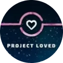

# Discord-Server

Dieser Artikel listet verschiedene [Discord-Server](https://discord.com/) auf, die von der osu!-Community aufgebaut und gepflegt werden, um Diskussionsräume für die vielen Facetten des Spiels zu schaffen. Einige fokussieren sich auf die Verwaltung bestimmter Projekte, während andere allgemein gehalten werden. Die meisten davon haben gemeinsam, dass sie Kanäle für Smalltalk bereitstellen.

## Offiziell

|  | Name | Eigentümer | Beschreibung |
| :-: | :-- | :-- | :-- |
|  | [osu!](https://discord.com/invite/ppy) | ::{ flag=AU }:: [peppy](https://osu.ppy.sh/users/2) | Der **osu!** Discord-Server, vorher auch bekannt als **osu!dev**, ist der offizielle Discord-Server von osu! für entwicklungsrelevante Zwecke. Der Server fungiert als Dreh- und Angelpunkt, um an den quelloffenen Projekten von osu! sowie der Community zu arbeiten und darüber zu diskutieren. Das ist der Hauptort, um an der Entwicklung von osu! teilzunehmen und mit dem [osu!-Team](/wiki/People/osu!_team) in Kontakt zu treten. |

## Gameplay

Diese Server fokussieren sich darauf, Nutzern einen Ort zu geben, in dem sie sich über das Wichtigste aus osu! austauschen können — das Gameplay! Sie dienen als Plattform für Spieler, ihre täglichen Spielerlebnisse in osu! teilen zu können.

|  | Name | Eigentümer | Beschreibung |
| :-: | :-- | :-- | :-- |
|  | [osu! Game](https://discord.com/invite/osu) | ::{ flag=DE }:: [oink](https://osu.ppy.sh/users/300173) | **osu! Game** ist aktuell der größte, von der Community betriebene und für mehrere Spielmodi ausgelegte Discord-Server. Dort werden regelmäßig Events für die Mitglieder veranstaltet und es gibt allgemeine Chatkanäle für die beliebtesten Aktivitäten aus dem Spiel. |
|  | [osu! University](https://discord.com/invite/QubdHdnBVg) | ::{ flag=US }:: [DigitalHypno](https://osu.ppy.sh/users/4384207) | **osu! University** ist ein Community-Discord-Server mit Schwerpunkt auf der Beratung zur Verbesserung der eigenen Fähigkeiten, hauptsächlich im [osu!](/wiki/Game_mode/osu!)-Spielmodus. Es werden laufend verschiedene Events geboten, wie zum Beispiel Interviews der besten Spieler, [Turniere](/wiki/Tournaments) und mit Optimierung zusammenhängende Experimente. |
|  | [osu! Medal Hunters](https://discord.com/invite/8qpNTs6) | ::{ flag=UA }:: [MegaMix](https://osu.ppy.sh/users/18152711) | **osu! Medal Hunters** organisiert Diskussionen über [Medaillen](/wiki/Medals) und [ihre Lösungen](/wiki/Medals/Unlock_requirements). |
|  | [osu!alternative](https://discord.com/invite/VZWRZZXcW4) | ::{ flag=CA }:: [billie eilish](https://osu.ppy.sh/users/6245906) | **osu!alternative** bietet zusätzliche Metriken und Punktetracker, die nicht von der osu!-Webseite stammen. Es ermöglicht Spielern, sich und andere auf eine inoffizielle Art und Weise einzustufen. |

## Entwicklung durch die Community

Diese Server kümmern sich um die Bereitstellung und Entwicklung von Werkzeugen und Systemen für das Spiel. Während die offizielle Entwicklung von osu! im [**osu!** Discord-Server](#offiziell) passiert, nutzen einige Projekte ihren eigenen Arbeitsbereich bevor sie ihre Arbeit an das Spiel weitergeben und dort einfließen lassen.

|  | Name | Eigentümer | Beschreibung |
| :-: | :-- | :-- | :-- |
|  | [Performance Points](https://discord.com/invite/aqPCnXu) | ::{ flag=RU }:: [StanR](https://osu.ppy.sh/users/7217455) | Der **Performance Points**-Server unterstützt die Communityentwicklung der Systeme zu den [Performance-Punkten](/wiki/Performance_points) und der [Sternebewertung](/wiki/Beatmap/Star_rating). |
|  | [osu!catch dev](https://discord.com/invite/YEJBENvFzN) | ::{ flag=FR }:: [bastoo0](https://osu.ppy.sh/users/4864877) | **osu!catch dev** unterstützt die Communityentwicklung der Systeme zu den [Performance-Punkten](/wiki/Performance_points) und der [Sternebewertung](/wiki/Beatmap/Star_rating) speziell bei osu!catch. |
|  | [o!m SR/PP Rework Hub](https://discord.com/invite/GFCNNg8bwk) | ::{ flag=ES }:: [Quenlla](https://osu.ppy.sh/users/4725379) | Der **o!m SR/PP Rework Hub** unterstützt die Communityentwicklung der Systeme zu den [Performance-Punkten](/wiki/Performance_points) und der [Sternebewertung](/wiki/Beatmap/Star_rating) speziell bei osu!mania. |

## Mapping und Modding

Die **Modding & Mapping Hubs** sind Discord-Server von der Community, die für alle aktuellen sowie heranwachsenden Mapper und Modder gemacht sind. Diese Orte dienen dazu, sich mit anderen Nutzern über Mapping für den jeweiligen Spielmodus auszutauschen. Sie bieten die Möglichkeit, unterschiedliche Mapping-Projekte zu planen, zu besprechen und anzukündigen.

|  | Name | Eigentümer | Beschreibung |
| :-: | :-- | :-- | :-- |
|  | [osu!taiko Modding & Mapping Hub](https://discord.com/invite/yRjvvyZ) | ::{ flag=TN }:: [Hivie](https://osu.ppy.sh/users/14102976) | Der **osu!taiko Modding & Mapping Hub** enthält Kanäle für Diskussionen, Ressourcen und Eventankündigungen rund um Mapping und Modding in osu!taiko. |
|  | [osu!catch Modding and Mapping Hub](https://discord.com/invite/ZuxFc4q) | ::{ flag=US }:: [Ascendance](https://osu.ppy.sh/users/2931883) | Der **osu!catch Modding and Mapping Hub** enthält Kanäle für Diskussionen, Ressourcen und Eventankündigungen rund um Mapping und Modding in osu!catch. |
|  | [osu!mania Mapping & Modding Hub](https://discord.com/invite/FqbDdYN) | ::{ flag=ID }:: [Maxus](https://osu.ppy.sh/users/4335785) | Der **osu!mania Mapping & Modding Hub** enthält Kanäle für Diskussionen, Ressourcen und Eventankündigungen rund um Mapping und Modding in osu!mania. |

Neben den Spielmodiservern existieren andere Communityserver, um die Kommunikation zwischen Mappern, Moddern und anderen Nutzern zu vereinfachen.

|  | Name | Eigentümer | Beschreibung |
| :-: | :-- | :-- | :-- |
|  | [Mapset Management Server](https://discord.com/invite/TCDSjhb6yS) | ::{ flag=GE }:: [Kyuunex](https://osu.ppy.sh/users/9236044) | Der **Mapset Management Server** stellt Orte zur Verfügung, um Anfragen für [Mods](/wiki/Modding), [Gast-Schwierigkeiten](/wiki/Beatmap/Guest_difficulty) sowie [Kollaborationen](/wiki/Beatmap/Beatmap_collaborations) zu erstellen und zu durchstöbern. |
|  | [Mentorship](https://discord.com/invite/Ft2FtXmBgx) | ::{ flag=DE }:: [Okoayu](https://osu.ppy.sh/users/1623405) | Der **Mentorship** Server verwaltet das [Community-Mentorenprogramm](/wiki/Community/Community_Mentorship_Program), bei dem in allen Spielmodi saisonale Kurse zum Lernen von [Mapping](/wiki/Beatmapping) und [Modding](/wiki/Modding) angeboten werden. |

## Turniere

Diese Server versuchen, den Nutzern alles rund um [Turniere](/wiki/Tournaments) nahe zu bringen. Nutzern werden regelmäßige Mitteilungen zu anstehenden Turnieren geboten, wodurch Nutzer über aktuelle Turniere, an denen sie teilnehmen können, auf dem Laufenden bleiben. Sowohl Spieler als auch Organisatoren können von den Hilfsmitteln, die diese Server zur Verfügung stellen, profitieren.

|  | Name | Eigentümer | Beschreibung |
| :-: | :-- | :-- | :-- |
|  | [osu! Tournament Hub](https://discord.com/invite/bvhajDC) | ::{ flag=MY }:: [Sikey](https://osu.ppy.sh/users/343057) | Der **osu! Tournament Hub** bietet Infomaterial über die Organisation von Turnieren sowie Kanäle zur Werbung neuer Turniere und Personalausschreibungen in allen Spielmodi und Regionen. |
|  | [osu!mania Tourney Central](https://discord.com/invite/WnMcrUnGV5) | ::{ flag=US }:: [-mint-](https://osu.ppy.sh/users/8976576) | **osu!mania Tourney Central** fokussiert sich auf Ressourcen und Personalausschreibungen für Turniere im osu!mania-Spielmodus. |
|  | [poolingcore](https://discord.com/invite/gpEbCBE7Jg) | ::{ flag=CA }:: [chiv](https://osu.ppy.sh/users/6701656) | **poolingcore** stellt Infomaterial rund um Turnier-Mappooling sowie Mapping vorwiegend im osu!-Spielmodus bereit. Auf dem Server werden gelegentlich Spiele und Wettbewerbe zum Thema Mappooling abgehalten. Des Weiteren können verifizierte Veranstalter aktive Mappooler und Mapper für ihr Turnier finden. |

## Project Loved

[Project Loved](/wiki/Community/Project_Loved) organisiert seine Arbeitsabläufe in verschiedenen Servern, unterteilt nach dem [Spielmodus](/wiki/Game_mode), mit dem sie sich auseinandersetzen. Diese Server ermöglichen die Diskussion über künftige Auswahlen für jeden Modus.

|  | Name | Eigentümer | Beschreibung |
| :-: | :-- | :-- | :-- |
|  | [osu! Project Loved](https://discord.com/invite/gn58Uk5sTE) | ::{ flag=US }:: [Librarian](https://osu.ppy.sh/users/10083084) | **osu! Project Loved** veranstaltet Diskussionen und bietet Ankündigungen rund um Project Loved für den osu!-Spielmodus. |
|  | [Project Loved: Taiko](https://discord.com/invite/GhfjtZ6) | ::{ flag=TN }:: [Hivie](https://osu.ppy.sh/users/14102976) | **Project Loved: Taiko** veranstaltet Diskussionen und bietet Ankündigungen rund um Project Loved für den osu!taiko-Spielmodus. |
|  | [osu!catch Project Loved](https://discord.com/invite/phgtyS4UCh) | ::{ flag=NL }:: [Wesley](https://osu.ppy.sh/users/2407265) | **osu!catch Project Loved** veranstaltet Diskussionen und bietet Ankündigungen rund um Project Loved für den osu!catch-Spielmodus. |
|  | [osu!mania Loved Community](https://discord.com/invite/Ededv7m) | ::{ flag=FR }:: [Paturages](https://osu.ppy.sh/users/1375479) | **osu!mania Loved Community** veranstaltet Diskussionen und bietet Ankündigungen rund um Project Loved für den osu!mania-Spielmodus. |

## Skinning

Diese Server versuchen, hilfreiche Orte rund um Skinning zu bieten, egal ob die Spieler Designexperten sind oder frisch mit Skinning anfangen. Nutzer erwarten zahlreiche Lernmaterialien zu [Skinning](/wiki/Skinning) sowie die Hilfe anderer Nutzer, die ebenso an dem Thema interessiert sind.

|  | Name | Eigentümer | Beschreibung |
| :-: | :-- | :-- | :-- |
|  | [skinship](https://discord.skinship.xyz/) | ::{ flag=DE }:: [RockRoller](https://osu.ppy.sh/users/8388854) | **skinship** ist eine Platform, um alles zu besprechen, was mit Skinning zu tun hat. Dort sind auch Projekte wie [Skinning-Wettbewerbe](/wiki/Contests/Skinning_Contest) und das [Completed Skins Compendium](https://compendium.skinship.xyz/) zu finden. Zur weiteren Unterstützung dient der Bot-Account [skinship](https://osu.ppy.sh/users/32231941). |

## Storyboarding

Diese Server stellen Hilfsmittel bereit, um Nutzern beim [Storyboarding](/wiki/Storyboard) zu helfen. Sie sind ein guter Startpunkt für Anfänger, die es einfacher haben werden, in das Storyboarding einzutauchen und gleichzeitig Unterstützung von erfahrenen Spielern zu erhalten.

|  | Name | Eigentümer | Beschreibung |
| :-: | :-- | :-- | :-- |
|  | [osu! storyboarder banquet](https://discord.com/invite/B8NX7YW) | ::{ flag=CA }:: [Sidetail](https://osu.ppy.sh/users/2036217) | **osu! storyboarder banquet** dient als Platz rund um Storyboarding. Zusammen mit der [Webseite](https://osb.moe/) bietet der Server Nutzern viele Lernressourcen und regelmäßige Präsentationen von Storyboards, die von der Community gemacht wurden. |

## Verschiedenes

|  | Name | Eigentümer | Beschreibung |
| :-: | :-- | :-- | :-- |
|  | [Aiess Project](https://discord.com/invite/2XV5dcW) | ::{ flag=SE }:: [Naxess](https://osu.ppy.sh/users/8129817) | Das **Aiess Project** betreibt mehrere Feeds, die die Mitglieder regelmäßig über osu!-Events informieren, wie zum Beispiel Änderungen der [Beatmap-Kategorie](/wiki/Beatmap/Category), Aktualisierungen in den [Nutzergruppen](/wiki/People/User_group) und neue Nachrichtenbeiträge. |
