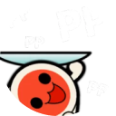
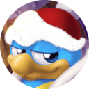
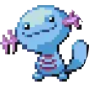
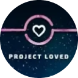
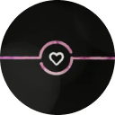
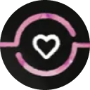
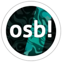
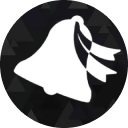

# Discord servers

This article lists various [Discord](https://discord.com/) servers that have been created and maintained by the osu! community to host discussion spaces about the game's many different facets. Some are focused on the management of specific projects, while others are more general, but most of them include casual chat channels regardless.

## Official

|  | Name | Owner | Description |
| :-: | :-- | :-- | :-- |
|  | [osu!](https://discord.com/invite/ppy) | ::{ flag=AU }:: [peppy](https://osu.ppy.sh/users/2) | The **osu!** Discord server, previously known as **osu!dev**, is osu!'s official Discord server for development-related purposes. The server functions as a hub for people to discuss and work on osu!'s open source and community projects. This is the main place to contribute to osu!'s development and get in touch with the [osu! team](/wiki/People/osu!_team). |

## Gameplay

These servers are focused on giving users a place to discuss osu!'s main attraction — the gameplay! They serve as hubs for players to interact with their daily gaming ventures in osu!.

|  | Name | Owner | Description |
| :-: | :-- | :-- | :-- |
|  | [osu! Game](https://discord.com/invite/osu) | ::{ flag=DE }:: [oink](https://osu.ppy.sh/users/300173) | **osu! Game** is currently the largest community-driven, multi-mode Discord server. It hosts regular events among its members and includes general chat channels for the game's most popular activities. |
|  | [osu! University](https://discord.com/invite/QubdHdnBVg) | ::{ flag=US }:: [DigitalHypno](https://osu.ppy.sh/users/4384207) | **osu! University** is a community Discord server with a focus on discussion about improvement, mainly in the [osu!](/wiki/Game_mode/osu!) game mode. It regularly hosts various events such as top player interviews, [tournaments](/wiki/Tournaments), and improvement-related studies. |
|  | [osu! Medal Hunters](https://discord.com/invite/8qpNTs6) | ::{ flag=UA }:: [MegaMix](https://osu.ppy.sh/users/18152711) | **osu! Medal Hunters** hosts discussion about [medals](/wiki/Medals) and [medal solutions](/wiki/Medals/Unlock_requirements). |
|  | [osu!alternative](https://discord.com/invite/VZWRZZXcW4) | ::{ flag=CA }:: [billie eilish](https://osu.ppy.sh/users/6245906) | **osu!alternative** offers extra metrics and score trackers not provided by the osu! website. It allows players to rank each other and their scores in an unofficial manner. |

## Community development

These servers focus on providing and developing tools and systems for the game. While the official development of osu! is done in the [**osu!** Discord server](#official), some projects make use of their own work spaces before proposing and merging their work in game.

|  | Name | Owner | Description |
| :-: | :-- | :-- | :-- |
|  | [Performance Points](https://discord.com/invite/aqPCnXu) | ::{ flag=RU }:: [StanR](https://osu.ppy.sh/users/7217455) | The **Performance Points** server facilitates community development of [performance points](/wiki/Performance_points) and [star rating](/wiki/Beatmap/Star_rating) systems. |
|  | [osu!catch dev](https://discord.com/invite/YEJBENvFzN) | ::{ flag=FR }:: [bastoo0](https://osu.ppy.sh/users/4864877) | **osu!catch dev** facilitates community development of osu!catch [performance points](/wiki/Performance_points) and [star rating](/wiki/Beatmap/Star_rating) systems. |
|  | [o!m SR/PP Rework Hub](https://discord.com/invite/GFCNNg8bwk) | ::{ flag=ES }:: [Quenlla](https://osu.ppy.sh/users/4725379) | The **o!m SR/PP Rework Hub** facilitates community development of osu!mania [performance points](/wiki/Performance_points) and [star rating](/wiki/Beatmap/Star_rating) systems. |

## Mapping and modding

The **Modding & Mapping Hubs** are community Discord servers designed for all current and aspiring mappers and modders. These are places meant to interact between other users interested in mapping for the game mode. They offer a place to organise, discuss, and advertise different mapping projects.

|  | Name | Owner | Description |
| :-: | :-- | :-- | :-- |
|  | [osu! Modding & Mapping Hub](https://discord.gg/gw5EtzgEXf) | ::{ flag=US }:: [radar](https://osu.ppy.sh/users/7131099) | The **osu! Modding & Mapping Hub** hosts channels for discussions, resources and event announcements around mapping and modding in osu!. |
|  | [osu!taiko Modding & Mapping Hub](https://discord.com/invite/yRjvvyZ) | ::{ flag=TN }:: [Hivie](https://osu.ppy.sh/users/14102976) | The **osu!taiko Modding & Mapping Hub** hosts channels for discussions, resources and event announcements around mapping and modding in osu!taiko. |
|  | [osu!catch Modding and Mapping Hub](https://discord.com/invite/ZuxFc4q) | ::{ flag=US }:: [Ascendance](https://osu.ppy.sh/users/2931883) | The **osu!catch Modding and Mapping Hub** hosts channels for discussions, resources and event announcements around mapping and modding in osu!catch. |
|  | [osu!mania Mapping & Modding Hub](https://discord.com/invite/FqbDdYN) | ::{ flag=ID }:: [Maxus](https://osu.ppy.sh/users/4335785) | The **osu!mania Mapping & Modding Hub** hosts channels for discussions, resources and event announcements around mapping and modding in osu!mania. |

Besides the game mode hubs, other community servers exist to facilitate communication between mappers, modders, and other users alike.

|  | Name | Owner | Description |
| :-: | :-- | :-- | :-- |
|  | [Mapset Management Server](https://discord.com/invite/TCDSjhb6yS) | ::{ flag=GE }:: [Kyuunex](https://osu.ppy.sh/users/9236044) | The **Mapset Management Server** hosts spaces to create and browse requests for [mods](/wiki/Modding), [guest difficulties](/wiki/Beatmap/Guest_difficulty), and [collaborations](/wiki/Beatmap/Beatmap_collaborations) in a casual environment. |
|  | [Mentorship](https://discord.com/invite/Ft2FtXmBgx) | ::{ flag=DE }:: [Okoayu](https://osu.ppy.sh/users/1623405) | The **Mentorship** server manages the [Community Mentorship Program](/wiki/Community/Community_Mentorship_Program), hosting seasonal classes to teach and learn [mapping](/wiki/Beatmapping) and [modding](/wiki/Modding) for all game modes. |

## Tournaments

These servers aim to provide users everything related to [tournaments](/wiki/Tournaments). By providing users with regular notices on upcoming tournaments, users can stay tuned with the latest tournaments they can be a part of. Both players and staff members can benefit from the resources provided by these servers.

|  | Name | Owner | Description |
| :-: | :-- | :-- | :-- |
|  | [osu! Tournament Hub](https://discord.com/invite/bvhajDC) | ::{ flag=MY }:: [Sikey](https://osu.ppy.sh/users/343057) | The **osu! Tournament Hub** provides resources around tournament organisation and channels for advertising new tournaments and staff recruitments in all game modes and regions. |
|  | [osu!mania Tourney Central](https://discord.com/invite/WnMcrUnGV5) | ::{ flag=US }:: [-mint-](https://osu.ppy.sh/users/8976576) | **osu!mania Tourney Central** focuses on resources and staff recruitments for tournaments in the osu!mania game mode. |
|  | [poolingcore](https://discord.com/invite/gpEbCBE7Jg) | ::{ flag=CA }:: [chiv](https://osu.ppy.sh/users/6701656) | **poolingcore** provides resources around tournament mappooling and mapping primarily in the osu! game mode. The server features occasional games and contests related to mappooling and allows verified hosts to recruit active mappoolers and mappers for their tournaments. |

## Project Loved

[Project Loved](/wiki/Community/Project_Loved) organises its workflows in different servers, divided by the [game mode](/wiki/Game_mode) which they specialise in. These servers aim to facilitate the discussion of prospective picks for each mode.

|  | Name | Owner | Description |
| :-: | :-- | :-- | :-- |
|  | [osu! Project Loved](https://discord.com/invite/gn58Uk5sTE) | ::{ flag=US }:: [Librarian](https://osu.ppy.sh/users/10083084) | **osu! Project Loved** hosts discussion and provides announcements around Project Loved for the osu! game mode. |
|  | [Project Loved: Taiko](https://discord.com/invite/GhfjtZ6) | ::{ flag=TN }:: [Hivie](https://osu.ppy.sh/users/14102976) | **Project Loved: Taiko** hosts discussion and provides announcements around Project Loved for the osu!taiko game mode. |
|  | [osu!catch Project Loved](https://discord.com/invite/phgtyS4UCh) | ::{ flag=NL }:: [Wesley](https://osu.ppy.sh/users/2407265) | **osu!catch Project Loved** hosts discussion and provides announcements around Project Loved for the osu!catch game mode. |
|  | [osu!mania Loved Community](https://discord.com/invite/Ededv7m) | ::{ flag=FR }:: [Paturages](https://osu.ppy.sh/users/1375479) | **osu!mania Loved Community** hosts discussion and provides announcements around Project Loved for the osu!mania game mode. |

## Skinning

These servers aim to provide safe places for skinners, no matter if they are design experts or brand-new to skinning. Users can expect to find multiple [skinning](/wiki/Skinning) resources, as well as receiving help from other users interested in the matter.

|  | Name | Owner | Description |
| :-: | :-- | :-- | :-- |
|  | [skinship](https://discord.skinship.xyz/) | ::{ flag=DE }:: [RockRoller](https://osu.ppy.sh/users/8388854) | **skinship** is a place to discuss anything involving skinning, while also hosting projects such as [Skinning Contests](/wiki/Contests/Skinning_Contest) and the [Completed Skins Compendium](https://compendium.skinship.xyz/). Users can manage their skinning affairs by reaching out the [skinship bot account](https://osu.ppy.sh/users/32231941). |

## Storyboarding

These servers aim to provide users with resources to help them in their [storyboarding](/wiki/Storyboard) affairs. They are good starting points for beginners who will have an easier time easing themselves in the world of storyboarding while getting help from experienced users.

|  | Name | Owner | Description |
| :-: | :-- | :-- | :-- |
|  | [osu! storyboarder banquet](https://discord.com/invite/B8NX7YW) | ::{ flag=CA }:: [Sidetail](https://osu.ppy.sh/users/2036217) | The **osu! storyboarder banquet** serves as a place all about storyboarding. With the help of their [website](https://osb.moe/), this server aims to provide users with multiple learning resources and a regular showcase of community-made storyboards. |

## Miscellaneous

|  | Name | Owner | Description |
| :-: | :-- | :-- | :-- |
|  | [Aiess Project](https://discord.com/invite/2XV5dcW) | ::{ flag=SE }:: [Naxess](https://osu.ppy.sh/users/8129817) | The **Aiess Project** maintains several feeds that inform members of events that happen in osu! on a regular basis, such as [beatmap category](/wiki/Beatmap/Category) changes, [user group](/wiki/People/User_group) updates, and news posts. |
