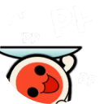
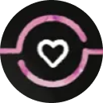

# Servidores de Discord

Este artículo enumera varios servidores de [Discord](https://discord.com/) que han sido creados y mantenidos por la comunidad de osu! para albergar lugares de discusión sobre los diferentes aspectos del juego. Algunos se centran en la gestión de proyectos concretos, mientras que otros son más generales, pero la mayoría incluyen canales de chat casuales a pesar de todo.

## Servidor oficial de osu!

|  | Nombre | Propietario | Descripción |
| :-: | :-- | :-- | :-- |
|  | [osu!](https://discord.gg/ppy) | ::{ flag=AU }:: [peppy](https://osu.ppy.sh/users/2) | El servidor de Discord **osu!**, anteriormente conocido como **osu!dev**, es el servidor de Discord oficial de osu! para fines relacionados con el desarrollo del juego. El servidor funciona como un lugar donde la gente pueda discutir y trabajar en los proyectos de la comunidad y de código abierto de osu!. Este es el lugar principal para contribuir al desarrollo de osu! y ponerse en contacto con el [osu! team](/wiki/People/osu!_team). |

## Servidores relacionados con la jugabilidad

Estos servidores se centran en ofrecer a los usuarios un lugar para charlar sobre la principal atracción de osu!, es decir, ¡su jugabilidad! Sirven como lugares de encuentro para que los jugadores interactúen y compartan sus partidas de osu!.

|  | Nombre | Propietario | Descripción |
| :-: | :-- | :-- | :-- |
|  | [osu! Game](https://discord.com/invite/osu) | ::{ flag=DE }:: [oink](https://osu.ppy.sh/users/300173) | **osu! Game** es actualmente el servidor de Discord más grande gestionado por la comunidad. Organiza eventos con regularidad entre sus miembros e incluye canales de chat generales para las actividades más populares del juego. |
|  | [osu! University](https://discord.com/invite/QubdHdnBVg) | ::{ flag=US }:: [DigitalHypno](https://osu.ppy.sh/users/4384207) | **osu! University** es un servidor de Discord de la comunidad con un enfoque en la discusión sobre cómo mejorar en el juego, principalmente en el modo de juego [osu!](/wiki/Game_mode/osu!). Organiza con regularidad diversos eventos, como entrevistas a los top players, [torneos](/wiki/Tournaments) y estudios relacionados sobre cómo mejorar. |
|  | [osu! Medal Hunters](https://discord.com/invite/8qpNTs6) | ::{ flag=UA }:: [MegaMix](https://osu.ppy.sh/users/18152711) | **osu! Medal Hunters** sirve como un lugar de discusión sobre las [medallas](/wiki/Medals) y sus [soluciones](/wiki/Medals/Unlock_requirements). |
|  | [osu!alternative](https://discord.com/invite/VZWRZZXcW4) | ::{ flag=CA }:: [billie eilish](https://osu.ppy.sh/users/6245906) | **osu!alternative** ofrece estadísticas y tablas de puntuación adicionales que no ofrece el sitio web de osu!. Esto le permite a los jugadores clasificar a los demás y a sus puntuaciones de una manera no oficial. |

## Servidores relacionados con el desarrollo de la comunidad

Estos servidores se centran en proporcionar y desarrollar herramientas y sistemas para el juego. Si bien el desarrollo oficial de osu! se realiza en el [servidor de Discord **osu!**](#servidor-oficial-de-osu!), algunos proyectos hacen uso de sus propios espacios de trabajo antes de proponer y fusionar su trabajo en el juego.

|  | Nombre | Propietario | Descripción |
| :-: | :-- | :-- | :-- |
|  | [Performance Points](https://discord.com/invite/aqPCnXu) | ::{ flag=RU }:: [StanR](https://osu.ppy.sh/users/7217455) | El servidor **Performance Points** facilita el desarrollo por parte de la comunidad del sistema de los [puntos de rendimiento](/wiki/Performance_points) y la [calificación por estrellas](/wiki/Beatmap/Star_rating). |
|  | [osu!catch dev](https://discord.com/invite/YEJBENvFzN) | ::{ flag=FR }:: [bastoo0](https://osu.ppy.sh/users/4864877) | **osu!catch dev** facilita el desarrollo por parte de la comunidad del sistema de los [puntos de rendimiento](/wiki/Performance_points) y la [calificación por estrellas](/wiki/Beatmap/Star_rating) de osu!catch. |
|  | [o!m SR/PP Rework Hub](https://discord.gg/GFCNNg8bwk) | ::{ flag=ES }:: [Quenlla](https://osu.ppy.sh/users/4725379) | El **o!m SR/PP Rework Hub** facilita el desarrollo por parte de la comunidad del sistema de los [puntos de rendimiento](/wiki/Performance_points) y la [calificación por estrellas](/wiki/Beatmap/Star_rating) de osu!mania. |

## Servidores relacionados con el mapping y modding

Los **Modding & Mapping Hubs** son servidores de Discord de la comunidad diseñados para todos los mappers y modders actuales y aspirantes. Estos lugares están pensados para la interacción entre otros usuarios interesados en el mapping del modo de juego que prefieran. Ofrecen un lugar para organizar, discutir y anunciar distintos proyectos de mapping.

|  | Nombre | Propietario | Descripción |
| :-: | :-- | :-- | :-- |
|  | [osu! Modding & Mapping Hub](https://discord.gg/gw5EtzgEXf) | ::{ flag=US }:: [radar](https://osu.ppy.sh/users/7131099) | El **osu! Modding & Mapping Hub** ofrece canales para discusiones, recursos y anuncios de eventos relacionados con el mapping y modding de osu!. |
|  | [osu!taiko Modding & Mapping Hub](https://discord.com/invite/yRjvvyZ) | ::{ flag=TN }:: [Hivie](https://osu.ppy.sh/users/14102976) | El **osu!taiko Modding & Mapping Hub** ofrece canales para discusiones, recursos y anuncios de eventos relacionados con el mapping y modding de osu!taiko. |
|  | [osu!catch Modding and Mapping Hub](https://discord.com/invite/ZuxFc4q) | ::{ flag=US }:: [Ascendance](https://osu.ppy.sh/users/2931883) | El **osu!catch Modding and Mapping Hub** ofrece canales para discusiones, recursos y anuncios de eventos relacionados con el mapping y modding de osu!catch. |
|  | [osu!mania Mapping & Modding Hub](https://discord.com/invite/FqbDdYN) | ::{ flag=ID }:: [Maxus](https://osu.ppy.sh/users/4335785) | El **osu!mania Mapping & Modding Hub** ofrece canales para discusiones, recursos y anuncios de eventos relacionados con el mapping y modding de osu!mania. |

Además de los servidores de los modos de juego, existen otros servidores de la comunidad para facilitar la comunicación entre mappers, modders y otros usuarios.

|  | Nombre | Propietario | Descripción |
| :-: | :-- | :-- | :-- |
|  | [Mapset Management Server](https://discord.com/invite/TCDSjhb6yS) | ::{ flag=GE }:: [Kyuunex](https://osu.ppy.sh/users/9236044) | El **Mapset Management Server** ofrece un lugar para crear y buscar solicitudes de [mods](/wiki/Modding), [dificultades de invitados](/wiki/Beatmap/Guest_difficulty), y [colaboraciones](/wiki/Beatmap/Beatmap_collaborations) en un entorno casual. |
|  | [Mentorship](https://discord.com/invite/Ft2FtXmBgx) | ::{ flag=DE }:: [Okoayu](https://osu.ppy.sh/users/1623405) | El servidor **Mentorship** gestiona el [Community Mentorship Program](/wiki/Community/Community_Mentorship_Program), dando clases por temporadas para enseñar y aprender a [mapear](/wiki/Beatmapping) y a [modear](/wiki/Modding) para todos los modos de juego. |

## Servidores relacionados con los torneos

Estos servidores tienen como objetivo proporcionar a los usuarios todo lo relacionado con los [torneos](/wiki/Tournaments). Proporcionando a los usuarios avisos regulares sobre los próximos torneos, los usuarios pueden estar al tanto de los torneos más recientes en los que les gustaría participar. Tanto los jugadores como los miembros del personal pueden beneficiarse de los recursos que ofrecen estos servidores.

|  | Nombre | Propietario | Descripción |
| :-: | :-- | :-- | :-- |
|  | [osu! Tournament Hub](https://discord.com/invite/bvhajDC) | ::{ flag=MY }:: [Sikey](https://osu.ppy.sh/users/343057) | El **osu! Tournament Hub** ofrece recursos en torno a la organización de torneos y canales para anunciar nuevos torneos y reclutar personal en todos los modos de juego y regiones. |
|  | [osu!mania Tourney Central](https://discord.com/invite/WnMcrUnGV5) | ::{ flag=US }:: [-mint-](https://osu.ppy.sh/users/8976576) | **osu!mania Tourney Central** se centra en los recursos y el reclutamiento de personal para los torneos de osu!mania. |
|  | [poolingcore](https://discord.com/invite/gpEbCBE7Jg) | ::{ flag=CA }:: [chiv](https://osu.ppy.sh/users/6701656) | **poolingcore** ofrece recursos en torno al mappooling y el mapping de torneos, principalmente para el modo de juego osu!. El servidor organiza ocasionalmente juegos y concursos relacionados con el mappooling, lo que permite a los anfitriones de torneos verificados reclutar mappoolers y mappers activos para sus torneos. |

## Servidores relacionados con el Project Loved

El [Project Loved](/wiki/Community/Project_Loved) organiza sus operaciones en diferentes servidores, divididos por el [modo de juego](/wiki/Game_mode) en el que están especializados. El objetivo de estos servidores es facilitar la discusión sobre las posibles selecciones de cada modo.

|  | Nombre | Propietario | Descripción |
| :-: | :-- | :-- | :-- |
|  | [osu! Project Loved](https://discord.com/invite/gn58Uk5sTE) | ::{ flag=US }:: [Librarian](https://osu.ppy.sh/users/10083084) | **osu! Project Loved** ofrece un lugar para discutir y hacer anuncios sobre el Project Loved para el modo de juego osu!. |
|  | [Project Loved: Taiko](https://discord.com/invite/GhfjtZ6) | ::{ flag=TN }:: [Hivie](https://osu.ppy.sh/users/14102976) | **Project Loved: Taiko** ofrece un lugar para discutir y hacer anuncios sobre el Project Loved de osu!taiko. |
|  | [osu!catch Project Loved](https://discord.com/invite/phgtyS4UCh) | ::{ flag=NL }:: [Wesley](https://osu.ppy.sh/users/2407265) | **osu!catch Project Loved** ofrece un lugar para discutir y hacer anuncios sobre el Project Loved de osu!catch. |
|  | [osu!mania Loved Community](https://discord.com/invite/Ededv7m) | ::{ flag=FR }:: [Paturages](https://osu.ppy.sh/users/1375479) | **osu!mania Loved Community** ofrece un lugar para discutir y hacer anuncios sobre el Project Loved de osu!mania. |

## Servidores relacionados con la creación de skins

El objetivo de estos servidores es proporcionar lugares seguros a los creadores de skins, ya sean expertos o novatos. Los usuarios pueden esperar encontrar múltiples recursos para [crear skins](/wiki/Skinning), así como recibir ayuda de otros usuarios interesados en el tema.

|  | Nombre | Propietario | Descripción |
| :-: | :-- | :-- | :-- |
|  | [skinship](https://discord.skinship.xyz/) | ::{ flag=DE }:: [RockRoller](https://osu.ppy.sh/users/8388854) | **skinship** es un lugar para discutir sobre cualquier tema relacionado con la creación de skins, además de albergar proyectos como los [concursos de creación de skins](/wiki/Contests/Skinning_Contest) y el [compendio de skins completadas](https://compendium.skinship.xyz/). Los usuarios pueden gestionar sus asuntos relacionados con la creación de skins a través de la cuenta [bot de skinship](https://osu.ppy.sh/users/32231941). |

## Servidores relacionados con la creación de storyboards

El objetivo de estos servidores es proporcionar a los usuarios recursos que les ayuden en sus asuntos relacionados con la [creación de storyboards](/wiki/Storyboard). Son buenos puntos de partida para los principiantes, ya que les resultará más fácil adentrarse en el mundo de los storyboards mientras reciben ayuda de usuarios experimentados.

|  | Nombre | Propietario | Descripción |
| :-: | :-- | :-- | :-- |
|  | [osu! storyboarder banquet](https://discord.com/invite/B8NX7YW) | ::{ flag=CA }:: [Sidetail](https://osu.ppy.sh/users/2036217) | El **osu! storyboarder banquet** es un lugar dedicado exclusivamente a la creación de storyboards. Con la ayuda de su [sitio web](https://osb.moe/), este servidor tiene como objetivo proporcionar a los usuarios múltiples recursos de aprendizaje y una presentación regular de storyboards realizados por la comunidad. |

## Otros

|  | Nombre | Propietario | Descripción |
| :-: | :-- | :-- | :-- |
|  | [Aiess Project](https://discord.com/invite/2XV5dcW) | ::{ flag=SE }:: [Naxess](https://osu.ppy.sh/users/8129817) | El **Aiess Project** mantiene varios canales de información que notifican a los miembros los eventos que ocurren en osu! de forma regular, como cambios en la [categoría de los beatmaps](/wiki/Beatmap/Category), actualizaciones en los [grupos de usuarios](/wiki/People/User_group), y noticias. |
