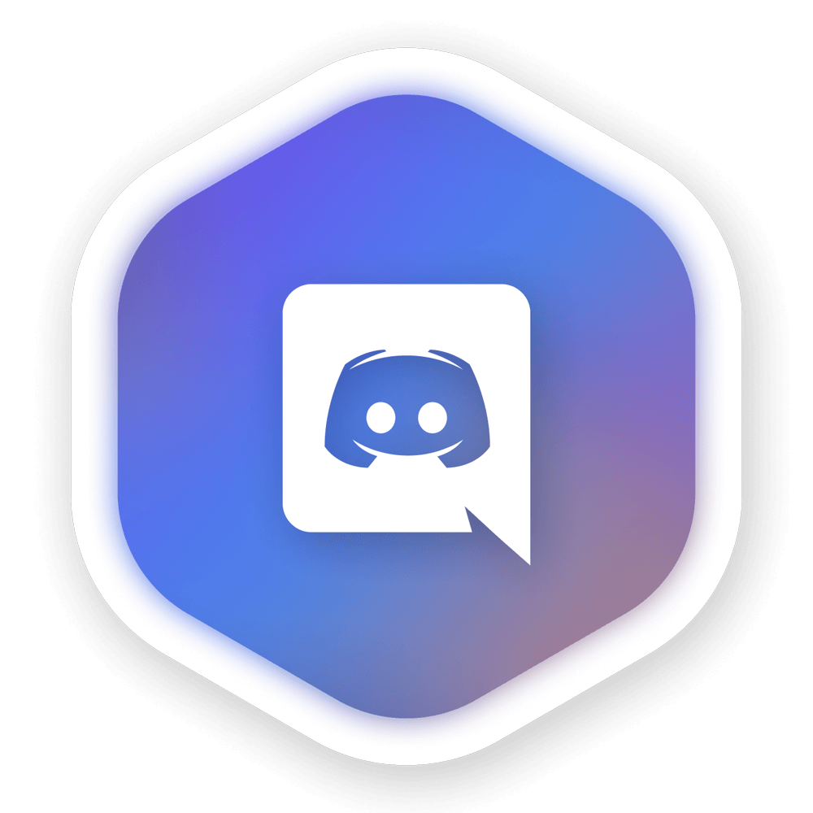
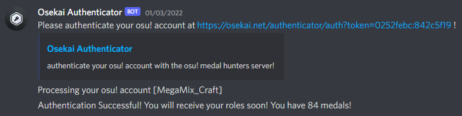
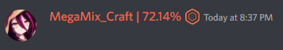

---
tags:
  - medals
  - medal hunting
---

# osu! Medal Hunters Discord server

::: Infobox

<!-- lint ignore heading-increment -->

#### osu! Medal Hunters

|  |  |
| :-- | :-- |
| Invite link | <https://discord.gg/osumedalhunters> |
| Alternative invite link | <https://discord.gg/8qpNTs6> |

:::

*Notice: While working together in order to find Hush-Hush medals is encouraged, finding them by yourself is as well. Be advised that the server contains solutions to Hush-Hush medals.*

**osu! Medal Hunters** is the main [Discord](https://discord.com) server used by the medal hunting community, where people discuss [medals](/wiki/Medals) and [medal solutions](/wiki/Medals/Unlock_requirements).

A lot of medal hunters work together in order to find solutions for each new Hush-Hush medal added into the game. Every time new medals get released, they are announced by one of the server staff members, threads for each medal are created, and people work together to hunt down the solutions.

## Staff

| Role | User (Discord handle) |
| :-- | :-- |
| Server owner | ::{ flag=CA }:: [Remyria](https://osu.ppy.sh/users/1699875) (Remyria#0001) |
| Server admin | ::{ flag=GB }:: [Tanza3D](https://osu.ppy.sh/users/10379965) (Hubz#6283, Tanza#8733), ::{ flag=DE }:: [mulraf](https://osu.ppy.sh/users/1309242) (mulraf#1087) |
| Community manager & server admin | ::{ flag=UA }:: [MegaMix_Craft](https://osu.ppy.sh/users/18152711) (MegaMix_Craft#1151), ::{ flag=GB }:: [chromb](https://osu.ppy.sh/users/10238680) (chromb#4528), ::{ flag=CA }:: [Remyria](https://osu.ppy.sh/users/1699875) (Remyria#0001) |
| Server moderator | ::{ flag=US }:: [bentokage](https://osu.ppy.sh/users/13175102) (bento#6969) |

## Verification

Anyone can send messages in the server by default, but by authenticating with an osu! account using the Osekai Authenticator bot, members are allowed to send images and get a medal completion percentage automatically put next to their nickname.

