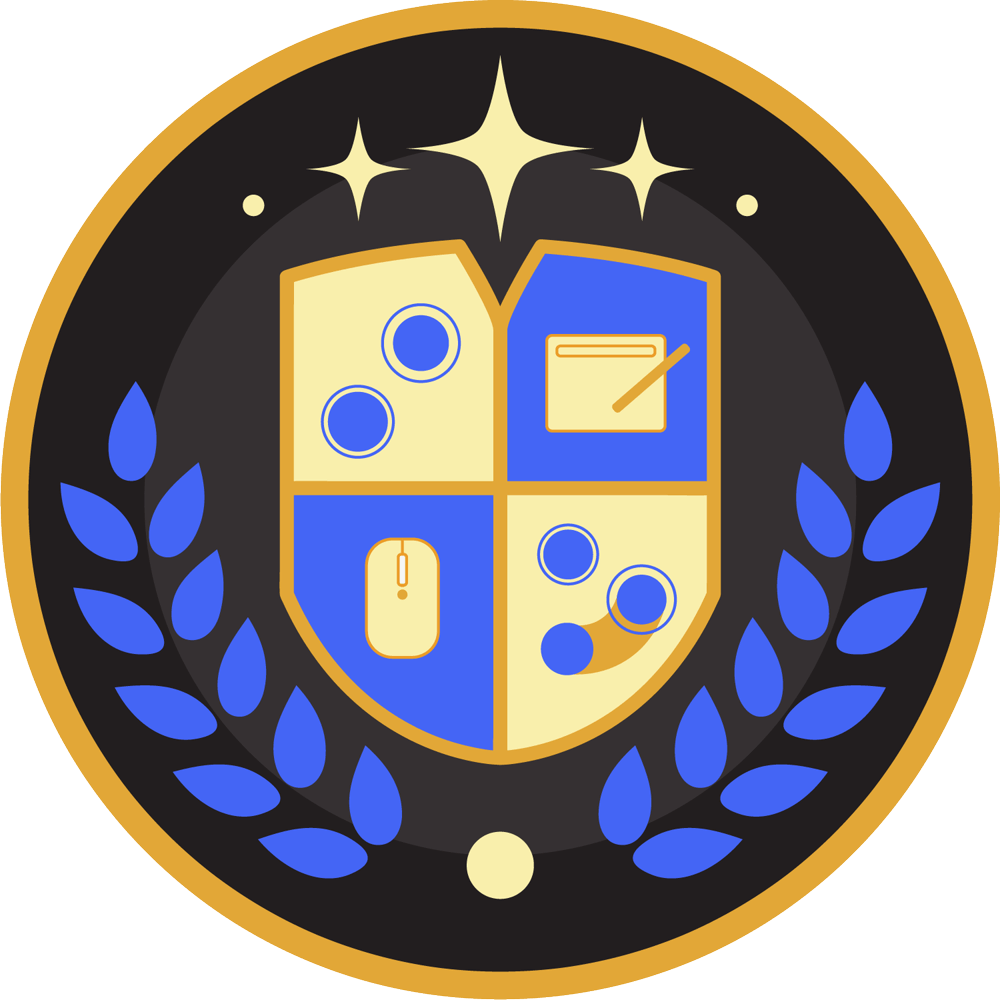

# Serveur Discord osu! University

::: Infobox

<!-- lint ignore heading-increment -->

#### osu! University

|  |  |
| :-- | :-- |
| Lien d'invitation | <https://discord.gg/QubdHdnBVg> |
| Chaîne Twitch | [osuuniversity](https://twitch.tv/osuuniversity) |
| Identifiant Twitter | [@osuuniversity](https://twitter.com/osuuniversity) |
| Chaîne Spotify | [osu! University](https://open.spotify.com/show/1KJTvGLOmUTnvbZoZGLlMP) |
| Chaîne YouTube | [osu! University](https://www.youtube.com/c/osuUniversity) |

:::

**osu! University** est un serveur [Discord](https://discord.com) communautaire axé sur les discussions relatives à l'amélioration, principalement dans le mode de jeu [osu!](/wiki/Game_mode/osu!). Il accueille régulièrement divers événements tels que des interviews de joueurs de haut niveau, des [tournois](/wiki/Tournaments) et des études sur l'amélioration. Il est également connu pour ses services de coaching payants.

Le serveur héberge également les fondations pour le développement, les tests et le support du programme [Rewind](https://osu.ppy.sh/community/forums/topics/1451845), qui est un outil d'analyse des [replays](/wiki/Gameplay/Replay).

## Staff

| Rôle | Utilisateur (Identifiant Discord) |
| :-- | :-- |
| Propriétaire du serveur | ::{ flag=US }:: [DigitalHypno](https://osu.ppy.sh/users/4384207) (habib?#2017) |
| Modérateurs | ::{ flag=IN }:: [\_Joan\_](https://osu.ppy.sh/users/16119852) (Joan♡#2331), ::{ flag=US }:: [Apraxia](https://osu.ppy.sh/users/4194445) (xav#6699), ::{ flag=GB }:: [chido](https://osu.ppy.sh/users/12339533) (chido#6526), ::{ flag=US }:: [Dain](https://osu.ppy.sh/users/3426414) (Dain#0001), ::{ flag=US }:: [Dorian -](https://osu.ppy.sh/users/13646749) (dorian#1337), ::{ flag=US }:: [yfruit](https://osu.ppy.sh/users/25839097) (a fluffy fruit#7626), ::{ flag=US }:: [im a fancy lad](https://osu.ppy.sh/users/4908650) (joel.#1859), ::{ flag=US }:: [Kahli](https://osu.ppy.sh/users/8926244) (Kahli#1017), ::{ flag=US }:: [Kuuube](https://osu.ppy.sh/users/11160804) (Kuuube#6878), ::{ flag=MY }:: [Gdzplayz](https://osu.ppy.sh/users/12911157) (Gdzplayz#1227), ::{ flag=US }:: [Larkspur](https://osu.ppy.sh/users/17968640) (auiopha#5267), ::{ flag=VN }:: [peachansimp](https://osu.ppy.sh/users/14585583) (Rylie#7704), ::{ flag=US }:: [shi-](https://osu.ppy.sh/users/20885646) (shi#8850), ::{ flag=US }:: [Spry](https://osu.ppy.sh/users/7069714) (Spry#1515), ::{ flag=DK }:: [TGRElite123](https://osu.ppy.sh/users/17217053) (Straitos#8293), ::{ flag=US }:: [Ziplup](https://osu.ppy.sh/users/10352315) (EdgeLord#4597) |

## Événements

| Date | Événement | Liens associés |
| :-- | :-- | :-- |
| 09/08/2021 - 13/08/2021 | Semaine d'interview de top player (contrôle du stress) | [Playlist YouTube](https://www.youtube.com/playlist?list=PL_QhgSQeB2zCEiwKnHwliUGbtjE4hI0MG) |
| 30/08/2021 - 03/09/2021 | Semaine d'interview de top player (mindblock) | [Playlist YouTube](https://www.youtube.com/playlist?list=PL_QhgSQeB2zD4GdoGOympAkhhSIytKect) |
| 27/09/2021 - 01/10/2021 | Semaine d'interview de top player (AR élevé) | [Playlist YouTube](https://www.youtube.com/playlist?list=PL_QhgSQeB2zDGmnvGdJJLGei0iLvmvtZg) |
| 11/10/2021 - 15/10/2021 | Semaine d'interview de top player (stratégie en tournoi) | [Playlist YouTube](https://www.youtube.com/playlist?list=PL_QhgSQeB2zBFW_YpeW_F_lDQRO2J9IOl) |
| 01/02/2022 - 01/03/2022 | Étude sur l'endurance | [Document d'informations](https://docs.google.com/document/d/14yY4_9E6q8kbOwPGtvWG7z5MCQsQGrX168hAOZFAK_M/edit), [document de résultats](https://docs.google.com/document/d/1aJmRXZTFCR2FirXQHC5f-TTYUCimpBPWGBg-bZPb_YE/edit), [vidéo de discussion des résultats](https://www.youtube.com/watch?v=BINGyy43T4U) |
| 20/02/2022 | [osu! community meeting](/wiki/Community/osu!_community_meetings) #11 | [VOD YouTube](https://www.youtube.com/watch?v=d66pU5lsHvE), [article récapitulatif](https://osu.ppy.sh/home/news/2022-03-07-community-meetings-recap) |
| 06/03/2022 | [osu! community meeting](/wiki/Community/osu!_community_meetings) #12 | [VOD YouTube](https://www.youtube.com/watch?v=HimCHAnPCCY), [article récapitulatif](https://osu.ppy.sh/home/news/2022-03-07-community-meetings-recap) |
| 20/05/2022 - 22/05/2022 | [osu! Talk Event: Overcoming Obstacles](/wiki/Community/osu!_Talk_Event/Overcoming_Obstacles) | [Playlist YouTube](https://www.youtube.com/playlist?list=PL_QhgSQeB2zC5_Go2esnB7_64Egv5HmSL) |
| 01/10/2022 - 31/10/2022 | osu! Improvement Month | [Post du forum](https://osu.ppy.sh/community/forums/topics/1649135), [playlist des interviews des top players](https://www.youtube.com/playlist?list=PL_QhgSQeB2zDRSd-xm9lQrkmGY2wJTXvH) |
| 08/10/2022 - 30/10/2022 | Tournoi King of the Hill | [Post du forum](https://osu.ppy.sh/community/forums/topics/1649138) |
