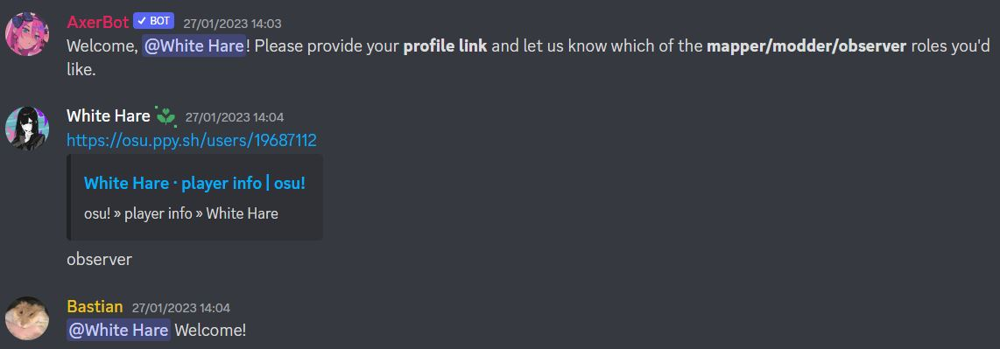

# Serveur Discord osu!catch Modding & Mapping Hub

::: Infobox

<!-- lint ignore heading-increment -->

#### osu!catch Modding & Mapping Hub

|  |  |
| :-- | :-- |
| Lien d'invitation | <https://discord.gg/2hbWns9> |

:::

**osu!catch Modding & Mapping Hub** est un serveur [Discord](https://discord.com) communautaire pour tous les actuels et futurs mappeurs et moddeurs du mode [osu!catch](/wiki/Game_mode/osu!catch). Les utilisateurs peuvent trouver de nombreux salons qui les aideront à se développer en tant que mappeurs, ou qui leur permettront d'interagir avec la communauté de mapping osu!catch.

Ce serveur est principalement composé de :

- Salons pour demander du modding, des guest difficulties, des nominations, ou d'autres requêtes liées au mapping.
- Salons dans lesquels les utilisateurs peuvent poser toute sorte de questions liées au mapping. Des mappeurs expérimentés pourront répondre à ces questions.
- Un endroit pour partager des modding queues afin d'obtenir plus d'expérience.
- Un endroit centralisé pour trouver le statut des [Beatmap Nominators](/wiki/People/The_Team/Beatmap_Nominators).
- Une liste de références utiles telles que des outils, des proposition de critères de classement ainsi que d'autres serveurs Discord.

## Staff

| Rôle | Utilisateur (Identifiant Discord) |
| :-- | :-- |
| Propriétaire du serveur | ::{ flag=US }:: [Ascendance](https://osu.ppy.sh/users/2931883) (ascendance#7599) |
| Administrateurs | ::{ flag=PH }:: [-Rustyy](https://osu.ppy.sh/users/16355636) (Rustyy#2330), ::{ flag=US }:: [Ascendance](https://osu.ppy.sh/users/2931883) (ascendance#7599), ::{ flag=CL }:: [Bastian](https://osu.ppy.sh/users/6345176) (Bastian#9611), ::{ flag=ES }:: [Deif](https://osu.ppy.sh/users/318565)(Deif#1111), ::{ flag=NL }:: [Greaper](https://osu.ppy.sh/users/2369776) (Greaper#0001), ::{ flag=GB }:: [JBHyperion](https://osu.ppy.sh/users/4879508) (JBHyperion#9178), ::{ flag=PH }:: [Jemzuu](https://osu.ppy.sh/users/7890134) (Jemzuu#2751), ::{ flag=US }:: [Secre](https://osu.ppy.sh/users/2306637) (Andrew#2539), ::{ flag=CL }:: [ZiRoX](https://osu.ppy.sh/users/200768) (Guille#1111) |

## Vérification

Afin d'accéder aux salons du serveur, les utilisateurs doivent confirmer leur identité en postant leur profil osu! dans le salon `#arrival` en indiquant quel(s) rôle(s) les intéresse.

