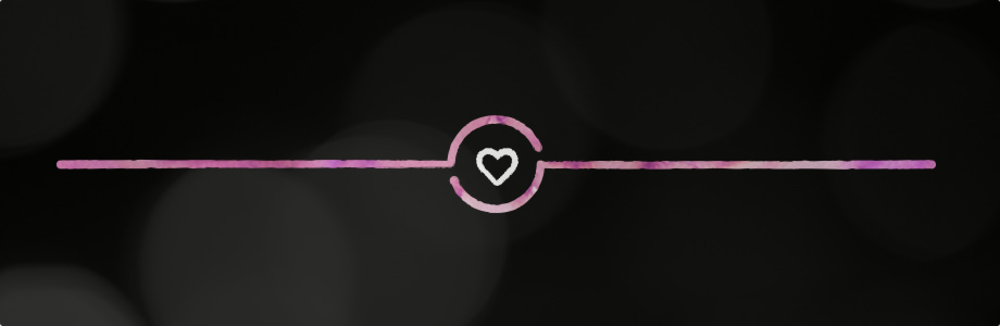
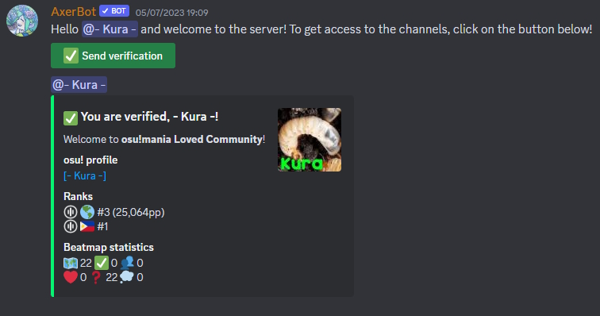

# osu!mania Loved Community Discord server

::: Infobox

<!-- lint ignore heading-increment -->

#### osu!mania Loved Community Discord

|  |  |
| :-- | :-- |
| Invite link | <https://discord.gg/BuJ6TVPmtN> |

:::

**osu!mania Loved Community** is a community [Discord](https://discord.com) server designated for osu!mania players and mappers alike looking for information about Project Loved or to discuss and suggest maps for consideration. Users are able to directly interact with the osu!mania Loved Captains, other Project Loved Team members, and report cheated scores on Loved osu!mania mapsets.

## Staff

| Role | User (Discord handle) |
| :-- | :-- |
| Server Owner | ::{ flag=US }:: [Toaph Daddy](https://osu.ppy.sh/users/7616811) (thetoaphster) |
| **Captains** & Project Loved Team Members (Server Moderators) | ::{ flag=PL }:: [**\_underjoy**](https://osu.ppy.sh/users/2235750) (underjoy), ::{ flag=US }:: [-mint-](https://osu.ppy.sh/users/8976576) (mint6), ::{ flag=US }:: [**-NoName-**](https://osu.ppy.sh/users/10400730) (noname_osu), ::{ flag=CN }:: [\[Crz\]hinako1804](https://osu.ppy.sh/users/13747903) (hinako1804#0625), ::{ flag=SG } [Abraxos](https://osu.ppy.sh/users/5025064) (\_a), ::{ flag=GB }:: [aceticke](https://osu.ppy.sh/users/8838763) (aceticke), ::{ flag=ES }:: [aitor98](https://osu.ppy.sh/users/3154852) (aitor98), ::{ flag=US }:: [Blushing](https://osu.ppy.sh/users/5927823) (blooshing), ::{ flag=US }:: [clayton](https://osu.ppy.sh/users/3666350) (gp_clayton), ::{ flag=NL }:: [DannyPX](https://osu.ppy.sh/users/11253722) (dannypx), ::{ flag=AU }:: [Ephemeral](https://osu.ppy.sh/users/102335) (ephemeralis), ::{ flag=CN }:: [gzdongsheng](https://osu.ppy.sh/users/8660315) (gzdongsheng), ::{ flag=TN }:: [Hivie](https://osu.ppy.sh/users/14102976) (hivie), ::{ flag=LT }:: [huu](https://osu.ppy.sh/users/6044237) (huuishuu), ::{ flag=ES }:: [**kadoen**](https://osu.ppy.sh/users/12780575) (deranged_cultist), ::{ flag=CN }:: [MadBricktree](https://osu.ppy.sh/users/4790958) (dendroarboritree), ::{ flag=ID }:: [Maxus](https://osu.ppy.sh/users/4335785) (maxus_), ::{ flag=SG }:: [megumic](https://osu.ppy.sh/users/7537133) (megumic), ::{ flag=ID }:: [**Mipha-**](https://osu.ppy.sh/users/5767941) (Mipha#7658), ::{ flag=FR }:: [Paturages](https://osu.ppy.sh/users/1375479) (paturages), ::{ flag=GB }:: [Pope Gadget](https://osu.ppy.sh/users/2288341) (popegadget), ::{ flag=ES }:: [Quenlla](https://osu.ppy.sh/users/4725379) (komirin), ::{ flag=ES }:: [RandomeLoL](https://osu.ppy.sh/users/7080063) (marticheca), ::{ flag=KR }:: [**Remuring**](https://osu.ppy.sh/users/6522146) (remuring), ::{ flag=US }:: [Toaph Daddy](https://osu.ppy.sh/users/7616811) (thetoaphster), ::{ flag=SE }:: [Walavouchey](https://osu.ppy.sh/users/5773079) (walavouchey) |

## Verification

In order to gain access to the channels, users must verify their identity with their osu! accounts using [AxerBot](https://osu.ppy.sh/community/forums/topics/1604925).

