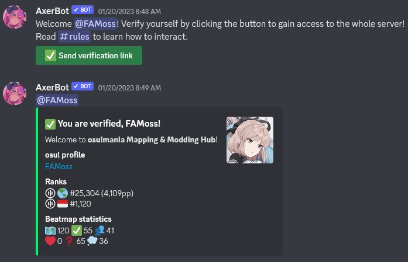

# osu!mania Modding & Mapping Hub Discord server

::: Infobox

<!-- lint ignore heading-increment -->

#### osu!mania Modding & Mapping Hub

|  |  |
| :-- | :-- |
| Invite link | <https://discord.gg/FqbDdYN> |

:::

**osu!mania Modding & Mapping Hub** is a community [Discord](https://discord.com) server designated for all current and aspiring [osu!mania](/wiki/Game_mode/osu!mania) mappers and modders. Users are able to find many channels that help them grow as a mapper, or interact with the general osu!mania mapping community.

The server mainly consists of:

- Channels to request mods, guest difficulties, nominations, or other mapping related requests.
- Channels where users can ask any mapping related questions, fit with experienced mappers to answer said questions.
- A place to share modding queues in order to gain more experience.
- A centralized place to find the status of [Beatmap Nominators](/wiki/People/The_Team/Beatmap_Nominators).
- A list of useful references such as tools, RC proposals and other Discord servers.

## Staff

| Role | User (Discord handle) |
| :-- | :-- |
| Server Owner | ::{ flag=ID }:: [FAMoss](https://osu.ppy.sh/users/7707789) (FAMoss#8805) |
| Server Moderators | ::{ flag=ID }:: [FAMoss](https://osu.ppy.sh/users/7707789) (FAMoss#8805), ::{ flag=DE }:: [Feerum](https://osu.ppy.sh/users/4815717) (Feerum#4291), ::{ flag=ID }:: [Maxus](https://osu.ppy.sh/users/4335785) (Maxus#9040), ::{ flag=GB }:: [Pope Gadget](https://osu.ppy.sh/users/2288341) (Pope Gadget#7080), ::{ flag=CN }:: [Shima Rin](https://osu.ppy.sh/users/6089608) (Shima Rin#7859) |

## Verification

In order to gain access to the channels, users must verify their identity by posting their osu! profiles in the `#arrival` channel.

