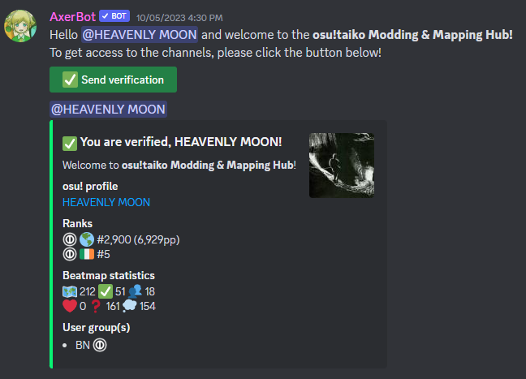

# osu!taiko Modding & Mapping Hub Discord-Server

::: Infobox

<!-- lint ignore heading-increment -->

#### osu!taiko Modding & Mapping Hub

|  |  |
| :-- | :-- |
| Einladungslink | <https://discord.gg/osutaiko> |
| Alternativer Einladungslink | <https://discord.gg/8RJBXe8> |

:::

**osu!taiko Modding & Mapping Hub** ist ein [Discord-Server](https://discord.com) für alle derzeitigen und angehenden Modder und Mapper für [osu!taiko](/wiki/Game_mode/osu!taiko). Die Nutzer können viele Kanäle finden, die ihnen helfen als Mapper zu wachsen, oder um allgemein mit der Mapping-Community von osu!taiko zu interagieren.

Der Server besteht hauptsächlich aus:

- Kanälen, um Anfragen nach Mods, Gastschwierigkeitsgraden, Nominierungen oder andere auf Mapping bezogene Anfragen zu stellen.
- Kanälen, in denen Nutzer auf Mapping bezogene Fragen stellen können, die von erfahrenen Mappern beantwortet werden können.
- einem Platz für das Teilen von Modding-Queues, um mehr Erfahrung zu sammeln.
- einem zentralen Ort, um den Status der [Beatmap Nominators](/wiki/People/Beatmap_Nominators) zu erfahren.
- einer Liste an nützlichen Ressourcen wie Tools, RC-Vorschlägen und anderen Discord-Servern.

## Personal

| Rolle | Benutzer (Discord-ID) |
| :-- | :-- |
| Server-Eigentümer | ::{ flag=TN }:: [Hivie](https://osu.ppy.sh/users/14102976) (@hivie) |
| Server-Moderatoren | ::{ flag=SG }:: [arcpotato](https://osu.ppy.sh/users/12842392) (@arcsine), ::{ flag=GB }:: [Dusk-](https://osu.ppy.sh/users/6092181) (@underscoredusk), ::{ flag=IE }:: [HEAVENLY MOON](https://osu.ppy.sh/users/13681283) (@hvnlymoon), ::{ flag=TN }:: [Hivie](https://osu.ppy.sh/users/14102976) (@hivie), ::{ flag=US }:: [meiqth](https://osu.ppy.sh/users/12565402) (@meiqth), ::{ flag=AT }:: [Yasuho](https://osu.ppy.sh/users/8458835) (@yasuho) |

## Verifizierung

Um Zugriff auf die Kanäle zu erhalten, müssen Nutzer ihre Identität mit ihrem osu!-Account unter Verwendung von [AxerBot](https://osu.ppy.sh/community/forums/topics/1604925) bestätigen.

