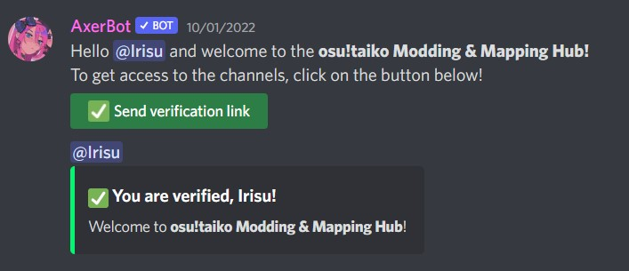

# Serveur Discord osu!taiko Modding & Mapping Hub

::: Infobox

<!-- lint ignore heading-increment -->

#### osu!taiko Modding & Mapping Hub

|  |  |
| :-- | :-- |
| Lien d'invitation | <https://discord.gg/8RJBXe8> |

:::

**osu!taiko Modding & Mapping Hub** est un serveur [Discord](https://discord.com) communautaire pour tous les actuels et futurs mappeurs et moddeurs du mode [osu!taiko](/wiki/Game_mode/osu!taiko). Les utilisateurs peuvent trouver de nombreux salons qui les aideront à se développer en tant que mappeurs, ou qui leur permettront d'interagir avec la communauté de mapping osu!taiko.

Ce serveur est principalement composé de :

- Salons pour demander du modding, des guest difficulties, des nominations, ou d'autres requêtes en rapport avec le mapping.
- Salons dans lesquels les utilisateurs peuvent poser toute sorte de questions en rapport avec le mapping. Des mappeurs expérimentés pourront répondre à ces questions.
- Un endroit pour partager des modding queues afin d'obtenir plus d'expérience.
- Un endroit centralisé pour trouver le statut des [Beatmap Nominators](/wiki/People/The_Team/Beatmap_Nominators).
- Une liste de références utiles telles que des outils, des proposition de critères de classement ainsi que d'autres serveurs Discord.

## Staff

| Rôle | Utilisateur (Identifiant Discord) |
| :-- | :-- |
| Propriétaire du serveur | ::{ flag=US }:: [radar](https://osu.ppy.sh/users/7131099) (radar#0001) |
| Mainteneur structurel | ::{ flag=TN }:: [Hivie](https://osu.ppy.sh/users/14102976) (Hivie#0859) |
| Modérateurs du serveur | ::{ flag=DE }:: [Capu](https://osu.ppy.sh/users/2474015) (Capu#4171), ::{ flag=GB }:: [Dusk-](https://osu.ppy.sh/users/6092181) (Dusk#8170), ::{ flag=IE }:: [HEAVENLY MOON](https://osu.ppy.sh/users/13681283) (solar#5193), ::{ flag=TN }:: [Hivie](https://osu.ppy.sh/users/14102976) (Hivie#0859), ::{ flag=US }:: [radar](https://osu.ppy.sh/users/7131099) (radar#0001), ::{ flag=AT }:: [Yasuho](https://osu.ppy.sh/users/8458835) (Yasuho#1512) |

## Vérification

Afin d'accéder aux salons du serveur, les utilisateurs doivent confirmer leur identité avec leur compte osu! en utilisant [AxerBot](https://osu.ppy.sh/community/forums/topics/1604925).

