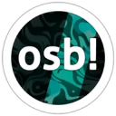

# Сервера Discord

Эта статья содержит различные сервера [Discord](https://discord.com/), которые были созданы и поддерживаются сообществом osu! для обсуждения различных аспектов игры. Некоторые из них ориентированы на управление конкретными проектами, некоторые имеют более общий характер, но большинство из них, тем не менее, включают в себя неформальные чат-каналы.

## Официальный

|  | Название | Владелец | Описание |
| :-: | :-- | :-- | :-- |
|  | [osu!](https://discord.com/invite/ppy) | ::{ flag=AU }:: [peppy](https://osu.ppy.sh/users/2) | Discord-сервер **osu!**, ранее известный как **osu!dev**, является официальным Discord-сервером для обсуждения целей, связанных с развитием игры. Сервер работает как центр для обсуждения и работы над открытым исходным кодом игры и проектов сообщества. Это главное место для внесения своего вклада в развитие osu! и знакомства с [командой osu!](/wiki/People/osu!_team). |

## Геймплей

Эти серверв дают людям возможность обсудить главную часть osu! — геймплей! Они работают как места, где игроки ежедневно обсуждают свои достижения в osu!.

|  | Название | Владелец | Описание |
| :-: | :-- | :-- | :-- |
|  | [osu! Game](https://discord.com/invite/osu) | ::{ flag=DE }:: [oink](https://osu.ppy.sh/users/300173) | **osu! Game** на данный момент - самый большой сервер, созданный комьюнити и рассчитанный на все режимы игры. Он проводит регулярные ивенты среди участников и имеет общие чат-каналы для самых популярных занятий в игре. |
|  | [osu! University](https://discord.com/invite/QubdHdnBVg) | ::{ flag=US }:: [DigitalHypno](https://osu.ppy.sh/users/4384207) | **osu! University** - Discord-сервер сообщества, рассчитанный на обсуждение тренировки себя как игрока (жарг. "импрува"), в основном в режиме [osu!](/wiki/Game_mode/osu!). Сервер регулярно проводит различные ивенты, например, интервью с топ-игроками, [турниры](/wiki/Tournaments) и исследования, связанные с импрувом. |
|  | [osu! Medal Hunters](https://discord.com/invite/8qpNTs6) | ::{ flag=UA }:: [MegaMix](https://osu.ppy.sh/users/18152711) | **osu! Medal Hunters** рассчитан на обсуждение [медалей](/wiki/Medals) и [условий их получения](/wiki/Medals/Unlock_requirements). |
|  | [osu!alternative](https://discord.com/invite/VZWRZZXcW4) | ::{ flag=CA }:: [billie eilish](https://osu.ppy.sh/users/6245906) | **osu!alternative** предлагает дополнительные метрики и трекеры скоров, не показываемые на сайте osu!. Он позволяет игрокам неофициально оценивать друг друга и свои результаты.

## Развитие сообщества

Эти сервера направлены на создание и разработку различных инструментов и систем для игры. В то время как официальная разработка osu! ведётся в [Discord-сервере **osu!**](#official), некоторые проекты создают свои рабочие пространства, прежде чем предлагать и объединять свою работу в игре.
|  | Название | Владелец | Описание |
| :-: | :-- | :-- | :-- |
|  | [Performance Points](https://discord.com/invite/aqPCnXu) | ::{ flag=RU }:: [StanR](https://osu.ppy.sh/users/7217455) | Сервер **Performance Points** способствует развитию системы [очков производительности](/wiki/Performance_points) и [системы сложности карт](/wiki/Beatmap/Star_rating). |
|  | [osu!catch dev](https://discord.com/invite/YEJBENvFzN) | ::{ flag=FR }:: [bastoo0](https://osu.ppy.sh/users/4864877) | Сервер **osu!catch dev** способствует развитию системы [очков производительности](/wiki/Performance_points) и [системы сложности карт](/wiki/Beatmap/Star_rating) в osu!catch. |
|  | [o!m SR/PP Rework Hub](https://discord.com/invite/GFCNNg8bwk) | ::{ flag=ES }:: [Quenlla](https://osu.ppy.sh/users/4725379) | Сервер **o!m SR/PP Rework** способствует развитию системы [очков производительности](/wiki/Performance_points) и [системы сложности карт](/wiki/Beatmap/Star_rating) в osu!mania. |

## Маппинг и моддинг

Сервера **Маппинга и моддинга** - это Discord-сервера комьюнити, созданные для всех действующих и начинающих мапперов и моддеров. Они предназначены для взаимодействия между игроками, интересующимися маппингом для игрового режима. Они выступают площадкой для организации, обсуждения и рекламы различных карт.

|  | Название | Владелец | Описание |
| :-: | :-- | :-- | :-- |
|  | [osu! Modding & Mapping Hub](https://discord.gg/gw5EtzgEXf) | ::{ flag=US }:: [radar](https://osu.ppy.sh/users/7131099) | **osu! Modding & Mapping Hub** имеет каналы для обсуждения, инструментов и анонса различных ивентов, связанных с маппингом и моддингом в osu!. |
|  | [osu!taiko Modding & Mapping Hub](https://discord.com/invite/yRjvvyZ) | ::{ flag=TN }:: [Hivie](https://osu.ppy.sh/users/14102976) | **osu!taiko Modding & Mapping Hub** имеет каналы для обсуждения, инструментов и анонса различных ивентов, связанных с маппингом и моддингом в osu!taiko. |
|  | [osu!catch Modding and Mapping Hub](https://discord.com/invite/ZuxFc4q) | ::{ flag=US }:: [Ascendance](https://osu.ppy.sh/users/2931883) | **osu!catch Modding and Mapping Hub** имеет каналы для обсуждения, инструментов и анонса различных ивентов, связанных с маппингом и моддингом в osu!catch. |
|  | [osu!mania Modding & Mapping Hub](https://discord.com/invite/FqbDdYN) | ::{ flag=ID }:: [Maxus](https://osu.ppy.sh/users/4335785) | **osu!mania Modding & Mapping Hub** имеет каналы для обсуждения, инструментов и анонса различных ивентов, связанных с маппингом и моддингом в osu!mania. |

Помимо серверов для разных режимов игры, другие серверы сообщества существуют для облегчения общения между мапперами, моддерами и другими игроками.

|  | Название | Владелец | Описание |
| :-: | :-- | :-- | :-- |
|  | [Mapset Management Server](https://discord.com/invite/TCDSjhb6yS) | ::{ flag=GE }:: [Kyuunex](https://osu.ppy.sh/users/9236044) | Сервер **Mapset Management Server** - место для создания и просмотра реквестов для [модов](/wiki/Modding), [гостевых сложностей](/wiki/Beatmap/Guest_difficulty) и [коллабораций](/wiki/Beatmap/Beatmap_collaborations) в непринуждённой обстановке. |
|  | [Mentorship](https://discord.com/invite/Ft2FtXmBgx) | ::{ flag=DE }:: [Okoayu](https://osu.ppy.sh/users/1623405) | Сервер **Mentorship** управляет [программой менторства сообщества](/wiki/Community/Community_Mentorship_Program), ведёт сезонные занятия для обучения [маппингу](/wiki/Beatmapping) и [моддингу](/wiki/Modding) для всех режимов игры. |

## Турниры

Цель этих серверов - предоставить игрокам всё, что связано с [турнирами](/wiki/Tournaments). Регулярно оповещая игроков о предстоящих турнирах, игроки могут оставаться в курсе последних турниров, в которых они могут принять участие. Ресурсы, предоставляемые этими серверами, могут идти на пользу как игрокам, так и модераторам этих серверов.

|  | Название | Владелец | Описание |
| :-: | :-- | :-- | :-- |
|  | [osu! Tournament Hub](https://discord.com/invite/bvhajDC) | ::{ flag=MY }:: [Sikey](https://osu.ppy.sh/users/343057) | **osu! Tournament Hub** предоставляет ресурсы для организаций турниров и каналы для рекламы новых турниров и рекрутинга команды во всех режимах и регионах. |
|  | [osu!mania Tourney Central](https://discord.com/invite/WnMcrUnGV5) | ::{ flag=US }:: [-mint-](https://osu.ppy.sh/users/8976576) | **osu!mania Tourney Central** фокусируется на ресурсах и рекрутинге команды для турниров в osu!mania. |
|  | [poolingcore](https://discord.com/invite/gpEbCBE7Jg) | ::{ flag=CA }:: [chiv](https://osu.ppy.sh/users/6701656) | **poolingcore** предоставляет ресурсы, связанные с маппуллингом и маппингом, в основном в режиме osu!. На сервере время от времени проводятся игры и конкурсы, связанные с маппулингом, а также он позволяет проверенным хостам набирать активных маппулеров и мапперов для своих турниров. |

## Project Loved

[Project Loved](/wiki/Community/Project_Loved) организовывает свою работу на других серверах, разделённых по [режимам игры](/wiki/Game_mode), в которых они специализируются. Эти сервера способствуют обсуждению выбора карт для каждого режима.

|  | Название | Владелец | Описание |
| :-: | :-- | :-- | :-- |
|  | [osu! Project Loved](https://discord.com/invite/gn58Uk5sTE) | ::{ flag=US }:: [Librarian](https://osu.ppy.sh/users/10083084) | **osu! Project Loved** проводит обсуждения и выдаёт оповещения вокруг Project Loved в osu!. |
|  | [Project Loved: Taiko](https://discord.com/invite/GhfjtZ6) | ::{ flag=TN }:: [Hivie](https://osu.ppy.sh/users/14102976) | **Project Loved: Taiko** проводит обсуждения и выдаёт оповещения вокруг Project Loved в osu!taiko. |
|  | [osu!catch Project Loved](https://discord.com/invite/phgtyS4UCh) | ::{ flag=NL }:: [Wesley](https://osu.ppy.sh/users/2407265) | **osu!catch Project Loved** проводит обсуждения и выдаёт оповещения вокруг Project Loved в osu!catch. |
|  | [osu!mania Loved Community](https://discord.com/invite/Ededv7m) | ::{ flag=FR }:: [Paturages](https://osu.ppy.sh/users/1375479) | **osu!mania Loved Community** проводит обсуждения и выдаёт оповещения вокруг Project Loved в osu!mania. |

## Скиннинг

Цель этих серверов - предоставить общее место для скиннеров, вне зависимости от того, являются ли они экспертами или новичками в скиннинге. Игроки могут найти множество ресурсов, связанных со [скиннингом](/wiki/Skinning), а также получить помощь от других скиннеров.

|  | Название | Владелец | Описание |
| :-: | :-- | :-- | :-- |
|  | [skinship](https://discord.skinship.xyz/) | ::{ flag=DE }:: [RockRoller](https://osu.ppy.sh/users/8388854) | **skinship** - это место для обсуждения всего, что связано со скиннингом, а также для проведения проектов, например, [Skinning Contests](/wiki/Contests/Skinning_Contest) и [Completed Skins Compendium](https://compendium.skinship.xyz/). Игроки также могут управлять своим процессом скиннинга через [бот-аккаунт skinship](https://osu.ppy.sh/users/32231941). |

## Сторибординг

Цель этих серверов - предоставить игрокам ресурсы для помощи в [сторибординге](/wiki/Storyboard). Они являются хорошей стартовой точкой для новичков, которым будет легче ориентироваться в сторибординге, при этом получая помощь от опытных игроков.

|  | Название | Владелец | Описание |
| :-: | :-- | :-- | :-- |
|  | [osu! storyboarder banquet](https://discord.com/invite/B8NX7YW) | ::{ flag=CA }:: [Sidetail](https://osu.ppy.sh/users/2036217) | **osu! storyboarder banquet** работает как место, полностью посвящённое сторибордингу. Не без помощи их [сайта](https://osb.moe/), этот сервер стремится предоставить игрокам множество обучающих ресурсов и регулярный показ сторибордов, сделанных сообществом. |

## Разное

|  | Название | Владелец | Описание |
| :-: | :-- | :-- | :-- |
|  | [Aiess Project](https://discord.com/invite/2XV5dcW) | ::{ flag=SE }:: [Naxess](https://osu.ppy.sh/users/8129817) | **Aiess Project** поддерживает несколько источников, которые информируют участников о событиях, происходящих в osu! на регулярной основе, например, изменения в [категориях карт](/wiki/Beatmap/Category) и [группах пользователей](/wiki/People/User_group), а также публикует новости. |
|  | [ThePooN](https://discord.gg/ThePooN) | ::{ flag=FR }:: [ThePooN](https://osu.ppy.sh/users/718454) | Discord-сервер **ThePooN** является сервером для пользователей, имеющих проблемы с osu! на [Linux](https://ru.wikipedia.org/wiki/Linux). Также предоставляет общую техническую поддержку. |
