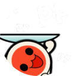
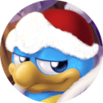
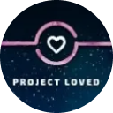
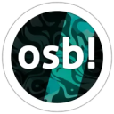

# เซิร์ฟเวอร์ Discord (Discord servers)

บทความนี้รวบรวมเซิร์ฟเวอร์ [Discord](https://discord.com/) ต่างๆ ที่สร้างขึ้นและดูแลโดยชุมชน osu! เพื่อเป็นพื้นที่ในการพูดคุยแลกเปลี่ยนในแง่มุมต่างๆ ของเกม บางเซิร์ฟเวอร์เน้นไปที่การจัดการโปรเจกต์เฉพาะทาง ในขณะที่บางส่วนเป็นเซิร์ฟเวอร์ทั่วไป แต่ส่วนใหญ่มักจะมีแชนแนลสำหรับการพูดคุยสัพเพเหระรวมอยู่ด้วยเสมอ

## ทางการ (Official)

|  | ชื่อเซิร์ฟเวอร์ | เจ้าของ | คำอธิบาย |
| :-: | :-- | :-- | :-- |
|  | [osu!](https://discord.com/invite/ppy) | ::{ flag=AU }:: [peppy](https://osu.ppy.sh/users/2) | เซิร์ฟเวอร์ Discord ของ **osu!** (เดิมชื่อ **osu!dev**) เป็นเซิร์ฟเวอร์ทางการสำหรับจุดประสงค์ด้านการพัฒนาเกม ทำหน้าที่เป็นศูนย์กลางสำหรับพูดคุยและทำงานในโปรเจกต์ Open source และโปรเจกต์ชุมชนต่างๆ นี่คือสถานที่หลักสำหรับผู้ที่ต้องการช่วยพัฒนา osu! และติดต่อกับ [ทีมงาน osu!](/wiki/People/osu!_team) |

## เกมเพลย์ (Gameplay)

เซิร์ฟเวอร์กลุ่มนี้เน้นให้ผู้ใช้มีพื้นที่ในการพูดคุยเกี่ยวกับหัวใจหลักของ osu! นั่นคือการเล่นเกม! ทำหน้าที่เป็นศูนย์กลางให้ผู้เล่นได้แลกเปลี่ยนประสบการณ์การเล่นในแต่ละวัน

|  | ชื่อเซิร์ฟเวอร์ | เจ้าของ | คำอธิบาย |
| :-: | :-- | :-- | :-- |
|  | [osu! Game](https://discord.com/invite/osu) | ::{ flag=DE }:: [oink](https://osu.ppy.sh/users/300173) | **osu! Game** ปัจจุบันเป็นเซิร์ฟเวอร์ชุมชนแบบรวมทุกโหมดที่ใหญ่ที่สุด มีการจัดกิจกรรมภายในอย่างสม่ำเสมอและมีแชนแนลพูดคุยทั่วไปสำหรับกิจกรรมยอดนิยมต่างๆ ของเกม |
|  | [osu! University](https://discord.com/invite/QubdHdnBVg) | ::{ flag=US }:: [DigitalHypno](https://osu.ppy.sh/users/4384207) | **osu! University** เน้นการพูดคุยเรื่องการพัฒนาฝีมือ โดยเฉพาะในโหมด [osu!](/wiki/Game_mode/osu!) มีการจัดกิจกรรมอย่างการสัมภาษณ์ผู้เล่นระดับท็อป, การแข่งขัน [ทัวร์นาเมนต์](/wiki/Tournaments) และการศึกษาเกี่ยวกับการพัฒนาทักษะ |
|  | [osu! Medal Hunters](https://discord.com/invite/8qpNTs6) | ::{ flag=UA }:: [MegaMix](https://osu.ppy.sh/users/18152711) | **osu! Medal Hunters** เป็นพื้นที่สำหรับพูดคุยเกี่ยวกับ [เหรียญรางวัล (Medals)](/wiki/Medals) และ [วิธีปลดล็อกเหรียญต่างๆ](/wiki/Medals/Unlock_requirements) |
|  | [osu!alternative](https://discord.com/invite/VZWRZZXcW4) | ::{ flag=CA }:: [billie eilish](https://osu.ppy.sh/users/6245906) | **osu!alternative** นำเสนอระบบวัดผลและติดตามคะแนนเพิ่มเติมที่หน้าเว็บ osu! ไม่มีให้ ช่วยให้ผู้เล่นสามารถจัดอันดับคะแนนของกันและกันได้ในรูปแบบไม่เป็นทางการ |

## การพัฒนาโดยชุมชน (Community development)

เซิร์ฟเวอร์กลุ่มนี้เน้นการสร้างและพัฒนาเครื่องมือหรือระบบต่างๆ ให้กับเกม แม้การพัฒนาหลักจะทำในเซิร์ฟเวอร์ [**osu!**](#ทางการ) แต่บางโปรเจกต์ก็มีพื้นที่ทำงานของตัวเองก่อนจะนำเสนอเพื่อรวมเข้ากับตัวเกมหลัก

|  | ชื่อเซิร์ฟเวอร์ | เจ้าของ | คำอธิบาย |
| :-: | :-- | :-- | :-- |
|  | [Performance Points](https://discord.com/invite/aqPCnXu) | ::{ flag=RU }:: [StanR](https://osu.ppy.sh/users/7217455) | เซิร์ฟเวอร์ **Performance Points** สนับสนุนการพัฒนาโดยชุมชนในด้านระบบ [Performance points (pp)](/wiki/Performance_points) และ [ระดับดาว (Star rating)](/wiki/Beatmap/Star_rating) |
|  | [osu!catch dev](https://discord.com/invite/YEJBENvFzN) | ::{ flag=FR }:: [bastoo0](https://osu.ppy.sh/users/4864877) | **osu!catch dev** สนับสนุนการพัฒนาระบบ pp และระดับดาวสำหรับโหมด osu!catch |
|  | [o!m SR/PP Rework Hub](https://discord.com/invite/GFCNNg8bwk) | ::{ flag=ES }:: [Quenlla](https://osu.ppy.sh/users/4725379) | **o!m SR/PP Rework Hub** สนับสนุนการพัฒนาระบบ pp และระดับดาวสำหรับโหมด osu!mania |

## การทำแมพและการ Mod (Mapping and modding)

**Modding & Mapping Hubs** คือเซิร์ฟเวอร์ชุมชนที่ออกแบบมาสำหรับ Mapper และ Modder ทั้งในปัจจุบันและผู้ที่สนใจ เป็นสถานที่สำหรับพบปะพูดคุยกับผู้ที่ชื่นชอบการทำแมพในแต่ละโหมดเกม เพื่อจัดระเบียบ พูดคุย และประชาสัมพันธ์โปรเจกต์การทำแมพต่างๆ

|  | ชื่อเซิร์ฟเวอร์ | เจ้าของ | คำอธิบาย |
| :-: | :-- | :-- | :-- |
|  | [osu! Modding & Mapping Hub](https://discord.gg/gw5EtzgEXf) | ::{ flag=US }:: [radar](https://osu.ppy.sh/users/7131099) | **osu! Modding & Mapping Hub** มีแชนแนลสำหรับการพูดคุย, แหล่งทรัพยากร และการประกาศกิจกรรมเกี่ยวกับการทำแมพและ Mod ในโหมด osu! |
|  | [osu!taiko Modding & Mapping Hub](https://discord.com/invite/yRjvvyZ) | ::{ flag=TN }:: [Hivie](https://osu.ppy.sh/users/14102976) | ศูนย์กลางการพูดคุยและทรัพยากรเกี่ยวกับการทำแมพในโหมด osu!taiko |
|  | [osu!catch Modding and Mapping Hub](https://discord.com/invite/ZuxFc4q) | ::{ flag=US }:: [Ascendance](https://osu.ppy.sh/users/2931883) | ศูนย์กลางการพูดคุยและทรัพยากรเกี่ยวกับการทำแมพในโหมด osu!catch |
|  | [osu!mania Modding & Mapping Hub](https://discord.com/invite/FqbDdYN) | ::{ flag=ID }:: [Maxus](https://osu.ppy.sh/users/4335785) | ศูนย์กลางการพูดคุยและทรัพยากรเกี่ยวกับการทำแมพในโหมด osu!mania |

นอกจากศูนย์กลางแยกตามโหมดแล้ว ยังมีเซิร์ฟเวอร์อื่นๆ ที่ช่วยอำนวยความสะดวกในการสื่อสารระหว่าง Mapper และ Modder:

|  | ชื่อเซิร์ฟเวอร์ | เจ้าของ | คำอธิบาย |
| :-: | :-- | :-- | :-- |
|  | [Mapset Management Server](https://discord.com/invite/TCDSjhb6yS) | ::{ flag=GE }:: [Kyuunex](https://osu.ppy.sh/users/9236044) | **Mapset Management Server** เป็นพื้นที่สำหรับส่งคำขอและหาคนช่วย [Mod](/wiki/Modding), ทำ [ระดับความยากรับเชิญ (Guest difficulty)](/wiki/Beatmap/Guest_difficulty) หรือทำ [แมพคอลแลบ (Collaborations)](/wiki/Beatmap/Beatmap_collaborations) ในบรรยากาศเป็นกันเอง |
|  | [Mentorship](https://discord.com/invite/Ft2FtXmBgx) | ::{ flag=DE }:: [Okoayu](https://osu.ppy.sh/users/1623405) | เซิร์ฟเวอร์ **Mentorship** จัดการดูแล [โครงการพี่เลี้ยงชุมชน (Community Mentorship Program)](/wiki/Community/Community_Mentorship_Program) โดยเปิดคลาสสอนการ [ทำแมพ](/wiki/Beatmapping) และ [Mod](/wiki/Modding) ทุกโหมดเกมตามฤดูกาล |

## ทัวร์นาเมนต์ (Tournaments)

เซิร์ฟเวอร์กลุ่มนี้มุ่งเน้นการให้ข้อมูลทุกอย่างที่เกี่ยวข้องกับ [ทัวร์นาเมนต์](/wiki/Tournaments) โดยจะแจ้งเตือนการแข่งขันที่กำลังจะมาถึง เพื่อให้ผู้เล่นไม่พลาดข่าวสารล่าสุด ทั้งผู้เล่นและทีมงานจัดงานสามารถใช้ประโยชน์จากทรัพยากรที่มีให้ในเซิร์ฟเวอร์เหล่านี้ได้

|  | ชื่อเซิร์ฟเวอร์ | เจ้าของ | คำอธิบาย |
| :-: | :-- | :-- | :-- |
|  | [osu! Tournament Hub](https://discord.com/invite/bvhajDC) | ::{ flag=MY }:: [Sikey](https://osu.ppy.sh/users/343057) | **osu! Tournament Hub** ให้ทรัพยากรเกี่ยวกับการจัดทัวร์นาเมนต์และแชนแนลสำหรับประชาสัมพันธ์การแข่งขันใหม่ๆ รวมถึงการรับสมัครทีมงานในทุกโหมดเกมและทุกภูมิภาค |
|  | [osu!mania Tourney Central](https://discord.com/invite/WnMcrUnGV5) | ::{ flag=US }:: [-mint-](https://osu.ppy.sh/users/8976576) | **osu!mania Tourney Central** เน้นทรัพยากรและการรับสมัครทีมงานสำหรับทัวร์นาเมนต์ในโหมด osu!mania |
|  | [poolingcore](https://discord.com/invite/gpEbCBE7Jg) | ::{ flag=CA }:: [chiv](https://osu.ppy.sh/users/6701656) | **poolingcore** ให้ทรัพยากรเกี่ยวกับการเลือกเพลง (Mappooling) และการทำแมพสำหรับแข่งในโหมด osu! เป็นหลัก มีกิจกรรมและการแข่งขันเกี่ยวกับการจัด Mappool เป็นระยะ |

## โปรเจกต์ Loved (Project Loved)

[Project Loved](/wiki/Community/Project_Loved) แบ่งการทำงานออกเป็นเซิร์ฟเวอร์ต่างๆ ตาม [โหมดเกม](/wiki/Game_mode) ที่เชี่ยวชาญ เพื่ออำนวยความสะดวกในการพูดคุยคัดเลือกแมพสำหรับแต่ละโหมด

|  | ชื่อเซิร์ฟเวอร์ | เจ้าของ | คำอธิบาย |
| :-: | :-- | :-- | :-- |
|  | [osu! Project Loved](https://discord.com/invite/gn58Uk5sTE) | ::{ flag=US }:: [Librarian](https://osu.ppy.sh/users/10083084) | พูดคุยและประกาศข่าวสารเกี่ยวกับ Project Loved สำหรับโหมด osu! |
|  | [Project Loved: Taiko](https://discord.com/invite/GhfjtZ6) | ::{ flag=TN }:: [Hivie](https://osu.ppy.sh/users/14102976) | พูดคุยและประกาศข่าวสารเกี่ยวกับ Project Loved สำหรับโหมด osu!taiko |
|  | [osu!catch Project Loved](https://discord.com/invite/phgtyS4UCh) | ::{ flag=NL }:: [Wesley](https://osu.ppy.sh/users/2407265) | พูดคุยและประกาศข่าวสารเกี่ยวกับ Project Loved สำหรับโหมด osu!catch |
|  | [osu!mania Loved Community](https://discord.com/invite/Ededv7m) | ::{ flag=FR }:: [Paturages](https://osu.ppy.sh/users/1375479) | พูดคุยและประกาศข่าวสารเกี่ยวกับ Project Loved สำหรับโหมด osu!mania |

## การทำ Skin (Skinning)

เซิร์ฟเวอร์กลุ่มนี้มุ่งหวังที่จะเป็นพื้นที่ปลอดภัยสำหรับเหล่านักทำ Skin ไม่ว่าจะเป็นมืออาชีพหรือมือใหม่ ผู้ใช้สามารถหาทรัพยากรการทำ [Skin](/wiki/Skinning) และขอความช่วยเหลือจากผู้ใช้คนอื่นๆ ได้

|  | ชื่อเซิร์ฟเวอร์ | เจ้าของ | คำอธิบาย |
| :-: | :-- | :-- | :-- |
|  | [skinship](https://discord.skinship.xyz/) | ::{ flag=DE }:: [RockRoller](https://osu.ppy.sh/users/8388854) | **skinship** เป็นพื้นที่พูดคุยทุกเรื่องเกี่ยวกับ Skin พร้อมทั้งจัดกิจกรรมอย่าง [การประกวดทำ Skin](/wiki/Contests/Skinning_Contest) และมีคลังรวบรวม Skin ที่เสร็จสมบูรณ์ |

## Storyboarding

เซิร์ฟเวอร์กลุ่มนี้ให้ทรัพยากรเพื่อช่วยเหลือผู้ใช้ในเรื่องการทำ [Storyboard](/wiki/Storyboard) เป็นจุดเริ่มต้นที่ดีสำหรับมือใหม่ในการเข้าสู่โลกของ Storyboard พร้อมรับคำแนะนำจากผู้เชี่ยวชาญ

|  | ชื่อเซิร์ฟเวอร์ | เจ้าของ | คำอธิบาย |
| :-: | :-- | :-- | :-- |
|  | [osu! storyboarder banquet](https://discord.com/invite/B8NX7YW) | ::{ flag=CA }:: [Sidetail](https://osu.ppy.sh/users/2036217) | **osu! storyboarder banquet** เป็นพื้นที่สำหรับทุกเรื่องของ Storyboard พร้อมด้วย [เว็บไซต์](https://osb.moe/) ที่มีแหล่งเรียนรู้มากมายและการแสดงผลงานจากชุมชน |

## อื่นๆ (Miscellaneous)

|  | ชื่อเซิร์ฟเวอร์ | เจ้าของ | คำอธิบาย |
| :-: | :-- | :-- | :-- |
|  | [Aiess Project](https://discord.com/invite/2XV5dcW) | ::{ flag=SE }:: [Naxess](https://osu.ppy.sh/users/8129817) | **Aiess Project** ให้ข้อมูลข่าวสารเกี่ยวกับกิจกรรมต่างๆ ใน osu! อย่างสม่ำเสมอ เช่น การเปลี่ยน [หมวดหมู่บีทแมพ](/wiki/Beatmap/Category), การอัปเดต [User group](/wiki/People/User_group) และโพสต์ข่าวสารใหม่ๆ |
|  | [ThePooN](https://discord.gg/ThePooN) | ::{ flag=FR }:: [ThePooN](https://osu.ppy.sh/users/718454) | เซิร์ฟเวอร์ของ **ThePooN** เป็นศูนย์กลางหลักสำหรับผู้ใช้ osu! บนระบบปฏิบัติการ [Linux](https://en.wikipedia.org/wiki/Linux) และให้การสนับสนุนด้านเทคนิคทั่วไป |
