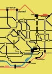
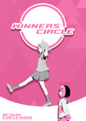

# Manga

Cet article liste les [mangas](https://fr.wikipedia.org/wiki/Manga) en lien avec osu! faits par la communauté.

| Couverture | Titre | Synopsis | Plateforme | Date |
| :-: | :-- | :-- | :-- | --: |
|  | osu! Combat Championship | Les meilleurs joueurs d'osu! se battent dans un tournoi pour la gloire et le premier prix. | [MangaDex](https://mangadex.org/title/f1d50eba-6ace-4490-8439-07692fda3b9c/osu-combat-championship) | 23/01/2023 |
|  | How Do I Improve!? | Défaut veut s'améliorer au jeu de rythme "osu!". Elle demande à son amie Pippi, mais celle-ci ne lui donne pas une réponse claire... | [NamiComi](https://namicomi.com/en/title/wAs5awjv/osu-winner-s-circle) | 05/04/2024 |
|  | Corsace Closed: The Manga | "Mesdames et messieurs, bienvenue au Corsace Closed!" Une surprise d'une amie donne à Chloé l'occasion d'une vie de changer la sienne, mais la saisira-t-elle ? | [NamiComi](https://namicomi.com/en/title/nM6E7HnY/corsace-closed-the-manga) | 20/04/2024 |
|  | Corsace Closed 4koma | Diverses histoires secondaires basées sur *Corsace Closed : The Manga* | [@corsace_ on Twitter](https://twitter.com/corsace_) ([1](https://twitter.com/corsace_/status/1782576118052085790), [2](https://twitter.com/corsace_/status/1785111830563590238), [3](https://twitter.com/corsace_/status/1787648543693693066), [4](https://twitter.com/corsace_/status/1790185259062980643)) | 23/04/2024 |
|  | osu! Winner's Circle | Les aventures de Défaut et Pippi à mesure qu'ils progressent et deviennent des "osu! champions!". | [NamiComi](https://namicomi.com/en/title/mMcsy7z3/osu-winner-s-circle) | 05/06/2024 |
