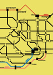

# มังงะ (Manga)

บทความนี้รวบรวมรายชื่อผลงาน [มังงะ](https://en.wikipedia.org/wiki/Manga) ที่เกี่ยวข้องกับ osu! ซึ่งสร้างสรรค์โดยสมาชิกในชุมชน

| หน้าปก | ชื่อเรื่อง | เรื่องย่อ | แพลตฟอร์ม | วันที่ |
| :-: | :-- | :-- | :-- | --: |
|  | osu! Combat Championship | สุดยอดผู้เล่น osu! เข้าห่ำหั่นกันในทัวร์นาเมนต์การต่อสู้เพื่อชิงเกียรติยศและรางวัลอันดับ 1 | [MangaDex](https://mangadex.org/title/f1d50eba-6ace-4490-8439-07692fda3b9c/osu-combat-championship) | 2023-01-23 |
|  | How Do I Improve!? | Default ต้องการพัฒนาฝีมือในเกมแนวจังหวะดนตรี "osu!" เธอจึงไปขอคำแนะนำจาก pippi เพื่อนของเธอ แต่ pippi กลับไม่ให้คำตอบที่ชัดเจนกับเธอ... | [NamiComi](https://namicomi.com/en/title/wAs5awjv/osu-winner-s-circle) | 2024-04-05 |
|  | Corsace Closed: The Manga | "ท่านสุภาพบุรุษและสุภาพสตรี ขอต้อนรับกลับสู่ Corsace Closed!" เซอร์ไพรส์จากเพื่อนทำให้ Chloe ได้รับโอกาสครั้งสำคัญในชีวิตที่จะเปลี่ยนชีวิตที่เป็นอยู่ของเธอ แต่เธอจะคว้ามันไว้หรือไม่? | [NamiComi](https://namicomi.com/en/title/nM6E7HnY/corsace-closed-the-manga) | 2024-04-20 |
|  | Corsace Closed 4koma | เรื่องราวเบ็ดเตล็ดที่เป็นภาคแยกของ *Corsace Closed: The Manga* | [@corsace_ บน Twitter](https://twitter.com/corsace_) ([1](https://twitter.com/corsace_/status/1782576118052085790), [2](https://twitter.com/corsace_/status/1785111830563590238), [3](https://twitter.com/corsace_/status/1787648543693693066), [4](https://twitter.com/corsace_/status/1790185259062980643)) | 2024-04-23 |
|  | osu! Winner's Circle | การผจญภัยของ Default และ pippi ในเส้นทางการแข่งขันเพื่อก้าวไปสู่การเป็น "แชมป์ osu!" | [NamiComi](https://namicomi.com/en/title/mMcsy7z3/osu-winner-s-circle) | 2024-06-05 |
