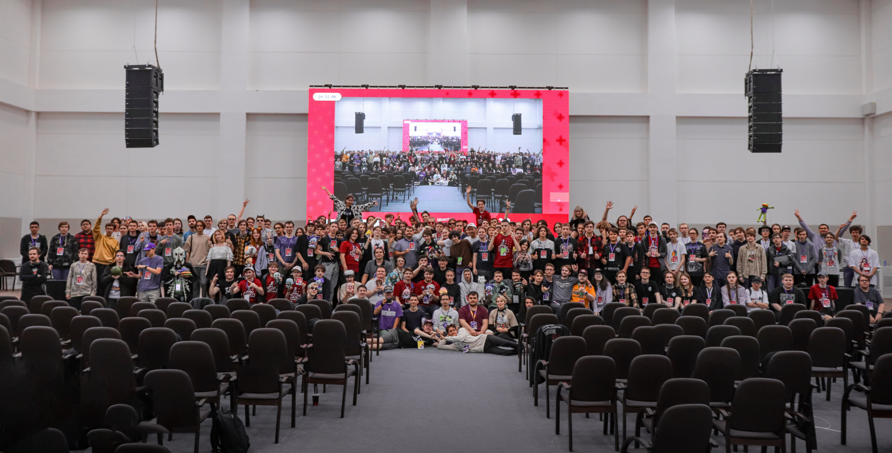

---
tags:
  - MOE
  - MOE2023
---

# Moscow osu! Event 2023

**Moscow osu! Event 2023** (***MOE 2023***) was the first instalment of the Moscow osu! Event. It was held on July 29–30, 2023 at **Phystechpark, Moscow, Russian Federation**, gathering more than 250 people offline.

## Links

- **[Website](https://moscowosu.events)**
- [Twitter account](https://x.com/moscowosuevent)
- [Telegram channel](https://t.me/moscowosuevent)
- [VK group](https://vk.com/moscowosuevent)
- [Discord server](https://discord.gg/EJh4qW6JWz)
- [Discussion](https://osu.ppy.sh/community/forums/topics/1778473)
- [Event stream recordings (YouTube playlist)](https://www.youtube.com/playlist?list=PLOkaDdbVuNyZ4PoDHpsCakj_O1-C5hP7W)

## Organisation

MOE 2023 was run by various community members:

| Position | User(s) |
| :-- | :-- |
| Head staff | ::{ flag=RU }:: [Stanwald](https://osu.ppy.sh/users/1628227), ::{ flag=RU }:: [\[kr\]](https://osu.ppy.sh/users/9472862), ::{ flag=RU }:: [ThankYou](https://osu.ppy.sh/users/4571241) |
| Developer | ::{ flag=RU }:: [\[kr\]](https://osu.ppy.sh/users/9472862), ::{ flag=RU }:: [ThankYou](https://osu.ppy.sh/users/4571241) |
| Graphics designer | ::{ flag=RU }:: [vr_virtux](https://osu.ppy.sh/users/11531550), ::{ flag=RU }:: [Arhella](https://osu.ppy.sh/users/4411044), ::{ flag=RU }:: [-database-](https://osu.ppy.sh/users/4411044) |
| Technical specialist | ::{ flag=RU }:: [Rainbowtaves](https://osu.ppy.sh/users/10079847), ::{ flag=RU }:: [InditaiX](https://osu.ppy.sh/users/8303943) |
| Media support | ::{ flag=RU }:: [InditaiX](https://osu.ppy.sh/users/8303943), ::{ flag=RU }:: [Kyori](https://osu.ppy.sh/users/6660546), ::{ flag=RU }:: [excel error](https://osu.ppy.sh/users/12464535) |
| Mascot design | ::{ flag=RU }:: [sonyaao_o](https://osu.ppy.sh/users/16964067), ::{ flag=RU }:: [Surann](https://osu.ppy.sh/users/9274069) |
| Narrator | ::{ flag=RU }:: [Stanwald](https://osu.ppy.sh/users/1628227), ::{ flag=RU }:: [qqseekq](https://osu.ppy.sh/scores/4775817262) |
| Tournament host | ::{ flag=RU }:: [Stanwald](https://osu.ppy.sh/users/1628227), ::{ flag=RU }:: [\[kr\]](https://osu.ppy.sh/users/9472862), ::{ flag=RU }:: [ThankYou](https://osu.ppy.sh/users/4571241) |
| Referee | ::{ flag=RU }:: [Eloy](https://osu.ppy.sh/users/9837368), ::{ flag=RU }:: [Normanzerga](https://osu.ppy.sh/users/9887673), ::{ flag=RU }:: [Rainbowtaves](https://osu.ppy.sh/users/10079847) |
| Mappooler | ::{ flag=RU }:: [Sanch-KK](https://osu.ppy.sh/users/9131844), ::{ flag=RU }:: [Daycore](https://osu.ppy.sh/users/5596337), ::{ flag=RU }:: [fergas](https://osu.ppy.sh/users/3144542), ::{ flag=RU }:: [Frakturehawkens](https://osu.ppy.sh/users/7458583), ::{ flag=RU }:: [keevy](https://osu.ppy.sh/users/10584295), ::{ flag=RU }:: [KomachiBaka](https://osu.ppy.sh/users/6155320), ::{ flag=RU }:: [Rootynator](https://osu.ppy.sh/users/9824686), ::{ flag=ID }:: [Shurelia](https://osu.ppy.sh/users/3807986), ::{ flag=RU }:: [Alumetri](https://osu.ppy.sh/users/5371497), ::{ flag=RU }:: [Cami](https://osu.ppy.sh/users/10286675), ::{ flag=RU }:: [Caspar](https://osu.ppy.sh/users/6084669), ::{ flag=RU }:: [E4pi4mak](https://osu.ppy.sh/users/11199892), ::{ flag=RS }:: [Florescence](https://osu.ppy.sh/users/6495550), ::{ flag=KR }:: [milr_](https://osu.ppy.sh/users/4485933), ::{ flag=RU }:: [piroshki](https://osu.ppy.sh/users/7645522), ::{ flag=RU }:: [Ratarok](https://osu.ppy.sh/users/9014033), ::{ flag=PK }:: [DeRandom Otaku](https://osu.ppy.sh/users/5156153), ::{ flag=RU }:: [Djulus](https://osu.ppy.sh/users/4960893), ::{ flag=RU }:: [WalkingDivan4ik](https://osu.ppy.sh/users/10420493), ::{ flag=RU }:: [wenect](https://osu.ppy.sh/users/10261029) |
| Commentator | ::{ flag=BY }:: [durashcka](https://osu.ppy.sh/users/4608215), ::{ flag=RU }:: [Kargondz](https://osu.ppy.sh/users/9919528), ::{ flag=RU }:: [Nennerce](https://osu.ppy.sh/users/16873960), ::{ flag=RU }:: [Prade](https://osu.ppy.sh/users/9318565), ::{ flag=RU }:: [MrFuture](https://osu.ppy.sh/users/5724445), ::{ flag=RU }:: [qqseekq](https://osu.ppy.sh/scores/4775817262) |
| Support staff | ::{ flag=RU }:: [3mplify](https://osu.ppy.sh/users/5688171), ::{ flag=RU }:: [AnyProblems](https://osu.ppy.sh/users/14521043), ::{ flag=RU }:: [Ezaact](https://osu.ppy.sh/users/7398762), ::{ flag=RU }:: [micke259](https://osu.ppy.sh/users/9417967), ::{ flag=RU }:: [Mihu1lio](https://osu.ppy.sh/users/10248474), ::{ flag=RU }:: [Yolixer](https://osu.ppy.sh/users/13954882), ::{ flag=RU }:: [Twiggykun](https://osu.ppy.sh/users/9126943), ::{ flag=LV }:: [zoomqge](https://osu.ppy.sh/users/10765028), ::{ flag=RU }:: [-Fila-](https://osu.ppy.sh/users/8979058), ::{ flag=RU }:: [KeRLi_](https://osu.ppy.sh/users/5902629), ::{ flag=RU }:: [System_error](https://osu.ppy.sh/users/9249873), ::{ flag=RU }:: [1337](https://osu.ppy.sh/users/167013) |

Group photo of attendees ([Reddit](https://www.reddit.com/r/osugame/comments/15fgwc5/moscow_osu_event_2023_july_2930/))

## Schedule

Saturday, July 29, 2023:

| Event | Time (UTC+3) |
| :-- | :-- |
| Opening speech & event opening | 11:00–12:00 |
| Round of 16 matches: ::{ flag=RU }:: [temka na](https://osu.ppy.sh/users/10504596) vs. ::{ flag=RU }:: [Skrowell](https://osu.ppy.sh/users/9694263); ::{ flag=RU }:: [HandsomeMe](https://osu.ppy.sh/users/11376152) vs. ::{ flag=RU }:: [Orenburg](https://osu.ppy.sh/users/6215032) | 12:00–13:30 |
| Panel discussion: Mapping | 13:30–14:30 |
| Round of 16 matches: ::{ flag=RU }:: [Arclyte](https://osu.ppy.sh/users/6585939) vs. ::{ flag=RU }:: [desuqe](https://osu.ppy.sh/users/9712285); ::{ flag=RU }:: [MrFuture](https://osu.ppy.sh/users/5724445) vs. ::{ flag=RU }:: [gamer228666](https://osu.ppy.sh/users/5981005) | 14:30–16:00 |
| Game activity: osu! Arena | 16:00–16:30 |
| Round of 16 matches: ::{ flag=RU }:: [DaHuJka](https://osu.ppy.sh/users/6830745) vs. ::{ flag=RU }:: [Welter](https://osu.ppy.sh/users/11552867); ::{ flag=RU }:: [SL1PER](https://osu.ppy.sh/users/10199538) vs. ::{ flag=RU }:: [Chicony](https://osu.ppy.sh/users/5199332) | 16:30–18:00 |
| Panel discussion: Q&A for players | 18:00–18:30 |
| Game activity: Neuro-osu! | 18:30–19:00 |
| Round of 16 matches: ::{ flag=RU }:: [azaz08967565](https://osu.ppy.sh/users/8631281) vs. ::{ flag=RU }:: [Vitya1437](https://osu.ppy.sh/users/4346274); ::{ flag=RU }:: [talala](https://osu.ppy.sh/users/1389663) vs. ::{ flag=RU }:: [-Din-](https://osu.ppy.sh/users/7972980) | 19:00–20:30 |
| Day wrap-up | 20:30–21:00 |

Sunday, July 30, 2023:

| Event | Time (UTC+3) |
| :-- | :-- |
| Opening speech & start of the second day. | 11:00–11:30 |
| Quarterfinal matches: ::{ flag=RU }:: [Skrowell](https://osu.ppy.sh/users/9694263) vs. ::{ flag=RU }:: [HandsomeMe](https://osu.ppy.sh/users/11376152); ::{ flag=RU }:: [Welter](https://osu.ppy.sh/users/11552867) vs. ::{ flag=RU }:: [Vitya1437](https://osu.ppy.sh/users/4346274) | 11:30–13:00 |
| Panel discussion: osu! history | 13:00–14:00 |
| Quarterfinal matches: ::{ flag=RU }:: [Chicony](https://osu.ppy.sh/users/5199332) vs. ::{ flag=RU }:: [desuqe](https://osu.ppy.sh/users/9712285); ::{ flag=RU }:: [gamer228666](https://osu.ppy.sh/users/5981005) vs. ::{ flag=RU }:: [-Din-](https://osu.ppy.sh/users/7972980) | 14:00–15:30 |
| Game activity: osu! Quiz | 15:30–16:30 |
| Semifinal matches: ::{ flag=RU }:: [HandsomeMe](https://osu.ppy.sh/users/11376152) vs. ::{ flag=RU }:: [Welter](https://osu.ppy.sh/users/11552867); ::{ flag=RU }:: [Chicony](https://osu.ppy.sh/users/5199332) vs. ::{ flag=RU }:: [gamer228666](https://osu.ppy.sh/users/5981005) | 16:30–18:00 |
| Announcements and video content viewing | 18:00–19:00 |
| Final match: ::{ flag=RU }:: [Welter](https://osu.ppy.sh/users/11552867) vs. ::{ flag=RU }:: [Chicony](https://osu.ppy.sh/users/5199332) | 19:00–20:00 |
| Wrap-up, awarding of finalists & festival closing | 20:00–21:00 |

## Prizes

The prize pool for the event was 30,000 ₽ (~$326).

| Placing | Prize(s) |
| :-: | :-- |
|  | $130.35 (~12,000 ₽) |
|  | $65.18 (~6,000 ₽) |
|  | $32.59 (~3,000 ₽) |

The rest of the prize pool was distributed among players who placed 5th–8th.
