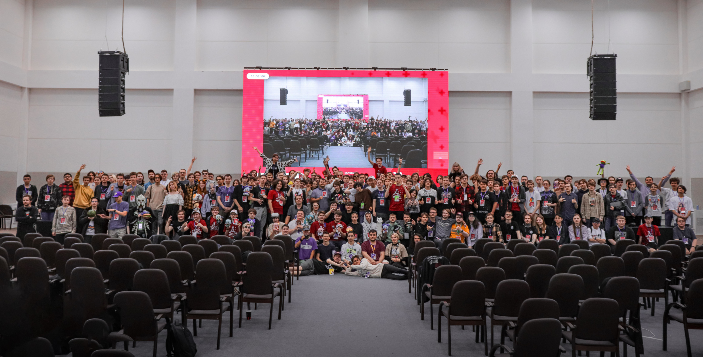

---
tags:
  - MOE
  - MOE2023
---

# Moscow osu! Event 2023

El **Moscow osu! Event 2023** (***MOE 2023***) fue la primera edición del Moscow osu! Event. Se llevó a cabo los días 29 y 30 de julio de 2023 en **Phystechpark, Moscú, Federación de Rusia**, y reunió a más de 250 personas presencialmente.

## Enlaces

- **[Sitio web](https://moscowosu.events)**
- [Cuenta de Twitter](https://x.com/moscowosuevent)
- [Canal de Telegram](https://t.me/moscowosuevent)
- [Grupo de VK](https://vk.com/moscowosuevent)
- [Servidor de Discord](https://discord.gg/EJh4qW6JWz)
- [Hilo de discusión](https://osu.ppy.sh/community/forums/topics/1778473)
- [Grabaciones del evento (lista de reproducción de YouTube)](https://www.youtube.com/playlist?list=PLOkaDdbVuNyZ4PoDHpsCakj_O1-C5hP7W)

## Organización

MOE 2023 fue organizado por varios miembros de la comunidad:

| Posición | Usuario(s) |
| :-- | :-- |
| Jefe del personal | ::{ flag=RU }:: [Stanwald](https://osu.ppy.sh/users/1628227), ::{ flag=RU }:: [\[kr\]](https://osu.ppy.sh/users/9472862), ::{ flag=RU }:: [ThankYou](https://osu.ppy.sh/users/4571241) |
| Desarrollador | ::{ flag=RU }:: [\[kr\]](https://osu.ppy.sh/users/9472862), ::{ flag=RU }:: [ThankYou](https://osu.ppy.sh/users/4571241) |
| Diseñador gráfico | ::{ flag=RU }:: [vr_virtux](https://osu.ppy.sh/users/11531550), ::{ flag=RU }:: [Arhella](https://osu.ppy.sh/users/4411044), ::{ flag=RU }:: [-database-](https://osu.ppy.sh/users/4411044) |
| Técnico especialista | ::{ flag=RU }:: [Rainbowtaves](https://osu.ppy.sh/users/10079847), ::{ flag=RU }:: [InditaiX](https://osu.ppy.sh/users/8303943) |
| Soporte de la multimedia | ::{ flag=RU }:: [InditaiX](https://osu.ppy.sh/users/8303943), ::{ flag=RU }:: [Kyori](https://osu.ppy.sh/users/6660546), ::{ flag=RU }:: [excel error](https://osu.ppy.sh/users/12464535) |
| Diseñador de las mascotas | ::{ flag=RU }:: [sonyaao_o](https://osu.ppy.sh/users/16964067), ::{ flag=RU }:: [Surann](https://osu.ppy.sh/users/9274069) |
| Narrador | ::{ flag=RU }:: [Stanwald](https://osu.ppy.sh/users/1628227), ::{ flag=RU }:: [qqseekq](https://osu.ppy.sh/scores/4775817262) |
| Anfitrión del torneo | ::{ flag=RU }:: [Stanwald](https://osu.ppy.sh/users/1628227), ::{ flag=RU }:: [\[kr\]](https://osu.ppy.sh/users/9472862), ::{ flag=RU }:: [ThankYou](https://osu.ppy.sh/users/4571241) |
| Árbitro | ::{ flag=RU }:: [Eloy](https://osu.ppy.sh/users/9837368), ::{ flag=RU }:: [Normanzerga](https://osu.ppy.sh/users/9887673), ::{ flag=RU }:: [Rainbowtaves](https://osu.ppy.sh/users/10079847) |
| Mappooler | ::{ flag=RU }:: [Sanch-KK](https://osu.ppy.sh/users/9131844), ::{ flag=RU }:: [Daycore](https://osu.ppy.sh/users/5596337), ::{ flag=RU }:: [fergas](https://osu.ppy.sh/users/3144542), ::{ flag=RU }:: [Frakturehawkens](https://osu.ppy.sh/users/7458583), ::{ flag=RU }:: [keevy](https://osu.ppy.sh/users/10584295), ::{ flag=RU }:: [KomachiBaka](https://osu.ppy.sh/users/6155320), ::{ flag=RU }:: [Rootynator](https://osu.ppy.sh/users/9824686), ::{ flag=ID }:: [Shurelia](https://osu.ppy.sh/users/3807986), ::{ flag=RU }:: [Alumetri](https://osu.ppy.sh/users/5371497), ::{ flag=RU }:: [Cami](https://osu.ppy.sh/users/10286675), ::{ flag=RU }:: [Caspar](https://osu.ppy.sh/users/6084669), ::{ flag=RU }:: [E4pi4mak](https://osu.ppy.sh/users/11199892), ::{ flag=RS }:: [Florescence](https://osu.ppy.sh/users/6495550), ::{ flag=KR }:: [milr_](https://osu.ppy.sh/users/4485933), ::{ flag=RU }:: [piroshki](https://osu.ppy.sh/users/7645522), ::{ flag=RU }:: [Ratarok](https://osu.ppy.sh/users/9014033), ::{ flag=PK }:: [DeRandom Otaku](https://osu.ppy.sh/users/5156153), ::{ flag=RU }:: [Djulus](https://osu.ppy.sh/users/4960893), ::{ flag=RU }:: [WalkingDivan4ik](https://osu.ppy.sh/users/10420493), ::{ flag=RU }:: [wenect](https://osu.ppy.sh/users/10261029) |
| Comentarista | ::{ flag=BY }:: [durashcka](https://osu.ppy.sh/users/4608215), ::{ flag=RU }:: [Kargondz](https://osu.ppy.sh/users/9919528), ::{ flag=RU }:: [Nennerce](https://osu.ppy.sh/users/16873960), ::{ flag=RU }:: [Prade](https://osu.ppy.sh/users/9318565), ::{ flag=RU }:: [MrFuture](https://osu.ppy.sh/users/5724445), ::{ flag=RU }:: [qqseekq](https://osu.ppy.sh/scores/4775817262) |
| Personal de soporte | ::{ flag=RU }:: [3mplify](https://osu.ppy.sh/users/5688171), ::{ flag=RU }:: [AnyProblems](https://osu.ppy.sh/users/14521043), ::{ flag=RU }:: [Ezaact](https://osu.ppy.sh/users/7398762), ::{ flag=RU }:: [micke259](https://osu.ppy.sh/users/9417967), ::{ flag=RU }:: [Mihu1lio](https://osu.ppy.sh/users/10248474), ::{ flag=RU }:: [Yolixer](https://osu.ppy.sh/users/13954882), ::{ flag=RU }:: [Twiggykun](https://osu.ppy.sh/users/9126943), ::{ flag=LV }:: [zoomqge](https://osu.ppy.sh/users/10765028), ::{ flag=RU }:: [-Fila-](https://osu.ppy.sh/users/8979058), ::{ flag=RU }:: [KeRLi_](https://osu.ppy.sh/users/5902629), ::{ flag=RU }:: [System_error](https://osu.ppy.sh/users/9249873), ::{ flag=RU }:: [1337](https://osu.ppy.sh/users/167013) |

Foto grupal de los asistentes ([Publicación de Reddit](https://www.reddit.com/r/osugame/comments/15fgwc5/moscow_osu_event_2023_july_2930/))

## Cronograma

Sábado, 29 de julio de 2023:

| Evento | Hora (UTC+3) |
| :-- | :-- |
| Discurso de apertura y apertura del evento | 11:00-12:00 |
| Partidos de octavos de final: ::{ flag=RU }:: [temka na](https://osu.ppy.sh/users/10504596) vs. ::{ flag=RU }:: [Skrowell](https://osu.ppy.sh/users/9694263); ::{ flag=RU }:: [HandsomeMe](https://osu.ppy.sh/users/11376152) vs. ::{ flag=RU }:: [Orenburg](https://osu.ppy.sh/users/6215032) | 12:00-13:30 |
| Panel de discusión sobre el mapping | 13:30-14:30 |
| Partidos de octavos de final: ::{ flag=RU }:: [Arclyte](https://osu.ppy.sh/users/6585939) vs. ::{ flag=RU }:: [desuqe](https://osu.ppy.sh/users/9712285); ::{ flag=RU }:: [MrFuture](https://osu.ppy.sh/users/5724445) vs. ::{ flag=RU }:: [gamer228666](https://osu.ppy.sh/users/5981005) | 14:30-16:00 |
| Actividad: osu! Arena | 16:00-16:30 |
| Partidos de octavos de final: ::{ flag=RU }:: [DaHuJka](https://osu.ppy.sh/users/6830745) vs. ::{ flag=RU }:: [Welter](https://osu.ppy.sh/users/11552867); ::{ flag=RU }:: [SL1PER](https://osu.ppy.sh/users/10199538) vs. ::{ flag=RU }:: [Chicony](https://osu.ppy.sh/users/5199332) | 16:30-18:00 |
| Panel de discusión: Preguntas y respuestas para los jugadores | 18:00-18:30 |
| Actividad: Neuro-osu! | 18:30-19:00 |
| Partidos de octavos de final: ::{ flag=RU }:: [azaz08967565](https://osu.ppy.sh/users/8631281) vs. ::{ flag=RU }:: [Vitya1437](https://osu.ppy.sh/users/4346274); ::{ flag=RU }:: [talala](https://osu.ppy.sh/users/1389663) vs. ::{ flag=RU }:: [-Din-](https://osu.ppy.sh/users/7972980) | 19:00-20:30 |
| Resumen del día | 20:30-21:00 |

Domingo, 30 de julio de 2023:

| Evento | Hora (UTC+3) |
| :-- | :-- |
| Discurso de apertura e inicio del segundo día. | 11:00-11:30 |
| Partidos de cuartos de final: ::{ flag=RU }:: [Skrowell](https://osu.ppy.sh/users/9694263) vs. ::{ flag=RU }:: [HandsomeMe](https://osu.ppy.sh/users/11376152); ::{ flag=RU }:: [Welter](https://osu.ppy.sh/users/11552867) vs. ::{ flag=RU }:: [Vitya1437](https://osu.ppy.sh/users/4346274) | 11:30-13:00 |
| Panel de discusión: Historia de osu! | 13:00-14:00 |
| Partidos de cuartos de final: ::{ flag=RU }:: [Chicony](https://osu.ppy.sh/users/5199332) vs. ::{ flag=RU }:: [desuqe](https://osu.ppy.sh/users/9712285); ::{ flag=RU }:: [gamer228666](https://osu.ppy.sh/users/5981005) vs. ::{ flag=RU }:: [-Din-](https://osu.ppy.sh/users/7972980) | 14:00-15:30 |
| Actividad: osu! Quiz | 15:30-16:30 |
| Partidos de las semifinales: ::{ flag=RU }:: [HandsomeMe](https://osu.ppy.sh/users/11376152) vs. ::{ flag=RU }:: [Welter](https://osu.ppy.sh/users/11552867); ::{ flag=RU }:: [Chicony](https://osu.ppy.sh/users/5199332) vs. ::{ flag=RU }:: [gamer228666](https://osu.ppy.sh/users/5981005) | 16:30-18:00 |
| Anuncios y visualización de vídeos | 18:00-19:00 |
| Partido de la final: ::{ flag=RU }:: [Welter](https://osu.ppy.sh/users/11552867) vs. ::{ flag=RU }:: [Chicony](https://osu.ppy.sh/users/5199332) | 19:00-20:00 |
| Resumen, entrega de premios a los finalistas y clausura del festival | 20:00-21:00 |

## Premios

La bolsa de premios del evento fue de 30 000 ₽ (~326 $).

| Posición | Premio(s) |
| :-: | :-- |
|  | 130,35 $ (~12,000 ₽) |
|  | 65,18 $ (~6,000 ₽) |
|  | 32,59 $ (~3,000 ₽) |

El resto de la bolsa de premios se repartió entre los jugadores del 5to y 8vo lugar.
