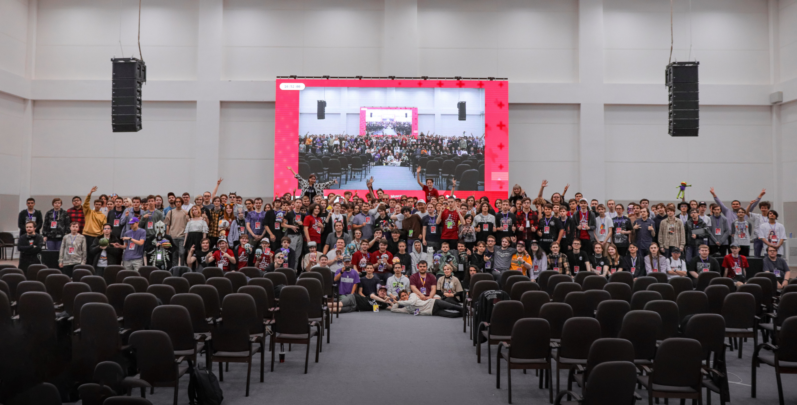

---
tags:
  - MOE
  - MOE2023
---

# Moscow osu! Event 2023

**Moscow osu! Event 2023** (***MOE 2023***) - первая итерация osu!-фестиваля, проходившая 29–30 июля 2023 года в **ФизТехПарк, Москва, Российская Федерация** и собравшая более 250 участников.

## Ссылки

- **[Сайт](https://moscowosu.events)**
- [Твиттер](https://x.com/moscowosuevent)
- [Телеграм](https://t.me/moscowosuevent)
- [VK](https://vk.com/moscowosuevent)
- [Дискорд](https://discord.gg/EJh4qW6JWz)
- [Обсуждение](https://osu.ppy.sh/community/forums/topics/1778473)
- [Записи трансляции мероприятия (YouTube-плейлист)](https://www.youtube.com/playlist?list=PLOkaDdbVuNyZ4PoDHpsCakj_O1-C5hP7W)

## Организаторы

MOE 2023 проводился с помощью различных участников [сообщества](/wiki/Community) osu!:

| Позиция | Пользователь(-и) |
| :-- | :-- |
| Организатор | ::{ flag=RU }:: ::Stanwald::{ user=1628227 }, ::{ flag=RU }:: ::\[kr\]::{ user=9472862 }, ::{ flag=RU }:: ::ThankYou::{ user=4571241 } |
| Разработчик | ::{ flag=RU }:: ::\[kr\]::{ user=9472862 }, ::{ flag=RU }:: ::ThankYou::{ user=4571241 } |
| Графика | ::{ flag=RU }:: ::vr_virtux::{ user=11531550 }, ::{ flag=RU }:: ::Arhella::{ user=4411044 }, ::{ flag=RU }:: ::-database-::{ user=4411044 } |
| Технический специалист | ::{ flag=RU }:: ::Rainbowtaves::{ user=10079847 }, ::{ flag=RU }:: ::InditaiX::{ user=8303943 } |
| Медиа-сопровождение | ::{ flag=RU }:: ::InditaiX::{ user=8303943 }, ::{ flag=RU }:: ::Kyori::{ user=6660546 }, ::{ flag=RU }:: ::excel error::{ user=12464535 } |
| Дизайн маскота | ::{ flag=RU }:: ::sonyaao_o::{ user=16964067 }, ::{ flag=RU }:: ::Surann::{ user=9274069 } |
| Ведущий | ::{ flag=RU }:: ::Stanwald::{ user=1628227 }, ::{ flag=RU }:: [qqseekq](https://osu.ppy.sh/scores/4775817262) |
| Организатор турнира | ::{ flag=RU }:: ::Stanwald::{ user=1628227 }, ::{ flag=RU }:: ::\[kr\]::{ user=9472862 }, ::{ flag=RU }:: ::ThankYou::{ user=4571241 } |
| Рефери | ::{ flag=RU }:: ::Eloy::{ user=9837368 }, ::{ flag=RU }:: ::Normanzerga::{ user=9887673 }, ::{ flag=RU }:: ::Rainbowtaves::{ user=10079847 } |
| Составители маппула | ::{ flag=RU }:: ::Sanch-KK::{ user=9131844 }, ::{ flag=RU }:: ::Daycore::{ user=5596337 }, ::{ flag=RU }:: ::fergas::{ user=3144542 }, ::{ flag=RU }:: ::Frakturehawkens::{ user=7458583 }, ::{ flag=RU }:: ::keevy::{ user=10584295 }, ::{ flag=RU }:: ::KomachiBaka::{ user=6155320 }, ::{ flag=RU }:: ::Rootynator::{ user=9824686 }, ::{ flag=ID }:: ::Shurelia::{ user=3807986 }, ::{ flag=RU }:: ::Alumetri::{ user=5371497 }, ::{ flag=RU }:: ::Cami::{ user=10286675 }, ::{ flag=RU }:: ::Caspar::{ user=6084669 }, ::{ flag=RU }:: ::E4pi4mak::{ user=11199892 }, ::{ flag=RS }:: ::Florescence::{ user=6495550 }, ::{ flag=KR }:: ::milr_::{ user=4485933 }, ::{ flag=RU }:: ::piroshki::{ user=7645522 }, ::{ flag=RU }:: ::Ratarok::{ user=9014033 }, ::{ flag=PK }:: ::DeRandom Otaku::{ user=5156153 }, ::{ flag=RU }:: ::Djulus::{ user=4960893 }, ::{ flag=RU }:: ::WalkingDivan4ik::{ user=10420493 }, ::{ flag=RU }:: ::wenect::{ user=10261029 } |
| Комментатор | ::{ flag=BY }:: ::durashcka::{ user=4608215 }, ::{ flag=RU }:: ::Kargondz::{ user=9919528 }, ::{ flag=RU }:: ::Nennerce::{ user=16873960 }, ::{ flag=RU }:: ::Prade::{ user=9318565 }, ::{ flag=RU }:: ::MrFuture::{ user=5724445 }, ::{ flag=RU }:: [qqseekq](https://osu.ppy.sh/scores/4775817262) |
| Вспомогательный персонал | ::{ flag=RU }:: ::3mplify::{ user=5688171 }, ::{ flag=RU }:: ::AnyProblems::{ user=14521043 }, ::{ flag=RU }:: ::Ezaact::{ user=7398762 }, ::{ flag=RU }:: ::micke259::{ user=9417967 }, ::{ flag=RU }:: ::Mihu1lio::{ user=10248474 }, ::{ flag=RU }:: ::Yolixer::{ user=13954882 }, ::{ flag=RU }:: ::Twiggykun::{ user=9126943 }, ::{ flag=LV }:: ::zoomqge::{ user=10765028 }, ::{ flag=RU }:: ::-Fila-::{ user=8979058 }, ::{ flag=RU }:: ::KeRLi_::{ user=5902629 }, ::{ flag=RU }:: ::System_error::{ user=9249873 }, ::{ flag=RU }:: ::1337::{ user=167013 } |

Групповая фотография участников мероприятия ([Reddit](https://www.reddit.com/r/osugame/comments/15fgwc5/moscow_osu_event_2023_july_2930/))

## Расписание

Суббота, 29 июля 2023

| Событие | Время проведения (UTC+3) |
| :-- | :-- |
| Вступительная речь. Открытие мероприятия. | 11:00–12:00 |
| Матчи 1/8 турнира: ::{ flag=RU }:: ::temka na::{ user=10504596 } vs. ::{ flag=RU }:: ::Skrowell::{ user=9694263 }; ::{ flag=RU }:: ::HandsomeMe::{ user=11376152 } vs. ::{ flag=RU }:: ::Orenburg::{ user=6215032 } | 12:00 - 13:30 |
| Разговорная панель: Маппинг | 13:30–14:30 |
| Матчи 1/8 турнира: ::{ flag=RU }:: ::Arclyte::{ user=6585939 } vs. ::{ flag=RU }:: ::desuqe::{ user=9712285 }; ::{ flag=RU }:: ::MrFuture::{ user=5724445 } vs. ::{ flag=RU }:: ::gamer228666::{ user=5981005 } | 14:30 - 16:00 |
| Игровая активность: osu! Арена | 16:00–16:30 |
| Матчи 1/8 турнира: ::{ flag=RU }:: ::DaHuJka::{ user=6830745 } vs. ::{ flag=RU }:: ::Welter::{ user=11552867 }; ::{ flag=RU }:: ::SL1PER::{ user=10199538 } vs. ::{ flag=RU }:: ::Chicony::{ user=5199332 } | 16:30 - 18:00 |
| Разговорная панель: Ответы на вопросы игрокам | 18:00–18:30 |
| Игровая активность: Нейро-osu! | 18:30–19:00 |
| Матчи 1/8 турнира: ::{ flag=RU }:: ::azaz08967565::{ user=8631281 } vs. ::{ flag=RU }:: ::Vitya1437::{ user=4346274 }; ::{ flag=RU }:: ::talala::{ user=1389663 } vs. ::{ flag=RU }:: ::-Din-::{ user=7972980 } | 19:00 - 20:30 |
| Подведение итогов дня | 20:30–21:00 |

Воскресенье, 30 июля 2023

| Событие | Время проведения (UTC+3) |
| :-- | :-- |
| Вступительная речь. Открытие второго дня. | 11:00–11:30 |
| Матчи 1/4 турнира: ::{ flag=RU }:: ::Skrowell::{ user=9694263 } vs. ::{ flag=RU }:: ::HandsomeMe::{ user=11376152 }; ::{ flag=RU }:: ::Welter::{ user=11552867 } vs. ::{ flag=RU }:: ::Vitya1437::{ user=4346274 } | 11:30 - 13:00 |
| Разговорная панель: История osu! | 13:00–14:00 |
| Матчи 1/4 турнира: ::{ flag=RU }:: ::Chicony::{ user=5199332 } vs. ::{ flag=RU }:: ::desuqe::{ user=9712285 }; ::{ flag=RU }:: ::gamer228666::{ user=5981005 } vs. ::{ flag=RU }:: ::-Din-::{ user=7972980 } | 14:00 - 15:30 |
| Игровая активность: osu! Викторина | 15:30–16:30 |
| Матчи полуфинала турнира: ::{ flag=RU }:: ::HandsomeMe::{ user=11376152 } vs. ::{ flag=RU }:: ::Welter::{ user=11552867 }; ::{ flag=RU }:: ::Chicony::{ user=5199332 } vs. ::{ flag=RU }:: ::gamer228666::{ user=5981005 } | 16:30 - 18:00 |
| Анонсы и просмотр видеоконтента | 18:00–19:00 |
| Финальный матч турнира: ::{ flag=RU }:: ::Welter::{ user=11552867 } vs. ::{ flag=RU }:: ::Chicony::{ user=5199332 } | 19:00 - 20:00 |
| Подведение итогов, награждение финалистов и закрытие фестиваля | 20:00–21:00 |

## Призы

Призовой фонд мероприятия составил 30,000₽ (≃$326).

| Место | Приз(-ы) |
| :-: | :-- |
|  | US $130.35 (~12,000₽) |
|  | US $65.18 (~6,000₽) |
|  | US $32.59 (~3,000₽) |

Остальная часть средств призового фонда была распределена между игроками, занявшими места с 5 по 8.
