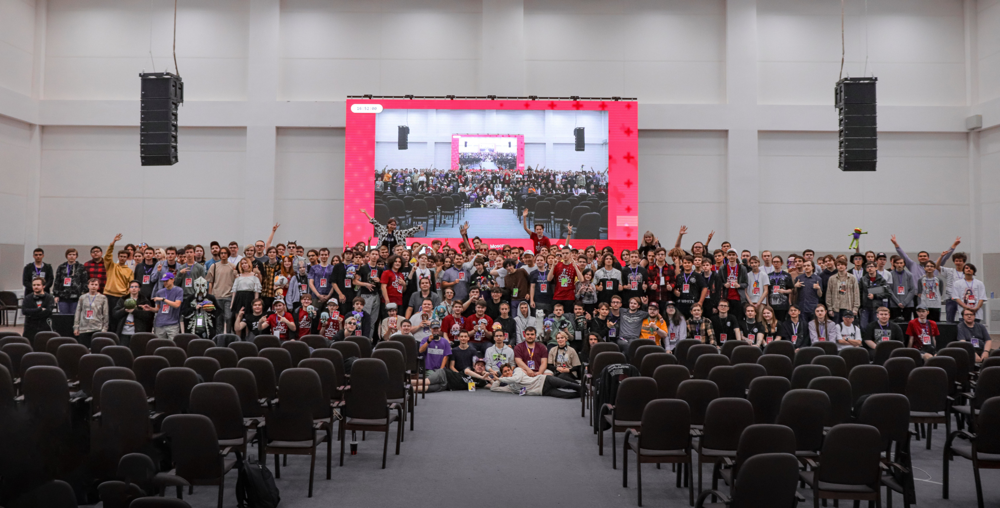

---
tags:
  - MOE
  - MOE2023
---

# Moscow osu! Event 2023

**Moscow osu! Event 2023** (***MOE 2023***) เป็นการจัดงานครั้งแรกของ Moscow osu! Event โดยจัดขึ้นระหว่างวันที่ 29–30 กรกฎาคม 2023 ณ **Phystechpark กรุงมอสโก ประเทศรัสเซีย** ซึ่งมีผู้เข้าร่วมงานในสถานที่จริงมากกว่า 250 คน

## ลิงก์ที่เกี่ยวข้อง

- **[เว็บไซต์](https://moscowosu.events)**
- [บัญชี Twitter](https://x.com/moscowosuevent)
- [แชนแนล Telegram](https://t.me/moscowosuevent)
- [กลุ่ม VK](https://vk.com/moscowosuevent)
- [เซิร์ฟเวอร์ Discord](https://discord.gg/EJh4qW6JWz)
- [กระทู้พูดคุย](https://osu.ppy.sh/community/forums/topics/1778473)
- [บันทึกการถ่ายทอดสดกิจกรรม (เพลย์ลิสต์ YouTube)](https://www.youtube.com/playlist?list=PLOkaDdbVuNyZ4PoDHpsCakj_O1-C5hP7W)

## การจัดการงาน

MOE 2023 ดำเนินการโดยสมาชิกในชุมชนจากหลายส่วนงาน:

| ตำแหน่ง | รายชื่อสมาชิก |
| :-- | :-- |
| หัวหน้าทีมงาน | ::{ flag=RU }:: [Stanwald](https://osu.ppy.sh/users/1628227), ::{ flag=RU }:: [\[kr\]](https://osu.ppy.sh/users/9472862), ::{ flag=RU }:: [ThankYou](https://osu.ppy.sh/users/4571241) |
| นักพัฒนา (Developer) | ::{ flag=RU }:: [\[kr\]](https://osu.ppy.sh/users/9472862), ::{ flag=RU }:: [ThankYou](https://osu.ppy.sh/users/4571241) |
| กราฟิกดีไซน์เนอร์ | ::{ flag=RU }:: [vr_virtux](https://osu.ppy.sh/users/11531550), ::{ flag=RU }:: [Arhella](https://osu.ppy.sh/users/4411044), ::{ flag=RU }:: [-database-](https://osu.ppy.sh/users/4411044) |
| ผู้เชี่ยวชาญด้านเทคนิค | ::{ flag=RU }:: [Rainbowtaves](https://osu.ppy.sh/users/10079847), ::{ flag=RU }:: [InditaiX](https://osu.ppy.sh/users/8303943) |
| ฝ่ายสนับสนุนสื่อ | ::{ flag=RU }:: [InditaiX](https://osu.ppy.sh/users/8303943), ::{ flag=RU }:: [Kyori](https://osu.ppy.sh/users/6660546), ::{ flag=RU }:: [excel error](https://osu.ppy.sh/users/12464535) |
| ผู้ออกแบบมาสคอต | ::{ flag=RU }:: [sonyaao_o](https://osu.ppy.sh/users/16964067), ::{ flag=RU }:: [Surann](https://osu.ppy.sh/users/9274069) |
| ผู้ดำเนินรายการ | ::{ flag=RU }:: [Stanwald](https://osu.ppy.sh/users/1628227), ::{ flag=RU }:: [qqseekq](https://osu.ppy.sh/scores/4775817262) |
| โฮสต์การแข่งขัน | ::{ flag=RU }:: [Stanwald](https://osu.ppy.sh/users/1628227), ::{ flag=RU }:: [\[kr\]](https://osu.ppy.sh/users/9472862), ::{ flag=RU }:: [ThankYou](https://osu.ppy.sh/users/4571241) |
| กรรมการ (Referee) | ::{ flag=RU }:: [Eloy](https://osu.ppy.sh/users/9837368), ::{ flag=RU }:: [Normanzerga](https://osu.ppy.sh/users/9887673), ::{ flag=RU }:: [Rainbowtaves](https://osu.ppy.sh/users/10079847) |

ภาพหมู่ผู้เข้าร่วมงาน ([Reddit](https://www.reddit.com/r/osugame/comments/15fgwc5/moscow_osu_event_2023_july_2930/))

## กำหนดการ (Schedule)

วันเสาร์ที่ 29 กรกฎาคม 2023:

| กิจกรรม | เวลา (UTC+3) |
| :-- | :-- |
| กล่าวเปิดงานและเริ่มงาน | 11:00–12:00 |
| การแข่งขันรอบ 16 คน: Chanyah vs. Akito; HandsomeMe vs. Orenburg | 12:00–13:30 |
| กิจกรรมพูดคุย: การทำแมพ (Mapping) | 13:30–14:30 |
| การแข่งขันรอบ 16 คน: Arclyte vs. desuqe; MrFuture vs. gamer228666 | 14:30–16:00 |
| กิจกรรมเกม: osu! Arena | 16:00–16:30 |
| การแข่งขันรอบ 16 คน: DaHuJka vs. Welter; SL1PER vs. Chicony | 16:30–18:00 |
| กิจกรรมพูดคุย: ถาม-ตอบสำหรับผู้เล่น | 18:00–18:30 |
| กิจกรรมเกม: Neuro-osu! | 18:30–19:00 |
| การแข่งขันรอบ 16 คน: azaz08967565 vs. Vitya1437; talala vs. -Din- | 19:00–20:30 |
| สรุปกิจกรรมประจำวัน | 20:30–21:00 |

วันอาทิตย์ที่ 30 กรกฎาคม 2023:

| กิจกรรม | เวลา (UTC+3) |
| :-- | :-- |
| กล่าวเปิดงานและเริ่มงานวันที่สอง | 11:00–11:30 |
| การแข่งขันรอบก่อนรองชนะเลิศ: Skrowell vs. HandsomeMe; Welter vs. Vitya1437 | 11:30–13:00 |
| กิจกรรมพูดคุย: ประวัติศาสตร์ของ osu! | 13:00–14:00 |
| การแข่งขันรอบก่อนรองชนะเลิศ: Chicony vs. desuqe; gamer228666 vs. -Din- | 14:00–15:30 |
| กิจกรรมเกม: osu! Quiz | 15:30–16:30 |
| การแข่งขันรอบรองชนะเลิศ: HandsomeMe vs. Welter; Chicony vs. gamer228666 | 16:30–18:00 |
| ประกาศข่าวสารและชมเนื้อหาวิดีโอ | 18:00–19:00 |
| การแข่งขันรอบชิงชนะเลิศ: Welter vs. Chicony | 19:00–20:00 |
| สรุปงาน, มอบรางวัลผู้ชนะ และปิดเทศกาล | 20:00–21:00 |

## รางวัล (Prizes)

เงินรางวัลรวมสำหรับกิจกรรมนี้คือ 30,000 รูเบิล (~326 ดอลลาร์สหรัฐ)

| อันดับ | รางวัล |
| :-: | :-- |
|  | ประมาณ 12,000 รูเบิล ($130.35) |
|  | ประมาณ 6,000 รูเบิล ($65.18) |
|  | ประมาณ 3,000 รูเบิล ($32.59) |

เงินรางวัลส่วนที่เหลือจะถูกแบ่งจ่ายให้กับผู้ที่ได้อันดับ 5 ถึง 8
