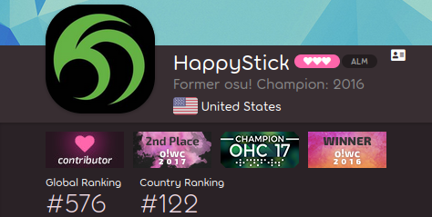
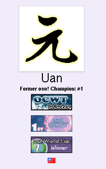

---
tags:
  - badges
  - profile badges
  - user badge
  - user badges
  - badges de profil
  - badge utilisateur
  - badges utilisateur
no_native_review: true
---

# Badge de profil

*À ne pas confondre avec les badges de groupe, qui apparaissent également sur les profils des utilisateurs.*\
*Pour les règles concernant l'utilisation comme prix de tournoi, voir : [Support officiel des tournois § Badges de profil](/wiki/Tournaments/Official_support#badges-de-profil)*

**Les badges de profil** (communément appelés *badges*) sont de petits graphiques affichés sur les pages de profil des utilisateurs et attribués pour diverses réalisations. Ils sont le plus souvent donnés comme prix pour les [tournois](/wiki/Tournaments) et les [concours](/wiki/Contests), mais ont d'autres utilisations, comme les récompenses pour les [contributeurs de la communauté](/wiki/People/Community_Contributors), les [Beatmap Spotlights](/wiki/Beatmap_Spotlights#récompenses), et l'appartenance continue à un groupe.

Lorsque l'on survole un badge, une infobulle s'affiche avec plus de détails sur la raison pour laquelle le badge a été décerné.

## Classement du tournoi

*Page principale : [Sélection pondérée par badge](/wiki/Tournaments/Badge-weighted_seeding)*

Dans le [client](/wiki/Client) et sur le site web, les badges sont purement décoratifs. Cependant, étant donné que les badges de prix des [tournois](/wiki/Tournaments) mettent en valeur les performances des joueurs, certains tournois ont adopté des méthodes [seeding](https://en.wikipedia.org/wiki/Seed_(sports)) qui prennent en compte le nombre de badges des joueurs, communément appelées [sélection pondérée par badge](/wiki/Tournaments/Badge-weighted_seeding).

## Histoire

Plutôt que d'empiler les badges horizontalement dans un conteneur couvrant toute la page, l'ancien site web les empilait verticalement entre le nom d'utilisateur et le drapeau du pays.

Un effet secondaire de ce schéma de mise en page était que la hauteur par défaut, non élargie, des [pages utilisateur](/wiki/osu!supporter#couverture-du-profil) pouvait être augmentée en gagnant plus de badges. Bien que cela n'ait pas été voulu, c'est devenu une blague dans la communauté des tournois. ::{ flag=US }:: [Toy](https://osu.ppy.sh/users/2757689) l'a montré dans [un tweet populaire](https://twitter.com/droombs/status/1036050610687074304), en affichant son record de badges gagnés au moment de la publication.

## Le saviez-vous ?

::: Infobox

:::

- Les deux premiers badges de profil ont été attribués à ::{ flag=PL }:: [niedzwiedz1124](https://osu.ppy.sh/users/9610) et ::{ flag=PL }:: [White Wolf](https://osu.ppy.sh/users/39828) le 6 septembre 2009, pour [avoir gagné *Tag Tournament*](https://osu.ppy.sh/community/forums/topics/17169).
- Les badges peuvent renvoyer à d'autres pages web pour plus de contexte, comme la page du forum d'un tournoi ou d'un article du wiki.
- Les badges empêchent les autres de [prendre le nom d'utilisateur actuel ou passé du joueur](/wiki/Help_centre/Account#prendre-nom-d'utilisateur-existant).
