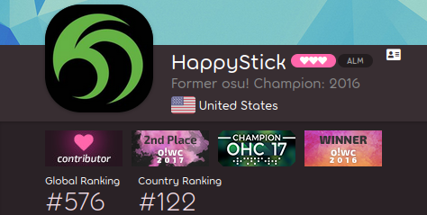
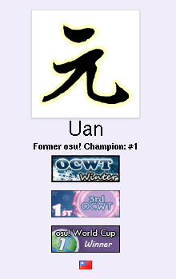

---
tags:
  - badges
  - profile badges
  - user badge
  - user badges
---

# เหรียญตราหน้าโปรไฟล์ (Profile badge)

*อย่าสับสนกับเหรียญตรากลุ่มผู้ใช้ (Group badges) ซึ่งปรากฏบนหน้าโปรไฟล์เช่นกัน*\
*สำหรับกฎระเบียบเกี่ยวกับการใช้เหรียญตราเป็นรางวัลในการแข่งขัน ดูที่: [การสนับสนุนทัวร์นาเมนต์อย่างเป็นทางการ § เหรียญตราหน้าโปรไฟล์](/wiki/Tournaments/Official_support#profile-badges)*

**เหรียญตราหน้าโปรไฟล์ (Profile badges)** (มักเรียกสั้นๆ ว่า *Badges*) คือรูปกราฟิกขนาดเล็กบนหน้าโปรไฟล์ของผู้ใช้ที่มอบให้สำหรับความสำเร็จต่างๆ ส่วนใหญ่มักจะมอบให้เป็นรางวัลสำหรับผู้ชนะการแข่งขัน [ทัวร์นาเมนต์](/wiki/Tournaments) และ [การประกวด (Contest)](/wiki/Contests) แต่ก็มีการใช้งานในรูปแบบอื่นด้วย เช่น มอบให้เพื่อเป็นรางวัลสำหรับ [ผู้มีส่วนร่วมในชุมชน (Community contributors)](/wiki/People/Community_Contributors), กิจกรรม [Beatmap Spotlights](/wiki/Beatmap_Spotlights#rewards) และการเป็นสมาชิกในกลุ่มผู้ใช้บางกลุ่มอย่างต่อเนื่อง

เมื่อวางเมาส์เหนือเหรียญตรา จะมีคำอธิบาย (Tooltip) แสดงรายละเอียดเพิ่มเติมว่าเหรียญตรานั้นได้รับมาจากสาเหตุใด

## การจัดอันดับในการแข่งขัน (Tournament seeding)

*หน้าหลัก: [Badge-weighted seeding](/wiki/Tournaments/Badge-weighted_seeding)*

ภายใน [ตัวเกม](/wiki/Client) และบนเว็บไซต์ เหรียญตรามีไว้เพื่อความสวยงามเท่านั้น อย่างไรก็ตาม เนื่องจากเหรียญตราจากการแข่งขันเป็นสิ่งที่บ่งบอกถึงความสามารถของผู้เล่น ทัวร์นาเมนต์บางแห่งจึงใช้วิธีการจัดอันดับผู้เล่น (Seeding) โดยนำจำนวนเหรียญตราที่มีมาคำนวณด้วย ซึ่งเรียกกันว่า [Badge-weighted seeding](/wiki/Tournaments/Badge-weighted_seeding) (BWS)

## ประวัติความเป็นมา (History)

แทนที่จะวางเรียงกันในแนวนอนตามความกว้างของหน้าจอเหมือนปัจจุบัน เว็บไซต์แบบดั้งเดิมจะวางเหรียญตราเรียงซ้อนกันในแนวตั้งระหว่างชื่อผู้ใช้และธงชาติ

ผลข้างเคียงของการจัดวางแบบนี้คือ ความสูงพื้นฐานของ [หน้าโปรไฟล์ (Userpages)](/wiki/osu!supporter#editable-profile-section) จะเพิ่มขึ้นตามจำนวนเหรียญตราที่มี แม้ว่าจะไม่ใช่ความตั้งใจของผู้พัฒนา แต่มันก็ได้กลายเป็นมุกตลกในวงการทัวร์นาเมนต์ ตัวอย่างเช่น ::{ flag=US }:: [Toy](https://osu.ppy.sh/users/2757689) ได้โพสต์ [ทวีตยอดนิยม](https://twitter.com/droombs/status/1036050610687074304) เพื่ออวดสถิติการครองเหรียญตรามากที่สุดในขณะนั้น

## เกร็ดน่ารู้ (Trivia)

::: Infobox

:::

- เหรียญตราหน้าโปรไฟล์สองอันแรกถูกมอบให้กับ ::{ flag=PL }:: [niedzwiedz1124](https://osu.ppy.sh/users/9610) และ ::{ flag=PL }:: [White Wolf](https://osu.ppy.sh/users/39828) เมื่อวันที่ 6 กันยายน 2009 สำหรับ [การชนะเลิศรายการ *Tag Tournament*](https://osu.ppy.sh/community/forums/topics/17169)
- เหรียญตราสามารถใส่ลิงก์ไปยังหน้าเว็บอื่นเพื่อดูข้อมูลเพิ่มเติมได้ เช่น หน้ากระทู้ทัวร์นาเมนต์ในฟอรัมหรือบทความในวิกิ
- การมีเหรียญตราจะช่วยป้องกันไม่ให้คนอื่นสามารถ [ขอใช้ชื่อผู้ใช้ (Take username)](/wiki/Help_centre/Account#take-existing-username) ทั้งชื่อปัจจุบันและชื่อในอดีตของคุณได้
