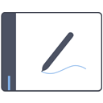

# Projects

This article lists the various projects, tools, and/or services made for osu! by the [developers](/wiki/People/Developers) and the community.

While official projects are for the most part run by the [osu! team](/wiki/People/osu!_team), community projects are managed by members of the community. As such, they are not endorsed by osu!, nor do they have any official support. For news and discussions on all the current and upcoming projects, please visit the [Development forum](http://osu.ppy.sh/community/forums/2).

## Official

### Active

| Logo | Name | Project lead | Description |
| :-: | :-- | :-- | :-- |
|  | [osu!(lazer)](https://github.com/ppy/osu/) | ::{ flag=AU }:: [peppy](https://osu.ppy.sh/users/2) | The future (and final) iteration of the osu! game client |
|  | [osu!framework](https://github.com/ppy/osu-framework/) | ::{ flag=AU }:: [peppy](https://osu.ppy.sh/users/2) | Custom game framework written with osu! in mind |
|  | [osu!web](https://github.com/ppy/osu-web/) | ::{ flag=AU }:: [peppy](https://osu.ppy.sh/users/2) | The browser-facing portion of osu! |
|  | [osu-api](https://github.com/ppy/osu-api/) | ::{ flag=AU }:: [peppy](https://osu.ppy.sh/users/2) | Public API for accessing osu!-related data |
|  | [osu! wiki](https://github.com/ppy/osu-wiki/) | ::{ flag=AU }:: [peppy](https://osu.ppy.sh/users/2) | Open-source knowledge base for all things osu! |
|  | [puush](/wiki/Community/Projects/puush) | ::{ flag=AU }:: [peppy](https://osu.ppy.sh/users/2) and ::{ flag=AU }:: [nekodex](https://osu.ppy.sh/users/102) | Ad-free file sharing service with a focus on screenshot sharing and user data management |

### Inactive or defunct

| Logo | Name | Project lead | Description |
| :-: | :-- | :-- | :-- |
|  | [osu!performance](https://github.com/ppy/osu-performance/) | ::{ flag=AU }:: [peppy](https://osu.ppy.sh/users/2) | Part of the game handling the calculations of [performance points](/wiki/Performance_points) (pp) |
|  | [osu!stream](/wiki/osu!stream) | ::{ flag=AU }:: [peppy](https://osu.ppy.sh/users/2) | Special version of osu! for handheld iOS and Android devices |
|  | [osu! iPhone](https://osu.ppy.sh/community/forums/topics/9193) | ::{ flag=US }:: [nuudles](https://osu.ppy.sh/users/21312) | Official iPhone port of osu! |
|  | [osu! on OS X](https://osuosx.tumblr.com/) | ::{ flag=AU }:: [peppy](https://osu.ppy.sh/users/2) | Experimental build of osu! that runs natively on macOS |
|  | [pTransl](/wiki/Community/Projects/pTransl) | ::{ flag=AU }:: [peppy](https://osu.ppy.sh/users/2) | Community-based localisation platform for osu! |
|  | [rajio](/wiki/Community/Projects/rajio) | ::{ flag=AU }:: [peppy](https://osu.ppy.sh/users/2) | On-demand online radio service |
|  | [upppy](/wiki/Community/Projects/upppy) | ::{ flag=AU }:: [peppy](https://osu.ppy.sh/users/2) | Browser-based lightweight file sharing service |

## Community

### Game clients

| Logo | Name | Project lead | Description |
| :-: | :-- | :-- | :-- |
|  | [McOsu](https://store.steampowered.com/app/607260/McOsu/) | ::{ flag=AT }:: [McKay](https://osu.ppy.sh/users/3321909) | Practice client for osu! beatmaps with VR support |
|  | [osu! python edition](https://osu.ppy.sh/community/forums/topics/688175) | ::{ flag=US }:: [superloach](https://osu.ppy.sh/users/11213125) | Open-source osu! client written in [Python 3](https://www.python.org/about/) |
|  | [osu!droid](https://github.com/osudroid/osu-droid) | ::{ flag=DE }:: [neico](https://osu.ppy.sh/users/119665) and ::{ flag=RU }:: [Pesets](https://osu.ppy.sh/users/780451) | Unofficial osu! client for Android |
|  | [osu!taiko made with Scratch](https://turbowarp.org/1067424534?fps=240&offscreen) | ::{ flag=US }:: [MrrJinxx](https://osu.ppy.sh/users/32908054) | osu!taiko clone written in [Scratch](https://scratch.mit.edu/about) |
|  | [opsu!](https://osu.ppy.sh/community/forums/topics/221726) | ::{ flag=US }:: [euphyy](https://osu.ppy.sh/users/2936932) | Open-source osu! client written in [Java](https://www.java.com/) |
|  | [otu!](https://gdladder.com/level/111345732) | ::{ flag=US }:: [CreatorCreepy](https://osu.ppy.sh/users/10436454) | Recreation of osu! in [Geometry Dash](https://en.wikipedia.org/wiki/Geometry_Dash) |
|  | [T-Aiko!](https://osu.ppy.sh/community/forums/topics/58640/) | ::{ flag=GB }:: [Guy-kun](https://osu.ppy.sh/users/217431) | Free [Taiko no Tatsujin](https://en.wikipedia.org/wiki/Taiko_no_Tatsujin) clone that plays osu!taiko beatmaps on mobile devices |

### Gameplay

#### General

| Logo | Name | Project lead | Description |
| :-: | :-- | :-- | :-- |
|  | [Circleguard](https://github.com/circleguard/circleguard) | ::{ flag=US }:: [tybug](https://osu.ppy.sh/users/12092800) | Replay analysis suite for checking potential foul play |
|  | [Desktop Composition Disabler](https://osu.ppy.sh/community/forums/topics/177218) | ::{ flag=LT }:: [kleps](https://osu.ppy.sh/users/2902534) | Tool for disabling the Desktop Composition feature in Windows to reduce input latency |
|  | [KeysPerSecond](https://osu.ppy.sh/community/forums/topics/552405) | ::{ flag=NL }:: [Roan](https://osu.ppy.sh/users/8214639) | Benchmark tool for analysing general key input speed |
|  | [OpenTabletDriver](https://opentabletdriver.net/) | ::{ flag=DK }:: [gonX](https://github.com/gonX) | Low-latency graphics tablet driver for osu! |
|  | [osr2mp4](https://osu.ppy.sh/community/forums/topics/1104243) | ::{ flag=JP }:: [yuitora](https://osu.ppy.sh/users/11401118) | Automatic `.osr` to `.mp4` conversion tool |
|  | [osu! Miss Analyzer](https://osu.ppy.sh/community/forums/topics/613143) | ::{ flag=US }:: [ThereGoesMySanity](https://osu.ppy.sh/users/4613296) | Replay analysis suite for determining the cause of a miss |
|  | [osu! Replayer](https://osu.ppy.sh/community/forums/topics/563282) | ::{ flag=NL }:: [joeykapi](https://osu.ppy.sh/users/8779015) | Program that allows users to view replays that are not saved locally |
|  | [TabletDriver](https://github.com/hawku/TabletDriver) | ::{ flag=FI }:: [HWK](https://osu.ppy.sh/users/1919864) | Low-latency graphics tablet driver for osu! |

#### osu!

| Logo | Name | Project lead | Description |
| :-: | :-- | :-- | :-- |
|  | [danser-go](https://github.com/Wieku/danser-go) | ::{ flag=PL }:: [Wiek](https://osu.ppy.sh/users/2584698) | Visualisation tool for osu! beatmaps |
|  | [my hand, IT BURNS!!](https://keyaa.github.io/osu-stream-practice/) | ::{ flag=PH }:: [keyaa](https://osu.ppy.sh/users/30720651) | Benchmark tool for determining tapping speed |
|  | [osu!Tapspeed-Meter](https://osu.ppy.sh/community/forums/topics/247716) | ::{ flag=AT }:: [DaRealSlimOni](https://osu.ppy.sh/users/2925249) | Benchmark tool for determining tapping speed |
|  | [osu!trainer](https://github.com/FunOrange/osu-trainer) | ::{ flag=CA }:: [FunOrange](https://osu.ppy.sh/users/2051389) | Program for modifying a beatmap's speed rate and difficulty settings quickly |
|  | [SpinnyProgram](https://osu.ppy.sh/community/forums/topics/140878) | ::{ flag=GB }:: [jimj316](https://osu.ppy.sh/users/1863872) | Benchmark tool for determining spinning speed |

#### osu!taiko

| Logo | Name | Project lead | Description |
| :-: | :-- | :-- | :-- |
|  | [Wii TaTaCon to USB Converter](https://osu.ppy.sh/community/forums/topics/258400) | ::{ flag=AU }:: [montymintypie](https://osu.ppy.sh/users/2007075) | Low-cost Wii TaTaCon to USB converter |

### Livestreaming

| Logo | Name | Project lead | Description |
| :-: | :-- | :-- | :-- |
|  | [gosumemory](https://github.com/l3lackShark/gosumemory) | ::{ flag=RU }:: [BlackShark](https://osu.ppy.sh/users/9173653) | Cross-platform memory reader for osu! |
|  | [JKPS](https://osu.ppy.sh/community/forums/topics/1356687) | ::{ flag=IT }:: [Down16IQ](https://osu.ppy.sh/users/10371089) | Screen overlay showing key states, keys per second, total keys, and beats per minute |
|  | [osu!StreamCompanion](https://osu.ppy.sh/community/forums/topics/209616) | ::{ flag=PL }:: [Piotrekol](https://osu.ppy.sh/users/304520) | Beatmap information extractor for livestreamers |
|  | [osu!RequestBot](https://osu.ppy.sh/community/forums/topics/175723) | ::{ flag=HK }:: [Redback](https://osu.ppy.sh/users/2071169) | Twitch bot that tracks song requests and player data |
|  | [Ronnia](https://ronnia.me/) | ::{ flag=NL }:: [heyronii](https://osu.ppy.sh/users/5642779) | Twitch bot that tracks song requests and player data |

### Beatmapping

#### General

| Logo | Name | Project lead | Description |
| :-: | :-- | :-- | :-- |
|  | [AxerBot](https://github.com/Hiviexd/AxerBot) | ::{ flag=TN }:: [Hivie](https://osu.ppy.sh/users/14102976) | All-purpose Discord bot with features catered to mapping and modding |
|  | [Hitsounds copier 2.1.1](https://osu.ppy.sh/community/forums/topics/131540) | ::{ flag=UA }:: [grumd](https://osu.ppy.sh/users/530913) | Tool for copying hitsounds from one difficulty to another |
|  | [Local osu! NPS-Calculator](https://osu.ppy.sh/community/forums/topics/459779) | ::{ flag=DE }:: [Marilyth](https://osu.ppy.sh/users/1161671) | Tool for calculating and visualising beatmap density over time |
|  | [Mapping Tools](https://osu.ppy.sh/community/forums/topics/940368) | ::{ flag=NL }:: [OliBomby](https://osu.ppy.sh/users/6573093) | Core program for all things mapping |
|  | [New Hitsound Copier](https://osu.ppy.sh/community/forums/topics/353638) | ::{ flag=CN }:: [wcx19911123](https://osu.ppy.sh/users/376831) | Tool for copying hitsounds from one difficulty to another |
|  | [osu! Storyboarder Banquet](https://osb.moe) | ::{ flag=CN }:: [Sidetail](https://osu.ppy.sh/users/2036217) | Compendium of tips, tricks, and other storyboarding essentials |
|  | [osu!tp's difficulty calculator](https://osu.ppy.sh/community/forums/topics/164057) | ::{ flag=DE }:: [Tom94](https://osu.ppy.sh/users/1857058) | Calculator for determining a beatmap's difficulty according to the [legacy tp system](https://osu.ppy.sh/home/news/2014-01-26-new-performance-ranking) |
|  | [Variable BPM Slider Velocity Stabilizer](https://osu.ppy.sh/community/forums/topics/567059) | ::{ flag=US }:: [Alchyr](https://osu.ppy.sh/users/4993032) | Tool for stabilising slider velocity after applying BPM changes |

#### osu!

| Logo | Name | Project lead | Description |
| :-: | :-- | :-- | :-- |
|  | [A little approach rate calculator for your maps](https://osu.ppy.sh/community/forums/topics/578541) | ::{ flag=FR }:: [Grosinge](https://osu.ppy.sh/users/7505438) | Website that suggests an optimal [Approach Rate](/wiki/Beatmap/Approach_rate) based on the song's BPM |
|  | [osu! Slider Creator Tool](https://osu.ppy.sh/community/forums/topics/536978) | ::{ flag=US }:: [stUwUpid](https://osu.ppy.sh/users/5797359) | Tool that translates hand-drawn shapes into sliders |
|  | [osu! Slider End Silencer](https://osu.ppy.sh/community/forums/topics/634268) | ::{ flag=US }:: [stUwUpid](https://osu.ppy.sh/users/5797359) | Tool for silencing slider ends automatically |
|  | [osu! Stacking Tool](https://osu.ppy.sh/community/forums/topics/561477) | ::{ flag=NO }:: [Enitoni](https://osu.ppy.sh/users/9118958) | Tool for ensuring [perfect stacks](/wiki/Beatmapping/Mapping_techniques/Stack) between objects |
|  | [osu!cad](https://osucad.com) | ::{ flag=AT }:: [Maarvin](https://osu.ppy.sh/users/6411631) | Browser-based collaborative beatmap editor |
|  | [osu!trace](https://osu.ppy.sh/community/forums/topics/303844) | ::{ flag=US }:: [HedonicKnight](https://osu.ppy.sh/users/4834671) | Cursor tracing program for analysing beatmap flow |

#### osu!taiko

| Logo | Name | Project lead | Description |
| :-: | :-- | :-- | :-- |
|  | [Manage Beatmap](https://github.com/frukoyurdakul/Manage_Beatmap) | ::{ flag=TR }:: [frukoyurdakul](https://osu.ppy.sh/users/7612550) | Tool for managing slider velocity changes in osu!taiko |
|  | [Taiko Editor](https://osu.ppy.sh/community/forums/topics/1373230) | ::{ flag=US }:: [Alchyr](https://osu.ppy.sh/users/4993032) | Standalone editor for osu!taiko beatmaps |

#### osu!mania

| Logo | Name | Project lead | Description |
| :-: | :-- | :-- | :-- |
|  | [Automap-chan](https://osu.ppy.sh/community/forums/topics/382896) | ::{ flag=CA }:: [Drum-Hitnormal](https://osu.ppy.sh/users/748722) | Tool for converting MIDI files into osu!mania beatmaps |
|  | [lua-mania](https://osu.ppy.sh/community/forums/topics/465914) | ::{ flag=RU }:: [semyon422](https://osu.ppy.sh/users/4695318) | Tool for converting osu!/osu!taiko/osu!catch beatmaps into osu!mania beatmaps |
|  | [Mania Hit Sounding Tools](https://osu.ppy.sh/community/forums/topics/488175) | ::{ flag=CA }:: [Drum-Hitnormal](https://osu.ppy.sh/users/748722) | Collection of tools for hitsounding osu!mania beatmaps |
|  | [O2jam to osu!mania converter](https://osu.ppy.sh/community/forums/topics/121149) | ::{ flag=NL }:: [Nyanderfull](https://osu.ppy.sh/users/1191983) | Tool for converting O2jam's `.ojn` charts into osu!mania beatmaps |
|  | [osu!HitsoundManager](https://osu.ppy.sh/community/forums/topics/385832) | ::{ flag=US }:: [FrenzyLi](https://osu.ppy.sh/users/6256685) | Tool for copying per-lane hitsounds from one osu!mania difficulty to another |
|  | [OMISM](https://osu.ppy.sh/community/forums/topics/664319) | ::{ flag=US }:: [BilliumMoto](https://osu.ppy.sh/users/3862471) | Tool for osu!mania beatmaps into Stepmania charts that doubles as beatmap keysound copier |
|  | [omtrc - osu!mania timerate changer](https://osu.ppy.sh/community/forums/topics/618646) | ::{ flag=RU }:: [semyon422](https://osu.ppy.sh/users/4695318) | Rate changer for osu!mania beatmaps |

### Storyboarding

| Logo | Name | Project lead | Description |
| :-: | :-- | :-- | :-- |
|  | [osu! Storyboard Script Editor](https://osu.ppy.sh/community/forums/topics/45597) | ::{ flag=DE }:: [MoonShade](https://osu.ppy.sh/users/273649) | Specialised text editor for storyboarding |
|  | [SGL Tool](https://osu.ppy.sh/community/forums/topics/45597) | ::{ flag=DE }:: [MoonShade](https://osu.ppy.sh/users/273649) | Programming interface for generating storyboard codes |
|  | [Taiko Mod Generator](https://osu.ppy.sh/community/forums/topics/605656) | ::{ flag=FR }:: [Yuzeyun](https://osu.ppy.sh/users/481582) | Storyboarding tool for creating osu!taiko gameplay gimmicks |
|  | [Storybrew](https://github.com/Damnae/storybrew) | ::{ flag=FR }:: [Damnae](https://osu.ppy.sh/users/989377) | Easy-to-use storyboard editor |

### Modding

#### General

| Logo | Name | Project lead | Description |
| :-: | :-- | :-- | :-- |
|  | [AIBat](https://osu.ppy.sh/community/forums/topics/55305) | ::{ flag=US }:: [akrolsmir](https://osu.ppy.sh/users/576800) | Tool for checking a beatmap's [ranking criteria](/wiki/Ranking_criteria) compliance |
|  | [osumod](https://osumod.com/) | ::{ flag=US }:: [Cychloryn](https://osu.ppy.sh/users/6921736) | Hub for setting personal [modding queues](/wiki/Community/Forum/Modding_Queues) |
|  | [Mapset Verifier](https://osu.ppy.sh/community/forums/topics/943895) | ::{ flag=SE }:: [Naxess](https://osu.ppy.sh/users/8129817) | Tool for checking a beatmap's [ranking criteria](/wiki/Ranking_criteria) compliance |
|  | [Mod Helper](https://osu.ppy.sh/community/forums/topics/527602) | ::{ flag=CN }:: [yf\_bmp](https://osu.ppy.sh/users/1243669) | [BBCode](/wiki/BBCode) writing assistant for mapping/modding environment |

#### osu!taiko

| Logo | Name | Project lead | Description |
| :-: | :-- | :-- | :-- |
|  | [MVTaikoChecks](https://github.com/Hiviexd/MVTaikoChecks) | ::{ flag=TN }:: [Hivie](https://osu.ppy.sh/users/14102976) | Mapset Verifier plugin for checking osu!taiko beatmaps |

#### osu!catch

| Logo | Name | Project lead | Description |
| :-: | :-- | :-- | :-- |
|  | [MapsetCheckCatch](https://github.com/Darius-Wattimena/MapsetChecksCatch) | ::{ flag=NL }:: [Greaper](https://osu.ppy.sh/users/2369776) | Mapset Verifier plugin for checking osu!catch beatmaps |

#### osu!mania

| Logo | Name | Project lead | Description |
| :-: | :-- | :-- | :-- |
|  | [ManiaCheck](https://github.com/MChecaH/ManiaCheck) | ::{ flag=ES }:: [RandomeLoL](https://osu.ppy.sh/users/7080063) | Mapset Verifier plugin for checking osu!mania beatmaps |

### Skinning

| Logo | Name | Project lead | Description |
| :-: | :-- | :-- | :-- |
|  | [Fringe Remover](https://osu.ppy.sh/community/forums/topics/1244643) | ::{ flag=NL }:: [Roan](https://osu.ppy.sh/users/8214639) | Tool for removing fringes from skin elements |
|  | [Image Scaler](https://osu.ppy.sh/community/forums/topics/762684) | ::{ flag=NL }:: [Roan](https://osu.ppy.sh/users/8214639) | Tool for downscaling HD skin elements to SD |
|  | [Mania Column Centering](https://osu.ppy.sh/community/forums/topics/581972) | ::{ flag=NL }:: [Roan](https://osu.ppy.sh/users/8214639) | Calculator for determining optimal `ColumnStart` value |
|  | [osu! Skin Manager](https://osu.ppy.sh/community/forums/topics/231747) | ::{ flag=AT }:: [BlackTasty](https://osu.ppy.sh/users/3685723) | Tool for mixing and matching existing skin elements |
|  | [osu! skin mixer](https://github.com/rednir/OsuSkinMixer) | ::{ flag=GB }:: [rednir](https://osu.ppy.sh/users/17204559) | Tool for mixing and matching existing skin elements |
|  | [Skin Checker](https://osu.ppy.sh/community/forums/topics/617168) | ::{ flag=NL }:: [Roan](https://osu.ppy.sh/users/8214639) | Tool for checking missing skin elements |

### Beatmap management

| Logo | Name | Project lead | Description |
| :-: | :-- | :-- | :-- |
|  | [Batch script to delete map](https://osu.ppy.sh/community/forums/topics/682907) | ::{ flag=MX }:: [Greydus](https://osu.ppy.sh/users/6522973) | `.bat` script for deleting beatmaps in bulk |
|  | [Beatmap Version Checker](https://osu.ppy.sh/community/forums/topics/636199) | ::{ flag=NL }:: [Roan](https://osu.ppy.sh/users/8214639) | Tool for scanning and updating out-of-date beatmaps |
|  | [Collections Manager](https://osu.ppy.sh/community/forums/topics/131103) | ::{ flag=PL }:: [Piotrekol](https://osu.ppy.sh/users/304520) | Tool for creating, editing, and exporting collections |
|  | [osu! Beatmap Downloader](https://osu.ppy.sh/community/forums/topics/134646) | ::{ flag=HK }:: [AiriLing](https://osu.ppy.sh/users/2536943) | Tool for downloading beatmaps in bulk from beatmap mirrors |
|  | [osu!grab](https://osu.ppy.sh/community/forums/topics/259116) | ::{ flag=ID }:: [Faishal Akbar](https://osu.ppy.sh/users/2061007) | Various enhancements for beatmap downloading |
|  | [osu!cleaner](https://github.com/InvisibleSymbol/osu-cleaner) | ::{ flag=AT }:: [InvisibleSymbol](https://osu.ppy.sh/users/13506780) | Tool for sorting and deleting beatmaps based on certain filters |
|  | [osu!ocm Collection Manager](https://osu.ppy.sh/community/forums/topics/554209) | ::{ flag=DE }:: [Yulivee](https://osu.ppy.sh/users/341447) | Tool for downloading beatmaps from exported collections |
|  | [osu!Sync](https://osu.ppy.sh/community/forums/topics/270446) | ::{ flag=DE }:: [naseweis520](https://osu.ppy.sh/users/4729376) | Tool for creating, editing, and exporting collections |
|  | [osu!vd](https://osu.ppy.sh/community/forums/topics/210509) | ::{ flag=US }:: [OMQ12](https://osu.ppy.sh/users/3160531) | `.bat` script for deleting beatmap videos in bulk |

### Beatmap mirrors

| Logo | Name | Project lead | Description |
| :-: | :-- | :-- | :-- |
|  | [Beatconnect](https://beatconnect.io) | ::{ flag=FR }:: [KatsuuKumi](https://www.twitch.tv/katsuukumi) | Mirror site for downloading beatmaps |
|  | [Mino](https://catboy.best) | ::{ flag=DE }:: [Nanoo](https://osu.ppy.sh/users/9527931) | Mirror site for downloading beatmaps |
|  | [Sayobot](https://osu.sayobot.cn) | ::{ flag=CN }:: [SoulDee](https://github.com/SoulDee) | Mirror site for downloading beatmaps primarily serving Chinese-speaking users |
|  | [Yet another beatmap mirror](https://osu.ppy.sh/community/forums/topics/137156) | ::{ flag=LT }:: [Hexide](https://osu.ppy.sh/users/1353867) | Mirror site for downloading beatmaps |

### Website

| Logo | Name | Project lead | Description |
| :-: | :-- | :-- | :-- |
|  | [ezpp!](https://osu.ppy.sh/community/forums/topics/466740) | ::{ flag=FI }:: [oam](https://osu.ppy.sh/users/3844204) | Browser extension for calculating pp |
|  | [osu! news scheduler](https://osunews.untone.uk) | ::{ flag=GB }:: [Tanza3D](https://osu.ppy.sh/users/10379965) | Schedule calendar for the [osu! news feed](https://osu.ppy.sh/home/news) |
|  | [osu! preview](https://osu.ppy.sh/community/forums/topics/2062759) | ::{ flag=IT }:: [TechnoZamb](https://osu.ppy.sh/users/12958169) | Browser extension for showing beatmap previews |
|  | [osu!next Signature Generator](https://osu.ppy.sh/community/forums/topics/372346) | ::{ flag=GB }:: [Lemmmy](https://osu.ppy.sh/users/4656511) | Forum signature generator in the style of [osu!next](https://osunext.tumblr.com) |
|  | [osu!Post - Live osu! Status](https://osu.ppy.sh/community/forums/topics/164486) | ::{ flag=DE }:: [givenameplz](https://osu.ppy.sh/users/947499) | Forum signature generator with [MSN Live](https://en.wikipedia.org/wiki/MSN_Messenger) status integration |
|  | [osuplus](https://osu.ppy.sh/community/forums/topics/408541) | ::{ flag=SG }:: [oneplusone](https://osu.ppy.sh/users/1843447) | Browser script that adds additional features to the website |

### IRC

*See also: [Internet Relay Chat](/wiki/Community/Internet_Relay_Chat)*

| Logo | Name | Project lead | Description |
| :-: | :-- | :-- | :-- |
|  | [chat4osu!](https://osu.ppy.sh/community/forums/topics/879262) | ::{ flag=DE }:: [hallowatcher](https://osu.ppy.sh/users/1874761) | Chat client for tournament referees and casual chatters |
|  | [irc4osu!](https://osu.ppy.sh/community/forums/topics/430741) | ::{ flag=SK }:: [Claire Farron](https://osu.ppy.sh/users/4167678) | Cross-platform IRC client for osu! |
|  | [Script chan](https://osu.ppy.sh/community/forums/topics/730734) | ::{ flag=FR }:: [shARPII](https://osu.ppy.sh/users/776257) | Tool for tournament referees to create and manage multiplayer rooms |

### Performance

| Logo | Name | Project lead | Description |
| :-: | :-- | :-- | :-- |
|  | [Bonus PP calculator](https://osu.ppy.sh/community/forums/topics/538470) | ::{ flag=NL }:: [Roan](https://osu.ppy.sh/users/8214639) | Calculator for determining how much [bonus pp](/wiki/Performance_points#how-much-bonus-pp-is-awarded-for-having-scores-on-ranked-maps?) a user has |
|  | [osu! level calculator](https://osu.ppy.sh/community/forums/topics/199230) | ::{ flag=IT }:: [Howl](https://osu.ppy.sh/users/2751672) | Calculator for determining the required score value to achieve a certain level |
|  | [osu! Stats Watcher](https://osu.ppy.sh/community/forums/topics/269483) | ::{ flag=US }:: [Albi-chan](https://osu.ppy.sh/users/2770894) | Tool for exporting player stats into a text file, which can later be displayed using [Open Broadcaster Software](https://obsproject.com/) |
|  | [osu!chan](https://osuchan.syrin.me) | ::{ flag=AU }:: [Syrin](https://osu.ppy.sh/users/5701575) | Website that hosts a multitude of alternative ranking leaderboards |
|  | [osu!Skills](https://osu.ppy.sh/community/forums/topics/367283) | ::{ flag=RU }:: [Kert](https://osu.ppy.sh/users/119933) | Website that breaks down pp into other metrics such as stamina, reaction, and memory |
|  | [osu!Stats](https://osustats.ppy.sh) | ::{ flag=PL }:: [Piotrekol](https://osu.ppy.sh/users/304520) | Website for searching specific scores and player statistics |
|  | [osu!track](https://osu.ppy.sh/community/forums/topics/212151) | ::{ flag=US }:: [Ameo](https://osu.ppy.sh/users/4093752) | Website that allows players to track their progress and see their improvements over time |
|  | [osu!track (IRC)](https://osu.ppy.sh/community/forums/topics/233167) | ::{ flag=US }:: [Ameo](https://osu.ppy.sh/users/4093752) | In-game IRC bot of osu!track |
|  | [osu-pps](https://osu-pps.com) | ::{ flag=UA }:: [grumd](https://osu.ppy.sh/users/530913) | Website that calculates how "overweighted" a beatmap's pp output is |
|  | [RTPP Displayer](https://osu.ppy.sh/community/forums/topics/685031) | ::{ flag=CN }:: [DarkProjector](https://osu.ppy.sh/users/1344395) | Tool for calculating and displaying earned pp on-the-fly |

### Miscellaneous

| Logo | Name | Project lead | Description |
| :-: | :-- | :-- | :-- |
|  | [Aiess](https://github.com/Naxesss/Aiess) | ::{ flag=SE }:: [Naxess](https://osu.ppy.sh/users/8129817) | Service that provides subscriptions for various web events such as ranks, qualifications, nominations, suggestions, news posts, and user group changes |
|  | [AR/OD calculator \[Android\]](https://osu.ppy.sh/community/forums/topics/227510) | ::{ flag=DE }:: [Deimos](https://osu.ppy.sh/users/1515403) | Android app for determining [Approach Rate](/wiki/Beatmap/Approach_rate) speed and [Overall Difficulty](/wiki/Beatmap/Overall_difficulty) hit window accuracy |
|  | [BathBot](https://github.com/MaxOhn/Bathbot) | ::{ flag=BE }:: [Badewanne3](https://osu.ppy.sh/users/2211396) | Feature-rich Discord bot with versatile osu! functionalities |
|  | [Detect the osu! folder easily](https://osu.ppy.sh/community/forums/topics/381311) | ::{ flag=BG }:: [Flanster](https://osu.ppy.sh/users/447818) | Tool for [I/O developers](https://en.wikipedia.org/wiki/Input/output) to locate user's osu! installation folder |
|  | [hwchr's pick'em](https://pickem.hwc.hr/tournaments) | ::{ flag=DE }:: [hallowatcher](https://osu.ppy.sh/users/1874761) | Website that hosts [pick'ems](https://egamersworld.com/blog/egamersworld-pickem-vjofPo3GE7) for osu! tournaments |
|  | [Osekai](https://osu.ppy.sh/community/forums/topics/1427698) | ::{ flag=DE }:: [mulraf](https://osu.ppy.sh/users/1309242) | Website hosting [medal unlock requirements](/wiki/Medals/Unlock_requirements), alternative ranking leaderboards, and more |
|  | [OSUWME](https://osu.ppy.sh/community/forums/topics/2029947) | ::{ flag=ID }:: [rezzvy](https://osu.ppy.sh/users/8804560) | [BBCode](/wiki/BBCode) editor with real-time preview for osu! userpages |
|  | [Osu Music Library](https://osu.ppy.sh/community/forums/topics/267236) | ::{ flag=SE }:: [Dayanto](https://osu.ppy.sh/users/4907353) | Tool for organising, listening, and searching up beatmap songs outside of the osu! client |
|  | [osu! BBCode Editor](https://github.com/NoelleTGS/osu-bbcode-editor) | ::{ flag=CA }:: [HonokaKousakaTV](https://osu.ppy.sh/users/18595366) | [BBCode](/wiki/BBCode) editor with real-time preview for osu! userpages |
|  | [osu! mouse simulator for Leap](https://osu.ppy.sh/community/forums/topics/139360) | ::{ flag=CZ }:: [Brejlounek](https://osu.ppy.sh/users/931841) | Mouse pointer movement wrapper for [Leap Motion](https://en.wikipedia.org/wiki/Leap_Motion) sensors |
|  | [osu! Music Player](https://osu.ppy.sh/community/forums/topics/257881) | ::{ flag=CA }:: [Naviaux](https://osu.ppy.sh/users/2240370) | osu!-themed music player |
|  | [osu! Windows 60 fps animated cursors](https://osu.ppy.sh/community/forums/topics/86671) | ::{ flag=GB }:: [Darkimmortal](https://osu.ppy.sh/users/10886) | osu!-styled cursors for Windows |
|  | [o!subscribe](https://osu.ppy.sh/community/forums/topics/587110) | ::{ flag=CA }:: [Slow Twitch](https://osu.ppy.sh/users/3172543) | Service that allows users to subscribe to their favorite mappers |
|  | [osu!APIlib](https://osu.ppy.sh/community/forums/topics/141331) | ::{ flag=MX }:: [Repflez](https://osu.ppy.sh/users/201392) | Simple library to interface with the osu! API |
|  | [osu!Elements](https://osu.ppy.sh/community/forums/topics/430701) | ::{ flag=BE }:: [ExCellRaD](https://osu.ppy.sh/users/2189591) | Open source .NET framework for osu! application developers |
|  | [osu!matchmaking](https://discord.com/invite/CehChep) | ::{ flag=RU }:: [Anemic Witch](https://osu.ppy.sh/users/7258536) | Quick and automated multiplayer matches |
|  | [osu!player](https://osu.ppy.sh/community/forums/topics/660418) | ::{ flag=DE }:: [Founntain](https://osu.ppy.sh/users/5105217) | Media player for osu! beatmaps |
|  | [osu!search](https://osu.ppy.sh/community/forums/topics/380485) | ::{ flag=FI }:: [Rivenation](https://osu.ppy.sh/users/2063554) | Website for advanced beatmap searching |
|  | [osu!station](https://osu.ppy.sh/community/forums/topics/236417) | ::{ flag=DE }:: [nanashiRei](https://osu.ppy.sh/users/807630) | On-demand online radio service powered by songs from beatmaps |
|  | [osu!Stuff Play](https://play.osustuff.org) | ::{ flag=GB }:: [ifailedatlife](https://osu.ppy.sh/users/6331918) | Website that matches players into automated osu! Battle Royale tournaments |
|  | [Mutualify](https://mutualify.stanr.info) | ::{ flag=RU }:: [StanR](https://osu.ppy.sh/users/7217455) | Friend list database for osu! |
|  | [stats.circleclickers](https://stats.circleclickers.com) | ::{ flag=AT }:: [InvisibleSymbol](https://osu.ppy.sh/users/13506780) | Real-time osu! user count tracker |
