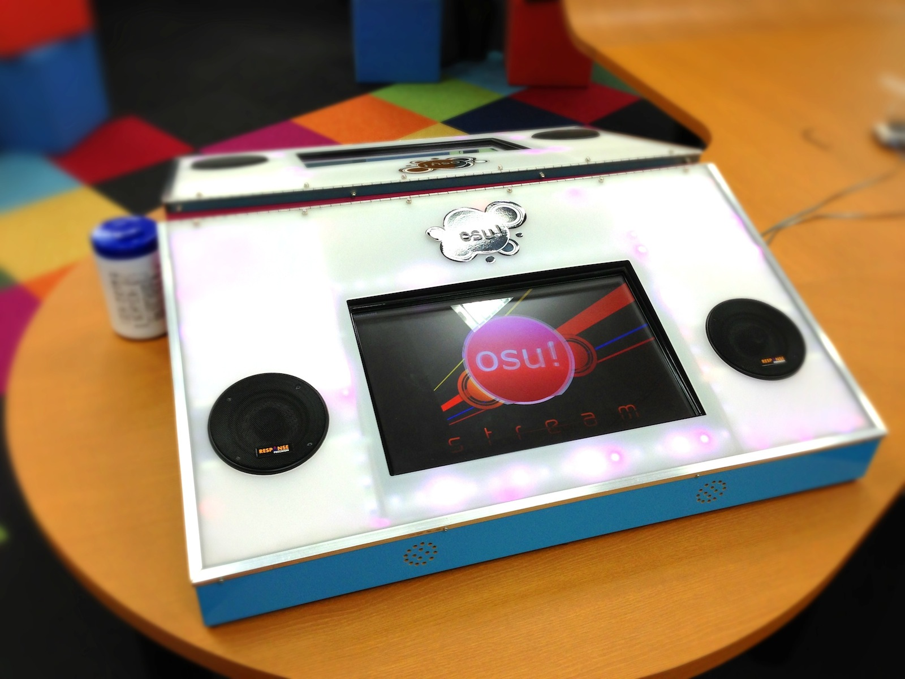

# osu!arcade

The **osu!arcade** was a prototype arcade machine created by ::{ flag=AU }:: [peppy](https://osu.ppy.sh/users/2). It consisted of a custom-made enclosure and a built-in touchscreen running a touch-based version of osu!.

Although it has *arcade* in its name, features typical for arcade machines like coin slots had been considered but were never added when working on the prototype.[^rfid]

## First prototype

::: Infobox

:::

For the [Wai-con](https://en.wikipedia.org/wiki/Wai-Con) anime convention in Perth in January 2010, peppy wanted to create a showcase for osu! with the goal to make osu! more known in the local community.[^wai-con] Despite the idea being relatively spontaneous, peppy successfully set up the first prototype for an arcade machine. It was a slanted box with external speakers at the side, running a modified version of osu!(stable).[^wai-con-video][^kingking9-profile]

Throughout the 2-day convention, peppy tried to get feedback by watching both beginners as well as veterans of [Ouendan](https://en.wikipedia.org/wiki/Osu!_Tatakae!_Ouendan) and [Elite Beat Agents](/wiki/iNiS_games#elite-beat-agents) play the game.

Many convention visitors wanted to try out the arcade machine, so much so that at most times it was hard to see the screen due to the constant stream of people gathered around the cabinet. Overall, the community acclaimed the arcade machine, although some people pointed out that playing too much could lead to sore fingers.[^sore-fingers]

## Second prototype

::: Infobox

:::

Around early to mid 2012, a second prototype was developed.[^tweet-1][^tweet-2] It featured two speakers which were integrated into the cabinet. The touchscreen used a precise optical-based system.[^optical] Furthermore, an [Arduino](https://en.wikipedia.org/wiki/Arduino) [microcontroller](https://en.wikipedia.org/wiki/Microcontroller) controlled LED lights that would flash according to the music.[^music-light][^design-documents]

The prototype was showcased to the public running [osu!stream](/wiki/osu!stream), an osu! variant designed for touch devices, at multiple events such as the "Red Flag LAN Fest" in Perth.[^rflan][^oneup]

In August 2012, support for local multiplayer was added to osu!stream specifically for the arcade.[^local-multi] Included with the multiplayer was a custom server and real-time synced cursors, an exclusive feature not present in any other osu! variant.[^multi-arcade]

Later that same year, peppy experimented with support for converting [osu!](/wiki/Game_mode/osu!) [beatmaps](/wiki/Beatmap) to osu!stream, so a more diverse collection of maps could be played on the arcade cabinet.[^conversion]

## Discontinuation

In the following years, the osu!arcade project was discontinued due to a shift in focus on the development of osu!(stable) and later osu!(lazer). Additionally, the prototype was never mass-produced as the costs for creating a new cabinet were too high.[^mass-production]

## References

[^rfid]: [GitHub comment by peppy (2026-05-07)](https://github.com/ppy/osu-wiki/pull/14697/changes#r3201675470)
[^wai-con]: [Forum thread by peppy (2010-01-27) "osu!arcade at Wai-con 2010"](https://osu.ppy.sh/community/forums/topics/23392?n=1)
[^wai-con-video]: [YouTube video by shigeru miyamoto (2010-01-23) "osu! at Waicon 2010"](https://www.youtube.com/watch?v=WKvm975bmj0)
[^kingking9-profile]: [kingking9's osu! profile featuring a lot of pictures of the prototype](https://osu.ppy.sh/users/1277097)
[^sore-fingers]: [Tweet by @ppy (2010-07-04)](https://twitter.com/ppy/status/17689427400)

[^tweet-1]: [Tweet by @ppy (2012-05-15)](https://twitter.com/ppy/status/202271556498505729)
[^tweet-2]: [Tweet by @ppy (2012-06-13)](https://twitter.com/ppy/status/212795116774109184)
[^optical]: [YouTube comment by Dean Herbert (2013) in "[osu!stream/osu!arcade] OK Go - This Too Shall Pass"](https://www.youtube.com/watch?v=LQjYwpDnBec&lc=Ugz7J0_hFd-DXQHN5Gl4AaABAg)
[^design-documents]: [Forum thread by peppy (2013-11-01) "osu!arcade design documents"](https://osu.ppy.sh/community/forums/topics/163062?n=1)
[^music-light]: [YouTube video by Dean Herbert (2012-06-03) "osu!arcade lighting #2 (wip)"](https://www.youtube.com/watch?v=CjXqPZXbnHU)
[^local-multi]: [Tweet by @ppy (2012-08-24)](https://twitter.com/ppy/status/239027656476213249)
[^multi-arcade]: [GitHub comment by peppy (2026-05-07)](https://github.com/ppy/osu-wiki/pull/14697/changes#r3201696782)
[^rflan]: [YouTube video by Dean Herbert (2012-10-17) "osu!arcade @ RFLAN (highlights #1)"](https://www.youtube.com/watch?v=3RZ0e5QxUj8)
[^oneup]: [YouTube video by Dean Herbert (2012-09-19) "osu!arcade @ OneUp Microcinema"](https://www.youtube.com/watch?v=aIDqzD09Sus)
[^conversion]: [Blog post by peppy (2012-12-17) "This Week in osu!"](https://blog.ppy.sh/post/38114063519/this-week-in-osu-5)
[^mass-production]: [YouTube comment by Dean Herbert (2014) in "[osu!stream/osu!arcade] OK Go - This Too Shall Pass"](https://www.youtube.com/watch?v=LQjYwpDnBec&lc=UgyqSDvx465RZdZqSE14AaABAg)
