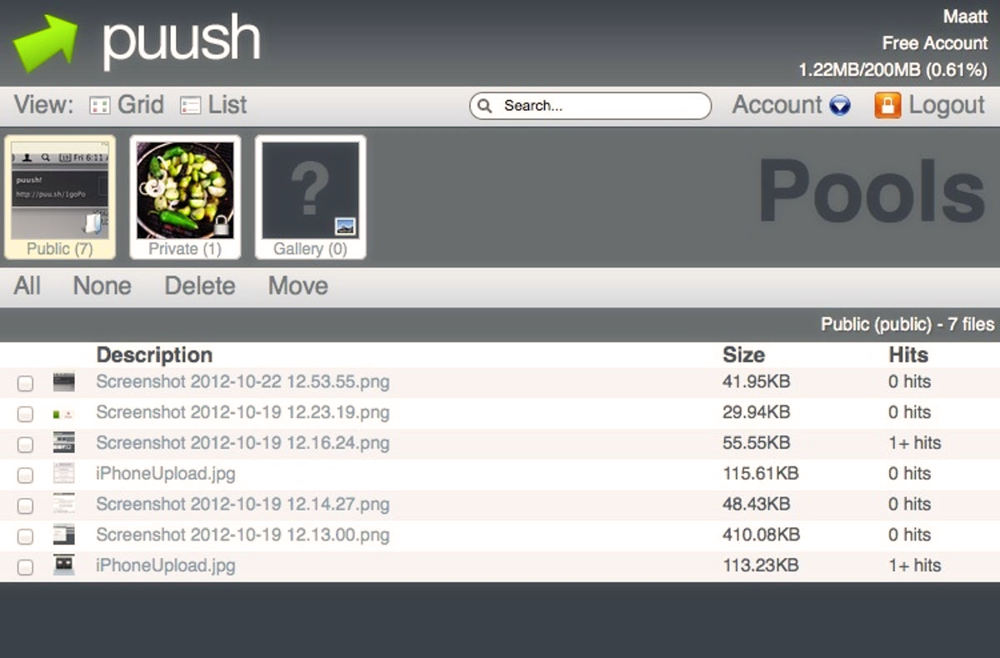

---
tags:
  - puu.sh
  - puush.me
  - puushme
---

# puush

::: Infobox

:::

**[puush.me](https://puush.me)** หรือที่มักเรียกกันสั้นๆ ว่า **puush** คือบริการแชร์ภาพหน้าจอที่ดูแลและโฮสต์โดย ::{ flag=AU }:: [peppy](https://osu.ppy.sh/users/2) และ ::{ flag=AU }:: [nekodex](https://osu.ppy.sh/users/102) เปิดตัวครั้งแรกในเดือนมิถุนายน 2010 โดยเป็นผู้สืบทอดของ [upppy](/wiki/upppy) ที่เน้นไปที่การแชร์ภาพหน้าจอและการจัดการข้อมูลผู้ใช้ที่ดียิ่งขึ้น บริการนี้ถูกสร้างขึ้นจากความจำเป็นเนื่องจากบริการเดิมที่ผู้ก่อตั้งทั้งสองใช้อยู่เริ่มมีโฆษณาจำนวนมากและยกเลิกการรองรับการเชื่อมโยงรูปภาพโดยตรง (Hotlinking)

## รูปแบบการบริการ

puush อนุญาตให้ผู้ใช้อัปโหลดภาพหน้าจอและไฟล์ไปยังบัญชีส่วนตัวผ่านโปรแกรมเฉพาะทางบน [Windows](https://puush.me/dl/puush-installer.exe), [Mac OS](https://puush.me/dl/puush.zip) หรือ [iOS](https://itunes.apple.com/au/app/puush/id386524126?mt=8) เมื่ออัปโหลดแล้ว ไฟล์เหล่านี้สามารถจัดการได้ผ่านเว็บไซต์ puush.me จัดเข้า "pools" (อัลบั้มรูป) หรือแชร์ไปยังที่ต่างๆ โดยใช้ลิงก์ `puu.sh` ที่จำง่าย

คุณสมบัติหลักของ puush คือความสามารถในการถ่ายภาพหน้าจอและแชร์ได้ทันที ซึ่งทำให้เป็นที่นิยมอย่างมากในหมู่ [Modder](/wiki/Modding) อย่างไรก็ตาม เนื่องจาก puush ถูกออกแบบมาเพื่อการแชร์ไฟล์ ไม่ใช่ที่เก็บไฟล์ถาวร ไฟล์ที่อัปโหลดจะถูกเก็บไว้ในช่วงเวลาจำกัดก่อนที่จะถูกลบออกไป

## การสมัครสมาชิก

เดิมที puush เปิดให้ทุกคนใช้งานฟรี แต่เพื่อให้บริการสามารถอยู่ได้ด้วยตัวเอง จึงมีการเสนอแผน "Pro" ในราคา 15 ดอลลาร์สหรัฐต่อปี[^puush-pro-plan-ref] ซึ่งมาพร้อมกับสิทธิประโยชน์เพิ่มเติมดังนี้:

- เพิ่มขนาดไฟล์สูงสุด (จาก 20 MB สำหรับผู้ใช้ฟรี เป็น 250 MB สำหรับผู้ใช้ Pro)
- เพิ่มระยะเวลาการเก็บไฟล์ (จาก 1 เดือนนับจากการเข้าถึงครั้งสุดท้าย เป็น 6 เดือนสำหรับผู้ใช้ Pro)

เช่นเดียวกับ osu! ผู้ใช้ puush ทุกคนจะไม่พบกับโฆษณาใดๆ ไม่ว่าจะสมัครสมาชิกหรือไม่ก็ตาม

## การลดขนาดการให้บริการ

ตั้งแต่เดือนมีนาคม 2014 puush ไม่เปิดรับสมัครสมาชิกแผน Pro รายใหม่ เนื่องจาก PayPal ได้ระงับบัญชีของ puush จากปัญหา "การละเมิดข้อกำหนดการให้บริการ" ที่ไม่คาดคิด[^puush-paypal-suspension-ref] ส่งผลให้ ::{ flag=AU }:: [peppy](https://osu.ppy.sh/users/2) ต้องควักเงินส่วนตัวประมาณ 400 ดอลลาร์สหรัฐต่อเดือนเพื่อคงการให้บริการไว้[^puush-finances-ref]

ต่อมาในปีนั้น เนื่องจากการดูแลรักษา puush เริ่มทำได้ยากขึ้น ทางบริการจึงได้ปิดการลงทะเบียนบัญชีใหม่ทั้งหมด อย่างไรก็ตาม ผู้ใช้เดิมยังคงสามารถใช้งานบริการได้ตามปกติ[^puush-maintenance-ref]

## อ้างอิง (References)

[^puush-pro-plan-ref]: [หน้า FAQ ของ puush](https://puush.me/faq): "*What are the differences between the free and pro accounts?*"
[^puush-paypal-suspension-ref]: [ทวีตโดย peppy (2014-03-25)](https://twitter.com/ppy/status/1286507028962136064): "*in other news, paypal decided that puush is a file sharing service and therefore goes against their ToS. no more payment provider!*"
[^puush-finances-ref]: [ทวีตโดย peppy (2019-07-25)](https://twitter.com/ppy/status/1154349448807366657)
[^puush-maintenance-ref]: [ความคิดเห็นบน GitHub โดย peppy (2025-09-29)](https://github.com/ppy/osu-wiki/pull/13779#discussion_r2385975381)
