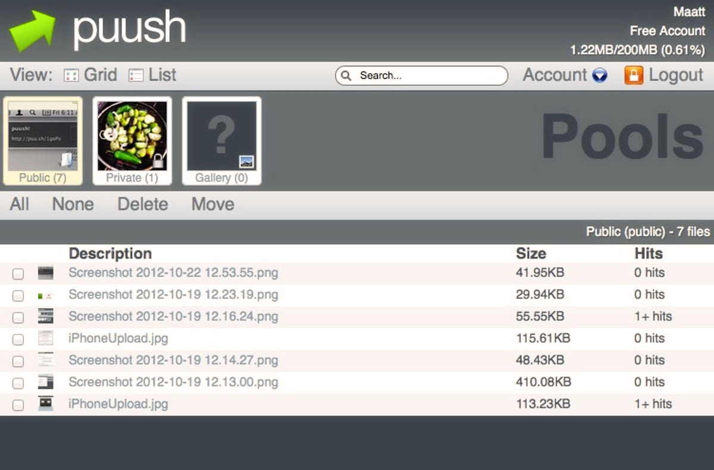

---
tags:
  - puu.sh
  - puush.me
  - puushme
---

# puush

::: Infobox

:::

**[puush.me](https://puush.me)**（常被称作 **puush**）是由 ::{ flag=AU }:: [peppy](https://osu.ppy.sh/users/2) 和 ::{ flag=AU }:: [nekodex](https://osu.ppy.sh/users/102)运营与托管的截图共享服务。该服务于 2010 年 6 月首次启动，作为 [upppy](/wiki/upppy) 的后继，更加专注于屏幕共享与用户数据管理。由于两位创始人当时正在使用的某个服务添加了大量广告，并移除了直接的图像热链接支持，该服务应运而生。

## 服务

puush 使用户可以通过专用的 [Windows](https://puush.me/dl/puush-installer.exe)、[Mac OS](https://puush.me/dl/puush.zip) 或 [iOS](https://itunes.apple.com/au/app/puush/id386524126?mt=8) 应用，将截图与文件上传到个人账户。在上传后，用户可在 puush.me 网站管理这些文件，将其放入“相册”中，或者用便捷的 `puu.sh` 链接分享到其他地方。

puush 的一个核心功能是能够立即捕获并分享截图，使其在[摸图者](/wiki/Modding)中极受欢迎。由于 puush 旨在分享文件而非永久存储文件，上传的文件只会保留有限时间，随后便会被删除。

## 订阅计划

puush 对所有人免费可用，但为了维持服务自给自足，puush 还提供了“专业版”计划，用户订阅费用为每年 15 美元。[^puush-pro-plan-ref]该计划的订阅用户可享有一些额外权益，具体是：

- 增加文件大小上限（免费版用户 20MB，专业版用户 250MB）
- 延长文件有效期（免费版用户自最后一次访问起保留 1 个月，专业版用户则保留 6 个月）

与 osu! 相似，无论订阅状态如何，所有 puush 用户都不会看到任何广告。

## 服务缩减

从 2014 年 3 月起，由于 PayPal 以意外的“违反服务条款”为由冻结了 puush 的账户，puush 不再接受专业版计划的注册申请。[^puush-paypal-suspension-ref]这导致 ::{ flag=AU }:: [peppy](https://osu.ppy.sh/users/2) 每个月不得不自费约 400 美元来维持服务运行。[^puush-finances-ref]

同年晚些时候，随着对 puush 维护的终止，puush 彻底关闭了所有新账户的注册——但是现有用户仍可继续正常使用服务。[^puush-maintenance-ref]

## 参考

[^puush-pro-plan-ref]: [puush 的常见问题页](https://puush.me/faq): "*What are the differences between the free and pro accounts?*"
[^puush-paypal-suspension-ref]: [peppy 的推文 (2014-03-25)](https://twitter.com/ppy/status/1286507028962136064): "*in other news, paypal decided that puush is a file sharing service and therefore goes against their ToS. no more payment provider!*"
[^puush-finances-ref]: [peppy 的推文 (2019-07-25)](https://twitter.com/ppy/status/1154349448807366657): "*i mean you can just throw money (buy osu! supporter tags or paypal (at) ppy.sh) if you want, but we don't really plan on having anything official. i'm happy to pay for puush from my pocket for the time being (~$400/month).*"
[^puush-maintenance-ref]: [peppy 的 GitHub 评论 (2025-09-29)](https://github.com/ppy/osu-wiki/pull/13779#discussion_r2385975381): "*It was less about cost and more about us being done with maintaining the service. It was becoming way more effort than it was worth. I won't get started with the weird edge cases we had to deal with, but the internet is a weird/bad place when users can upload anything.*"
