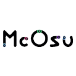
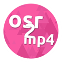

# โปรเจกต์ต่างๆ (Projects)

บทความนี้รวบรวมรายชื่อโปรเจกต์, เครื่องมือ และ/หรือบริการต่างๆ ที่สร้างขึ้นเพื่อ osu! โดยทั้งจากทีม [นักพัฒนา (Developers)](/wiki/People/Developers) และจากชุมชน

ในขณะที่โปรเจกต์ทางการส่วนใหญ่จะดำเนินงานโดย [ทีมงาน osu!](/wiki/People/osu!_team) โปรเจกต์ชุมชนจะถูกจัดการโดยสมาชิกในชุมชนเอง ด้วยเหตุนี้ โปรเจกต์ชุมชนจึงไม่ได้รับการรับรองจาก osu! และไม่มีการสนับสนุนอย่างเป็นทางการ สำหรับข่าวสารและบทสนทนาเกี่ยวกับโปรเจกต์ปัจจุบันและที่กำลังจะเกิดขึ้น โปรดไปที่ [ฟอรัม Development](http://osu.ppy.sh/community/forums/2)

## โปรเจกต์ทางการ (Official)

### ที่ยังดำเนินการอยู่ (Active)

| โลโก้ | ชื่อโปรเจกต์ | หัวหน้าโปรเจกต์ | คำอธิบาย |
| :-: | :-- | :-- | :-- |
|  | [osu!(lazer)](https://github.com/ppy/osu/) | ::{ flag=AU }:: [peppy](https://osu.ppy.sh/users/2) | ตัวเกม osu! เวอร์ชันถัดไป (และเป็นเวอร์ชันสุดท้าย) |
|  | [osu!framework](https://github.com/ppy/osu-framework/) | ::{ flag=AU }:: [peppy](https://osu.ppy.sh/users/2) | เฟรมเวิร์กสำหรับสร้างเกมที่เขียนขึ้นมาเพื่อ osu! โดยเฉพาะ |
|  | [osu!web](https://github.com/ppy/osu-web/) | ::{ flag=AU }:: [peppy](https://osu.ppy.sh/users/2) | ส่วนของเว็บไซต์ osu! ที่ผู้ใช้เข้าถึงผ่านเบราว์เซอร์ |
|  | [osu-api](https://github.com/ppy/osu-api/) | ::{ flag=AU }:: [peppy](https://osu.ppy.sh/users/2) | บริการ API สาธารณะสำหรับเข้าถึงข้อมูลที่เกี่ยวข้องกับ osu! |
|  | [osu! wiki](https://github.com/ppy/osu-wiki/) | ::{ flag=AU }:: [peppy](https://osu.ppy.sh/users/2) | คลังความรู้แบบ Open-source สำหรับทุกเรื่องของ osu! |
|  | [puush](/wiki/Community/Projects/puush) | ::{ flag=AU }:: [peppy](https://osu.ppy.sh/users/2) และ ::{ flag=AU }:: [nekodex](https://osu.ppy.sh/users/102) | บริการฝากไฟล์ที่ไม่มีโฆษณา โดยเน้นไปที่การแชร์ภาพหน้าจอและการจัดการข้อมูลผู้ใช้ |

### ที่หยุดดำเนินการหรือปิดตัวลงแล้ว (Inactive or defunct)

| โลโก้ | ชื่อโปรเจกต์ | หัวหน้าโปรเจกต์ | คำอธิบาย |
| :-: | :-- | :-- | :-- |
|  | [osu!performance](https://github.com/ppy/osu-performance/) | ::{ flag=AU }:: [peppy](https://osu.ppy.sh/users/2) | ส่วนของเกมที่จัดการคำนวณคะแนน [Performance points](/wiki/Performance_points) (pp) |
|  | [osu!stream](/wiki/osu!stream) | ::{ flag=AU }:: [peppy](https://osu.ppy.sh/users/2) | osu! เวอร์ชันพิเศษสำหรับอุปกรณ์พกพา iOS และ Android |
|  | [osu! iPhone](https://osu.ppy.sh/community/forums/topics/9193) | ::{ flag=US }:: [nuudles](https://osu.ppy.sh/users/21312) | ตัวเกมเวอร์ชัน iPhone ทางการของ osu! |
|  | [osu! on OS X](https://osuosx.tumblr.com/) | ::{ flag=AU }:: [peppy](https://osu.ppy.sh/users/2) | รุ่นทดลองของ osu! ที่ทำงานบน macOS ได้โดยตรง |
|  | [pTransl](/wiki/Community/Projects/pTransl) | ::{ flag=AU }:: [peppy](https://osu.ppy.sh/users/2) | แพลตฟอร์มการแปลภาษาโดยชุมชนสำหรับ osu! |
|  | [rajio](/wiki/Community/Projects/rajio) | ::{ flag=AU }:: [peppy](https://osu.ppy.sh/users/2) | บริการวิทยุออนไลน์แบบ On-demand |
|  | [upppy](/wiki/Community/Projects/upppy) | ::{ flag=AU }:: [peppy](https://osu.ppy.sh/users/2) | บริการฝากไฟล์ขนาดเล็กผ่านเบราว์เซอร์ |

## โปรเจกต์โดยชุมชน (Community)

### โปรแกรมเกม (Game clients)

| โลโก้ | ชื่อโปรเจกต์ | หัวหน้าโปรเจกต์ | คำอธิบาย |
| :-: | :-- | :-- | :-- |
|  | [McOsu](https://store.steampowered.com/app/607260/McOsu/) | ::{ flag=AT }:: [McKay](https://osu.ppy.sh/users/3321909) | โปรแกรมฝึกซ้อมสำหรับบีทแมพ osu! ที่รองรับแว่น VR |
|  | [osu! python edition](https://osu.ppy.sh/community/forums/topics/688175) | ::{ flag=US }:: [superloach](https://osu.ppy.sh/users/11213125) | ตัวเกม osu! แบบ Open-source ที่เขียนด้วยภาษา [Python 3](https://www.python.org/about/) |
|  | [osu!droid](https://github.com/osudroid/osu-droid) | ::{ flag=DE }:: [neico](https://osu.ppy.sh/users/119665) และ ::{ flag=RU }:: [Pesets](https://osu.ppy.sh/users/780451) | ตัวเกม osu! อย่างไม่เป็นทางการสำหรับ Android |
|  | [osu!taiko made with Scratch](https://turbowarp.org/1067424534?fps=240&offscreen) | ::{ flag=US }:: [MrrJinxx](https://osu.ppy.sh/users/32908054) | เกมเลียนแบบ osu!taiko ที่เขียนขึ้นบน [Scratch](https://scratch.mit.edu/about) |
|  | [opsu!](https://osu.ppy.sh/community/forums/topics/221726) | ::{ flag=US }:: [euphyy](https://osu.ppy.sh/users/2936932) | ตัวเกม osu! แบบ Open-source ที่เขียนด้วยภาษา [Java](https://www.java.com/) |
|  | [otu!](https://gdladder.com/level/111345732) | ::{ flag=US }:: [CreatorCreepy](https://osu.ppy.sh/users/10436454) | การจำลองเกม osu! ภายในเกม [Geometry Dash](https://en.wikipedia.org/wiki/Geometry_Dash) |
|  | [T-Aiko!](https://osu.ppy.sh/community/forums/topics/58640/) | ::{ flag=GB }:: [Guy-kun](https://osu.ppy.sh/users/217431) | เกมเลียนแบบ [Taiko no Tatsujin](https://en.wikipedia.org/wiki/Taiko_no_Tatsujin) ฟรีที่สามารถเล่นบีทแมพของ osu!taiko บนมือถือได้ |

### ด้านเกมเพลย์ (Gameplay)

#### ทั่วไป

| โลโก้ | ชื่อโปรเจกต์ | หัวหน้าโปรเจกต์ | คำอธิบาย |
| :-: | :-- | :-- | :-- |
|  | [Circleguard](https://github.com/circleguard/circleguard) | ::{ flag=US }:: [tybug](https://osu.ppy.sh/users/12092800) | ชุดเครื่องมือวิเคราะห์ Replay เพื่อตรวจสอบความเป็นไปได้ในการทุจริต |
|  | [Desktop Composition Disabler](https://osu.ppy.sh/community/forums/topics/177218) | ::{ flag=LT }:: [kleps](https://osu.ppy.sh/users/2902534) | เครื่องมือสำหรับปิดฟีเจอร์ Desktop Composition ใน Windows เพื่อลดอาการหน่วงในการควบคุม |
|  | [KeysPerSecond](https://osu.ppy.sh/community/forums/topics/552405) | ::{ flag=NL }:: [Roan](https://osu.ppy.sh/users/8214639) | เครื่องมือวัดประสิทธิภาพสำหรับวิเคราะห์ความเร็วในการกดปุ่ม |
|  | [OpenTabletDriver](https://opentabletdriver.net/) | ::{ flag=DK }:: [gonX](https://github.com/gonX) | ไดรเวอร์แท็บเล็ตวาดรูปที่มีความหน่วงต่ำสำหรับ osu! |
|  | [osr2mp4](https://osu.ppy.sh/community/forums/topics/1104243) | ::{ flag=JP }:: [yuitora](https://osu.ppy.sh/users/11401118) | เครื่องมือแปลงไฟล์ Replay `.osr` เป็นวิดีโอ `.mp4` อัตโนมัติ |
|  | [osu! Miss Analyzer](https://osu.ppy.sh/community/forums/topics/613143) | ::{ flag=US }:: [ThereGoesMySanity](https://osu.ppy.sh/users/4613296) | ชุดเครื่องมือวิเคราะห์ Replay เพื่อหาสาเหตุที่ทำให้กดพลาด (Miss) |
|  | [osu! Replayer](https://osu.ppy.sh/community/forums/topics/563282) | ::{ flag=NL }:: [joeykapi](https://osu.ppy.sh/users/8779015) | โปรแกรมที่ช่วยให้ผู้ใช้ดู Replay ที่ไม่ได้บันทึกไว้ในเครื่องได้ |
|  | [TabletDriver](https://github.com/hawku/TabletDriver) | ::{ flag=FI }:: [HWK](https://osu.ppy.sh/users/1919864) | ไดรเวอร์แท็บเล็ตวาดรูปที่มีความหน่วงต่ำสำหรับ osu! |

#### osu!

| โลโก้ | ชื่อโปรเจกต์ | หัวหน้าโปรเจกต์ | คำอธิบาย |
| :-: | :-- | :-- | :-- |
|  | [danser-go](https://github.com/Wieku/danser-go) | ::{ flag=PL }:: [Wiek](https://osu.ppy.sh/users/2584698) | เครื่องมือแสดงผลภาพแบบพิเศษสำหรับบีทแมพ osu! |
|  | [my hand, IT BURNS!!](https://keyaa.github.io/osu-stream-practice/) | ::{ flag=PH }:: [keyaa](https://osu.ppy.sh/users/30720651) | เครื่องมือวัดประสิทธิภาพสำหรับหาความเร็วในการกดสตรีม |
|  | [osu!trainer](https://github.com/FunOrange/osu-trainer) | ::{ flag=CA }:: [FunOrange](https://osu.ppy.sh/users/2051389) | โปรแกรมสำหรับปรับความเร็วแมพและการตั้งค่าความยากได้อย่างรวดเร็ว |

#### osu!taiko

| โลโก้ | ชื่อโปรเจกต์ | หัวหน้าโปรเจกต์ | คำอธิบาย |
| :-: | :-- | :-- | :-- |
|  | [Wii TaTaCon to USB Converter](https://osu.ppy.sh/community/forums/topics/258400) | ::{ flag=AU }:: [montymintypie](https://osu.ppy.sh/users/2007075) | อุปกรณ์แปลงสัญญาณจอยกลอง Wii TaTaCon เป็น USB ราคาประหยัด |

### การถ่ายทอดสด (Livestreaming)

| โลโก้ | ชื่อโปรเจกต์ | หัวหน้าโปรเจกต์ | คำอธิบาย |
| :-: | :-- | :-- | :-- |
|  | [gosumemory](https://github.com/l3lackShark/gosumemory) | ::{ flag=RU }:: [BlackShark](https://osu.ppy.sh/users/9173653) | โปรแกรมอ่านค่าหน่วยความจำ (Memory reader) สำหรับแสดงสถานะการเล่นแบบสด |
|  | [JKPS](https://osu.ppy.sh/community/forums/topics/1356687) | ::{ flag=IT }:: [Down16IQ](https://osu.ppy.sh/users/10371089) | หน้าจอแสดงสถานะการกดปุ่ม, ความเร็วในการกด, จำนวนครั้งที่กด และ BPM |
|  | [osu!StreamCompanion](https://osu.ppy.sh/community/forums/topics/209616) | ::{ flag=PL }:: [Piotrekol](https://osu.ppy.sh/users/304520) | โปรแกรมดึงข้อมูลบีทแมพเพื่อใช้ในการถ่ายทอดสด |

### การทำบีทแมพ (Beatmapping)

#### ทั่วไป

| โลโก้ | ชื่อโปรเจกต์ | หัวหน้าโปรเจกต์ | คำอธิบาย |
| :-: | :-- | :-- | :-- |
|  | [AxerBot](https://github.com/Hiviexd/AxerBot) | ::{ flag=TN }:: [Hivie](https://osu.ppy.sh/users/14102976) | บอท Discord อเนกประสงค์ที่มีฟีเจอร์สำหรับการทำแมพและ Mod โดยเฉพาะ |
|  | [Mapping Tools](https://osu.ppy.sh/community/forums/topics/940368) | ::{ flag=NL }:: [OliBomby](https://osu.ppy.sh/users/6573093) | โปรแกรมหลักที่รวบรวมเครื่องมือสารพัดประโยชน์สำหรับการทำแมพ |
|  | [osu! Storyboarder Banquet](https://osb.moe) | ::{ flag=CN }:: [Sidetail](https://osu.ppy.sh/users/2036217) | แหล่งรวบรวมเคล็ดลับ เทคนิค และสิ่งจำเป็นสำหรับการทำ Storyboard |

#### Storyboarding

| โลโก้ | ชื่อโปรเจกต์ | หัวหน้าโปรเจกต์ | คำอธิบาย |
| :-: | :-- | :-- | :-- |
|  | [Storybrew](https://github.com/Damnae/storybrew) | ::{ flag=FR }:: [Damnae](https://osu.ppy.sh/users/989377) | ตัวแก้ไข Storyboard ที่ใช้งานง่าย |

#### การ Mod แมพ

| โลโก้ | ชื่อโปรเจกต์ | หัวหน้าโปรเจกต์ | คำอธิบาย |
| :-: | :-- | :-- | :-- |
|  | [Mapset Verifier](https://osu.ppy.sh/community/forums/topics/943895) | ::{ flag=SE }:: [Naxess](https://osu.ppy.sh/users/8129817) | เครื่องมือสำหรับตรวจสอบความถูกต้องของบีทแมพตาม [เกณฑ์การพิจารณา (Ranking criteria)](/wiki/Ranking_criteria) |
