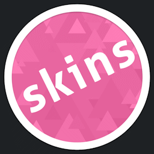

# Reddit

This article lists places on [Reddit](https://reddit.com) where users are able to interact with osu! and its community.

## Community

These subreddits are driven by the community, each with their own focus on different topics like gameplay aspects, mapping, and skinning.

| Avatar | Name | Description |
| :-: | :-: | :-- |
|  | [/r/osugame](https://reddit.com/r/osugame) | **/r/osugame** is currently the largest multi-mode forum open for general discussions and score showcases. |
|  | [/r/osumania](https://reddit.com/r/osumania) | **/r/osumania** offers a safe space specifically intended for the [osu!mania](/wiki/Game_mode/osu!mania) game mode. |
|  | [/r/osumapping](https://reddit.com/r/osumapping) | **/r/osumapping** serves as a platform all around mapping. |
|  | [/r/osuskins](https://reddit.com/r/osuskins) | **/r/osuskins** allows users to ask for general skinning support, exchange design choices as well as request help for finding specific skins. |

## Personal

| Avatar | Handle | Description |
| :-: | :-: | :-- |
|  | [/u/pepppppy](https://reddit.com/user/pepppppy) | The [osu! creator](/wiki/People/peppy)'s personal Reddit account, which primarily contains osu!-related topics, but is not limited to them. |
